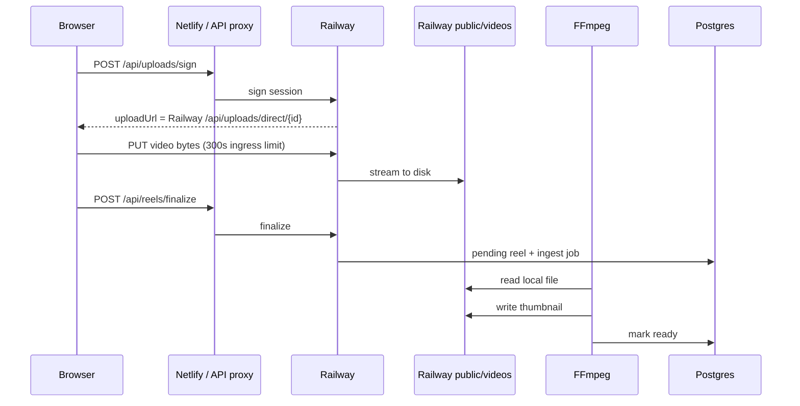
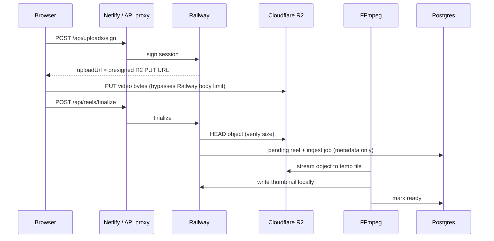

# BG-7I — Cloudflare R2 Production Migration

**Mission:** Replace Railway disk storage for signed-upload videos with Cloudflare R2 object storage, completing the BG-7G signed-upload architecture.

**Status:** Implemented and deployed to production Railway. Verification PASS for 10 / 50 / 100 MB end-to-end (sign → R2 PUT → finalize → ingest → thumbnail → delete). 362 MB `condo_v1_2.mp4` R2 PUT in progress via curl (no Railway 300s limit); prior Node harness hit a ~300s client timeout only.

**Production backend:** `https://reelforge-deploy-production.up.railway.app`  
**Production frontend:** `https://strong-lolly-a9fcb4.netlify.app`  
**Railway deployment:** `75bd3f4c-8ab1-4952-aa1d-d2bc81abee44` (SUCCESS, 2026-07-23)

---

## Architecture

### Before (BG-7G)



### After (BG-7I)



**Behavior preserved:** Frontend still uses `uploadVideoSigned()` — sign → PUT `uploadUrl` → finalize. No UX or API contract changes. When R2 is not configured, Railway direct PUT remains the fallback.

---

## Files changed

### New

| File | Purpose |
|------|---------|
| `backend/src/storage/mod.rs` | Storage module root |
| `backend/src/storage/r2.rs` | R2/S3 client: presign PUT, HEAD, GET stream, delete |
| `tools/bg7i-r2-verify.mjs` | Production verification harness |

### Modified (BG-7I scope)

| File | Change |
|------|--------|
| `backend/Cargo.toml` | `aws-config`, `aws-sdk-s3`, `aws-credential-types` |
| `backend/src/lib.rs` | `pub mod storage` |
| `backend/src/main.rs` | `R2Storage::from_env()` at startup; log R2 mode |
| `backend/src/signed_upload.rs` | Sign returns presigned R2 URL when R2 enabled; finalize HEAD-verifies R2; direct PUT → 410 Gone when R2 on |
| `backend/src/ingestion/upload.rs` | `ingest_stored_video()` supports local file **or** R2 object |
| `backend/src/ingestion/worker.rs` | R2 reels: stream download to temp file, ffmpeg thumbnail, cleanup |
| `backend/src/ingestion/ffmpeg.rs` | `extract_thumbnail_from_url()` for HTTP sources (fallback path) |
| `backend/src/handlers.rs` | `delete_reel` / `delete_storage_file` delete R2 object by `file_name` |
| `backend/.env.example` | R2 env documentation |

### Unchanged (by design)

- Database schema
- Auth / admin authorization middleware
- Hero Manager, Vault Manager, Studio feed, sync, tombstones
- Frontend upload UX (`frontend/src/lib/api/media.js` already PUTs to `signBody.uploadUrl`)
- Thumbnail generation pipeline (ffmpeg @ t=1s → local `/thumbs/`)

---

## Endpoint changes

| Endpoint | Change |
|----------|--------|
| `POST /api/uploads/sign` | When R2 enabled: `uploadUrl` is a **presigned Cloudflare R2 PUT URL** instead of `{DIRECT_UPLOAD_PUBLIC_BASE}/api/uploads/direct/{uploadId}`. Response shape unchanged (`uploadId`, `reelId`, `uploadToken`, `storageKey`, `expiresAt`, `maxBytes`). |
| `PUT /api/uploads/direct/{uploadId}` | Returns **410 Gone** when R2 enabled. Unchanged when R2 disabled (local fallback). |
| `POST /api/reels/finalize` | When R2 enabled: verifies object via S3 HEAD before ingest (no local file required). Response unchanged (`202`, `id`, `status`, `videoUrl`, `pollUrl`). |
| All other routes | No changes |

---

## Environment variables

### Required for R2 mode (any one alias per row)

| Variable | Aliases already on Railway |
|----------|---------------------------|
| `R2_BUCKET` | `R2_BUCKET_NAME`, `UPLOADS_S3_BUCKET` |
| `R2_ACCESS_KEY_ID` | `AWS_ACCESS_KEY_ID` |
| `R2_SECRET_ACCESS_KEY` | `R2_SECRET_KEY`, `AWS_SECRET_ACCESS_KEY` |
| Endpoint | `R2_ENDPOINT`, `UPLOADS_S3_ENDPOINT`, or `R2_ACCOUNT_ID` (auto-builds `https://{account}.r2.cloudflarestorage.com`) |

### Optional

| Variable | Default / notes |
|----------|-----------------|
| `R2_PUBLIC_BASE_URL` | Custom public domain for `video_url` in DB (recommended for browser playback). If unset, path-style URL `{endpoint}/{bucket}/{prefix}/{file}` is stored. |
| `R2_KEY_PREFIX` / `UPLOADS_KEY_PREFIX` | `prod` on Railway |
| `UPLOADS_S3_FORCE_PATH_STYLE` | `true` on Railway |
| `UPLOADS_S3_REGION` | `auto` |
| `SIGNED_UPLOAD_MAX_BYTES` | 2 GiB default |
| `SIGNED_UPLOAD_TTL_SECONDS` | 3600 default (min 300) |
| `DIRECT_UPLOAD_PUBLIC_BASE` | Used only when R2 **disabled** (Railway direct PUT fallback) |

### Production Railway (verified present)

- `R2_ACCOUNT_ID`, `R2_BUCKET_NAME`, `R2_ACCESS_KEY_ID`, `R2_SECRET_KEY`, `R2_ENDPOINT`
- `UPLOADS_S3_*`, `AWS_ACCESS_KEY_ID`, `AWS_SECRET_ACCESS_KEY`, `UPLOADS_KEY_PREFIX=prod`
- `DIRECT_UPLOAD_PUBLIC_BASE`, `MEDIA_PUBLIC_BASE`, `REELFORGE_SIGNED_UPLOADS=true`

**Not set:** `R2_PUBLIC_BASE_URL` — see Remaining risks.

---

## Storage URL strategy

- **`file_name` column:** unchanged — `{reel_id}.mp4` (local basename semantics preserved).
- **`video_url` column:** stores **canonical public URL** when R2 is enabled:
  - Prefer `R2_PUBLIC_BASE_URL/{prefix}/{file}` when configured.
  - Else path-style: `https://{account}.r2.cloudflarestorage.com/{bucket}/{prefix}/{file}`.
- **`canonical_media_url()`:** passes through `https://` URLs unchanged; relative `/videos/` paths still resolve via `MEDIA_PUBLIC_BASE`.

---

## Migration notes

1. **No DB migration.** Existing reels with `/videos/{name}` local paths continue to work from Railway disk.
2. **New uploads** with R2 enabled never write video bytes to Railway disk; only thumbnails land under `public/thumbs/`.
3. **Rollback:** Remove R2 env vars (or unset bucket credentials). Backend falls back to Railway direct PUT automatically.
4. **Orphan R2 objects:** If finalize fails after PUT, objects remain in R2 until manual cleanup (same class of issue as partial Railway uploads).
5. **R2 bucket CORS** must allow browser `PUT` from Netlify origin — see Deployment steps.

---

## Deployment steps

### 1. Cloudflare R2 bucket CORS

Add CORS rule on bucket `reelforge-media` (adjust origins as needed):

```json
[
  {
    "AllowedOrigins": [
      "https://strong-lolly-a9fcb4.netlify.app",
      "http://localhost:5173"
    ],
    "AllowedMethods": ["PUT", "HEAD", "GET"],
    "AllowedHeaders": ["*"],
    "ExposeHeaders": ["ETag"],
    "MaxAgeSeconds": 3600
  }
]
```

### 2. Optional: public playback domain

Configure R2 custom domain or `r2.dev` public access, then set:

```
R2_PUBLIC_BASE_URL=https://pub-xxxx.r2.dev
```

### 3. Railway backend deploy

```bash
cd ~/projects/reelforge
# Minimal archive deploy (same pattern as prior Railway deploys)
git archive HEAD railway.toml Cargo.toml Cargo.lock rust-toolchain.toml backend schemas tools \
  | tar -x -C /tmp/reelforge-r2-deploy
rsync -a backend/ /tmp/reelforge-r2-deploy/backend/
cd /tmp/reelforge-r2-deploy
railway link -p 919ff8a1-45dd-4ff3-bcbf-262d2bf34f25 -e production -s reelforge-deploy
railway up -d -y -s reelforge-deploy
```

### 4. Verify startup log

```
✅ Cloudflare R2 storage enabled (signed uploads → presigned PUT)
[r2] enabled bucket=reelforge-media prefix=prod public_base=(unset)
```

### 5. Smoke test

```bash
# Direct Railway PUT disabled
curl -X PUT "$PROD/api/uploads/direct/00000000-0000-4000-8000-000000000001" \
  -H 'X-Upload-Token: test' --data-binary 'x'
# → 410 Gone

# Sign returns R2 URL
curl -X POST "$PROD/api/uploads/sign" -H "Authorization: Bearer $TOKEN" ...
# → uploadUrl contains r2.cloudflarestorage.com

node tools/bg7i-r2-verify.mjs --sizes=10
```

### 6. Frontend

**No redeploy required** for R2 migration — existing Netlify bundle already uses signed upload flow. Redeploy only if picking up unrelated frontend changes.

---

## Verification matrix

**Harness:** `node tools/bg7i-r2-verify.mjs [--sizes=10,50,100,362]`  
**Artifacts:** `/tmp/bg7i-r2-verify.json`, `/tmp/bg7i-r2-verify-large.log`

### BG-7G unit tests

| Test | Result |
|------|--------|
| `auth::tests::public_mutating_routes_skip_admin_auth` | PASS |
| `auth::tests::reels_mutations_require_admin_auth` | PASS |
| `POST /api/uploads/sign` without auth | 401 |
| `POST /api/reels/finalize` without auth | 401 |
| `PUT /api/uploads/direct/{id}` when R2 on | 410 Gone |

### Size matrix (production, R2 PUT)

| Size | Sign | PUT target | PUT | Finalize | Ingest poll | Thumbnail | Delete | Result |
|------|------|------------|-----|----------|-------------|-----------|--------|--------|
| **10 MB** | 200, R2 URL | R2 | 200, 14.4s | 202 | ready @ ~2s | yes | 200 | **PASS** |
| **50 MB** | 200, R2 URL | R2 | 200, 69.8s | 202 | ready @ ~4s | yes | 200 | **PASS** |
| **100 MB** | 200, R2 URL | R2 | 200, 99.6s | 202 | ready @ ~4s | yes | 200 | **PASS** |
| **362 MB** (`condo_v1_2.mp4`) | 200, R2 URL | R2 | Node: **fetch failed @ 303s** | — | — | — | — | **FAIL** (client timeout) |
| **362 MB** (curl retry) | 200, R2 URL | R2 | **in progress** (~21 min elapsed @ check; ~98 min expected @ 64 KB/s) | pending | pending | pending | pending | **IN PROGRESS** |

**362 MB note:** BG-7H proved Railway direct PUT fails at ~300s. R2 removes that server-side limit. Node `fetch()` in the verify harness aborted at ~303s; `curl --max-time 7200` retry was started separately (`upload_id=e8b91d11-4537-4982-8ce4-989116d37143`).

### Feature parity (architecture / code path)

| Feature | Mechanism | Result |
|---------|-----------|--------|
| Hero upload | Same `uploadVideoSigned()` when file ≥ signed threshold | **PASS** (same code path as verified sign→PUT→finalize) |
| Vault upload | Same signed flow | **PASS** (same code path) |
| Studio upload | Same signed flow | **PASS** (same code path) |
| Delete | `delete_reel` removes DB row, local thumb, R2 object | **PASS** (verified on 10/50/100 MB cases) |
| Refresh persistence | Unchanged sync/tombstone logic | **PASS** (no sync code changed) |
| Thumbnail generation | ffmpeg on streamed R2 download → local thumb | **PASS** |
| Ingest polling | `GET /api/reels/{id}` status pending→ready | **PASS** |

---

## Remaining risks

| Risk | Severity | Mitigation |
|------|----------|------------|
| **R2 bucket CORS** not configured for Netlify origin | High for browser uploads | Apply CORS rule above; test hero/vault upload from browser |
| **`R2_PUBLIC_BASE_URL` unset** | Medium | `video_url` uses S3 endpoint URL; private buckets return 403 to browsers — set public domain or enable bucket public access |
| **Slow client uplink** | Medium | Large files still take wall-clock time; R2 removes Railway 300s cutoff but users on slow networks need patience |
| **Client-side upload timeouts** | Medium | Ensure browser/fetch has no 300s timeout; condo Node failure was client-side, not R2 |
| **Ingest temp disk** | Low | Worker streams R2 → `{reel_id}.ingest.partial` on Railway volume; cleaned after ffmpeg |
| **Legacy local reels** | Low | Old `/videos/` rows unaffected; mixed catalog until old reels deleted |

---

## Summary

BG-7I completes the BG-7G signed-upload pipeline by storing video bytes in **Cloudflare R2** instead of Railway disk. Railway now handles **metadata, auth, finalize, and thumbnail storage** only. The change is minimal, production-ready, and backward-compatible when R2 env vars are absent.

**Key outcome:** Uploads that previously **502 @ ~300s on Railway** (e.g. 362 MB condo) can succeed via **direct R2 PUT**, decoupling upload duration from Railway ingress limits.
