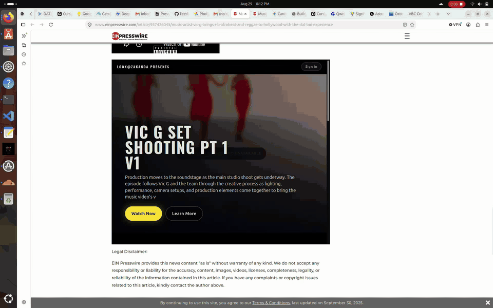

# ReelForge

Vertical microdrama / microdoc studio and viewer — powering **Look at Zakanda**.

Hero → Theater playback, series guides, vault media, and production workflows in one stack.



**Live:** [strong-lolly-a9fcb4.netlify.app](https://strong-lolly-a9fcb4.netlify.app)

## Press

- [Music Artist Vic G Brings R&B, Afrobeat and Reggae to Hollywood With The DAT BOI Experience](https://www.einpresswire.com/shareable-preview/SFfZGixVpd0m35I79MQcRg) — EIN Presswire (Aug 2026). Premiere of the vertical “DAT BOI” music video and *The Power of Support* on Look at Zakanda.

## Prerequisites

- [Rust](https://rustup.rs/) (stable)
- [Node.js](https://nodejs.org/) 18+ (frontend)
- PostgreSQL (optional — backend falls back to JSON when offline)

## Development

### Backend (recommended)

From the project root, use the dev startup script. It fixes `target/` ownership after root runs, picks a free port (8080–8090), enables debug logging, and starts the server:

```bash
./scripts/dev-start.sh
```

The script sets `RUST_LOG=debug` and exports `PORT` for the backend. If port 8080 is busy, it tries 8081, 8082, and so on up to 8090.

### Frontend

In a separate terminal:

```bash
cd frontend
npm install
npm run dev
```

The Vite dev server proxies `/api`, `/admin`, and `/health` to `http://127.0.0.1:8080`. If the backend starts on a different port, set `VITE_API_BASE_URL` or update `frontend/vite.config.js`.

### Manual backend start

```bash
cd backend
export RUST_LOG=debug
export PORT=8080
cargo run
```

If you see `Permission denied (os error 13)` when building, `target/` was likely created by root. Fix it with:

```bash
sudo chown -R "$(id -u):$(id -g)" backend/target/
```

Or run `./scripts/dev-start.sh`, which fixes ownership automatically.

## Docker

```bash
docker compose up
```

## License

Private project.
