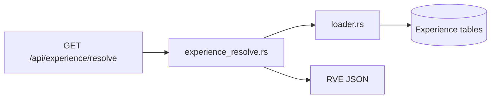

# Architecture Closure Report — Phase 1a.7

**Date:** 2026-06-03  
**Status:** Read-only closure audit  
**Purpose:** Determine whether Phase 1a architecture is complete enough to freeze and begin Phase 1b implementation.

**Authoritative governance baseline:** [`EXPERIENCE_GOVERNANCE_CONTRACT.md`](./EXPERIENCE_GOVERNANCE_CONTRACT.md)  
**Prior cross-doc audit:** [`EXPERIENCE_GOVERNANCE_AUDIT_REPORT.md`](./EXPERIENCE_GOVERNANCE_AUDIT_REPORT.md)

**Reviewed (read-only):**

| Category | Artifacts |
|----------|-----------|
| Contracts | [`RESOLVED_VIEWER_EXPERIENCE_CONTRACT.md`](./RESOLVED_VIEWER_EXPERIENCE_CONTRACT.md), [`RESOLVED_VIEWER_EXPERIENCE_SCHEMA.md`](./RESOLVED_VIEWER_EXPERIENCE_SCHEMA.md), [`RESOLVER_DECISION_RECORD.md`](./RESOLVER_DECISION_RECORD.md), [`RESOLVER_BOUNDARY_AUDIT.md`](./RESOLVER_BOUNDARY_AUDIT.md), [`MEDIA_REPRESENTATION_CONTRACT.md`](./MEDIA_REPRESENTATION_CONTRACT.md) |
| Governance | [`EXPERIENCE_GOVERNANCE_CONTRACT.md`](./EXPERIENCE_GOVERNANCE_CONTRACT.md), [`EXPERIENCE_GOVERNANCE_AUDIT_REPORT.md`](./EXPERIENCE_GOVERNANCE_AUDIT_REPORT.md) |
| Implementation | [`backend/src/experience/`](../backend/src/experience/), [`backend/src/api/experience.rs`](../backend/src/api/experience.rs) |

**No changes made:** Rust, schema JSON, migrations, APIs, frontend, or existing normative documents.

---

## Executive Summary

Phase 1a delivers a complete **Resolved Viewer Experience (RVE)** architecture: contract, schema, resolver boundary, governance, media semantics, and a working production resolve path. One **documented contradiction cluster** (pinned ARCHIVED profile versions) remains in legacy contract text and running code; it is **accepted as deferred remediation** per Phase 1a.6, not a reason to extend Phase 1a architecture.

| Question | Answer |
|----------|--------|
| Sole composition authority? | **Yes** — `experience_resolve.rs` |
| Campaigns without RVE contract change? | **Yes** — §8.8–8.9 already defined |
| Studio preview on resolve endpoint only? | **Yes (normative)** — no alternate compose API |
| Unresolved contradictions? | **Yes** — F-001 cluster (accepted deferred) |
| Blocks Phase 1b? | **Implementation merge** only (REM-001–005, REM-007) |
| Deferred remediation? | F-001 cluster, F-007, F-009–F-011 |

### Final Verdict

## **APPROVED FOR PHASE 1B WITH CONDITIONS**

### Freeze Recommendation

**No additional architecture phases required before Phase 1b.**

---

## Phase 1a Architecture Inventory

### Documentation stack (frozen)

| Phase | Deliverable | Role |
|-------|-------------|------|
| 1a.1 | RVE contract | Wire shape, merge order, consumer rules |
| 1a.2 | Schema doc + JSON Schema | Validation, NC codes, enums |
| 1a.3 / 1a.3.5 | Data model + boundary audit | Storage design, resolver purity |
| 1a.4 | RDR + resolver impl | Merge rules + `experience_resolve.rs` |
| 1a.5 | Media representation contract | Semantic media fields (future RVE section) |
| 1a.6 | Governance contract + audit | Operations, lifecycle, F-001 register |
| 1a.7 | This report | Closure gate |

### Code modules (`backend/src/experience/`)

| Module | Role | Composes RVE? |
|--------|------|---------------|
| `experience_resolve.rs` | Sole composer | **Yes** |
| `loader.rs` | Read bundle for resolver | No |
| `contract.rs` | `validate_rve`, schema embed | No |
| `hierarchy.rs` | Context + merge helpers | No |
| `profiles.rs` | Write + read profile rows | No |
| `platform_defaults.rs`, `layout_presets.rs`, `theme_tokens.rs` | Loader sources | No |
| `metadata_registry.rs`, `slots.rs` | Loader sources | No |
| `provenance.rs` | Pure provenance builders | No |

### HTTP surface

| Route | Handler | Composition |
|-------|---------|-------------|
| `GET /api/experience/resolve` | `api/experience::get_experience_resolve` | Delegates to `experience_resolve::resolve` only |

No `campaign_injector` module exists yet (Phase 1b placeholder in boundary audit only).

---

## Required Answers

### 1. Is `experience_resolve.rs` the sole composition authority?

**Yes.**

| Check | Evidence |
|-------|----------|
| Single compose entry | `resolve()` → `compose()` → `validate_rve()` in [`experience_resolve.rs`](../backend/src/experience/experience_resolve.rs) |
| No direct SQL in resolver | Zero `sqlx::query` in resolver file; enforced by test `rdr_001_resolver_no_direct_sql` |
| Reads via loader only | `load_resolve_bundle()` in [`loader.rs`](../backend/src/experience/loader.rs) (RDR-001) |
| API delegates only to resolver | [`api/experience.rs`](../backend/src/api/experience.rs) calls `experience_resolve::resolve` exclusively |
| No alternate RVE composer | `get_full_config` in [`platform_config.rs`](../backend/src/db/platform_config.rs) serves platform bundle via `api/platform_config.rs` — not RVE (RDR-002, boundary audit §1.3) |
| Write modules do not merge | `profiles.rs`, `metadata_registry.rs`, etc. are Studio write or loader read paths only |

**Alignment:** G1 ([`EXPERIENCE_GOVERNANCE_CONTRACT.md`](./EXPERIENCE_GOVERNANCE_CONTRACT.md)), RDR-000, RVE §4 S3, boundary audit §1.

---

### 2. Can campaigns be added without modifying the RVE contract?

**Yes.**

| Requirement | Status |
|-------------|--------|
| `campaigns[]` in contract | RVE §8.8 — required array, may be empty |
| `slots[]` in contract | RVE §8.9 — required array; slot enrichment allowed |
| Schema support | [`resolved_viewer_experience.schema.json`](../schemas/resolved_viewer_experience.schema.json) defines `campaign` and `slot` items |
| Current emission | `campaigns: []` per RDR-130; `slots` from `build_slots()` + `load_slots_chain` (RDR-120–122) |
| Phase 1b injector | Boundary audit: `campaign_injector` inside resolver fills existing sections — metadata only (RVE §8.8, NC-105) |

Phase 1b adds **content** to existing arrays within `schema_version` `1.0.0`. No new top-level RVE sections or breaking wire changes are required for campaign injection.

**Alignment:** RDR-004 (empty until 1b), RDR-130, governance §10.1, boundary audit Phase 1b row.

---

### 3. Can Studio preview rely exclusively on `GET /api/experience/resolve`?

**Yes, as the only experience composition HTTP endpoint.**

| Check | Result |
|-------|--------|
| Routes registered | Only `/api/experience/resolve` in [`main.rs`](../backend/src/main.rs) under experience API |
| RVE consumer rule | RVE §12.2: Studio preview via cached `GET /api/experience/resolve` |
| No second compose API | Grep: no other `experience/resolve` or RVE compose handlers |
| Frontend wiring | No `experience/resolve` calls in `frontend/` today — Studio not yet integrated |
| Viewer | Unaffected; does not call resolve API |

**Caveat (deferred, not a second composer):** Governance PI-01–PI-05 describe a future **isolated** preview channel (DRAFT resolve, `X-Reelforge-Preview`, non-authoritative labeling). That is **Studio implementation work**, not an additional architecture phase. Until built, normative Studio preview path remains the single production resolve endpoint per RVE §12.2.

---

### 4. Are there any unresolved architectural contradictions?

**Yes — one bounded cluster, plus minor future risks.**

#### Critical / governance drift (F-001 cluster)

| ID | Classification | Summary |
|----|----------------|---------|
| **F-001** | Critical contradiction | Governance LC-03/AG-02: ARCHIVED never production-resolved; pins must be ACTIVE. RVE §5.2/§8.2, RDR-034, boundary audit, and code allow pinned ARCHIVED in RVE output. |
| **F-002** | Governance drift | RDR-034 vs LC-03 |
| **F-003** | Governance drift | RVE §8.2 `status` enum includes ARCHIVED for pinned |
| **F-004** | Governance drift | Boundary audit: “Pinned ARCHIVED allowed with warning” |
| **F-005** | Resolver drift | `get_pinned_version` returns ARCHIVED; `build_experience_profile` emits `status: "ARCHIVED"` |
| **F-006** | Resolver drift | No NC-106 for pinned ARCHIVED (NC-103 covers DRAFT only) |

**Source of truth:** [`EXPERIENCE_GOVERNANCE_CONTRACT.md`](./EXPERIENCE_GOVERNANCE_CONTRACT.md) §12.1 and LC-03 supersede conflicting legacy text until REM doc/code alignment.

#### Future risks (not additional 1a architecture)

| ID | Classification | Summary |
|----|----------------|---------|
| **F-007** | Future implementation risk | Preview isolation (PI-*) vs single production endpoint |
| **F-008** | Future implementation risk | Campaign injector must respect G1, NC-105 |
| **F-009** | Future implementation risk | Audit storage not implemented (governance §8) |
| **F-010** | Future implementation risk | Media block not in RVE wire yet |
| **F-011** | Informational | Partial provenance vs RDR-140; schema minimum met |

No **new** contradictions were found beyond [`EXPERIENCE_GOVERNANCE_AUDIT_REPORT.md`](./EXPERIENCE_GOVERNANCE_AUDIT_REPORT.md).

---

### 5. Which findings block Phase 1b?

**Phase 1b architecture and design may proceed.** The following **block Phase 1b implementation merge** (not the freeze of Phase 1a):

| Finding | REM IDs | Why it blocks merge |
|---------|---------|---------------------|
| F-001 cluster | REM-001, REM-002, REM-004, REM-005 | Ambiguous profile `status` in production RVE vs governance; campaign attachment may reference version epochs |
| F-008 | REM-007 | Campaign injector must pass governance G1 and NC-105 before merge |

**Do not block Phase 1b start:**

| Finding | Reason |
|---------|--------|
| F-007 | Preview API is Studio-phase; no alternate composer |
| F-009 | Audit store explicit non-goal |
| F-010 | Media block deferred per media contract |
| F-011 | Provenance minimum satisfied |

---

### 6. Which findings are accepted deferred remediation?

Explicitly **accepted** for Phase 1a freeze (not resolved in code or upstream docs in 1a.7):

| Finding | Acceptance rationale |
|---------|---------------------|
| **F-001 through F-006** | Phase 1a.6 audit **PASS WITH CONDITIONS**; governance authoritative; REM-001–005 inventory defines pre-merge alignment; code retains pinned ARCHIVED for backward compatibility until hardening sprint |
| **F-007** | Preview isolation specified in governance §4; implementation deferred; RVE §12.2 single-endpoint model accepted for now |
| **F-009** | Audit requirements documented; storage out of scope per governance §8.3 |
| **F-010** | Media semantics contract complete; RVE wire extension deferred |
| **F-011** | Informational; no action required before 1b |

**Binding conditions (from 1a.6):**

1. REM-001–005 accepted before 1b **implementation** merge.
2. REM-007 completed before merging `campaign_injector`.
3. Do not treat RVE §5.2, RDR-034, or boundary audit pinned-ARCHIVED text as authoritative over governance until REM doc/code work lands.

---

### 7. Final verdict

## **APPROVED FOR PHASE 1B WITH CONDITIONS**

| Criterion | Result |
|-----------|--------|
| Phase 1a architecture complete | Yes — contract, schema, resolver, governance, media semantics, API surface |
| Sole composition authority verified | Yes |
| Campaign/slot injection path defined | Yes — within existing RVE §8.8–8.9 |
| Contradictions bounded and inventoried | Yes — F-001 cluster accepted deferred |
| Viewer / frontend unaffected | Yes |
| New architecture phases required before 1b | **No** |

**Not BLOCKED** — Phase 1a may freeze; Phase 1b implementation may begin subject to conditions above.

**Not unconditional APPROVED** — REM-001–005 and REM-007 remain mandatory before 1b implementation merge.

---

## Contradiction Register (carry-forward)

| ID | Severity | Blocks 1b merge? | Status at 1a.7 |
|----|----------|-------------------|----------------|
| F-001 | Critical | Yes | Accepted deferred |
| F-002 | High | Yes (with F-001) | Accepted deferred |
| F-003 | High | Yes (with F-001) | Accepted deferred |
| F-004 | Medium | No | Accepted deferred |
| F-005 | Critical | Yes | Accepted deferred |
| F-006 | Medium | Yes (with F-001) | Accepted deferred |
| F-007 | Medium | No | Accepted deferred |
| F-008 | High | Yes (at merge) | Open — REM-007 |
| F-009 | Medium | No | Accepted deferred |
| F-010 | Low | No | Accepted deferred |
| F-011 | Low | No | Closed — informational |

---

## Remediation Inventory (reference only — not implemented)

From [`EXPERIENCE_GOVERNANCE_AUDIT_REPORT.md`](./EXPERIENCE_GOVERNANCE_AUDIT_REPORT.md). No work performed in Phase 1a.7.

| Rem-ID | Type | Summary | Blocks 1b merge? |
|--------|------|---------|------------------|
| REM-001 | Doc | Amend RVE §5.2/§8.2 — ACTIVE-only production resolve | Yes |
| REM-002 | Doc | Amend RDR-034; ARCHIVED pin rule | Yes |
| REM-003 | Doc | Update boundary audit pinned ARCHIVED note | No |
| REM-004 | Code | Reject pinned ARCHIVED in loader/resolver | Yes |
| REM-005 | Doc + code | NC-106 for pinned ARCHIVED | Yes |
| REM-006 | API | Isolated preview endpoint (future) | No |
| REM-007 | Process | Campaign injector governance checklist | Yes |
| REM-008 | Impl | Audit event store | No |
| REM-009 | Doc + schema | Media block in RVE | No |
| REM-010 | Code | Full leaf provenance (optional) | No |

---

## Implementation Observational Notes

Facts only; no code changes in 1a.7.

| Observation | Location |
|-------------|----------|
| Production RVE composed in `compose()` | `experience_resolve.rs` |
| `campaigns` hardcoded empty array | `experience_resolve.rs` line ~146 |
| `slots` built from loader rows | `build_slots()`, `loader::load_slots_chain` |
| Pinned DRAFT → 422 NC-103 | `api/experience.rs`, `profiles::get_pinned_version` |
| Pinned ARCHIVED allowed | `get_pinned_version` (DRAFT only rejected); `build_experience_profile` allows ARCHIVED status |
| Feature flag | `REELFORGE_EXPERIENCE_PROFILES` gates API |
| Media block | Not emitted — consistent with media contract deferral |
| Viewer | No RVE consumption in frontend |

---

## Alignment Summary

| Area | Phase 1a status |
|------|-----------------|
| Resolver authority (G1) | Complete |
| Studio write / Viewer read (G2, G3) | Documented; Viewer integration Phase 2+ |
| Lifecycle DRAFT/ACTIVE/ARCHIVED | Documented; F-001 drift accepted deferred |
| Publish / rollback / attachments | Documented + partial code (publish, resolve) |
| Campaign engine placeholder | RVE sections exist; injector is Phase 1b |
| Media semantics | Contract only; no RVE wire yet |
| Audit | Requirements only |

---

## Document Change Log (Phase 1a.7)

| File | Action |
|------|--------|
| `docs/ARCHITECTURE_CLOSURE_REPORT.md` | **Created** (this file) |
| All other reviewed docs and code | **Unchanged** |

---

## Freeze Recommendation

Phase 1a architecture is sufficient to freeze. Phase 1b may begin implementation planning and the in-resolver campaign injector, subject to REM-001–005 and REM-007 before merge.

**No additional architecture phases required before Phase 1b.**

---

**Report path:** `docs/ARCHITECTURE_CLOSURE_REPORT.md`
