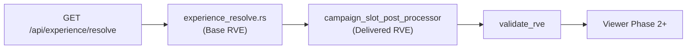

# Campaign and Slot Injection Architecture

**Phase:** 1b.1 — Campaign + Slot Injection (architecture only)  
**Status:** Normative architecture (no implementation)  
**Version:** `1.0.0`  
**Project:** ReelForge / Smart Production Studio  
**Prerequisites:** [`RESOLVED_VIEWER_EXPERIENCE_CONTRACT.md`](./RESOLVED_VIEWER_EXPERIENCE_CONTRACT.md), [`RESOLVER_DECISION_RECORD.md`](./RESOLVER_DECISION_RECORD.md), [`RESOLVER_BOUNDARY_AUDIT.md`](./RESOLVER_BOUNDARY_AUDIT.md), [`MEDIA_REPRESENTATION_CONTRACT.md`](./MEDIA_REPRESENTATION_CONTRACT.md), [`MEDIA_INVENTORY_AND_PLACEHOLDER_ARCHITECTURE.md`](./MEDIA_INVENTORY_AND_PLACEHOLDER_ARCHITECTURE.md), [`EXPERIENCE_GOVERNANCE_CONTRACT.md`](./EXPERIENCE_GOVERNANCE_CONTRACT.md), [`ARCHITECTURE_CLOSURE_REPORT.md`](./ARCHITECTURE_CLOSURE_REPORT.md)

**Scope:** Semantic campaign model, slot taxonomy, injection pipeline, resolver purity guarantees, injection rules, media-contract interaction, extension boundaries, and contradiction analysis. This document does **not** define Rust modules, SQL migrations, HTTP routes, JSON Schema changes, Viewer behavior, or enforcement logic.

**Explicit non-goals (Phase 1b.1):** Campaign CRUD APIs, ad serving, recommendation ranking, slot write paths during resolve, paywall enforcement, thumbnail URL materialization, audit storage implementation.

---

## Table of Contents

1. [Purpose and Authority Split](#1-purpose-and-authority-split)
2. [Semantic Campaign Model](#2-semantic-campaign-model)
3. [Slot Taxonomy and Layout Alignment](#3-slot-taxonomy-and-layout-alignment)
4. [Injection Pipeline](#4-injection-pipeline)
5. [Resolver Purity Guarantee](#5-resolver-purity-guarantee)
6. [Injection Rules](#6-injection-rules)
7. [Interaction with Media Contracts](#7-interaction-with-media-contracts)
8. [Extension Points](#8-extension-points)
9. [Governance and RDR Alignment (Future)](#9-governance-and-rdr-alignment-future)
10. [Contradiction Analysis](#10-contradiction-analysis)
11. [Phase 1b Implementation Checklist](#11-phase-1b-implementation-checklist)

---

## 1. Purpose and Authority Split

Phase 1b introduces **promotional metadata** into an otherwise frozen RVE wire shape (`schema_version` `1.0.0`). Campaigns and enriched slots are **informational**: they tell the Viewer what to promote and where, without changing layout geometry, visibility intersection, profile selection, or monetization enforcement.

| Layer | Responsibility | Mutates RVE sections |
|-------|----------------|----------------------|
| **Composition kernel** | `experience_resolve.rs` — deterministic merge per RVE §5.1 steps 1–10 | `resolve_context`, `layout`, `theme`, `labels`, `metadata`, `visibility`, `monetization_presentation`, `watch_features`, structural `slots[]`, `provenance` (non-campaign leaves) |
| **Campaign slot post-processor (CSPP)** | Read-only enrichment after composition | `campaigns[]`, campaign-related `slots[]` fields, campaign `provenance` entries |
| **Viewer** | Render-only consumer | None (reads pipeline output) |

**Viewer Experience identity:** Production consumers receive **Delivered RVE** = composition kernel output passed through CSPP and final `validate_rve()`. The composition kernel output alone is **Base RVE**.



This split satisfies the Phase 1b.1 requirement that **campaigns must not affect resolver output** while preserving a single validated wire document for the Viewer (governance G3).

---

## 2. Semantic Campaign Model

The campaign model is **semantic only**. No component in this pipeline enforces eligibility, billing, contest rules, or geo-fencing. Enforcement remains in future domain services.

### 2.1 Campaign entity (RVE §8.8 alignment)

| Field | Semantics | Notes |
|-------|-----------|-------|
| `id` | Stable campaign identity | Maps to `platform_campaigns.id` |
| `campaign_name` | Human label for Studio and debug provenance | Non-unique allowed across types |
| `campaign_type` | `CONTEST` \| `PREMIERE` \| `PROMOTION` \| `SPONSOR` | Drives default priority band (§6.1); does not change layout |
| `status` | Resolved **active state** at CSPP evaluation time | See §2.3; not raw DB enum passthrough |
| `start_date` | ISO-8601 activation bound (inclusive) | `null` = unbounded start |
| `end_date` | ISO-8601 deactivation bound (exclusive) | `null` = unbounded end |
| `priority` | Integer sort key | Higher wins ties; default `0` |
| `target_series_id` | Optional scope filter | Must match resolve context series when set |
| `target_episode_id` | Optional scope filter | Must match resolve context episode when set |

**Forbidden on campaign objects (NC-105, RVE §8.8):** `playback_url`, layout keys, `visibility` overrides, thumbnail URLs, paywall flags, or any key that would let a campaign override §8.1–8.7 merge results.

### 2.2 Campaign types (behavioral semantics, not enforcement)

| Type | Intended use | Typical slots | Default priority band |
|------|--------------|---------------|------------------------|
| `PREMIERE` | Time-boxed launch / first-run | `hero_promo`, `theater_overlay` | 80–100 |
| `PROMOTION` | General marketing | `hero_promo`, `shelf_featured`, `shelf_badge` | 40–79 |
| `SPONSOR` | Partner placement | `shelf_badge`, `custom.*` | 20–59 |
| `CONTEST` | Engagement CTA | `hero_promo`, `shelf_featured` | 60–89 |

Bands are **defaults** when `priority` is equal; explicit `priority` on the row always wins.

### 2.3 Resolved `status` (CSPP evaluation model)

CSPP derives `status` for each campaign row at **read time** (no writes):

| Resolved status | Condition |
|-----------------|-----------|
| `scheduled` | `now < start_date` (when `start_date` set) |
| `active` | Within `[start_date, end_date)` window (null bounds treated as open) **and** DB row is administratively enabled **and** targeting matches resolve context |
| `ended` | `now >= end_date` OR administratively ended/archived |

Only `active` campaigns appear in Delivered RVE `campaigns[]`. `scheduled` and `ended` rows are **omitted** from the array (not emitted as inactive entries) unless a future preview mode explicitly requests them (out of scope for production resolve).

### 2.4 Targeting and scope interaction

| Target field | Match rule |
|--------------|------------|
| Both null | Platform-wide or scope-attached campaign (inherits slot `scope_type` / `scope_id`) |
| `target_series_id` set | Resolve context must include that series |
| `target_episode_id` set | Resolve context episode must match |
| Both set | **AND** — both must match |

Campaign targeting **does not** replace hierarchy merge for labels or visibility. It only gates inclusion in `campaigns[]` and eligibility for slot binding.

### 2.5 Multi-campaign presence model

`campaigns[]` is an **unordered bag of active campaigns** after CSPP filtering. Ordering for display is **not** defined here; the Viewer may sort by `priority` for debug UI only. Slot winners (§6.3) determine per-`slot_key` presentation.

**Stacking rule (campaign list):** Multiple campaigns may be `active` simultaneously if targeting and time windows overlap. They **coexist** in `campaigns[]` until slot collision rules reduce visible slot assignments.

---

## 3. Slot Taxonomy and Layout Alignment

Slots bridge **layout panels** (RVE `layout` / `visibility`) and **promotional content** without changing blueprint geometry.

### 3.1 Standard slot keys (RVE §8.9)

| `slot_key` | Layout surface | `zone_hint` source | Primary `content_ref` role |
|------------|----------------|--------------------|----------------------------|
| `hero_promo` | Hero panel (`visibility.panels.hero`) | Blueprint `panels.hero` | Series/episode/image key for hero overlay |
| `shelf_featured` | Featured shelf row | Blueprint shelf zones | Featured title or collection ref |
| `theater_overlay` | Theater / player chrome | Theater panel definition | Overlay CTA or premiere badge ref |
| `shelf_badge` | Per-tile badge on shelf | Shelf tile zone | Small badge ref (sponsor, contest) |

**Alignment rule:** CSPP **must** set `zone_hint` from the resolved layout blueprint when the slot row omits it, but **must not** set `visibility.panels.*.effective_visible` or change `layout` structure. If the hero panel is not effectively visible, the Viewer **may** hide `hero_promo` content; CSPP still may emit the slot when administratively assigned (Studio preview may differ — governance §4).

### 3.2 Custom slots (`extensions.custom_slots` policy)

| Pattern | Rule |
|---------|------|
| `custom.<name>` | Allowed in `extensions.custom_slots.slots` per RVE §9.2 |
| Precedence | Standard `slots[]` merged first (resolver); custom merged after CSPP |
| Collision | `custom.*` keys **must not** equal standard keys |

**`future_slot_allocator` (§8.3)** may propose `custom.*` assignments in a later phase; CSPP remains the authority that copies allocator output into Delivered RVE without touching layout.

### 3.3 Structural slot shape (resolver vs CSPP)

| Field | Resolver (Base RVE) | CSPP (Delivered RVE) |
|-------|---------------------|----------------------|
| `slot_key` | From `experience_slot_assignments` | Unchanged |
| `scope_type`, `scope_id` | From row | Unchanged |
| `campaign_id` | May be present from row | Validated against active `campaigns[]`; nulled if campaign inactive |
| `status` | Row status or default | Re-evaluated: `scheduled` \| `active` \| `ended` per slot+campaign windows |
| `content_ref` | Opaque object from row | Enriched with campaign join metadata **only** inside `content_ref` (still no URLs) |
| `zone_hint` | Optional | Filled from blueprint when missing |

Resolver deduplication (RDR-122): last wins on `(slot_key, scope_type, scope_id)` within the scope chain load. CSPP **must not** re-run hierarchy dedup; it only resolves **campaign competition** among rows that share the same `slot_key` after dedup.

### 3.4 Slot–panel dependency matrix

| If panel not in blueprint | Slot behavior |
|---------------------------|---------------|
| Panel absent | Slot may exist; Viewer ignores (contract consumer rule) |
| Panel present, `effective_visible: false` | Slot remains in RVE; Viewer suppresses render |
| Panel present, visible | Viewer renders slot content per `content_ref` |

---

## 4. Injection Pipeline

### 4.1 Stages

| Stage | Input | Output | Reads |
|-------|-------|--------|-------|
| **1. Load** | `episode_id` (+ flags) | `ResolveBundle` | Experience tables via `loader.rs` only |
| **2. Compose** | `ResolveBundle` | Base RVE | No `platform_campaigns` reads in composition kernel |
| **3. Inject** | Base RVE + campaign bundle | Delivered RVE | `platform_campaigns`, slot–campaign joins |
| **4. Validate** | Delivered RVE | Pass / 422 | Embedded schema + NC-105 |
| **5. Deliver** | Validated JSON | HTTP 200 / Viewer | None |

### 4.2 Composition kernel (unchanged Phase 1a.4 behavior)

Steps 1–10 of RVE §5.1 only. Emits:

- `campaigns: []` (hard empty array — purity sentinel)
- `slots[]` from batched assignment load (RDR-120–122) without campaign enrichment

### 4.3 Campaign slot post-processor (CSPP)

**Module name (implementation placeholder):** `campaign_slot_post_processor` or `campaign_injector` — architecture prefers **post-processor** naming to emphasize ordering after `compose`.

| Function (conceptual) | `enrich(base_rve, ctx) -> delivered_rve` |
|-----------------------|------------------------------------------|
| Reads | Active campaigns for platform + scope chain; slot rows already in Base RVE |
| Writes | None |
| Mutations | Replace `campaigns[]`; patch `slots[]` status, `campaign_id`, `content_ref`, `zone_hint`; append/update `provenance` for §8.8–8.9 leaves |

CSPP runs **after** `compose()` and **before** `validate_rve()`. The HTTP handler orchestrates: `resolve` → `enrich` → `validate_rve`.

### 4.4 Viewer consumption

Viewer Phase 2+ consumes **Delivered RVE** only. It **must not**:

- Re-evaluate campaign time windows
- Merge slots with layout tables
- Apply campaign priority

Viewer **may** ignore `campaigns[]` and use only winning `slots[]` per surface. `provenance` is optional in production render (RVE S7).

---

## 5. Resolver Purity Guarantee

### 5.1 Formal guarantee

> **RP-1:** For any two resolve contexts that produce identical `ResolveBundle` inputs to the composition kernel, the **Base RVE** (all sections except post-CSPP deltas) is **byte-identical** regardless of which campaigns are active in the database.

Corollaries:

| ID | Statement |
|----|-----------|
| **RP-2** | Adding, removing, or changing `platform_campaigns` rows does not change `layout`, `visibility`, `labels`, `theme`, `metadata`, `monetization_presentation`, `watch_features`, or `resolve_context`. |
| **RP-3** | The composition kernel performs **no** reads of `platform_campaigns`. |
| **RP-4** | Campaign evaluation time (`now`) affects only CSPP outputs, not Base RVE. |
| **RP-5** | Slot **assignment existence** (which keys appear) comes from resolver loader; campaign activity affects only CSPP field enrichment and filtering, not which rows were loaded. |

### 5.2 Purity sentinel

Base RVE always includes `"campaigns": []`. Tests can assert RP-1 by comparing Base RVE before CSPP. Phase 1a.4 tests (`rdr_130_campaigns_empty`) remain valid for the composition kernel in isolation.

### 5.3 Harmonization with G1 (governance)

Governance **G1** names `experience_resolve.rs` as sole composition authority for RVE. Phase 1b.1 interprets G1 as authority over **§8.1–8.7, 8.10–8.11** and structural slot load, not over the final Delivered RVE document. CSPP is a **read-only transformer** on a fixed schema, not a second composer of layout or profile merge.

**API contract:** External callers still receive one JSON document; orchestration is internal. No second public compose endpoint (closure report §3).

### 5.4 What CSPP may not do (NC-105 + S4)

| Forbidden action | Rationale |
|------------------|-----------|
| Mutate `layout.*` | RVE S4 |
| Mutate `visibility.panels.*` | RVE S4 |
| Add `playback_url` to campaigns or slots | NC-105 |
| Change profile version selection | RVE §5.2 |
| Write DB during enrich | Governance §10.1 |
| Remove structural slot rows loaded by resolver | RP-5; may mark `ended` or clear `campaign_id` only |

---

## 6. Injection Rules

### 6.1 Priority ordering

When multiple **active** campaigns compete for the same **slot collision group** (§6.2), CSPP selects a winner by strict ordering:

1. **Higher `priority` integer** wins.
2. If tie: **narrower targeting** wins (`target_episode_id` > `target_series_id` > platform-wide).
3. If tie: **`PREMIERE` > `CONTEST` > `PROMOTION` > `SPONSOR`** (type band).
4. If tie: **lexicographically greatest `id`** (deterministic UUID tie-break).

Losers remain in `campaigns[]` if still active but **lose slot binding** (`campaign_id` on slot set to winner or null per §6.3).

### 6.2 Slot collision groups

| Collision group | Member `slot_key` values | Max winners per resolve |
|-----------------|--------------------------|---------------------------|
| `hero_surface` | `hero_promo` | 1 |
| `theater_surface` | `theater_overlay` | 1 |
| `shelf_featured_surface` | `shelf_featured` | 1 |
| `shelf_badge_surface` | `shelf_badge` | 1 per `(scope_type, scope_id)` |
| `custom_group` | Each `custom.<name>` independently | 1 per custom key |

**Cross-group stacking:** `hero_promo` and `theater_overlay` may both win simultaneously (different collision groups). This is **multi-campaign stacking** at the Viewer surface level.

### 6.3 Slot collision resolution

| Situation | Resolution |
|-----------|------------|
| One slot row, one eligible campaign | `campaign_id` set; `status: active` |
| One slot row, multiple eligible campaigns | Winner per §6.1; others unbound for that slot |
| Slot row `campaign_id` points to inactive campaign | `campaign_id` null; `status` from slot-only window |
| No eligible campaign | Row retained; `campaign_id` null; `status` from assignment row |
| Duplicate `slot_key` after RDR-122 dedup | Already resolved in Base RVE; CSPP does not re-dedup |

### 6.4 Multi-campaign stacking rules

| Rule ID | Rule |
|---------|------|
| **ST-1** | `campaigns[]` includes all administratively active campaigns passing targeting and time windows. |
| **ST-2** | At most one winning binding per collision group per resolve (§6.2). |
| **ST-3** | A campaign may win multiple groups (e.g. `hero_promo` + `shelf_badge`) if assignments exist. |
| **ST-4** | `SPONSOR` + `PREMIERE` may coexist in `campaigns[]` but cannot both win `hero_surface` — §6.1 applies. |
| **ST-5** | Extensions (`future_ad_modules`) must not bind to standard keys without a documented precedence extension (§8.1). |

### 6.5 Time window activation model

```
evaluate_campaign(row, now, ctx):
  if row administratively disabled → omit from campaigns[]
  if start_date set and now < start_date → omit (scheduled)
  if end_date set and now >= end_date → omit (ended)
  if targeting fails ctx → omit
  else → include as active in campaigns[]
```

Slot-level windows may further restrict `slots[].status` independently of campaign windows. **Slot `active`** requires both assignment window (if any) and bound campaign (if `campaign_id` set) to be active.

**Clock source:** Server UTC at CSPP invocation. No client-supplied time for production resolve.

---

## 7. Interaction with Media Contracts

### 7.1 Media Representation Contract

| Topic | Rule |
|-------|------|
| Campaigns vs `media_state` | Independent. Campaign injection does not set or read `media_state` / `media_intent` / `media_reference` (Phase 1a resolver does not emit media block yet). |
| URLs in RVE | Forbidden in campaigns and in `content_ref` per NC-105 and media contract §3.2. |
| `content_ref` shape | Opaque keys only: e.g. `{ "series_id": "uuid" }`, `{ "image_asset_key": "string" }` — resolved by future thumbnail orchestrator, not CSPP. |
| Resolver boundary | Composition kernel remains media-agnostic; CSPP does not add thumbnail URLs. |

When RVE gains a `media` section (post-1a.5 implementation), CSPP **still must not** write URLs or override M1–M4 classification in the composition kernel.

### 7.2 Media Inventory and Placeholder Architecture

| Ref | Interaction |
|-----|-------------|
| **GR-03** | Active campaign slot imagery is conveyed via `slots[].content_ref`. When a slot is `active` and visible, **orchestrator precedence** favors slot content over generic hero placeholder; inventory `asset_state` is unchanged. |
| **GR-02** | Visibility gates remain in Base RVE; CSPP does not bypass them. |
| **GR-04** | Thumbnail ladders run in `thumbnail_orchestrator`, not in CSPP. |
| **PH-05** | Campaign imagery must use slot injection path, not placeholder shortcuts. |

### 7.3 Combined precedence (reference)

For hero imagery on a single resolve:

1. RVE visibility allows hero surface (Base RVE).
2. If `hero_promo` slot `active` with `content_ref` → orchestrator uses slot ref (**GR-03**).
3. Else apply media ladder M1→M4 on episode/series media block (future).
4. Else inventory placeholder ladder per surface.

Campaigns never skip step 1.

---

## 8. Extension Points

All extensions remain under RVE `extensions` per §9. Campaign injection **must not** require new top-level keys for `1.0.0`.

### 8.1 `extensions.future_ad_modules`

| Field | Role |
|-------|------|
| `placements[]` | Ad metadata parallel to `campaigns` |

| Rule | Detail |
|------|--------|
| Separation | Ad placements are not `campaign_type` rows. |
| Slot collision | Must not use `hero_promo`, `shelf_featured`, `theater_overlay`, or `shelf_badge` without a written precedence spec superseding ST-2. |
| Pipeline | Ad enricher runs **after** CSPP or as a second post-processor stage; must preserve RP-1. |
| Purity | Ad configuration changes do not affect Base RVE. |

### 8.2 `extensions.future_slot_allocator`

| Field | Role |
|-------|------|
| Proposed assignments | Suggests `custom.*` or standard slot rows |

| Rule | Detail |
|------|--------|
| Authority | Allocator is Studio-side or batch; output merged by CSPP into `extensions.custom_slots` or `slots[]`. |
| Layout | Allocator input may read blueprint; output must not mutate `layout` in Delivered RVE. |
| Conflicts | Allocator suggestions lose to administratively assigned rows on same `(slot_key, scope_type, scope_id)`. |

### 8.3 `extensions.future_recommendation_modules`

| Field | Role |
|-------|------|
| `engine_id`, `shelf_hints` | Non-binding ordering hints |

| Rule | Detail |
|------|--------|
| vs campaigns | Recommendations do not remove or override winning slots; may reorder shelf tiles only in Viewer. |
| Purity | Hint changes do not affect Base RVE. |
| watch_features | `recommendations_enabled` from Base RVE gates whether hints are consumed. |

### 8.4 `extensions.custom_slots` and `custom_metadata`

Custom slots merge **after** standard `slots[]` (RVE §9.2). CSPP applies the same collision and priority rules per `custom.<name>` group. Custom metadata values remain independent of campaign injection.

---

## 9. Governance and RDR Alignment (Future)

This section records **planned** RDR additions for implementation; **RDR file is not modified in Phase 1b.1.**

| Proposed ID | Rule |
|-------------|------|
| **RDR-131** | CSPP runs after `compose`; composition kernel still emits `campaigns: []`. |
| **RDR-132** | Delivered RVE `campaigns[]` contains only CSPP-resolved `active` campaigns. |
| **RDR-133** | Slot collision winner per §6.1–6.3; provenance `source: campaign` for winning slot leaves. |
| **RDR-134** | NC-105 enforced at `validate_rve` after CSPP. |
| **RDR-135** | RP-1 tested by comparing Base RVE with campaigns DB variants. |

**REM-007 (closure / audit):** Implementation merge requires checklist: G1 interpretation (§5.3), S4, NC-105, RP-1–RP-5, no writes on enrich path.

**REM-001–005 (F-001):** Campaign attachment to profile version epochs must not reintroduce ambiguous `ARCHIVED` production pins; CSPP does not select profile version but inherits resolve context from Base RVE.

---

## 10. Contradiction Analysis

| ID | Source A | Source B | Conflict | Resolution (1b.1) |
|----|----------|----------|----------|-------------------|
| **CS-01** | Boundary audit: `campaign_injector` called **from resolver** | Phase 1b.1: **resolver → CSPP** pipeline | Placement of injector | **Superseded for implementation:** CSPP is separate stage orchestrated by API/handler after `compose`. G1 preserved via §5.3 split. Update boundary audit in a future doc pass, not in this phase. |
| **CS-02** | RVE §5.1 step 11: `campaign` in merge order | RP-1: campaigns must not affect resolver output | Appears to fold campaigns into resolver | **Harmonized:** Step 11 applies to **Delivered RVE provenance** and CSPP only, not composition kernel steps 1–10. RVE amendment text optional in future; behavior defined here. |
| **CS-03** | RDR-130: always `campaigns: []` | Phase 1b Delivered RVE has populated `campaigns[]` | Empty vs filled | **Split:** RDR-130 remains true for **Base RVE** / composition kernel. RDR-132 (proposed) governs Delivered RVE. |
| **CS-04** | RDR-121: `campaign_id` may appear in slot row; `campaigns[]` empty | CSPP binds campaigns to slots | Transitional 1a.4 shape | **Expected:** Base RVE may carry orphan `campaign_id` until CSPP validates or clears. |
| **CS-05** | Governance G1: sole authority in `experience_resolve.rs` | CSPP mutates RVE sections | Second composer? | **No:** CSPP is enricher only; G1 applies to merge of experience configuration. §5.3. |
| **CS-06** | Closure: injector inside resolver | RP-1 purity | Testability | **Resolved:** Base RVE tests unchanged; CSPP unit tests separate. |
| **CS-07** | F-001: pinned ARCHIVED profiles in production | Campaign targeting by episode/series | Wrong epoch attachments | **Deferred:** REM-001–005; CSPP must not widen ARCHIVED pin semantics. |
| **CS-08** | Media contract: resolver classifies media | CSPP adds `content_ref` imagery keys | URL leakage risk | **Aligned:** `content_ref` opaque keys only; orchestrator materializes URLs. NC-105 + PH-05. |

**Verdict:** No blocker to Phase 1b **architecture** completion. Implementation merge still requires REM-007 and F-001 awareness per [`ARCHITECTURE_CLOSURE_REPORT.md`](./ARCHITECTURE_CLOSURE_REPORT.md).

---

## 11. Phase 1b Implementation Checklist

Architecture-only phase delivers this document. Before merging implementation:

| # | Check |
|---|-------|
| 1 | Composition kernel emits Base RVE with `campaigns: []`; no `platform_campaigns` reads |
| 2 | CSPP implements §6.1–6.5 and §5 purity |
| 3 | `validate_rve` runs on Delivered RVE; NC-105 rejects forbidden keys |
| 4 | Provenance entries for all §8.8–8.9 leaves in Delivered RVE |
| 5 | REM-007 checklist signed (G1, S4, NC-105, RP-1) |
| 6 | No Viewer.svelte or resolve consumer changes until authorized Phase 2 |
| 7 | Unit tests: RP-1 (campaign DB variant), collision groups, time windows |
| 8 | Document pass: optional boundary audit update for CS-01 (not blocking) |

---

## References

| Document | Relevance |
|----------|-----------|
| [`RESOLVED_VIEWER_EXPERIENCE_CONTRACT.md`](./RESOLVED_VIEWER_EXPERIENCE_CONTRACT.md) | §5.1, §8.8–8.9, S4, extensions §9 |
| [`RESOLVER_DECISION_RECORD.md`](./RESOLVER_DECISION_RECORD.md) | RDR-120–130; proposed RDR-131–135 |
| [`RESOLVER_BOUNDARY_AUDIT.md`](./RESOLVER_BOUNDARY_AUDIT.md) | CS-01 supersession note |
| [`MEDIA_REPRESENTATION_CONTRACT.md`](./MEDIA_REPRESENTATION_CONTRACT.md) | M1–M4, no URLs in RVE |
| [`MEDIA_INVENTORY_AND_PLACEHOLDER_ARCHITECTURE.md`](./MEDIA_INVENTORY_AND_PLACEHOLDER_ARCHITECTURE.md) | GR-02–GR-04, GR-03 |
| [`EXPERIENCE_GOVERNANCE_CONTRACT.md`](./EXPERIENCE_GOVERNANCE_CONTRACT.md) | G1–G3, §10.1 |
| [`ARCHITECTURE_CLOSURE_REPORT.md`](./ARCHITECTURE_CLOSURE_REPORT.md) | Phase 1b approval, REM items |

---

*End of Phase 1b.1 architecture document.*
