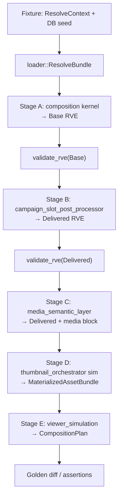
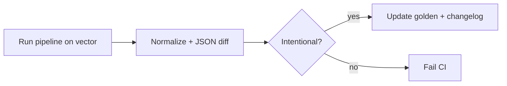

# End-to-End RVE Composition Validation Harness

**Phase:** 1b.3 — E2E Composition Validation (architecture + validation design only)  
**Status:** Normative validation architecture (no implementation)  
**Version:** `1.0.0`  
**Project:** ReelForge / Smart Production Studio  
**Prerequisites:** [`RESOLVED_VIEWER_EXPERIENCE_CONTRACT.md`](./RESOLVED_VIEWER_EXPERIENCE_CONTRACT.md), [`RESOLVED_VIEWER_EXPERIENCE_SCHEMA.md`](./RESOLVED_VIEWER_EXPERIENCE_SCHEMA.md), [`RESOLVER_DECISION_RECORD.md`](./RESOLVER_DECISION_RECORD.md), [`CAMPAIGN_AND_SLOT_INJECTION_ARCHITECTURE.md`](./CAMPAIGN_AND_SLOT_INJECTION_ARCHITECTURE.md), [`VIEWER_COMPOSITION_CONTRACT.md`](./VIEWER_COMPOSITION_CONTRACT.md), [`MEDIA_REPRESENTATION_CONTRACT.md`](./MEDIA_REPRESENTATION_CONTRACT.md), [`MEDIA_INVENTORY_AND_PLACEHOLDER_ARCHITECTURE.md`](./MEDIA_INVENTORY_AND_PLACEHOLDER_ARCHITECTURE.md), [`EXPERIENCE_GOVERNANCE_CONTRACT.md`](./EXPERIENCE_GOVERNANCE_CONTRACT.md), [`ARCHITECTURE_CLOSURE_REPORT.md`](./ARCHITECTURE_CLOSURE_REPORT.md)

**Scope:** Full-pipeline simulation model, canonical test vectors, per-stage assertion catalog, golden snapshot system, drift detection rules, layer independence reassertion, and Phase 1b production-readiness gate. This document does **not** define Rust test crates, fixture file paths, CI YAML, schema JSON, HTTP routes, or Svelte code.

**Explicit non-goals (Phase 1b.3):** Implementing the harness, loading production databases in CI, visual regression screenshots, load testing, or amending normative contracts.

---

## Table of Contents

1. [Purpose](#1-purpose)
2. [Full Pipeline Simulation Model](#2-full-pipeline-simulation-model)
3. [Harness Architecture](#3-harness-architecture)
4. [Canonical Test Vectors](#4-canonical-test-vectors)
5. [Assertion Rules per Stage](#5-assertion-rules-per-stage)
6. [Golden Snapshot System](#6-golden-snapshot-system)
7. [Drift Detection Rules](#7-drift-detection-rules)
8. [Layer Independence (Boundary Reassertion)](#8-layer-independence-boundary-reassertion)
9. [Phase 1b Readiness Gate](#9-phase-1b-readiness-gate)
10. [Harness Execution Modes](#10-harness-execution-modes)
11. [References](#11-references)

---

## 1. Purpose

Phase 1a.4 introduced **unit-level** resolver tests against RDR rules. Phase 1b adds **campaign injection**, **media semantic classification**, and **Viewer composition**. Without an end-to-end validation harness, regressions can leak across layer boundaries (resolver purity, injector structural drift, URL construction in Viewer, campaign priority re-run in UI).

The harness answers:

| Question | Harness mechanism |
|----------|-------------------|
| Does the full stack produce deterministic output? | Pipeline simulation + golden snapshots |
| Did a change break resolver purity? | RP-1 campaign DB variant tests |
| Did CSPP mutate layout? | Structural diff Base vs Delivered |
| Does media stay semantic-only? | M-assertions + forbidden-key scan |
| Did Viewer re-implement resolution? | CompositionPlan golden + leakage detectors |

The harness is a **specification for future implementation** (Phase 1b.4+ or parallel to CSPP merge). Architecture phases 1b.0–1b.3 deliver **design only**; this document closes the 1b architecture trilogy before production campaign + UI integration.

---

## 2. Full Pipeline Simulation Model

### 2.1 Stage graph

The harness simulates production order **without** collapsing layers. Each stage has explicit inputs, outputs, and isolation barriers.



| Stage | Production analogue | Harness output artifact |
|-------|---------------------|-------------------------|
| **Fixture** | Seeded test DB or frozen bundle JSON | `HarnessFixture` |
| **Loader** | `load_resolve_bundle()` | `ResolveBundle` |
| **A — Resolver** | `experience_resolve::compose` | `base_rve.json` |
| **B — Injector** | `campaign_slot_post_processor::enrich` | `delivered_rve.json` (pre-media) |
| **C — Media semantic** | Future resolver/media classifier + policy merge | `delivered_rve_with_media.json` |
| **D — Orchestrator sim** | `thumbnail_orchestrator` + theater pipeline | `materialized_bundle.json` |
| **E — Viewer sim** | Pure `compose_viewer(base, delivered, bundle)` | `composition_plan.json` |

Stages **A–E** are independently invokable. E2E run executes **A→E** in sequence; stage-scoped runs stop at any boundary for faster feedback.

### 2.2 Simulation vs production

| Aspect | Harness | Production |
|--------|---------|------------|
| Database | In-memory / fixture snapshot | Live PostgreSQL |
| Clock | Frozen `now` injectable into CSPP | Server UTC |
| Orchestrator | Deterministic stub bundle from fixture refs | Real pipeline |
| Viewer | `viewer_simulation` (no DOM) | Svelte / native UI |
| HTTP | Not required; may optionally assert `GET /api/experience/resolve` parity | Required |

**Parity rule E2E-P1:** When fixture DB and frozen clock match, HTTP resolve response **must** equal `delivered_rve_with_media` (post Stage C) modulo provenance timestamps if any are wall-clock (forbidden in harness fixtures).

### 2.3 Data contracts between stages

| Handoff | Required invariant |
|---------|-------------------|
| Bundle → Base | RDR-130: `campaigns: []` |
| Base → CSPP | Base immutable during enrich |
| CSPP → Delivered | `delivered` structural §2.2 paths === `base` (Viewer contract VC-STRUCT-1) |
| Delivered → Media layer | Only `media` (+ optional `media_placeholder_policy`) added or updated; no layout mutation |
| Delivered + Bundle → Viewer | DET-1 inputs complete |

### 2.4 Failure injection points

Harness **must** support aborting pipeline at each stage to assert error codes:

| Inject | Expected |
|--------|----------|
| Invalid bundle (missing profile) | Stage A error before RVE |
| NC-005 on Base layout | Stage A `validate_rve` → 422 |
| NC-105 campaign key in CSPP output | Stage B `validate_rve` → 422 |
| Forbidden URL in `media_reference` | Stage C assertion fail |
| Base/Delivered structural drift | Stage E diagnostic + harness fail |

---

## 3. Harness Architecture

### 3.1 Logical components (future implementation)

| Component | Responsibility |
|-----------|----------------|
| **harness_runner** | Orchestrates stages, frozen clock, assertion aggregation |
| **fixture_registry** | Maps vector ID → seed data + expected flags |
| **assertion_engine** | Applies §5 rule sets per stage |
| **golden_store** | Versioned expected artifacts (§6) |
| **drift_analyzer** | Applies §7 rules on diffs |
| **viewer_simulation** | Implements Viewer contract §4–§9 without UI framework |
| **orchestrator_stub** | Maps opaque refs → deterministic fake handles |

### 3.2 Artifact naming convention (design)

```
harness/
  vectors/
    <vector_id>/
      fixture.json
      base_rve.golden.json
      delivered_rve.golden.json
      delivered_rve_with_media.golden.json
      materialized_bundle.golden.json
      composition_plan.golden.json
      manifest.yaml          # vector metadata, clock, schema_version
```

`<vector_id>` is one of §4 canonical IDs. `manifest.yaml` records `harness_version`, `schema_version`, `rdr_revision`, and `frozen_now` (ISO-8601).

### 3.3 Assertion severity

| Level | Meaning | CI default |
|-------|---------|------------|
| **HARD** | Pipeline incorrect; block merge | Fail build |
| **SOFT** | Spec drift warning; triage required | Warn + ticket |
| **INFO** | Informational diff (provenance ordering) | Log only |

---

## 4. Canonical Test Vectors

Five **canonical vectors** are mandatory for harness completeness. Each exercises a distinct `media_intent` / content-format axis and pipeline edge behavior.

### 4.1 Vector summary

| Vector ID | Content axis | `media_intent` | Primary surfaces | Campaign scenario | Inventory / media |
|-----------|--------------|----------------|------------------|-------------------|-----------------|
| `documentary` | Long-form documentary profile | `DOCUMENTARY` | HERO, THEATER, CARD | `PREMIERE` + `hero_promo` active | READY → `REAL_MEDIA` hero |
| `micro_drama` | Vertical serial | `MICRO_DRAMA` | HERO, CARD, CONTINUE_WATCHING | `PROMOTION` + `shelf_featured`; `shelf_badge` sponsor | READY; CW row present |
| `music_video` | Artist-forward | `MUSIC_VIDEO` | HERO, CARD, THEATER | Overlapping campaigns → collision on `hero_surface` | READY + DERIVED poster |
| `clip` | Short clip | `CLIP` | CARD, HERO (compact) | Single `CONTEST` + `hero_promo` | PLACEHOLDER policy path |
| `failure_case` | Mixed / invalid inputs | `UNKNOWN` or absent | All gated off or partial | Expired campaign, orphan `campaign_id`, NC-105 inject | FAILED / not READY → `FALLBACK_MEDIA` |

### 4.2 `documentary` vector (spec)

| Dimension | Seed intent |
|-----------|-------------|
| Profile | `content_format` documentary; layout preset cinematic wide |
| Visibility | Hero `STATIC_IMAGE`, theater visible |
| Slots | `hero_promo` + `theater_overlay` bound to active `PREMIERE` |
| Campaigns | One active premiere within frozen window |
| Media | Inventory READY; expect `REAL_MEDIA`, documentary placeholder family when thumb missing |
| Viewer | HERO + THEATER admitted; overlay in theater zone |

**Distinguishing assertion:** GR-03 — active `hero_promo` `content_ref` present in bundle before placeholder tier on hero.

### 4.3 `micro_drama` vector (spec)

| Dimension | Seed intent |
|-----------|-------------|
| Profile | Micro-drama preset; 9:16 hero tokens |
| Visibility | Hero `STATIC_VIDEO` or carousel; continue_watching panel visible |
| Watch features | `continue_watching_enabled: true` |
| Slots | `shelf_featured` + `shelf_badge` (SPONSOR) |
| Campaigns | Two active (PROMOTION + SPONSOR) — both in `campaigns[]`, distinct collision groups |
| Media | Per-tile refs for shelf; episode `MICRO_DRAMA` |

**Distinguishing assertion:** CONTINUE_WATCHING surface omitted when `continue_watching_enabled: false` (variant `micro_drama_gated_off` optional sub-fixture).

### 4.4 `music_video` vector (spec)

| Dimension | Seed intent |
|-----------|-------------|
| Profile | Music video format; `card_style` music tokens |
| Campaigns | Two active campaigns same priority on `hero_promo` — CSPP picks winner per §6.1 |
| Slots | Winner has `campaign_id`; loser unbound on hero |
| Media | `DERIVED_MEDIA` for hero poster; `REAL_MEDIA` for theater |

**Distinguishing assertion:** ST-2 — at most one hero_surface winner; RP-1 — Base identical if only campaign rows change.

### 4.5 `clip` vector (spec)

| Dimension | Seed intent |
|-----------|-------------|
| Profile | Clip format; compact card layout |
| Inventory | Not READY or no real asset — forces `PLACEHOLDER_MEDIA` or `FALLBACK_MEDIA` |
| Campaigns | `CONTEST` + active `hero_promo` |
| Placeholder | `CONTENT_THEN_PLACEHOLDER` policy |

**Distinguishing assertion:** Viewer F2 placeholder path; no URL in RVE; bundle may omit real handle.

### 4.6 `failure_case` vector (spec)

| Dimension | Seed intent |
|-----------|-------------|
| Campaigns | Expired campaign (excluded from `campaigns[]`); slot still references old `campaign_id` |
| Structural | Optional deliberate Base/Delivered drift for harness negative test (separate sub-case `failure_case_drift`) |
| Media | `FAILED` inventory; `FALLBACK_MEDIA` |
| Validation | Optional inject `playback_url` on campaign object → NC-105 at Stage B |
| Viewer | Invalid campaign ignored (§8.3); panels with `effective_visible: false` |

**Distinguishing assertion:** Safe-ignore semantics; validate_rve failure when NC-105 injected at CSPP output.

### 4.7 Vector coverage matrix

| Capability | doc | micro | music | clip | fail |
|------------|-----|-------|-------|------|------|
| RP-1 purity | ✓ | ✓ | ✓ | ✓ | ✓ |
| Collision groups | | | ✓ | | ✓ |
| CW surface | | ✓ | | | ✓ |
| PLACEHOLDER path | | | | ✓ | ✓ |
| NC-105 reject | | | | | ✓ |
| GR-03 slot precedence | ✓ | | ✓ | ✓ | |

---

## 5. Assertion Rules per Stage

Assertions are grouped by stage. IDs are stable for implementation traceability.

### 5.1 Stage A — Resolver (Base RVE)

| ID | Severity | Rule |
|----|----------|------|
| **A-RP-1** | HARD | `base_rve` identical when only `platform_campaigns` fixture data changes (RDR-135 / RP-1). |
| **A-RDR-130** | HARD | `campaigns` deep-equals `[]`. |
| **A-RDR-120** | HARD | Slots loaded for platform + hierarchy scopes present in fixture. |
| **A-RDR-122** | HARD | No duplicate `(slot_key, scope_type, scope_id)` in `slots[]`. |
| **A-NC** | HARD | `validate_rve(base)` passes for happy vectors; `failure_case` may expect compose failure before validate. |
| **A-NO-CAMPAIGN-READ** | HARD | Static analysis or spy: composition kernel module graph excludes `platform_campaigns` loader. |
| **A-STRUCT** | HARD | Required §8.1–8.7, §8.10–8.11 present per schema. |
| **A-PROV** | SOFT | Provenance minimum per RDR-140–143. |

### 5.2 Stage B — Campaign injector (CSPP)

| ID | Severity | Rule |
|----|----------|------|
| **B-ND-1** | HARD | **Non-destructive:** For every path in Viewer §2.2, `delivered[path] === base[path]`. |
| **B-RDR-132** | HARD | Every `campaigns[].status` resolved `active`; no scheduled/ended in array. |
| **B-RDR-133** | SOFT | Winning slots have `provenance` `source: campaign` where contract requires. |
| **B-NC-105** | HARD | Deep scan: no `playback_url`, `thumbnail_url`, layout override keys on campaigns or slots. |
| **B-COLLISION** | HARD | Per vector manifest: expected winner `slot_key` + `campaign_id` for music_video / failure_case. |
| **B-NO-WRITE** | HARD | No DB writes during enrich (transaction count / mock). |
| **B-CLOCK** | HARD | Changing `frozen_now` outside window changes `campaigns[]` without changing `base_rve`. |
| **B-VALIDATE** | HARD | `validate_rve(delivered)` passes for happy paths. |

### 5.3 Stage C — Media semantic layer

| ID | Severity | Rule |
|----|----------|------|
| **C-SEM-ONLY** | HARD | Output adds/updates only `media` (+ optional `media_placeholder_policy`); no other top-level section changes vs Stage B output. |
| **C-M1-M4** | HARD | `media_state` is exactly one of `REAL_MEDIA`, `DERIVED_MEDIA`, `PLACEHOLDER_MEDIA`, `FALLBACK_MEDIA`. |
| **C-INTENT** | HARD | `media_intent` ∈ contract enum for vector axis. |
| **C-REF-OPAQUE** | HARD | `media_reference` is null or opaque string; must not match URL regex patterns. |
| **C-NO-THUMB-URL** | HARD | No `thumbnail_url`, `url`, `cdn_*` anywhere in RVE JSON. |
| **C-NO-RESOLVER-URL** | HARD | Stage A output unchanged when media inventory fixture toggles READY/FAILED (media layer isolated). |
| **C-PH-05** | HARD | Placeholder selection inputs exclude raw campaign `content_ref` blobs (media contract §5.3). |
| **C-INVENTORY-MAP** | SOFT | `media_state` consistent with fixture inventory table per media inventory §2.5 mapping. |

### 5.4 Stage D — Orchestrator simulation

| ID | Severity | Rule |
|----|----------|------|
| **D-STUB-DET** | HARD | Same refs + vector → identical `materialized_bundle`. |
| **D-GR-03** | HARD | For documentary/music_video: when `hero_promo` active, bundle contains slot image key before placeholder key. |
| **D-NO-RVE-MUTATE** | HARD | Orchestrator sim does not modify RVE documents. |

### 5.5 Stage E — Viewer simulation

| ID | Severity | Rule |
|----|----------|------|
| **E-DET-1** | HARD | Identical `(base, delivered, bundle, viewer_version)` → identical `composition_plan`. |
| **E-BASE-AUTH** | HARD | Composition uses Base for §2.2 paths even if Delivered differs (drift injection sub-case). |
| **E-NO-MERGE** | HARD | `composition_plan` does not contain fields implying hierarchy merge or campaign priority scores. |
| **E-NO-URL** | HARD | Plan references only bundle handles, never constructed URLs from refs. |
| **E-CP-ORDER** | HARD | Region admission order matches Viewer §4: invisible panels have zero children. |
| **E-CR-03** | HARD | Plan does not reorder campaigns by `priority`. |
| **E-SAFE-IGNORE** | HARD | `failure_case`: orphan `campaign_id` produces no overlay node. |
| **E-SURFACE** | HARD | Per vector manifest: expected surfaces HERO/CARD/THEATER/CW admission flags. |

### 5.6 Cross-stage assertions

| ID | Severity | Rule |
|----|----------|------|
| **X-E2E-P1** | HARD | Full pipeline golden matches committed snapshot for vector. |
| **X-LAYER-ISO** | HARD | Failure in Stage B does not skip Stage A golden (stages independently testable). |
| **X-SCHEMA** | HARD | `schema_version` constant across all artifacts for vector. |

---

## 6. Golden Snapshot System

### 6.1 Purpose

Golden snapshots provide **regression baselines** for each stage artifact. They are **not** a substitute for property-based assertions (§5); they catch unintended drift when rules pass but output changes.

### 6.2 Snapshot types

| Snapshot | Stage | Update policy |
|----------|-------|---------------|
| `base_rve.golden.json` | A | Update only on intentional RDR/contract change + review |
| `delivered_rve.golden.json` | B | Update on CSPP rule change |
| `delivered_rve_with_media.golden.json` | C | Update on media semantic rules |
| `materialized_bundle.golden.json` | D | Update on orchestrator contract or stub version |
| `composition_plan.golden.json` | E | Update on Viewer composition table version |

### 6.3 Normalization before diff

To avoid flaky diffs:

| Field class | Normalization |
|-------------|---------------|
| UUIDs in fixtures | Fixed per vector manifest |
| `frozen_now` | Stripped from snapshot body; stored in manifest only |
| Provenance | Sort keys lexicographically; optional strip `profile_version` if SOFT |
| Array order | `campaigns[]` sorted by `id` for snapshot only (not production requirement) |
| Floating text | Trim whitespace |

### 6.4 Diff workflow



**Changelog entry required** for every golden update: vector ID, stage, author, rule ID or ticket, one-line rationale.

### 6.5 Snapshot versioning

| Field | Meaning |
|-------|---------|
| `golden_epoch` | Monotonic integer; bump on breaking harness contract |
| `schema_version` | RVE `1.0.0` until amended |
| `harness_contract_version` | This document version (`1.0.0`) |

Breaking changes to normalization rules increment `golden_epoch` and require bulk regoldening.

### 6.6 Relationship to Phase 1a.4 tests

Existing resolver unit tests (`rdr_130_campaigns_empty`, etc.) remain **Stage A fast path**. E2E harness **includes** Stage A assertions but does not replace focused RDR tests.

---

## 7. Drift Detection Rules

Drift detection runs on **diffs** (golden vs actual) and **static scans**. Categories map to remediation owners.

### 7.1 Schema drift

| Rule ID | Detection | Severity | Owner |
|---------|-----------|----------|-------|
| **SD-01** | New required top-level RVE key without schema amendment | HARD | Contract + schema |
| **SD-02** | Enum value outside `RESOLVED_VIEWER_EXPERIENCE_SCHEMA.md` | HARD | Schema |
| **SD-03** | `schema_version` mismatch across stages | HARD | API + harness |
| **SD-04** | NC-* validation code path removed or bypassed | HARD | `contract.rs` |

### 7.2 Injection drift

| Rule ID | Detection | Severity | Owner |
|---------|-----------|----------|-------|
| **ID-01** | `delivered.layout` ≠ `base.layout` (deep) | HARD | CSPP |
| **ID-02** | `delivered.visibility` ≠ `base.visibility` | HARD | CSPP |
| **ID-03** | `campaigns[]` non-empty in Base RVE | HARD | Resolver |
| **ID-04** | CSPP re-runs RDR-122 dedup (slot count/key set changes vs base) | HARD | CSPP |
| **ID-05** | Forbidden NC-105 keys appear in Delivered | HARD | CSPP |
| **ID-06** | Campaign row count changes without fixture campaign change when base fixed | HARD | RP-1 violation |

### 7.3 Media contract violations

| Rule ID | Detection | Severity | Owner |
|---------|-----------|----------|-------|
| **MD-01** | URL pattern in any RVE field | HARD | Media layer + CSPP |
| **MD-02** | `media_state` set in resolver before media layer authorized | SOFT | Resolver roadmap |
| **MD-03** | Inventory DB column mapped directly into RVE string field | HARD | Loader boundary |
| **MD-04** | Placeholder tier uses episode title metadata (PH-01) | HARD | Viewer / orchestrator |
| **MD-05** | `content_ref` URL used as placeholder input (PH-05) | HARD | Orchestrator |

### 7.4 Viewer logic leakage

| Rule ID | Detection | Severity | Owner |
|---------|-----------|----------|-------|
| **VL-01** | `composition_plan` changes when only campaign DB changes but base+delivered pair fixed | HARD | Viewer |
| **VL-02** | Plan includes `merged_from_profile` or hierarchy scope keys | HARD | Viewer |
| **VL-03** | Plan re-sorts shelf by recommendation hints without feature flag | HARD | Viewer |
| **VL-04** | Different `composition_plan` with same inputs across two runs | HARD | Viewer DET-1 |
| **VL-05** | Viewer bundle requests use parsed URL from `media_reference` | HARD | Viewer |
| **VL-06** | Svelte/frontend reads `experience_slot_assignments` (grep/AST) | HARD | Frontend |

### 7.5 Drift response playbook

| Severity | Action |
|----------|--------|
| HARD | Block merge; fix layer per owner column |
| SOFT | Open REM ticket; allow merge only with waiver from architecture owner |
| INFO | Log in harness report |

---

## 8. Layer Independence (Boundary Reassertion)

The harness **proves** independence by staged execution and forbidden cross-calls.

### 8.1 Independence matrix

| Layer | May read | Must never read | Must never write |
|-------|----------|-----------------|------------------|
| **Resolver** | `ResolveBundle`, experience tables via loader | `platform_campaigns` | Any table during compose |
| **Injector (CSPP)** | Base RVE, campaign + slot assignment reads | Layout preset merge, profile version pick | Any table during enrich |
| **Media semantic layer** | Delivered RVE, approved existence hints | Thumbnail URLs, CDN config | RVE structural sections |
| **Orchestrator** | RVE refs, inventory | Experience profile merge | RVE |
| **Viewer sim** | Base, Delivered, bundle | DB, resolve APIs, campaign tables | RVE, DB |

### 8.2 Forbidden integration patterns (harness flags)

| Pattern | Violation |
|---------|-----------|
| `experience_resolve` imports campaign enrich inline | CS-01 regression |
| Viewer calls `resolve()` internally | G3 violation |
| CSPP calls `compose()` twice with mutation | Non-idempotent enrich |
| Media layer patches `visibility` for “better UX” | S4 violation |
| Single “god” function returning CompositionPlan from episode_id | Layer collapse |

### 8.3 Contract authority chain

```
RESOLVED_VIEWER_EXPERIENCE_CONTRACT (wire)
  → RESOLVER_DECISION_RECORD (merge)
  → CAMPAIGN_AND_SLOT_INJECTION_ARCHITECTURE (CSPP)
  → MEDIA_REPRESENTATION_CONTRACT (semantic media)
  → MEDIA_INVENTORY_AND_PLACEHOLDER_ARCHITECTURE (orchestrator ladders)
  → VIEWER_COMPOSITION_CONTRACT (composition)
  → THIS DOCUMENT (validation)
```

Harness failures cite **contract clause** first, implementation file second.

### 8.4 Independence test procedure

For each layer **L**:

1. Run full pipeline on all five vectors.
2. Run pipeline with **L stubbed** to golden output for **L**'s inputs; downstream must match full pipeline golden.
3. Inject **L-only** defect; only **L** and downstream assertions fail; upstream goldens unchanged.

---

## 9. Phase 1b Readiness Gate

Production **campaign engine merge** and **Viewer UI integration** require all gates below. Architecture docs 1b.0–1b.3 are **necessary**; this gate is **sufficient** only when implementation exists.

### 9.1 Gate tiers

| Tier | Meaning |
|------|---------|
| **GATE-A** | Architecture frozen (1b.0–1b.3 docs approved) |
| **GATE-B** | Implementation + harness green |
| **GATE-C** | Production integration allowed |

### 9.2 GATE-A — Architecture (current phase)

| # | Criterion | Status |
|---|-----------|--------|
| A1 | Media inventory + placeholder architecture (1b.0) | Delivered |
| A2 | Campaign + slot injection architecture (1b.1) | Delivered |
| A3 | Viewer composition contract (1b.2) | Delivered |
| A4 | E2E validation harness design (1b.3) | This document |
| A5 | Closure report: no new architecture phases before 1b impl | Per closure report |

### 9.3 GATE-B — Implementation + harness

| # | Criterion | Evidence |
|---|-----------|----------|
| B1 | CSPP merged behind API orchestrate `compose → enrich → validate` | Code + tests |
| B2 | All five canonical vectors pass §5 assertions | CI report |
| B3 | Golden snapshots committed for all vectors × 5 artifact types | `harness/vectors/*` |
| B4 | RP-1 (A-RP-1) green on music_video + failure_case | Test log |
| B5 | REM-007 checklist completed (G1, S4, NC-105) | Signed checklist |
| B6 | `validate_rve` on Delivered; NC-105 reject case in failure_case | Test log |
| B7 | Stage isolation tests (§8.4) pass for resolver and CSPP | Test log |
| B8 | No VL-* leakage detectors firing on frontend | Static scan |

### 9.4 GATE-C — Production integration

| # | Criterion | Notes |
|---|-----------|-------|
| C1 | REM-001–005 addressed or formally waived with governance sign-off | F-001 cluster |
| C2 | `GET /api/experience/resolve` returns logical pair or embedded Base per Viewer §2.4 | Transport design |
| C3 | E2E-P1 parity: HTTP body matches harness Delivered for fixture DB | Integration test |
| C4 | Feature flag `REELFORGE_EXPERIENCE_PROFILES` behavior documented | Existing API gate |
| C5 | Viewer.svelte (or successor) consumes Base+Delivered; no experience DB reads | Code review |
| C6 | Audit events for campaign writes (governance §8) — **SOFT** if audit store deferred | Track F-009 |
| C7 | Drift analyzer in CI on main branch | SD/ID/MD/VL rules |

### 9.5 Explicitly not required for GATE-C

| Item | Reason |
|------|--------|
| Full `media` block in production schema | F-010 deferred; harness Stage C may use extension field until amendment |
| Visual screenshot regression | Out of scope |
| Production CDN | Orchestrator may remain stubbed in staging |
| REM-009 audit storage | Governance non-goal 1a.6 |

### 9.6 Gate verdict template

| Gate | Verdict (2026-06-03 architecture phase) |
|------|----------------------------------------|
| **GATE-A** | **PASS** — 1b.0–1b.3 documentation complete |
| **GATE-B** | **PENDING** — awaits harness + CSPP implementation |
| **GATE-C** | **BLOCKED** — until GATE-B + REM-001–005 / REM-007 |

---

## 10. Harness Execution Modes

| Mode | Stages | Use case |
|------|--------|----------|
| `resolver-only` | A | Fast RDR regression |
| `injector-only` | A→B | CSPP development |
| `media-only` | B→C | Media semantic layer |
| `viewer-only` | Fixed RVE inputs → E | Viewer contract |
| `e2e` | A→E | Release gate |
| `drift-scan` | Static | PR pre-check without DB |
| `golden-refresh` | A→E + manual approve | Intentional baseline update |

**CI recommendation:** `resolver-only` + `e2e` on main; full golden diff on release tags.

---

## 11. References

| Document | Harness use |
|----------|-------------|
| [`CAMPAIGN_AND_SLOT_INJECTION_ARCHITECTURE.md`](./CAMPAIGN_AND_SLOT_INJECTION_ARCHITECTURE.md) | Stages A–B, RP-1, collision rules |
| [`VIEWER_COMPOSITION_CONTRACT.md`](./VIEWER_COMPOSITION_CONTRACT.md) | Stage E, DET-1, Base+Delivered |
| [`MEDIA_REPRESENTATION_CONTRACT.md`](./MEDIA_REPRESENTATION_CONTRACT.md) | Stage C assertions |
| [`MEDIA_INVENTORY_AND_PLACEHOLDER_ARCHITECTURE.md`](./MEDIA_INVENTORY_AND_PLACEHOLDER_ARCHITECTURE.md) | Vectors, GR-03, ladders |
| [`RESOLVER_DECISION_RECORD.md`](./RESOLVER_DECISION_RECORD.md) | Stage A RDR-* |
| [`RESOLVED_VIEWER_EXPERIENCE_SCHEMA.md`](./RESOLVED_VIEWER_EXPERIENCE_SCHEMA.md) | NC-*, SD-* |
| [`EXPERIENCE_GOVERNANCE_CONTRACT.md`](./EXPERIENCE_GOVERNANCE_CONTRACT.md) | G1–G3, REM items |
| [`ARCHITECTURE_CLOSURE_REPORT.md`](./ARCHITECTURE_CLOSURE_REPORT.md) | F-001, REM-007, 1b approval |

---

*End of Phase 1b.3 validation harness architecture document.*
