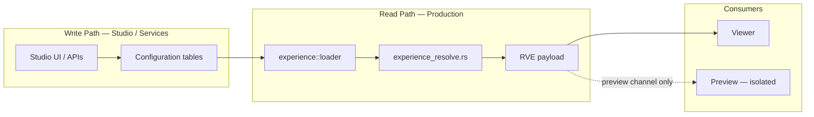
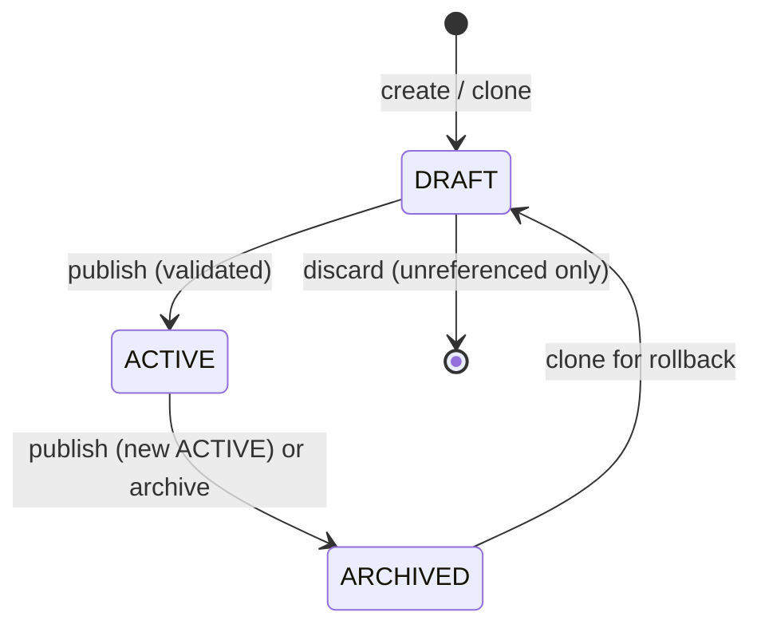

# Experience Governance Contract — Operational Specification

**Phase:** 1a.6 — Experience Governance (documentation only)  
**Status:** Normative architecture (no implementation)  
**Version:** `1.0.0`  
**Project:** ReelForge / Smart Production Studio  
**Prerequisites:** [`RESOLVED_VIEWER_EXPERIENCE_CONTRACT.md`](./RESOLVED_VIEWER_EXPERIENCE_CONTRACT.md), [`RESOLVED_VIEWER_EXPERIENCE_SCHEMA.md`](./RESOLVED_VIEWER_EXPERIENCE_SCHEMA.md), [`RESOLVER_BOUNDARY_AUDIT.md`](./RESOLVER_BOUNDARY_AUDIT.md), [`RESOLVER_DECISION_RECORD.md`](./RESOLVER_DECISION_RECORD.md), [`MEDIA_REPRESENTATION_CONTRACT.md`](./MEDIA_REPRESENTATION_CONTRACT.md)

**Scope:** Operational governance for experience profiles, publishing, previews, rollback, auditing, and lifecycle management. This document does **not** define migrations, APIs, UI, audit storage, approval workflows, or schema changes.

---

## Table of Contents

1. [Governance Principles](#1-governance-principles)
2. [Lifecycle States](#2-lifecycle-states)
3. [Publish Workflow](#3-publish-workflow)
4. [Preview Isolation Rules](#4-preview-isolation-rules)
5. [Rollback Policy](#5-rollback-policy)
6. [Version Lineage Rules](#6-version-lineage-rules)
7. [Attachment Governance](#7-attachment-governance)
8. [Audit Requirements](#8-audit-requirements)
9. [Operational Safety Rules](#9-operational-safety-rules)
10. [Governance Exit Criteria (Phase 1b Gate)](#10-governance-exit-criteria-phase-1b-gate)
11. [Explicit Non-Goals](#11-explicit-non-goals)
12. [Relationship to Implementation](#12-relationship-to-implementation)

---

## 1. Governance Principles

These principles are **non-negotiable** for all experience-layer operations.

| ID | Principle | Statement |
|----|-----------|-----------|
| **G1** | Resolver authority | `experience_resolve.rs` is the **only** production composition authority for `ResolvedViewerExperience` (RVE). |
| **G2** | Studio writes only | Studio (and approved admin services) **write configuration** — profiles, presets, metadata, hierarchy attachments, slots. Studio **must not** merge experience layers for production use except via cached or explicit resolve calls. |
| **G3** | Viewer consumes only | Viewer **consumes resolved output** (RVE or pipeline derivatives). Viewer **must not** read experience tables or apply merge logic. |
| **G4** | Controlled persistence | **No direct database edits** outside approved migrations, application services, or documented operational runbooks. Ad-hoc SQL against experience tables is forbidden in production. |
| **G5** | Traceability | **Every production-visible change** must be traceable to an actor, timestamp, profile family, version lineage, and action type (see §8). |

### 1.1 Authority diagram



---

## 2. Lifecycle States

Experience profile **versions** exist in exactly one of three states. Families are stable containers; state applies to **version rows**.

### 2.1 State reference

| State | Purpose | Allowed operations | Forbidden operations | Resolver visibility |
|-------|---------|-------------------|----------------------|---------------------|
| **DRAFT** | Editable working copy for Studio authors | Create, edit fields, validate (dry-run), preview resolve, clone from source, discard draft | Publish without validation; production resolve; pin as production attachment target | **Never** — resolver **must not** emit RVE using a DRAFT version (NC-103 if pinned) |
| **ACTIVE** | Single published version per family; production default | Read; unpinned attachment resolution; pin for locked broadcasts; clone → new DRAFT; publish demotes prior ACTIVE | In-place edit of immutable fields without new DRAFT; delete while referenced | **Yes** — resolver **may** resolve ACTIVE (latest when unpinned, exact row when pinned and ACTIVE) |
| **ARCHIVED** | Immutable historical snapshot for audit, compare, rollback source | Read; compare; clone → new DRAFT; lineage inspection | Edit; publish directly; reactivate in place; production resolve; delete while referenced | **Never** — resolver **must not** resolve ARCHIVED versions |

### 2.2 Global lifecycle rules

| Rule ID | Rule |
|---------|------|
| **LC-01** | At most **one** `ACTIVE` version per `profile_family_id` at any time. |
| **LC-02** | `DRAFT` versions are **not visible** to production Viewer resolve. |
| **LC-03** | `ARCHIVED` versions are **never** production-resolved. |
| **LC-04** | Transition `DRAFT → ACTIVE` occurs only through **Publish** (§3). |
| **LC-05** | Transition `ACTIVE → ARCHIVED` occurs only through **Publish** (demotion) or explicit archive service — never by silent overwrite. |
| **LC-06** | Pinned production attachments **must** reference a version row with status `ACTIVE`. Pinning `DRAFT` or `ARCHIVED` is a configuration error (resolver rejects DRAFT per NC-103; ARCHIVED pins are forbidden by governance). |

### 2.3 State transition diagram



---

## 3. Publish Workflow

Normative sequence for taking configuration live:

```
CREATE → EDIT → VALIDATE → PREVIEW → PUBLISH → RESOLVE
```

### 3.1 Stage definitions

| Stage | Actor | Description |
|-------|-------|-------------|
| **CREATE** | Studio | New `profile_family` and/or initial `DRAFT` version row. |
| **EDIT** | Studio | Mutate **DRAFT** only — labels, layout preset, theme set, component flags, content format. |
| **VALIDATE** | Studio / service | Run contract checks against composed shape (schema + business rules) **before** publish. |
| **PREVIEW** | Studio | Isolated resolve of DRAFT or hypothetical attachment (§4) — no production side effects. |
| **PUBLISH** | Studio / service | Transactional promotion `DRAFT → ACTIVE`; demote prior `ACTIVE → ARCHIVED`. |
| **RESOLVE** | Production API | `GET /api/experience/resolve` (or successor) returns RVE using **ACTIVE** only. |

### 3.2 Validation gate

| Rule ID | Rule |
|---------|------|
| **PW-01** | Validation **must succeed** before publish is permitted. |
| **PW-02** | Validation includes: JSON Schema (`validate_rve` on preview payload), null-critical paths, reserved metadata keys, single ACTIVE invariant. |
| **PW-03** | Failed validation **blocks** publish; DRAFT remains editable. |

### 3.3 Publish transaction semantics

Publishing **must** be **atomic** (single database transaction):

1. Lock target `DRAFT` row and family ACTIVE slot.
2. Verify target status is `DRAFT`.
3. Re-run validation on composed preview payload.
4. Set previous `ACTIVE` in same family → `ARCHIVED` (if exists).
5. Set target row → `ACTIVE`, set `published_at`.
6. Commit.

| Rule ID | Rule |
|---------|------|
| **PW-04** | Partial publish (ACTIVE set without archiving predecessor) is **forbidden**. |
| **PW-05** | Concurrent publish attempts: one succeeds; others fail with conflict (no dual ACTIVE). |

### 3.4 Expected failure behavior

| Failure | System behavior | Operator action |
|---------|-----------------|-----------------|
| Validation error | Publish rejected; DRAFT unchanged | Fix draft fields; re-validate |
| Not DRAFT | Publish rejected | Clone or create new DRAFT |
| Concurrent publish | Transaction rollback; error returned | Retry after refresh |
| Referenced ARCHIVED pin on hierarchy | Publish of profile succeeds; resolve may fail attachment rules | Update pin to ACTIVE or unpin |
| Database unavailable | Publish fails closed | Retry; no partial ACTIVE |

---

## 4. Preview Isolation Rules

Preview is a **governance channel**, not a production path. No APIs are defined in this phase; concepts below are normative for future Studio preview.

### 4.1 Channels

| Channel | Purpose | Consumers |
|---------|---------|-----------|
| **Preview Resolve** | Show authors the experience **as-if** a DRAFT or hypothetical attachment were live | Studio UI, internal tools |
| **Production Resolve** | Authoritative RVE for Viewer and external caches | Viewer, CDN edge config (future) |

### 4.2 Isolation rules

| Rule ID | Rule |
|---------|------|
| **PI-01** | Preview **must never** modify `ACTIVE` content. |
| **PI-02** | Preview **must never** alter hierarchy attachments (`experience_profile_family_id`, pin flags) in production tables. |
| **PI-03** | Preview **must never** affect Viewer output or production caches. |
| **PI-04** | Preview may read DRAFT rows and compose in-memory or via a dedicated preview endpoint flagged `X-Reelforge-Preview: true` (future). |
| **PI-05** | Preview responses **must** be labeled non-authoritative (header or payload flag) when wire format is shared with production. |

### 4.3 Future preview concepts (not implemented)

| Concept | Description |
|---------|-------------|
| **Draft preview** | Resolve with `profile_version_id` of DRAFT; skip write path. |
| **Attachment simulator** | Preview with hypothetical family/pin without persisting hierarchy columns. |
| **Diff preview** | Side-by-side ACTIVE vs DRAFT RVE for Studio compare UI. |
| **Preview expiry** | Short-lived preview tokens; no caching at CDN. |

---

## 5. Rollback Policy

Rollback restores prior **behavior** without mutating history.

### 5.1 Normative procedure

```
Clone Previous Version → New DRAFT → Edit (optional) → Validate → Publish → Resolve
```

| Step | Action |
|------|--------|
| 1 | Select `ARCHIVED` (or prior `ACTIVE`) source version |
| 2 | **Clone** → new `DRAFT` with `created_from_profile_id = source.id` |
| 3 | Optional edits on DRAFT |
| 4 | Validate → Publish → new `ACTIVE` |
| 5 | Prior `ACTIVE` becomes `ARCHIVED` via publish demotion |

### 5.2 Forbidden rollback patterns

| Forbidden | Rule ID |
|-----------|---------|
| `UPDATE status = 'ACTIVE'` on an `ARCHIVED` row in place | **RB-01** |
| Delete `ARCHIVED` rows to “undo” | **RB-02** |
| Point hierarchy pin at old `ARCHIVED` row for production | **RB-03** |
| Manual SQL to swap ACTIVE rows | **RB-04** |

### 5.3 Rationale

| Concern | Why clone + publish |
|---------|---------------------|
| Audit trail | Every production state has a monotonic version number and lineage pointer |
| Immutability | Historical rows remain byte-stable for compliance compare |
| Resolver safety | Only one ACTIVE; no ambiguous dual-live rows |
| Campaign alignment (1b) | Campaigns reference stable resolve epochs tied to version ids |

---

## 6. Version Lineage Rules

### 6.1 Identity fields

| Field | Semantics | Governance |
|-------|-----------|------------|
| `profile_family_id` | Stable logical profile identity across all versions | **Never** changes for a logical profile; new product line → new family |
| `version` | Monotonic integer per family (`1`, `2`, `3`, …) | **Strictly increasing**; never reused or decremented |
| `created_from_profile_id` | UUID of **source version row** cloned from, or `NULL` for inaugural version | **Immutable** after insert; encodes ancestry |

### 6.2 Lineage requirements

| Rule ID | Requirement |
|---------|-------------|
| **VL-01** | Version numbers are **monotonic** within a family. |
| **VL-02** | Published (`ACTIVE` / `ARCHIVED`) version rows are **immutable** — changes require new DRAFT. |
| **VL-03** | **Full ancestry** is preserved via `created_from_profile_id` chain (walkable for audit UI). |
| **VL-04** | Clone always increments `version = MAX(version) + 1`. |
| **VL-05** | `changelog` (optional) should summarize human intent on publish for audit readability. |

### 6.3 Example lineage

```
profile_family_id: F1
├── v1  ACTIVE   (published_at=T1, created_from=NULL)
├── v2  ARCHIVED (demoted at T2, created_from=NULL)
├── v3  ACTIVE   (published_at=T2, created_from=v2)   ← rollback clone of v2
└── v4  DRAFT    (editing, created_from=v3)
```

---

## 7. Attachment Governance

Hierarchy scopes: **project → series → season → episode**. Each may attach a **profile family** and optionally **pin** a version.

### 7.1 Attachment fields (semantic)

| Field | Semantics |
|-------|-----------|
| `experience_profile_family_id` | Which logical profile family applies at this scope |
| `experience_profile_pin_version` | When `true`, use exact `experience_profile_version_id` |
| `experience_profile_version_id` | Pinned version row (required when pin is true) |

### 7.2 Resolution modes

| Mode | Configuration | Resolver behavior |
|------|---------------|-----------------|
| **Latest ACTIVE** (default) | `pin_version = false` | Load latest `ACTIVE` for `profile_family_id` |
| **Pinned** | `pin_version = true` + `version_id` | Load exact version; **must** be `ACTIVE` for production |

Winning attachment for `experience_profile` section: **episode → season → series → project** (first scope with a family id).

### 7.3 When to pin

| Scenario | Recommendation |
|----------|----------------|
| Standard series / seasons | **Unpinned** — auto-upgrade on profile publish |
| Locked premiere, compliance, live broadcast | **Pinned** to specific `ACTIVE` version |
| A/B or experimental (future) | Preview only until publish; then pin or unpin explicitly |

### 7.4 Over-pinning risks

| Risk | Consequence | Mitigation |
|------|-------------|------------|
| Pin at every hierarchy level | Authors must update many pins on each publish | Pin at **lowest necessary** scope (usually episode or series) |
| Pin stale ACTIVE after new publish | Intended lock — but may surprise if uncoordinated | Document pin purpose in changelog / audit |
| Pin wrong version id | Resolve errors or wrong experience | Validation on attachment save (future API) |
| Mix pinned parent + unpinned child | Complex merge; winning attachment may not be obvious | Governance review for multi-level attachments |

| Rule ID | Rule |
|---------|------|
| **AG-01** | Prefer **unpinned** unless business requires freeze. |
| **AG-02** | Pin targets **ACTIVE** production versions only. |
| **AG-03** | Attachment changes are **Studio writes** — never resolver writes. |

---

## 8. Audit Requirements

Audit **storage is not implemented** in Phase 1a.6. The following are **requirements** for a future audit subsystem.

### 8.1 Record fields (minimum)

Every governance-relevant event should capture:

| Field | Required | Description |
|-------|----------|-------------|
| `actor` | Yes | User id, service account, or API key identity |
| `timestamp` | Yes | UTC event time |
| `profile_family_id` | Yes | Affected family |
| `profile_version_id` | When applicable | Affected version row |
| `version` | When applicable | Integer version number |
| `change_summary` | Yes | Human or structured summary (e.g. “Published v4”, “Pinned episode E123”) |
| `action` | Yes | Enum: `create`, `edit`, `validate`, `preview`, `publish`, `clone`, `archive`, `attach`, `detach`, `pin`, `unpin` |

### 8.2 Events requiring audit

| Event | Priority |
|-------|----------|
| Publish | **Critical** |
| Clone (rollback source) | **Critical** |
| Hierarchy attachment / pin change | **High** |
| DRAFT create / discard | **Medium** |
| Preview (optional sampling) | **Low** |

### 8.3 Audit non-goals (this phase)

- Log storage schema
- Retention policy implementation
- SIEM integration
- Approval workflow gates

---

## 9. Operational Safety Rules

### 9.1 Data safety

| Rule ID | Rule |
|---------|------|
| **OS-01** | **No delete** of profile versions or families while referenced by hierarchy pins, slots, or audit obligations. |
| **OS-02** | **Archive** instead of delete for retirement. |
| **OS-03** | **No bypass** of validation before publish. |
| **OS-04** | **No direct production mutation** of RVE-shaped data outside resolver read path. |
| **OS-05** | **No manual database updates** to experience tables in production except documented disaster recovery with post-incident audit entry. |

### 9.2 Incident recovery expectations

| Incident | Expected response |
|----------|-------------------|
| Bad ACTIVE published | Clone previous ARCHIVED → DRAFT → validate → publish (§5) |
| Dual ACTIVE detected | Stop publishes; run repair script under change control; root-cause in audit |
| Resolver 422 spike | Identify pinned DRAFT or invalid attachment; fix configuration, not resolver bypass |
| Accidental hierarchy pin | Unpin or repoint via Studio; record audit event |
| Database restore | Restore to point-in-time; re-run migrations; verify single ACTIVE per family |

### 9.3 Production resolve checklist (operators)

1. Confirm `REELFORGE_EXPERIENCE_PROFILES` enabled intentionally.
2. Confirm attachment uses ACTIVE (or unpinned latest ACTIVE).
3. Confirm no DRAFT in production resolve path.
4. Confirm RVE validates (`NC-101` absent in logs).

---

## 10. Governance Exit Criteria (Phase 1b Gate)

Phase **1b Campaign Engine** must not start until the following are **documented, reviewed, and accepted** (this document satisfies the documentation column).

| Criterion | Section | Status (1a.6) |
|-----------|---------|---------------|
| Lifecycle rules documented (`DRAFT` / `ACTIVE` / `ARCHIVED`) | §2 | ✅ |
| Rollback rules documented (clone → draft → publish) | §5 | ✅ |
| Attachment governance documented (pin vs latest ACTIVE) | §7 | ✅ |
| Audit requirements documented | §8 | ✅ |
| Preview isolation documented | §4 | ✅ |
| Governance principles aligned with resolver authority | §1 | ✅ |
| Publish workflow with validation gate documented | §3 | ✅ |
| Operational safety rules documented | §9 | ✅ |
| Explicit non-goals acknowledged | §11 | ✅ |

### 10.1 Additional 1b readiness checks (implementation — future)

These are **not** delivered in 1a.6 but must be green before 1b code merge:

| Check | Owner phase |
|-------|-------------|
| `campaigns[]` injector respects resolver-only composition | 1b |
| Campaign metadata does not bypass G1–G3 | 1b |
| Slot enrichment does not write during resolve | 1b |
| Studio campaign writes audited per §8 | 1b+ |

---

## 11. Explicit Non-Goals

The following are **out of scope** for Phase 1a.6 and this contract:

| Non-goal | Notes |
|----------|-------|
| Campaign engine | Phase 1b |
| Viewer rendering | Phase 2+ |
| Media pipeline | [`MEDIA_REPRESENTATION_CONTRACT.md`](./MEDIA_REPRESENTATION_CONTRACT.md) |
| Recommendation systems | Future module |
| AI personalization | Future module |
| Audit implementation | Future service |
| Approval workflows (multi-person sign-off) | Future governance layer |
| API endpoint definitions | Future Studio APIs |
| Schema / migration changes | Frozen at 1a.2 / 1a.3 |
| Frontend / Viewer.svelte changes | Forbidden in 1a.x doc phases |

---

## 12. Relationship to Implementation

| Artifact | Relationship |
|----------|--------------|
| [`RESOLVED_VIEWER_EXPERIENCE_CONTRACT.md`](./RESOLVED_VIEWER_EXPERIENCE_CONTRACT.md) | RVE shape; `experience_profile.status` enum |
| [`RESOLVER_DECISION_RECORD.md`](./RESOLVER_DECISION_RECORD.md) | RDR-031 (pinned DRAFT → 422), RDR-032 (ACTIVE), RDR-034 |
| [`RESOLVER_BOUNDARY_AUDIT.md`](./RESOLVER_BOUNDARY_AUDIT.md) | Resolver purity complements G1 |
| [`VIEWER_EXPERIENCE_LAYER_ARCHITECTURE.md`](./VIEWER_EXPERIENCE_LAYER_ARCHITECTURE.md) | Implementation-oriented sibling; governance supersedes on production ARCHIVED resolve |
| `backend/src/experience/profiles.rs` | Publish demotion behavior aligns with §3.3 |

### 12.1 Governance vs resolver note (ARCHIVED)

[`VIEWER_EXPERIENCE_LAYER_ARCHITECTURE.md`](./VIEWER_EXPERIENCE_LAYER_ARCHITECTURE.md) historically noted pinned ARCHIVED with Studio warning. **This governance contract** tightens production policy: **ARCHIVED is never resolved** (LC-03, AG-02). Pinned attachments must reference **ACTIVE** versions only. Implementation alignment is a future hardening task, not Phase 1a.6 scope.

---

**Document path:** `docs/EXPERIENCE_GOVERNANCE_CONTRACT.md`  
**Amendment:** Propose changes via PR before altering publish, attachment, or audit implementations.
