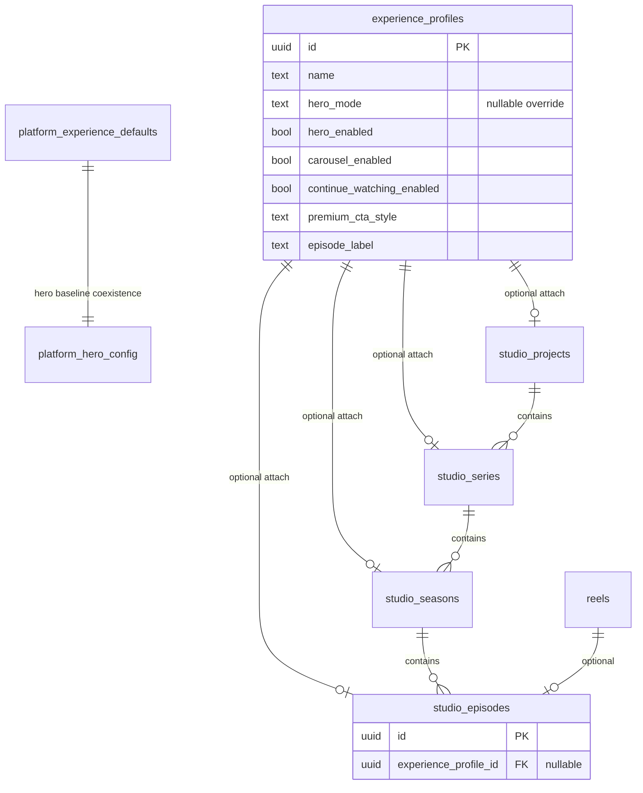
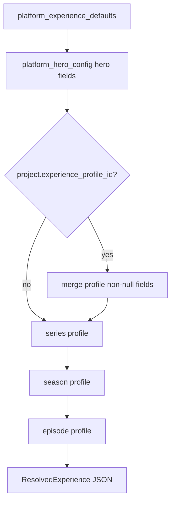

# Experience Profile Architecture (Review Draft)

> **Superseded for approval:** Use [`VIEWER_EXPERIENCE_LAYER_ARCHITECTURE.md`](./VIEWER_EXPERIENCE_LAYER_ARCHITECTURE.md) for the complete eight-deliverable package (full field set, content slots, business models, risk assessment, migration order).

**Status:** Architecture proposal — **no implementation until approved**  
**Objective:** Configuration-driven Viewer Experience layer for Smart Production Studio  
**Phase scope:** Metadata + APIs only. No Viewer appearance changes. No playback changes. No monetization enforcement.

---

## Executive Summary

Today, theater-mode and shelf behaviors are largely **hardcoded in `Viewer.svelte`** and **global platform singletons** (`platform_hero_config`). Monetization and watch intelligence already follow an additive **metadata-on-hierarchy** pattern.

This proposal introduces **named Experience Profiles** that can be attached at **Project → Series → Season → Episode**, with a deterministic **resolve** API that merges configuration from the innermost scope outward. The Viewer continues to behave exactly as today until a future, explicitly approved wiring phase reads resolved config (feature-flagged).

**Principle:** `Viewer Experience = Resolved Configuration + Metadata`, not scattered `if` blocks in Svelte/Rust.

---

## 1. Design Principles

| Principle | Implementation |
|-----------|----------------|
| Additive only | New tables + nullable FKs; no changes to `reels`, ingestion, ReelV1 |
| Metadata only | Booleans, enums, labels — no payment, no access denial |
| Preserve theater | `TheaterManager`, video element, controls unchanged in Phase 1 |
| Preserve APIs | `GET /api/reels`, streaming, studio tree shape unchanged (optional new fields when flag on) |
| Studio-manageable | CRUD profiles + attach/detach from Control Center (future panel) |
| Instant rollback | Env flag off → 404 on experience routes; Viewer ignores config |
| Separation from monetization | `access_mode` / paywall remain in monetization module; experience does not enforce either |

### Relationship to existing configuration

| Layer | Today | After Experience Profiles (when wired) |
|-------|-------|------------------------------------------|
| `platform_site_config` | Site branding | Unchanged |
| `platform_hero_config` | Global hero singleton | Becomes **platform baseline** for hero fields in resolve chain |
| `platform_feature_flags` | Admin prefs (env still gates APIs) | Unchanged; add `experience_profiles` flag in DB + `REELFORGE_EXPERIENCE_PROFILES` env |
| `studio_*` hierarchy | Editorial + monetization columns | Optional `experience_profile_id` FK per level |
| `Viewer.svelte` | Hardcoded hero paths, theater | **Phase 2+:** read `resolved_experience` store; Phase 1 = no reads |

---

## 2. Schema Proposal

### 2.1 New table: `experience_profiles`

Reusable, Studio-managed profile templates. **Nullable columns** mean “do not override parent scope during merge” (inherit).

```sql
CREATE TABLE IF NOT EXISTS experience_profiles (
    id                      UUID PRIMARY KEY DEFAULT gen_random_uuid(),
    name                    TEXT NOT NULL,
    slug                    TEXT,
    description             TEXT,
    status                  TEXT NOT NULL DEFAULT 'active'
                            CHECK (status IN ('active', 'archived')),

    -- Hero / shelf presentation (aligns with platform_hero_config enums)
    hero_mode               TEXT
                            CHECK (hero_mode IS NULL OR hero_mode IN (
                                'OFF', 'STATIC', 'CAROUSEL',
                                'FEATURED_SERIES', 'LATEST_RELEASE', 'PROMOTED'
                            )),
    hero_enabled            BOOLEAN,
    carousel_enabled        BOOLEAN,

    -- Feature toggles (metadata — not enforced in Phase 1)
    continue_watching_enabled BOOLEAN,
    artist_panel_enabled    BOOLEAN,
    downloads_enabled       BOOLEAN,
    comments_enabled        BOOLEAN,
    recommendations_enabled BOOLEAN,

    -- Display / CTA metadata (no paywall logic)
    premium_cta_style       TEXT
                            CHECK (premium_cta_style IS NULL OR premium_cta_style IN (
                                'NONE', 'SUBTLE', 'BANNER', 'MODAL', 'PILL'
                            )),
    episode_label           TEXT,
    season_label            TEXT,
    vip_label               TEXT,

    created_at              TIMESTAMPTZ NOT NULL DEFAULT now(),
    updated_at              TIMESTAMPTZ NOT NULL DEFAULT now()
);

CREATE UNIQUE INDEX IF NOT EXISTS idx_experience_profiles_slug
    ON experience_profiles(slug) WHERE slug IS NOT NULL AND slug <> '';

CREATE INDEX IF NOT EXISTS idx_experience_profiles_status
    ON experience_profiles(status);
```

### 2.2 Platform baseline (optional but recommended)

Avoid duplicating global defaults inside every profile. Seed resolve chain from existing hero singleton + new experience defaults row:

```sql
CREATE TABLE IF NOT EXISTS platform_experience_defaults (
    id                          SMALLINT PRIMARY KEY DEFAULT 1 CHECK (id = 1),

    hero_mode                   TEXT NOT NULL DEFAULT 'STATIC'
                                CHECK (hero_mode IN (
                                    'OFF', 'STATIC', 'CAROUSEL',
                                    'FEATURED_SERIES', 'LATEST_RELEASE', 'PROMOTED'
                                )),
    hero_enabled                BOOLEAN NOT NULL DEFAULT true,
    carousel_enabled            BOOLEAN NOT NULL DEFAULT false,

    continue_watching_enabled   BOOLEAN NOT NULL DEFAULT false,
    artist_panel_enabled        BOOLEAN NOT NULL DEFAULT false,
    downloads_enabled           BOOLEAN NOT NULL DEFAULT false,
    comments_enabled            BOOLEAN NOT NULL DEFAULT false,
    recommendations_enabled     BOOLEAN NOT NULL DEFAULT false,

    premium_cta_style           TEXT NOT NULL DEFAULT 'NONE'
                                CHECK (premium_cta_style IN (
                                    'NONE', 'SUBTLE', 'BANNER', 'MODAL', 'PILL'
                                )),
    episode_label               TEXT NOT NULL DEFAULT 'Episode',
    season_label                TEXT NOT NULL DEFAULT 'Season',
    vip_label                   TEXT NOT NULL DEFAULT 'VIP',

    updated_at                  TIMESTAMPTZ NOT NULL DEFAULT now()
);

INSERT INTO platform_experience_defaults (id) VALUES (1) ON CONFLICT (id) DO NOTHING;
```

**Note:** `platform_hero_config` remains the source of truth for hero until a one-time migration syncs values into `platform_experience_defaults` (or resolve reads hero singleton first, then overlays experience fields). Documented merge order below avoids breaking existing Platform Config panel.

### 2.3 Hierarchy attachments (nullable FKs)

```sql
ALTER TABLE studio_projects
    ADD COLUMN IF NOT EXISTS experience_profile_id UUID
    REFERENCES experience_profiles(id) ON DELETE SET NULL;

ALTER TABLE studio_series
    ADD COLUMN IF NOT EXISTS experience_profile_id UUID
    REFERENCES experience_profiles(id) ON DELETE SET NULL;

ALTER TABLE studio_seasons
    ADD COLUMN IF NOT EXISTS experience_profile_id UUID
    REFERENCES experience_profiles(id) ON DELETE SET NULL;

ALTER TABLE studio_episodes
    ADD COLUMN IF NOT EXISTS experience_profile_id UUID
    REFERENCES experience_profiles(id) ON DELETE SET NULL;

CREATE INDEX IF NOT EXISTS idx_studio_projects_experience_profile
    ON studio_projects(experience_profile_id) WHERE experience_profile_id IS NOT NULL;
-- (repeat for series, seasons, episodes)
```

**Attachment semantics:** A level may reference zero or one profile. Profiles are **not** embedded JSON blobs on hierarchy rows (keeps Studio reusable templates: “Netflix-style hero”, “Micro-drama minimal”, etc.).

### 2.4 ER diagram



### 2.5 Field dictionary

| Field | Type | Purpose (future Viewer) | Phase 1 |
|-------|------|-------------------------|---------|
| `hero_mode` | enum | Hero rendering strategy | Metadata only |
| `hero_enabled` | bool | Show/hide hero region | Metadata only |
| `carousel_enabled` | bool | Hero/shelf carousel behavior | Metadata only |
| `continue_watching_enabled` | bool | Surface continue row (pairs with watch API) | Metadata only |
| `artist_panel_enabled` | bool | Creator/artist sidebar | Metadata only |
| `downloads_enabled` | bool | Offline/download CTA visibility | Metadata only |
| `comments_enabled` | bool | Comments module visibility | Metadata only |
| `recommendations_enabled` | bool | “More like this” / rec shelf | Metadata only |
| `premium_cta_style` | enum | Visual style for upgrade CTA copy | **No enforcement** |
| `episode_label` | text | UI string e.g. “Ep”, “Chapter” | Metadata only |
| `season_label` | text | UI string e.g. “Season”, “Volume” | Metadata only |
| `vip_label` | text | VIP tier display name | Metadata only |

---

## 3. Resolution Model (Configuration Merge)

Resolved config is computed server-side and returned as a single JSON object. **No merge logic in Viewer during Phase 1.**

### 3.1 Merge order (inner → outer)

For context `(episode_id | season_id | series_id | project_id | reel_id)`:

1. Start with **`platform_experience_defaults`** (row `id=1`).
2. Overlay **`platform_hero_config`** for `hero_mode`, `hero_enabled` only (until unified migration).
3. Walk hierarchy **project → series → season → episode** (ancestor order). At each level, if `experience_profile_id` is set, load profile and apply **only non-NULL** fields (last writer wins per field).
4. Return `ResolvedExperience` + `provenance` map (which level set each field).



### 3.2 Example

| Scope | Profile | `hero_mode` | `continue_watching_enabled` |
|-------|---------|-------------|----------------------------|
| Platform default | — | `STATIC` | `false` |
| Project “Catalog” | — | inherit | inherit |
| Series “Black Stories” | Profile A | `CAROUSEL` | `true` |
| Episode 3 | Profile B | inherit | `false` (explicit override) |

**Resolved for Episode 3:** `hero_mode=CAROUSEL` (from A), `continue_watching_enabled=false` (from B).

### 3.3 Reel-only context

When only `reel_id` is provided:

1. Resolve `studio_episodes` by `reel_id` if present → use episode chain.
2. Else resolve default catalog **project** (`reelforge-catalog` seed) + platform defaults only.

This keeps orphan reels on the global baseline without breaking catalog playback.

---

## 4. Migration Plan

**Proposed file:** `backend/migrations/202512288_experience_profiles.sql`

### 4.1 Prerequisites

| Migration | Required |
|-----------|----------|
| `202512284_studio_hierarchy.sql` | Yes — attachment targets |
| `202512285_platform_configuration.sql` | Yes — hero enum alignment |
| `202512287_watch_intelligence.sql` | No — continue flag is metadata only |

### 4.2 Execution steps

1. **Backup** production/staging DB.
2. Apply migration in maintenance window (additive DDL only).
3. Seed `platform_experience_defaults` from current `platform_hero_config` values (one SQL `UPDATE` in migration).
4. Seed one template profile: `ReelForge Default` (all NULL overrides — documentation profile).
5. Deploy backend with `REELFORGE_EXPERIENCE_PROFILES=false`.
6. Verify existing APIs via smoke tests (`GET /api/reels`, theater, ingestion).
7. Enable flag in staging; exercise CRUD + resolve endpoints.
8. **Do not** enable Viewer reads until Phase 2 approval.

### 4.3 Idempotency & safety

- `CREATE TABLE IF NOT EXISTS` / `ADD COLUMN IF NOT EXISTS`
- No `NOT NULL` on hierarchy FKs
- No changes to `reels` columns
- No triggers on playback paths

### 4.4 Data migration (optional)

| Action | When |
|--------|------|
| Copy `platform_hero_config` → `platform_experience_defaults` hero fields | In migration |
| Attach catalog project to default profile | Manual / Studio UI post-launch |
| Per-series profiles | Studio editorial workflow |

---

## 5. API Proposal

**Feature flag:** `REELFORGE_EXPERIENCE_PROFILES=true` (default **off**)

**Flag off:** All `/api/experience/*` return `404`:

```json
{
  "error": "Experience profile API disabled",
  "hint": "Set REELFORGE_EXPERIENCE_PROFILES=true to enable"
}
```

**Unchanged when flag on:** `GET /api/reels`, `GET/POST` ingestion, video routes, `GET /api/watch/*`, `GET /api/monetization/*` response contracts (no required new fields on ReelV1).

### 5.1 Status

| Method | Path | Response |
|--------|------|----------|
| GET | `/api/experience/status` | `{ "enabled": true, "hero_modes": [...], "premium_cta_styles": [...] }` |

### 5.2 Profile CRUD (Studio templates)

| Method | Path | Description |
|--------|------|-------------|
| GET | `/api/experience/profiles` | List profiles (`?status=active`) |
| POST | `/api/experience/profiles` | Create template |
| GET | `/api/experience/profiles/{id}` | Get one |
| PUT | `/api/experience/profiles/{id}` | Partial update (nullable fields clear override) |
| DELETE | `/api/experience/profiles/{id}` | Archive or hard-delete if unattached |

**POST/PUT body (partial):**

```json
{
  "name": "Micro-drama Premium",
  "slug": "micro-drama-premium",
  "hero_mode": "CAROUSEL",
  "hero_enabled": true,
  "carousel_enabled": true,
  "continue_watching_enabled": true,
  "artist_panel_enabled": false,
  "downloads_enabled": false,
  "comments_enabled": true,
  "recommendations_enabled": false,
  "premium_cta_style": "SUBTLE",
  "episode_label": "Ep",
  "season_label": "Season",
  "vip_label": "VIP"
}
```

### 5.3 Platform defaults (admin)

| Method | Path | Description |
|--------|------|-------------|
| GET | `/api/experience/defaults` | Read `platform_experience_defaults` |
| PUT | `/api/experience/defaults` | Update platform baseline (admin) |

### 5.4 Hierarchy attachment

| Method | Path | Body |
|--------|------|------|
| GET | `/api/experience/projects/{id}` | — (returns `{ experience_profile_id, profile? }`) |
| PUT | `/api/experience/projects/{id}` | `{ "experience_profile_id": "uuid" \| null }` |
| GET/PUT | `/api/experience/series/{id}` | Same |
| GET/PUT | `/api/experience/seasons/{id}` | Same |
| GET/PUT | `/api/experience/episodes/{id}` | Same |

### 5.5 Resolve (read-only, Viewer-ready)

| Method | Path | Query | Response |
|--------|------|-------|----------|
| GET | `/api/experience/resolve` | `episode_id`, `season_id`, `series_id`, `project_id`, or `reel_id` (one required) | `ResolvedExperience` |

**Example response:**

```json
{
  "hero_mode": "CAROUSEL",
  "hero_enabled": true,
  "carousel_enabled": true,
  "continue_watching_enabled": false,
  "artist_panel_enabled": false,
  "downloads_enabled": false,
  "comments_enabled": true,
  "recommendations_enabled": false,
  "premium_cta_style": "SUBTLE",
  "episode_label": "Ep",
  "season_label": "Season",
  "vip_label": "VIP",
  "enforce_paywall": false,
  "provenance": {
    "hero_mode": "studio_series:uuid",
    "continue_watching_enabled": "studio_episodes:uuid"
  }
}
```

`enforce_paywall` is always `false` on this API (explicit separation from monetization).

### 5.6 Bundle (Control Center)

| Method | Path | Query |
|--------|------|-------|
| GET | `/api/experience/config` | `?project_id=` — nested tree with `experience_profile_id` + resolved preview per episode (optional, admin-only) |

### 5.7 Future Viewer integration (Phase 2 — not in initial implementation)

| Consumer | Behavior |
|----------|----------|
| `experienceStore.js` | Fetch resolve on theater open / project context |
| `Viewer.svelte` | Replace hardcoded hero/labels with store values **only when** `VITE_REELFORGE_EXPERIENCE_PROFILES=true` |
| Theater | Still no new controls; metadata gates visibility only |

---

## 6. Rollback Plan

### Level 1 — Disable API (instant)

```bash
REELFORGE_EXPERIENCE_PROFILES=false
# restart backend
```

- All experience routes 404.
- Viewer and theater unchanged (no reads in Phase 1 anyway).

### Level 2 — Remove Studio UI (future)

Remove Experience panel from Control Center. No DB impact.

### Level 3 — Detach profiles

```sql
UPDATE studio_episodes SET experience_profile_id = NULL;
UPDATE studio_seasons SET experience_profile_id = NULL;
UPDATE studio_series SET experience_profile_id = NULL;
UPDATE studio_projects SET experience_profile_id = NULL;
```

### Level 4 — Drop schema (after backup)

```sql
ALTER TABLE studio_episodes DROP COLUMN IF EXISTS experience_profile_id;
ALTER TABLE studio_seasons DROP COLUMN IF EXISTS experience_profile_id;
ALTER TABLE studio_series DROP COLUMN IF EXISTS experience_profile_id;
ALTER TABLE studio_projects DROP COLUMN IF EXISTS experience_profile_id;
DROP TABLE IF EXISTS platform_experience_defaults;
DROP TABLE IF EXISTS experience_profiles;
```

Studio hierarchy, reels, platform config, monetization, watch tables remain intact.

---

## 7. Performance Impact Analysis

| Area | Phase 1 (metadata APIs) | Phase 2 (Viewer wiring) |
|------|-------------------------|-------------------------|
| `GET /api/reels` | **No change** | Optional: do not embed experience on list |
| Theater playback | **No change** | **No change** to video pipeline |
| Resolve endpoint | 1–4 indexed FK lookups + ≤4 profile row reads | Cached per session in Svelte store |
| Studio tree bundle | +1 JOIN per level if profile embedded | Admin-only traffic |
| DB size | Small templates table | Negligible vs `watch_events` |

**Recommendations:**

- Cache `ResolvedExperience` client-side for duration of theater session.
- Do not call resolve on every watch event tick.
- Index all `experience_profile_id` FK columns.

---

## 8. File Modification Map (Post-Approval)

**No files are modified until this document is approved.** Planned changes:

| Path | Change |
|------|--------|
| `backend/migrations/202512288_experience_profiles.sql` | **New** — tables + FKs + seed |
| `backend/src/db/experience.rs` | **New** — CRUD, merge resolver, validation |
| `backend/src/api/experience.rs` | **New** — HTTP handlers |
| `backend/src/db/mod.rs` | `experience_profiles_enabled()` |
| `backend/src/api/mod.rs` | Module export |
| `backend/src/main.rs` | `/api/experience/*` routes |
| `backend/.env.example` | Document `REELFORGE_EXPERIENCE_PROFILES` |
| `frontend/src/lib/api/experience.js` | **New** — API client (Studio panel) |
| `frontend/src/components/studio/ExperienceProfilePanel.svelte` | **New** — admin CRUD + attach (Phase 1b) |
| `frontend/src/stores/experienceStore.js` | **New** — Phase 2 Viewer consumer |
| `frontend/src/Viewer.svelte` | **Phase 2 only** — read store; no Phase 1 edits |
| `docs/EXPERIENCE_PROFILE_ARCHITECTURE.md` | This document |

### Explicitly unchanged (all phases unless separately approved)

| Area | Guarantee |
|------|-----------|
| `Viewer.svelte` theater DOM, controls, autoplay | No change in Phase 1 |
| `TheaterManager`, `theaterPlayback.js` | No change |
| Ingestion pipeline | No change |
| ReelV1 / `GET /api/reels` | No required new fields |
| Monetization enforcement | Not introduced |
| `watchTracker.js` | Independent; `continue_watching_enabled` is metadata only |

---

## 9. Success Criteria (Acceptance)

| # | Criterion | How verified |
|---|-----------|--------------|
| 1 | Additive architecture | New tables/FKs only |
| 2 | Attachable at project/series/season/episode | FK columns + PUT attach APIs |
| 3 | All listed fields present | Schema + API contract |
| 4 | Metadata only | No paywall, no playback gates in Phase 1 |
| 5 | Viewer appearance unchanged | No Viewer.svelte changes in Phase 1 |
| 6 | Playback logic unchanged | No Rust stream/theater changes |
| 7 | No monetization enforcement | `enforce_paywall: false` on resolve API |
| 8 | Existing APIs preserved | Contract tests / smoke tests |
| 9 | Instant disable | Env flag → 404 |
| 10 | Studio-manageable path | Profile CRUD + attach + resolve documented |

---

## 10. Open Questions for Review

1. **Profile delete policy:** Hard-delete vs `status=archived` when still referenced?
2. **Hero single source:** Migrate `platform_hero_config` into `platform_experience_defaults` long-term, or keep dual-read in resolver indefinitely?
3. **Phase 2 flag:** Separate `VITE_REELFORGE_EXPERIENCE_PROFILES` vs piggyback on platform config store?
4. **Default catalog project:** Auto-attach “ReelForge Default” profile on backfill?
5. **`carousel_enabled` vs `hero_mode=CAROUSEL`:** Redundant unless carousel also controls non-hero shelves — document as “shelf carousel” in Studio UI?

---

## 11. Approval Gate

| Step | Owner | Status |
|------|-------|--------|
| Architecture review | Product / platform | **Pending** |
| Schema sign-off | Backend | Pending |
| API contract sign-off | Frontend + Studio | Pending |
| Implementation | Engineering | **Blocked until approved** |

Once approved, implementation order: migration → `db/experience.rs` → `api/experience.rs` → Studio panel → (separate approval) Viewer store wiring.
