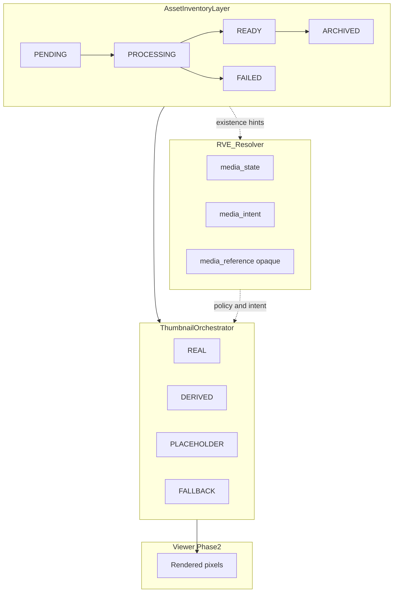
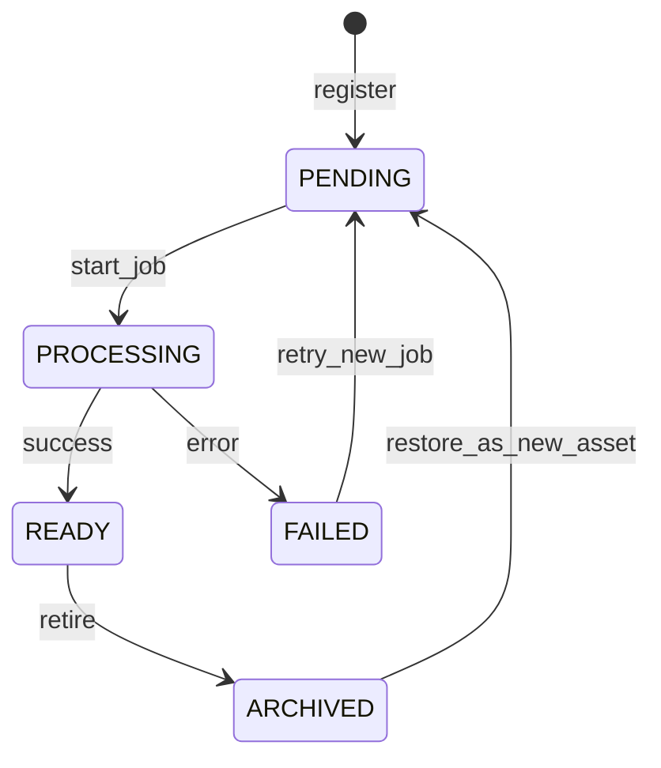
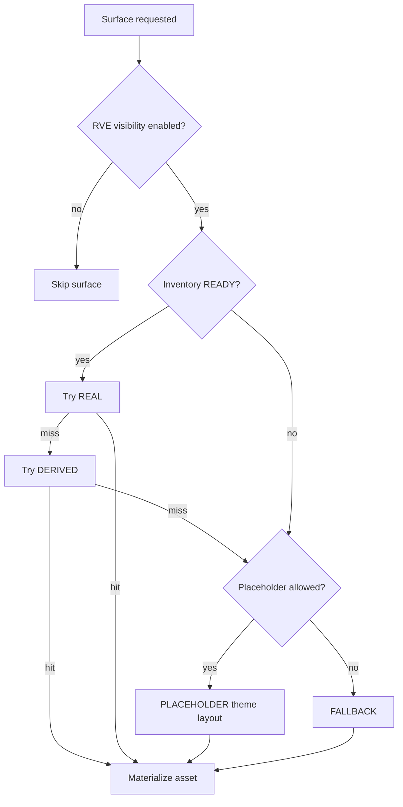
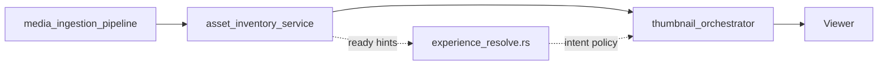

# Media Inventory & Placeholder Architecture — Phase 1b.0

**Phase:** 1b.0 — Media inventory and placeholder architecture (documentation only)  
**Status:** Normative architecture  
**Version:** `1.0.0`  
**Project:** ReelForge / Smart Production Studio  

**Prerequisites:** [`ARCHITECTURE_CLOSURE_REPORT.md`](./ARCHITECTURE_CLOSURE_REPORT.md), [`MEDIA_REPRESENTATION_CONTRACT.md`](./MEDIA_REPRESENTATION_CONTRACT.md), [`RESOLVED_VIEWER_EXPERIENCE_CONTRACT.md`](./RESOLVED_VIEWER_EXPERIENCE_CONTRACT.md), [`RESOLVER_BOUNDARY_AUDIT.md`](./RESOLVER_BOUNDARY_AUDIT.md), [`MEDIA_CONTRACT_v1.md`](./MEDIA_CONTRACT_v1.md)

**Scope:** Defines asset inventory lifecycle, per-surface thumbnail resolution, placeholder policies by content type, resolver boundaries, and future extension services. **No** Rust, migrations, APIs, Viewer changes, or schema amendments in this phase.

---

## Table of Contents

1. [Purpose and Three-Layer Model](#1-purpose-and-three-layer-model)
2. [Media Inventory Lifecycle](#2-media-inventory-lifecycle)
3. [Thumbnail Lifecycle States](#3-thumbnail-lifecycle-states)
4. [Deterministic Resolution by Surface](#4-deterministic-resolution-by-surface)
5. [Placeholder Policies by Content Type](#5-placeholder-policies-by-content-type)
6. [Resolver Boundary](#6-resolver-boundary)
7. [Future Extension Points](#7-future-extension-points)
8. [Contradiction Analysis](#8-contradiction-analysis)
9. [Relationship to Other Contracts](#9-relationship-to-other-contracts)

---

## 1. Purpose and Three-Layer Model

Phase 1b.0 specifies how **ingested assets**, **per-surface thumbnails**, and **RVE semantic media** interact without collapsing storage, presentation, and experience composition into one path.

### 1.1 Three layers (do not merge)

| Layer | Authority | States / outputs | Owns URLs? |
|-------|-----------|------------------|------------|
| **Asset inventory** | `asset_inventory_service` + `media_ingestion_pipeline` | `PENDING`, `PROCESSING`, `READY`, `FAILED`, `ARCHIVED` | Yes (internal only) |
| **Thumbnail presentation** | `thumbnail_orchestrator` | `REAL`, `DERIVED`, `PLACEHOLDER`, `FALLBACK` per surface | Yes (materialized to Viewer) |
| **RVE semantic media** | `experience_resolve.rs` (future amendment) | `media_state`, `media_intent`, `media_reference`, `media_placeholder_policy` | **No** |

### 1.2 Surfaces in scope

| Surface | Primary context | RVE visibility gate |
|---------|-----------------|---------------------|
| **Hero** | Series / episode hero scope | `visibility.hero.*`, layout `hero` panel |
| **Vault cards** | `reel_id` catalog tiles | Layout shelves; legacy v1 reel feed |
| **Theater mode** | Active playback `episode_id` | Theater contract; not layout shelf |
| **Continue Watching** | Progress + `episode_id` | `visibility.panels.continue_watching` |
| **Recommendations** | Recommendation item reference | `visibility.panels.recommendations` |

Media architecture **does not** override RVE layout intersection or campaign slot geometry (RVE §4 S4).

### 1.3 Legacy alignment

[`MEDIA_CONTRACT_v1.md`](./MEDIA_CONTRACT_v1.md) reel `status` values map to inventory lifecycle (see §2.4). v1 `url` / `thumbnailUrl` remain **outside RVE** until a controlled migration (AP-M07).

---

## 2. Media Inventory Lifecycle

Normative states for **primary assets** (video, image reel, episode-bound media). These describe **ingestion and catalog truth**, not thumbnail appearance.

### 2.1 State definitions

| State | Purpose | Consumer visibility |
|-------|---------|---------------------|
| **PENDING** | Asset row registered; job not started or queued | Excluded from ready catalog (`GET /api/reels` ready-only) |
| **PROCESSING** | Transcode, probe, thumbnail generation, or metadata extraction in flight | Poll via `GET /api/reels/{id}` only |
| **READY** | Primary asset validated and publishable | Catalog, vault hydrate, playback |
| **FAILED** | Terminal error; asset not publishable | Error UI; no playback |
| **ARCHIVED** | Retired from active catalog; lineage retained | Historical, audit, restore-only |

> **Naming disambiguation (MI-01):** **Inventory `ARCHIVED`** is unrelated to experience profile version `ARCHIVED` in [`EXPERIENCE_GOVERNANCE_CONTRACT.md`](./EXPERIENCE_GOVERNANCE_CONTRACT.md). In prose, use *inventory archived* vs *profile archived*.

### 2.2 Allowed transitions

| Transition | Rule |
|------------|------|
| `PENDING` → `PROCESSING` | At most one active processing job per asset id |
| `PROCESSING` → `READY` | All required pipeline gates pass (see ingestion pipeline §7) |
| `PROCESSING` → `FAILED` | Terminal; store error code externally to RVE |
| `READY` → `ARCHIVED` | Soft retire; do not delete rows referenced by audit |
| `FAILED` → `PENDING` | Retry creates new job generation; optional new row version |

### 2.3 Forbidden transitions

| Forbidden | Rule ID | Reason |
|-----------|---------|--------|
| `READY` → `PROCESSING` in place | **IL-01** | Publish new version row or re-ingest |
| `ARCHIVED` → `READY` in place | **IL-02** | Restore via new ingest or explicit restore job |
| `FAILED` → `READY` without reprocessing | **IL-03** | FAILED is terminal until retry |
| Skip to `READY` without `PROCESSING` | **IL-04** | Except documented bootstrap import paths |

### 2.4 Mapping to Media Contract v1

| Inventory state | v1 reel `status` (lowercase wire) |
|-----------------|-----------------------------------|
| `PENDING` | `pending` |
| `PROCESSING` | `processing` |
| `READY` | `ready` |
| `FAILED` | `failed` |
| `ARCHIVED` | *(no v1 equivalent — extension)* |

v1 absolute `url` / `thumbnailUrl` are **materialized outputs** of inventory + orchestrator, not resolver fields.

### 2.5 Contribution to RVE `media_state`

Inventory state informs but **does not equal** RVE semantic media:

| Inventory | Required for RVE `REAL_MEDIA`? |
|-----------|-------------------------------|
| `READY` | Yes — primary existence gate |
| `PROCESSING`, `PENDING` | No — treat as not ready |
| `FAILED` | No — `FALLBACK_MEDIA` or `PLACEHOLDER_MEDIA` if policy allows |
| `ARCHIVED` | No — historical; not production playback |

---

## 3. Thumbnail Lifecycle States

Thumbnail states describe **what class of image** is shown on a **specific surface** for a **specific context** (episode, reel, shelf item). They are **orthogonal** to inventory lifecycle.

### 3.1 State definitions

| State | Meaning | Source |
|-------|---------|--------|
| **REAL** | Authoritative still or poster frame from ingested asset (extracted keyframe, uploaded poster) | Asset-derived |
| **DERIVED** | Generated proxy: resize, crop, letterbox, sprite, AI poster, low-res preview | Pipeline-generated |
| **PLACEHOLDER** | Non-content-specific visual from **theme tokens** + **layout preset** | Theme/layout policy |
| **FALLBACK** | Platform default image when no better class applies | Platform bundle |

### 3.2 Rules

| Rule ID | Rule |
|---------|------|
| **TH-01** | Exactly one thumbnail state per `(surface, context_id)` at render time. |
| **TH-02** | `thumbnail_orchestrator` is the sole selector of materialized thumbnail assets. |
| **TH-03** | Thumbnail states are **never** serialized as URLs inside RVE. |
| **TH-04** | `REAL` requires inventory `READY` for the bound primary asset. |
| **TH-05** | `PLACEHOLDER` must not use episode title, cast photos, or ingestion filenames (AP-M06). |

### 3.3 Mapping to RVE `media_state` (informative)

RVE semantic media summarizes **episode-level** backing for the experience resolver context, not every surface independently.

| Inventory | Dominant thumbnail (episode hero) | Typical RVE `media_state` |
|-----------|-----------------------------------|---------------------------|
| `READY` | `REAL` | `REAL_MEDIA` |
| `READY` | `DERIVED` only | `DERIVED_MEDIA` |
| not `READY`, policy allows placeholder | `PLACEHOLDER` | `PLACEHOLDER_MEDIA` |
| otherwise | `FALLBACK` | `FALLBACK_MEDIA` |

Per-surface ladders (§4) may yield `PLACEHOLDER` on a shelf while hero is `REAL`; RVE `media_state` reflects **primary episode hero** unless a future schema adds per-surface media maps.

### 3.4 Mapping to MEDIA_REPRESENTATION_CONTRACT

| Thumbnail state | Related `media_state` |
|-----------------|----------------------|
| `REAL` | `REAL_MEDIA` |
| `DERIVED` | `DERIVED_MEDIA` |
| `PLACEHOLDER` | `PLACEHOLDER_MEDIA` |
| `FALLBACK` | `FALLBACK_MEDIA` |

Thumbnail `REAL` ≠ `REAL_MEDIA` naming: different layers (MI-02).

---

## 4. Deterministic Resolution by Surface

Each surface uses a **strict priority ladder**. Evaluation stops at the first applicable tier. Rules apply **only when** the surface is enabled by RVE visibility and layout blueprint.

### 4.1 Global preconditions

| Rule ID | Rule |
|---------|------|
| **GR-01** | Inventory must be `READY` before any `REAL` primary video or `REAL` thumbnail from that asset. |
| **GR-02** | RVE `visibility.panels.<id>.effective_visible` (or hero flags) must be true before resolving that surface. |
| **GR-03** | Campaign slot imagery (`hero_promo`, etc.) comes from `slots[].content_ref` (Phase 1b campaign engine) — **precedence over placeholder** when slot active; does not change inventory state. |
| **GR-04** | Resolver does not execute these ladders in Phase 1a; `thumbnail_orchestrator` owns execution. |

### 4.2 Hero

**Context:** `episode_id`, optional series/project hero scope; respects `visibility.hero.mode` (`OFF`, `STATIC_IMAGE`, `STATIC_VIDEO`, carousel modes per RVE §8.7).

**Priority ladder (highest first):**

| Step | Condition | Thumbnail / media class |
|------|-----------|-------------------------|
| H1 | Primary bound asset inventory `READY` + hero video/image asset present | `REAL` — authoritative hero asset |
| H2 | Inventory `READY` + derived hero poster registered | `DERIVED` — generated poster / keyframe |
| H3 | `visibility.hero.enabled` && layout permits placeholder && `media_placeholder_policy` allows | `PLACEHOLDER` — `hero_surface` + layout `hero` zone tokens |
| H4 | Default | `FALLBACK` — platform hero default |

**Mode interaction:**

| `visibility.hero.mode` | Ladder behavior |
|------------------------|-----------------|
| `OFF` | No hero render; ladder not invoked |
| `STATIC_IMAGE` | H1–H4 image tiers only |
| `STATIC_VIDEO` / carousel modes | H1 video tier; poster tiers for carousel slides per slide context |

### 4.3 Vault cards

**Context:** `reel_id` (catalog tile); used by vault hydrate and shelf tiles referencing reels.

**Priority ladder:**

| Step | Condition | Thumbnail class |
|------|-----------|-----------------|
| V1 | Reel inventory `READY` + catalog thumbnail asset `REAL` | `REAL` |
| V2 | Reel `READY` + derived tile thumb | `DERIVED` |
| V3 | Layout permits + content-type placeholder policy | `PLACEHOLDER` — `card_style` token family |
| V4 | Default | `FALLBACK` — generic tile |

**Note:** v1 `thumbnailUrl` is a **materialized output** of this ladder, not an RVE field.

### 4.4 Theater mode

**Context:** Active playback for `episode_id` (theater contract); primary video stream separate from shelf thumbs.

**Priority ladder:**

| Step | Condition | Media class |
|------|-----------|-------------|
| T1 | Episode primary asset inventory `READY` | Play primary video stream (`REAL` playback) |
| T2 | `READY` + poster/pause image registered | `REAL` or `DERIVED` still for pause/end cards |
| T3 | Theater panels visible + placeholder policy | `PLACEHOLDER` — theater backdrop tokens (not episode-specific art) |
| T4 | Default | `FALLBACK` — black / platform idle frame |

Theater **playback** is not a thumbnail state; inventory `READY` is mandatory for T1.

### 4.5 Continue Watching

**Context:** Watch progress record + `episode_id`; shelf row under `continue_watching` panel.

**Priority ladder:**

| Step | Condition | Thumbnail class |
|------|-----------|-----------------|
| C1 | Episode inventory `READY` + episode thumb `REAL` | `REAL` |
| C2 | Episode `READY` + derived progress thumb | `DERIVED` |
| C3 | Panel `effective_visible` + placeholder policy | `PLACEHOLDER` — shelf tile tokens |
| C4 | Default | `FALLBACK` |

**Gate:** `watch_features.continue_watching_enabled` and `visibility.panels.continue_watching.effective_visible` (RVE §8.10–8.11).

### 4.6 Recommendations

**Context:** Recommendation engine item reference (opaque id); renders under `recommendations` panel.

**Priority ladder:**

| Step | Condition | Thumbnail class |
|------|-----------|-----------------|
| R1 | Target item inventory `READY` + thumb `REAL` | `REAL` |
| R2 | Target `READY` + derived thumb | `DERIVED` |
| R3 | Panel visible + placeholder policy | `PLACEHOLDER` — same family as vault cards |
| R4 | Default | `FALLBACK` |

**Batch policy:** Missing thumbs on a shelf must not block row render — apply R3/R4 per item (no single failure domain).

### 4.7 Cross-surface precedence summary

---

## 5. Placeholder Policies by Content Type

Placeholders are **presentation defaults** keyed by content type. They drive `PLACEHOLDER` tier selection in §4 and inform RVE `media_placeholder_policy` / `media_intent` (resolver, future amendment).

### 5.1 Policy table

| Content type | Maps to `media_intent` | Default `media_placeholder_policy` | Placeholder visual family |
|--------------|------------------------|-----------------------------------|---------------------------|
| **documentary** | `DOCUMENTARY` | `CONTENT_THEN_PLACEHOLDER` | Cinematic wide aspect; film grain; `hero_surface.variant` documentary |
| **music_video** | `MUSIC_VIDEO` | `CONTENT_THEN_PLACEHOLDER` | Artist stage; waveform accent; `card_style` music |
| **micro_drama** | `MICRO_DRAMA` | `CONTENT_THEN_PLACEHOLDER` | Vertical 9:16 key art; `hero_surface` reelshort |
| **clip** | `CLIP` | `CONTENT_THEN_PLACEHOLDER` | Compact thumb; high contrast |
| **trailer** | *(no `media_intent` enum in RVE 1.0.0)* | `CONTENT_THEN_GENERATED` | Promo overlay; `cta` zone tokens; pairs with `trailer_label` |

### 5.2 Selection inputs (allowed)

| Input | Source |
|-------|--------|
| `layout.preset_key` | RVE layout |
| `theme.tokens` | `hero_surface`, `panel_surface`, `card_style`, `overlay_style` |
| `media_placeholder_policy` | RVE media block (future) |
| `experience_profile.content_format` | Maps to content type row |

### 5.3 Selection inputs (forbidden)

| Input | Rule ID | Reason |
|-------|---------|--------|
| Episode title / description | **PH-01** | Content-specific (AP-M06) |
| Cast / artist metadata values | **PH-02** | Content-specific |
| Ingestion filenames / paths | **PH-03** | Storage detail |
| `platform_hero_config` image URLs | **PH-04** | Legacy; not RVE (boundary audit) |
| Campaign `content_ref` URLs as placeholder | **PH-05** | Use slot injection path (GR-03) |

### 5.4 Trailer content type note

`trailer` is a **placeholder policy axis** for Phase 1b.0. It aligns with RVE `trailer_label` but is not yet a `media_intent` enum value (MI-04). Future schema amendment may add `TRAILER` or map trailers to `CLIP` intent.

---

## 6. Resolver Boundary

Normative constraints for `experience_resolve.rs` and any future RVE media block. Aligns with [`MEDIA_REPRESENTATION_CONTRACT.md`](./MEDIA_REPRESENTATION_CONTRACT.md) §4 and [`RESOLVER_BOUNDARY_AUDIT.md`](./RESOLVER_BOUNDARY_AUDIT.md).

### 6.1 Allowed RVE media fields (future amendment)

| Field | Type | Resolver may set? |
|-------|------|-------------------|
| `media_state` | enum | Yes — semantic class only |
| `media_intent` | enum | Yes — from profile / content type |
| `media_reference` | opaque string \| null | Yes — never a URL |
| `media_placeholder_policy` | enum | Yes — from layout + profile policy |

### 6.2 Forbidden in RVE and resolver

| Forbidden | Rule ID |
|-----------|---------|
| URLs (absolute or relative) | **RB-01** |
| File paths (`/videos/`, `/thumbs/`) | **RB-02** |
| CDN paths or hostnames | **RB-03** |
| ffmpeg outputs, transcode profiles | **RB-04** |
| Thumbnail file names | **RB-05** |
| Storage bucket / object keys | **RB-06** |
| `thumbnail_url`, `thumbnailUrl` | **RB-07** (AP-M01) |
| Reading `platform_hero_config` for imagery | **RB-08** |
| DB thumbnail columns in resolve path | **RB-09** (AP-M04) |

### 6.3 Loader hints (future, non-normative shape)

Loader may pass **existence hints** only, e.g. `primary_asset_ready: bool`. Loader **must not** return materialized URLs to the resolver.

### 6.4 Phase 1a.4 current state

[`experience_resolve.rs`](../backend/src/experience/experience_resolve.rs) does **not** emit a `media` block today. Phase 1b.0 does **not** add resolver duties — only architecture for downstream services.

### 6.5 Consumer split

| Consumer | Reads from |
|----------|------------|
| **Viewer (Phase 2+)** | Materialized assets from `thumbnail_orchestrator` + theater playback service |
| **Viewer** | RVE for gates: visibility, layout, labels, `media_state` intent |
| **Studio preview** | RVE resolve + pipeline preview assets (not URL fields in RVE) |

---

## 7. Future Extension Points

Services referenced here are **architecture placeholders** — not implemented in Phase 1b.0.

### 7.1 Service registry

| Service name | Media contract alias | Responsibility |
|--------------|---------------------|----------------|
| **`asset_inventory_service`** | Complements `extensions.future_media_pipeline` | System of record for inventory lifecycle §2; catalog queries; `ARCHIVED` retirement |
| **`media_ingestion_pipeline`** | `extensions.future_asset_ingestion_engine` | `PENDING`→`PROCESSING`→`READY`/`FAILED`; ffmpeg; probe; bind asset to episode/reel |
| **`thumbnail_orchestrator`** | `extensions.future_thumbnail_orchestrator` | Executes §4 ladders; emits materialized thumbs; per-surface `REAL`/`DERIVED`/`PLACEHOLDER`/`FALLBACK` |

### 7.2 Handoff contracts

| Handoff | Contract |
|---------|----------|
| Ingestion → inventory | Upsert row; monotonic lifecycle §2 |
| Inventory → orchestrator | `READY` gate before `REAL` |
| Inventory → resolver | Optional opaque `media_reference` + readiness hint |
| Resolver → orchestrator | `media_intent`, `media_placeholder_policy` only |
| Orchestrator → Viewer | Absolute or app-relative URLs via existing URL resolver (`canonical_media_url` / v1 patterns) — **outside RVE** |

### 7.3 Amendment process (unchanged from media contract)

1. Bump RVE schema when adding `media` block.  
2. Extend [`RESOLVER_BOUNDARY_AUDIT.md`](./RESOLVER_BOUNDARY_AUDIT.md) loader table.  
3. Add RDR-M* rules to [`RESOLVER_DECISION_RECORD.md`](./RESOLVER_DECISION_RECORD.md).  
4. Implement pipeline before resolver emits non-null `media_reference` for `REAL_MEDIA` unless handle is pre-stabilized.

See [`ARCHITECTURE_CLOSURE_REPORT.md`](./ARCHITECTURE_CLOSURE_REPORT.md) REM-009 for timing relative to Phase 1b campaign work.

---

## 8. Contradiction Analysis

Cross-check against [`MEDIA_REPRESENTATION_CONTRACT.md`](./MEDIA_REPRESENTATION_CONTRACT.md), [`RESOLVED_VIEWER_EXPERIENCE_CONTRACT.md`](./RESOLVED_VIEWER_EXPERIENCE_CONTRACT.md), and [`RESOLVER_BOUNDARY_AUDIT.md`](./RESOLVER_BOUNDARY_AUDIT.md).

| ID | Topic | Sources | Assessment | Action |
|----|-------|---------|------------|--------|
| **MI-01** | Inventory `ARCHIVED` vs profile `ARCHIVED` | This doc §2; governance LC-03 | **Disambiguation** — different domains; use qualified terms in prose | No merge |
| **MI-02** | Thumbnail `REAL` vs RVE `REAL_MEDIA` | §3.3–3.4; media contract §2.1 | **Layering** — surface vs episode semantic; mapping table | Document only |
| **MI-03** | v1 `thumbnail_url` vs RVE | MEDIA_CONTRACT_v1; AP-M07 | **Aligned** — v1 remains legacy materialization | No RVE embed |
| **MI-04** | `trailer` content type vs `media_intent` enum | §5.1; RVE content_format / media_intent | **Minor gap** — policy defined; enum amendment deferred | Future schema |
| **MI-05** | `asset_inventory_service` vs `future_media_pipeline` | §7; media contract §6 | **Harmonization** — complementary; inventory owns state, pipeline owns transitions | Document as split |
| **MI-06** | `platform_hero_config` hero imagery | Boundary audit §2.1; RB-08 | **Aligned** — resolver reads `platform_experience_defaults` only | No resolver hero URLs |
| **MI-07** | Content-specific placeholders | PH-01–PH-05; AP-M06 | **Aligned** — theme/layout only | Enforced in orchestrator |
| **MI-08** | RVE visibility vs media ladders | RVE §8.11; GR-02 | **Aligned** — visibility gates first | Orchestrator respects RVE |
| **MI-09** | Campaign slots vs hero placeholder | RVE §8.8–8.9; GR-03 | **Aligned** — slots informational; precedence documented | Phase 1b injector |
| **MI-10** | No `media` block in RVE 1.0.0 yet | Closure REM-009; §6.4 | **Aligned** — 1b.0 architecture precedes wire schema | Follow amendment process |

**No contradictions require blocking Phase 1b.0 documentation.** MI-04 is tracked for a future enum amendment.

---

## 9. Relationship to Other Contracts

| Document | Relationship |
|----------|--------------|
| [`MEDIA_REPRESENTATION_CONTRACT.md`](./MEDIA_REPRESENTATION_CONTRACT.md) | RVE semantic media; M1–M4 rules align with §4 ladders at episode level |
| [`RESOLVED_VIEWER_EXPERIENCE_CONTRACT.md`](./RESOLVED_VIEWER_EXPERIENCE_CONTRACT.md) | Visibility, layout, theme, slots; no media URLs |
| [`RESOLVER_BOUNDARY_AUDIT.md`](./RESOLVER_BOUNDARY_AUDIT.md) | Resolver purity; campaign injector Phase 1b |
| [`EXPERIENCE_GOVERNANCE_CONTRACT.md`](./EXPERIENCE_GOVERNANCE_CONTRACT.md) | Profile lifecycle unrelated to inventory lifecycle |
| [`ARCHITECTURE_CLOSURE_REPORT.md`](./ARCHITECTURE_CLOSURE_REPORT.md) | Phase 1a frozen; 1b.0 extends media architecture only |
| [`MEDIA_CONTRACT_v1.md`](./MEDIA_CONTRACT_v1.md) | Operational reel wire format; inventory v1 mapping §2.4 |

---

## Document Change Log (Phase 1b.0)

| File | Action |
|------|--------|
| `docs/MEDIA_INVENTORY_AND_PLACEHOLDER_ARCHITECTURE.md` | **Created** (this file) |
| Code, schema, APIs, Viewer | **Unchanged** |

---

**Document path:** `docs/MEDIA_INVENTORY_AND_PLACEHOLDER_ARCHITECTURE.md`
