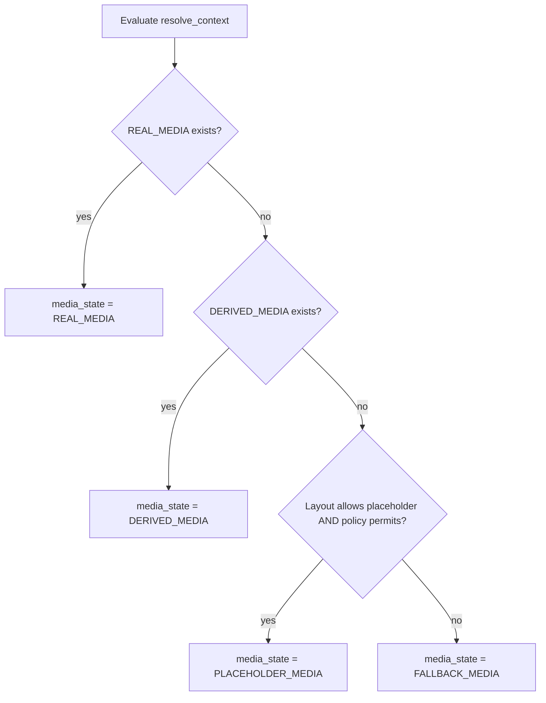

# Media Representation Contract — Semantic Specification

**Phase:** 1a.5 — Media Representation (documentation only)  
**Status:** Normative semantic contract (no implementation)  
**Version:** `1.0.0`  
**Project:** ReelForge / Smart Production Studio  
**Prerequisites:** [`RESOLVED_VIEWER_EXPERIENCE_CONTRACT.md`](./RESOLVED_VIEWER_EXPERIENCE_CONTRACT.md), [`RESOLVER_DECISION_RECORD.md`](./RESOLVER_DECISION_RECORD.md), [`RESOLVER_BOUNDARY_AUDIT.md`](./RESOLVER_BOUNDARY_AUDIT.md)

**Scope:** This document defines **semantic rules only** for how media is **represented** inside `ResolvedViewerExperience` (RVE). It does not define storage, databases, APIs, URLs, CDNs, asset formats, thumbnail fields, migrations, or frontend selection logic. Implementation is deferred to future phases.

---

## Table of Contents

1. [Purpose & Authority](#1-purpose--authority)
2. [Media Contract Model](#2-media-contract-model)
3. [Resolution Rules](#3-resolution-rules)
4. [Resolver Boundary Constraint](#4-resolver-boundary-constraint)
5. [Placeholder Strategy](#5-placeholder-strategy)
6. [Future Extension Boundary](#6-future-extension-boundary)
7. [Anti-Patterns](#7-anti-patterns)
8. [Example RVE Media Blocks](#8-example-rve-media-blocks)
9. [Relationship to Other Contracts](#9-relationship-to-other-contracts)

---

## 1. Purpose & Authority

RVE describes **what the viewer experience is** (layout, visibility, labels, theme, slots). This contract describes **how media availability is classified** for that experience — not **which bytes to fetch**.

| Question | Answered here | Answered elsewhere |
|----------|---------------|-------------------|
| Is playback backed by real ingested media? | `media_state` | Ingestion / reel contracts |
| What content shape is intended? | `media_intent` | Experience profiles, content format |
| Is there an opaque handle for downstream lookup? | `media_reference` | Future media pipeline |
| Which image file or CDN URL to show? | **Not here** | Future thumbnail orchestrator |

**Principle:** The resolver classifies media **semantics**. A separate **media pipeline layer** performs asset selection, URL materialization, and thumbnail orchestration.

---

## 2. Media Contract Model

All fields below are **semantic enums and opaque references**. Wire types, JSON Schema, and provenance keys are defined in a later phase when RVE schema is extended.

### 2.1 `media_state`

Describes **what class of media backing** applies for the resolved context.

| Value | Meaning |
|-------|---------|
| `REAL_MEDIA` | Authoritative ingested or published media exists for the resolve context. |
| `DERIVED_MEDIA` | No primary real asset, but a derived representation (e.g. generated poster, transcoded proxy label) is designated as the backing class. |
| `PLACEHOLDER_MEDIA` | No real or derived asset; a **non-content-specific** placeholder is permitted by layout and policy. |
| `FALLBACK_MEDIA` | No real, derived, or permitted placeholder path; consumer must use platform fallback treatment. |

`media_state` is **mutually exclusive** — exactly one value per media block.

### 2.2 `media_intent`

Describes **intended presentation semantics** for the viewer. Intent informs downstream pipeline styling; it does **not** select assets.

| Value | Meaning |
|-------|---------|
| `MICRO_DRAMA` | Vertical short-form serial presentation. |
| `MUSIC_VIDEO` | Artist-forward, performance or music-video framing. |
| `CLIP` | Short clip or excerpt presentation. |
| `DOCUMENTARY` | Long-form, cinematic or educational documentary framing. |
| `UNKNOWN` | Intent could not be classified from experience configuration. |

`media_intent` may be derived from `experience_profile.content_format`, layout preset family, or platform defaults — but **must not** read ingestion file paths or thumbnail tables.

### 2.3 `media_reference`

| Type | Constraint |
|------|------------|
| `string \| null` | **Opaque reference only.** |

Rules:

- When non-null, `media_reference` is an opaque token meaningful **only** to the future media pipeline (e.g. internal asset key, reel id handle).
- The resolver **must not** assume URL shape, path prefixes, MIME types, or CDN hosts.
- Consumers **must not** treat `media_reference` as a fetchable URL without pipeline resolution.

### 2.4 `media_placeholder_policy`

Governs **when** `PLACEHOLDER_MEDIA` is allowed (Rule M3). Policy is configuration-driven (layout / profile), not episode-specific.

| Value | Meaning |
|-------|---------|
| `CONTENT_ONLY` | Placeholders disallowed; only real or derived media, else `FALLBACK_MEDIA`. |
| `CONTENT_THEN_PLACEHOLDER` | Prefer real/derived; allow placeholder if layout permits and no content backing. |
| `CONTENT_THEN_GENERATED` | Prefer real/derived; allow placeholder; future pipeline may synthesize (not resolver). |
| `FULLY_SYNTHETIC_ALLOWED` | Placeholder or synthetic treatment allowed even when layout permits hero/shelf panels without real media. |

Policy is resolved from layout blueprint hints and experience profile — **not** from episode title, description, or ingestion metadata.

---

## 3. Resolution Rules

Rules are **deterministic** and evaluated in strict priority order. No implementation is specified here; this section is normative for future resolver and pipeline alignment.

### Rule M1 — Real media wins

```
IF REAL_MEDIA exists FOR resolve_context
THEN media_state = REAL_MEDIA
```

**Exists** means: the media pipeline layer (future) or authoritative ingestion contract attests that primary published media is bound to the resolve context. The Phase 1a resolver **does not** perform this existence check; it may only emit `media_reference` when a stable opaque handle is already available from loader inputs approved for semantic classification.

### Rule M2 — Derived media

```
ELSE IF DERIVED_MEDIA exists FOR resolve_context
THEN media_state = DERIVED_MEDIA
```

Derived media is a **secondary class** — not a thumbnail URL. Examples (semantic only): generated poster key, proxy reel handle. Existence is **not** inferred from DB thumbnail columns in the resolve path.

### Rule M3 — Placeholder allowed by layout

```
ELSE IF PLACEHOLDER_MEDIA is allowed BY layout AND media_placeholder_policy permits placeholders
THEN media_state = PLACEHOLDER_MEDIA
```

**Allowed by layout** means: the resolved layout preset (from RVE `layout.preset_key` / blueprint) explicitly permits placeholder treatment for the target surface (e.g. hero panel, shelf tile). Layout drives permission; policy drives **whether** to use it when content is absent.

### Rule M4 — Fallback

```
ELSE
  media_state = FALLBACK_MEDIA
```

`FALLBACK_MEDIA` is the unconditional default when M1–M3 do not apply.

### 3.1 Decision flow (reference)



### 3.2 Explicit non-goals (resolution)

The following are **out of scope** for these rules:

| Topic | Status |
|-------|--------|
| Storage layout, buckets, paths | Not defined |
| Database tables or columns | Not defined |
| URLs, CDNs, signed links | Not defined |
| Asset formats (mp4, webp, hls) | Not defined |
| Thumbnail fields (`thumbnail_url`, etc.) | **Forbidden** in RVE |

---

## 4. Resolver Boundary Constraint

### 4.1 Required resolver outputs (future RVE section)

When the media block is added to RVE, `experience_resolve.rs` **MUST** output **only**:

| Field | Required |
|-------|----------|
| `media_state` | Yes |
| `media_intent` | Yes |
| `media_reference` | Yes (may be `null`) |

Optional companion field `media_placeholder_policy` may appear when layout/policy merge requires exposing the effective policy to consumers; it is still **semantic**, not an asset locator.

### 4.2 Forbidden resolver behaviors

The resolver **MUST NOT**:

| Forbidden action | Reason |
|------------------|--------|
| Select images or poster frames | Asset selection is pipeline responsibility |
| Resolve thumbnails | Deferred to `future_thumbnail_orchestrator` |
| Generate or embed asset URLs | No CDN logic in composition path |
| Read thumbnail tables for display URLs | Violates experience layer boundary |
| Branch on file extensions or MIME types | Implementation detail of ingestion |
| Use episode synopsis, cast, or tags to pick art | Placeholders are not content-specific |

### 4.3 Loader boundary

`experience::loader` may supply **opaque handles** and **boolean existence hints** approved for semantic classification in a future phase. Loaders **must not** return ready-to-render URLs for the resolver to copy into RVE.

### 4.4 Consumer boundary

| Consumer | May | Must not |
|----------|-----|----------|
| **Viewer** | Read `media_state` / `media_intent`; delegate fetch to pipeline | Parse `media_reference` as URL; pick assets from episode DB |
| **Studio preview** | Display classification + pipeline preview | Merge thumbnail URLs client-side from raw tables |
| **Media pipeline** (future) | Resolve `media_reference` → fetchable assets | Mutate RVE layout or visibility |

---

## 5. Placeholder Strategy

Placeholder assets are **presentation scaffolding**, not episode artwork.

### 5.1 What placeholders are

| Property | Rule |
|----------|------|
| Specificity | **Not** content-specific (no episode title, no cast photo, no ingestion still) |
| Driving inputs | **Theme-driven** and **layout-driven** only |
| Visual source | Theme token sets (`theme.tokens`) and layout preset definition (`layout.definition`) |
| State | Emitted as `media_state = PLACEHOLDER_MEDIA` |

### 5.2 Selection inputs (allowed)

| Input | Source in RVE |
|-------|-----------------|
| Layout preset key | `layout.preset_key` |
| Panel zones and shelf geometry | `layout.definition` |
| Surface / card / overlay tokens | `theme.tokens` (e.g. `hero_surface`, `card_style`) |
| Effective placeholder policy | `media_placeholder_policy` |

### 5.3 Selection inputs (forbidden)

| Input | Why forbidden |
|-------|----------------|
| Episode title, description, metadata values | Content-specific |
| Ingestion job status, file paths | Implementation layer |
| `platform_hero_config` image URLs | Legacy; not RVE |
| Campaign slot `content_ref` blobs | Campaign metadata ≠ media classification |
| Thumbnail DB rows | Anti-pattern (§7) |

### 5.4 Pipeline vs resolver split

```
Resolver  →  media_state, media_intent, media_reference (opaque)
Pipeline  →  actual placeholder texture / sprite / lottie (future)
Viewer    →  renders pipeline output; trusts RVE for gates only
```

---

## 6. Future Extension Boundary

The following namespaces are **reserved** under RVE `extensions` (or sibling top-level sections) for post–Phase 1a work. They are **explicitly not part of Phase 1a** and **must not** be implemented in `experience_resolve.rs` until a separate contract amendment ships.

| Reserved key | Owning layer (future) | Responsibility |
|--------------|----------------------|----------------|
| `extensions.future_media_pipeline` | Media pipeline service | `media_reference` → materialized assets |
| `extensions.future_thumbnail_orchestrator` | Thumbnail orchestrator | Frame selection, sizes, readiness |
| `extensions.future_asset_ingestion_engine` | Ingestion | Bind REAL_MEDIA existence to context |

### 6.1 Amendment process

1. Publish schema bump in `RESOLVED_VIEWER_EXPERIENCE_SCHEMA.md`.
2. Add loader read contract in `RESOLVER_BOUNDARY_AUDIT.md`.
3. Add merge rules to `RESOLVER_DECISION_RECORD.md` (e.g. RDR-M01…).
4. Implement pipeline **before** resolver emits non-null `media_reference` for REAL_MEDIA unless handle is already opaque and stable.

---

## 7. Anti-Patterns

The following are **non-negotiable violations** of this contract and the RVE authority model.

| ID | Anti-pattern | Correct approach |
|----|--------------|------------------|
| AP-M01 | `thumbnail_url` (or similar) field in RVE | Use `media_state` + pipeline resolution |
| AP-M02 | Hardcoded asset URLs in `experience_resolve.rs` | Opaque `media_reference` only |
| AP-M03 | Viewer-driven asset selection (fetch episode row → pick image) | Viewer consumes pipeline output |
| AP-M04 | DB-driven image selection in resolve path | Loader existence hints only; no URL columns |
| AP-M05 | CDN host logic in resolver | CDN belongs to pipeline / `canonical_media_url` layer |
| AP-M06 | Content-specific placeholder from episode metadata | Theme + layout tokens only |
| AP-M07 | Merging `MEDIA_CONTRACT_v1` thumbnail fields into RVE | Keep legacy reel contract separate until migration plan |
| AP-M08 | Campaign `content_ref` URLs treated as `media_reference` | Slots remain informational; media block stays independent |

---

## 8. Example RVE Media Blocks

Examples are **schema illustrations only**. Field placement (top-level `media` vs nested under `resolve_context`) will be fixed when RVE schema is extended; semantics below are authoritative.

### 8.1 Placeholder media (micro-drama, no reference)

```json
{
  "media": {
    "media_state": "PLACEHOLDER_MEDIA",
    "media_intent": "MICRO_DRAMA",
    "media_reference": null,
    "media_placeholder_policy": "CONTENT_THEN_PLACEHOLDER"
  }
}
```

**Interpretation:** Layout and policy allow placeholder treatment; no opaque handle is published yet. Viewer / pipeline applies theme-driven placeholder for vertical short-form intent.

### 8.2 Real media (documentary, opaque reference)

```json
{
  "media": {
    "media_state": "REAL_MEDIA",
    "media_intent": "DOCUMENTARY",
    "media_reference": "reel:8f3c2a1b-4e5d-6c7b-8a9e-0f1d2c3b4a5e",
    "media_placeholder_policy": "CONTENT_ONLY"
  }
}
```

**Interpretation:** Primary media exists. `media_reference` is an opaque token for the future media pipeline — **not** a URL. No thumbnail field is present.

### 8.3 Fallback media (unknown intent)

```json
{
  "media": {
    "media_state": "FALLBACK_MEDIA",
    "media_intent": "UNKNOWN",
    "media_reference": null,
    "media_placeholder_policy": "CONTENT_ONLY"
  }
}
```

**Interpretation:** Rules M1–M3 did not apply. Consumer uses platform fallback treatment; pipeline may still upgrade state after async ingestion completes (outside resolver).

### 8.4 Derived media (clip)

```json
{
  "media": {
    "media_state": "DERIVED_MEDIA",
    "media_intent": "CLIP",
    "media_reference": "derived:poster:7a2b9c3d-1e4f-5a6b-9c8d-7e6f5a4b3c2d",
    "media_placeholder_policy": "CONTENT_THEN_GENERATED"
  }
}
```

**Interpretation:** No REAL_MEDIA, but a derived handle exists. Generation semantics belong to the pipeline, not the resolver.

---

## 9. Relationship to Other Contracts

| Document | Relationship |
|----------|--------------|
| [`RESOLVED_VIEWER_EXPERIENCE_CONTRACT.md`](./RESOLVED_VIEWER_EXPERIENCE_CONTRACT.md) | Authoritative RVE shape; media block is a future additive section |
| [`RESOLVER_DECISION_RECORD.md`](./RESOLVER_DECISION_RECORD.md) | Resolver merge rules; media rules (M1–M4) added in a later amendment |
| [`RESOLVER_BOUNDARY_AUDIT.md`](./RESOLVER_BOUNDARY_AUDIT.md) | Purity constraints in §4 align with resolver audit |
| [`MEDIA_CONTRACT_v1.md`](./MEDIA_CONTRACT_v1.md) | Legacy reel/thumbnail contract; **not** embedded in RVE without migration |

### 9.1 Phase map

| Phase | Deliverable |
|-------|-------------|
| **1a.5 (this document)** | Semantic media representation rules only |
| **1b+** | Campaign slot enrichment (no media URLs in resolver) |
| **Future** | Media pipeline, thumbnail orchestrator, RVE schema extension |
| **Explicitly excluded from 1a** | `future_media_pipeline`, `future_thumbnail_orchestrator`, `future_asset_ingestion_engine` |

---

**Document path:** `docs/MEDIA_REPRESENTATION_CONTRACT.md`  
**Amendment:** Propose changes via PR to this file before any resolver or schema implementation.
