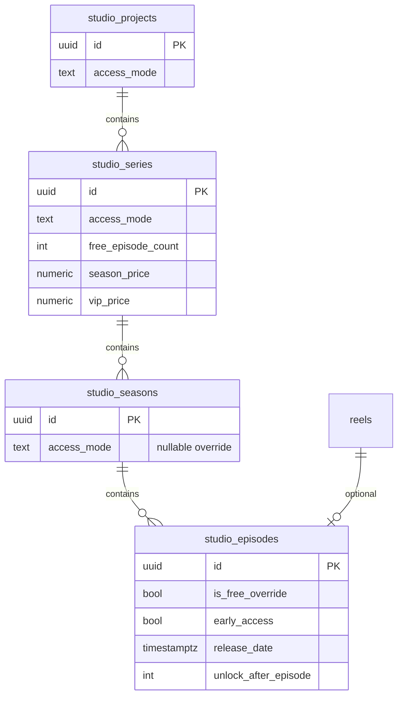

# Monetization Foundation

**Status:** Implemented (metadata only)  
**Feature flag:** `REELFORGE_MONETIZATION=true` (default **off**)  
**Payment processing:** None  
**Playback blocking:** None (`enforce_paywall: false` always)

---

## 1. Migration Report

**File:** `backend/migrations/202512286_monetization_foundation.sql`

Additive `ALTER TABLE` columns on existing studio hierarchy tables. No new payment tables. No changes to `reels`.

| Table | New columns | Defaults |
|-------|-------------|----------|
| `studio_projects` | `access_mode` | `FREE` |
| `studio_series` | `access_mode`, `free_episode_count`, `season_price`, `vip_price` | `FREE`, `0`, `NULL`, `NULL` |
| `studio_seasons` | `access_mode` | `NULL` (inherits series) |
| `studio_episodes` | `is_free_override`, `early_access`, `release_date`, `unlock_after_episode` | `false`, `false`, `NULL`, `NULL` |

**Access modes:** `FREE`, `EPISODE_LOCK`, `SEASON_PASS`, `VIP`, `SUBSCRIPTION`

**Prices:** `NUMERIC(10,2)` metadata only — not charged, not stored in any billing system.

**Existing reels:** Unchanged. Orphan reels without episodes remain fully playable.

**Requires:** Studio hierarchy migration (`202512284`) applied first.

---

## 2. Schema Diagram



### Hierarchy resolution (future — not enforced today)

```
Project.access_mode
  └─ Series.access_mode + free_episode_count + prices
       └─ Season.access_mode (optional override)
            └─ Episode.is_free_override + release_date + unlock_after_episode
```

**Today:** All API responses include `access_granted: true` and `enforce_paywall: false`.

---

## 3. API Documentation

**Flag off:** All routes return `404` with `{ "error": "Monetization API disabled" }`.

### Status

| Method | Path | Response |
|--------|------|----------|
| GET | `/api/monetization/status` | `{ enabled, enforce_paywall: false, access_modes[] }` |

### Configuration bundle

| Method | Path | Query |
|--------|------|-------|
| GET | `/api/monetization/config` | `?project_id=` optional (defaults to catalog project) |

Returns nested project → series → seasons → episodes with monetization fields. Every episode includes `access_granted: true`.

### Per-entity read/update

| Method | Path | Body (PUT) |
|--------|------|------------|
| GET/PUT | `/api/monetization/projects/{id}` | `{ access_mode? }` |
| GET/PUT | `/api/monetization/series/{id}` | `{ access_mode?, free_episode_count?, season_price?, vip_price?, clear_season_price?, clear_vip_price? }` |
| GET/PUT | `/api/monetization/seasons/{id}` | `{ access_mode?: string \| null }` |
| GET/PUT | `/api/monetization/episodes/{id}` | `{ is_free_override?, early_access?, release_date?, unlock_after_episode? }` |

### Example series update

```json
PUT /api/monetization/series/{uuid}
{
  "access_mode": "SEASON_PASS",
  "free_episode_count": 3,
  "season_price": "9.99",
  "vip_price": "14.99"
}
```

### Example episode update

```json
PUT /api/monetization/episodes/{uuid}
{
  "is_free_override": true,
  "early_access": false,
  "release_date": "2026-06-15T00:00:00Z",
  "unlock_after_episode": 2
}
```

**Unchanged endpoints:** `GET /api/reels`, video streaming, ingestion, theater — no monetization fields added to ReelV1.

---

## 4. Rollback Plan

### Level 1 — Disable API (instant)

```bash
REELFORGE_MONETIZATION=false
# restart backend
```

Metadata preserved. Playback identical.

### Level 2 — Remove admin UI

Remove `<MonetizationPanel />` from Control Center. No backend impact.

### Level 3 — Drop columns

After backup:

```sql
ALTER TABLE studio_episodes
  DROP COLUMN IF EXISTS is_free_override,
  DROP COLUMN IF EXISTS early_access,
  DROP COLUMN IF EXISTS release_date,
  DROP COLUMN IF EXISTS unlock_after_episode;

ALTER TABLE studio_seasons DROP COLUMN IF EXISTS access_mode;

ALTER TABLE studio_series
  DROP COLUMN IF EXISTS access_mode,
  DROP COLUMN IF EXISTS free_episode_count,
  DROP COLUMN IF EXISTS season_price,
  DROP COLUMN IF EXISTS vip_price;

ALTER TABLE studio_projects DROP COLUMN IF EXISTS access_mode;
```

Studio hierarchy and reels remain intact.

---

## 5. File Modification Map

| Path | Change |
|------|--------|
| `backend/migrations/202512286_monetization_foundation.sql` | **New** — additive columns |
| `backend/src/db/monetization.rs` | **New** — repository |
| `backend/src/api/monetization.rs` | **New** — HTTP handlers |
| `backend/src/db/mod.rs` | `monetization_enabled()` |
| `backend/src/api/mod.rs` | Module export |
| `backend/src/main.rs` | Routes + startup log |
| `backend/.env.example` | Flag documented |
| `frontend/src/lib/api/monetization.js` | **New** — API client |
| `frontend/src/components/studio/MonetizationPanel.svelte` | **New** — admin panel |
| `frontend/src/Viewer.svelte` | One `<MonetizationPanel />` in Control Center admin block |
| `docs/MONETIZATION_FOUNDATION.md` | **New** — this document |

### Unchanged

- Ingestion pipeline, ReelV1, theater, hero, shelf layout
- No Stripe/PayPal/checkout/subscription/coins/billing code

---

## 6. Enable

```bash
# Requires studio hierarchy tables
REELFORGE_STUDIO_HIERARCHY=true
REELFORGE_MONETIZATION=true
```

Restart backend → Control Center (admin) → **Monetization** section.

---

## 7. Success Criteria

| Criterion | Met |
|-----------|-----|
| No UI redesign | ✓ Panel additive in Control Center only |
| No playback changes | ✓ `enforce_paywall: false`, no theater changes |
| No payment processor | ✓ Metadata only |
| Fully reversible | ✓ Flag off + column drop |
| Metadata via APIs | ✓ GET/PUT endpoints |
| Existing reels work | ✓ No reel schema changes |
