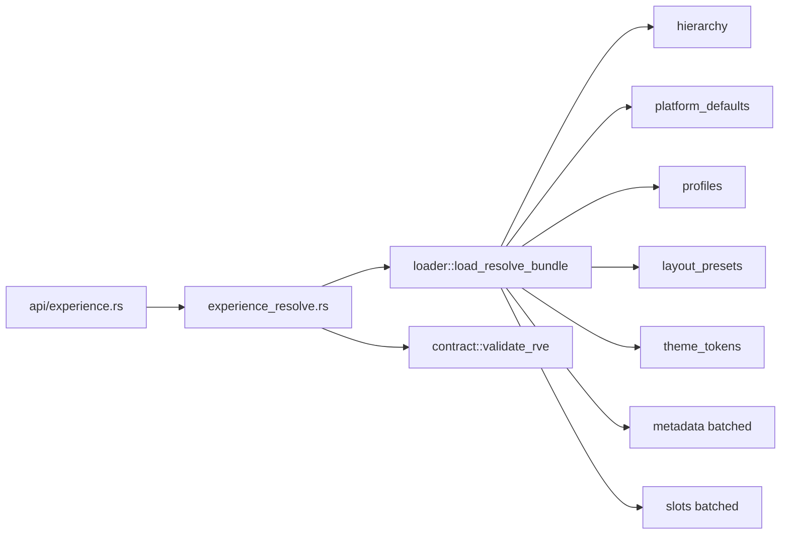

# Phase 1a.4 Implementation Report

**Date:** 2026-06-03  
**Status:** Complete  
**Authority:** [`RESOLVER_DECISION_RECORD.md`](./RESOLVER_DECISION_RECORD.md)

---

## Summary

Phase 1a.4 implements the Unified Resolver as the sole composition authority for `ResolvedViewerExperience` (RVE). All database reads flow through `experience::loader`; composition and provenance assembly live in `experience_resolve.rs`. A gated HTTP endpoint exposes resolve for Studio/Viewer consumers.

---

## Deliverables

| Artifact | Path |
|----------|------|
| Resolver decision record | `docs/RESOLVER_DECISION_RECORD.md` |
| Resolver (composition only) | `backend/src/experience/experience_resolve.rs` |
| Loader + query counter | `backend/src/experience/loader.rs` |
| API handler | `backend/src/api/experience.rs` |
| Route | `GET /api/experience/resolve?episode_id=` |
| Integration tests | `backend/src/experience/resolve_tests.rs` |
| Family read helper | `profiles::get_family()` |

---

## Architecture

---

## Merge implementation

Merge order follows RDR-010 through RDR-018:

1. In-memory defaults (labels, hero mode `OFF`, layout `MINIMAL` fallback).
2. `platform_experience_defaults` — never `platform_hero_config`.
3. Hierarchy profile overlays: project → series → season → episode (non-null fields).
4. Winning attachment for `experience_profile` section identity.
5. Layout/theme whole-set from winning profile → platform → fallback.
6. Visibility intersection: `baseline_visible AND profile_enabled.unwrap_or(true)`.
7. Metadata: batched scope chain; later scope wins.
8. Slots: batched; deduped; no campaign enrichment.
9. `campaigns[]` always `[]`.

---

## Constraints verified

| Requirement | Status |
|-------------|--------|
| Sole composer: `experience_resolve.rs` | Yes |
| Reads via `loader` only | Yes |
| No `sqlx::query` in resolver file | Yes (`rdr_001` test) |
| No writes | Yes |
| No `platform_hero_config` / `get_full_config` | Yes |
| `validate_rve()` every response | Yes |
| Validation failure → 422 | Yes (API) |
| `campaigns[]` empty | Yes |
| Slots without campaign enrichment | Yes |
| No Viewer.svelte changes | Yes |
| No `VITE_*` flags | Yes |
| No campaign engine / caching | Yes |
| Debug query_count logging | Yes (`eprintln!` in debug builds) |

---

## Module wiring

- `backend/src/experience/mod.rs` — exports `experience_resolve`
- `backend/src/lib.rs` — `pub mod experience`
- `backend/src/api/mod.rs` — `pub mod experience`
- `backend/src/main.rs` — route registration

---

## Flag gating

`REELFORGE_EXPERIENCE_PROFILES=true` required. When disabled, `GET /api/experience/resolve` returns **404** with enable hint (same pattern as watch API).

---

## Known limitations (by design)

- Phase 1b: `campaigns[]` enrichment and slot campaign metadata injection deferred.
- `extensions` omitted from output (RDR-006).
- Provenance on all leaf fields is partial; schema-required minimum keys are always present.

---

**Next phase:** 1b — campaign injector, expanded provenance coverage, Studio preview consumer.
