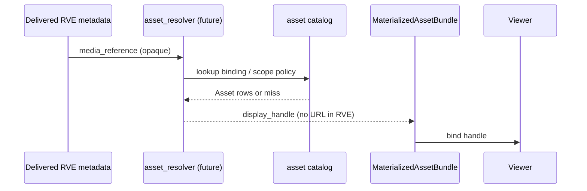

# Phase 1c.1 — Asset Inventory Model (Contract Only)

**Phase:** 1c.1 — Asset Inventory Model (architecture only)  
**Status:** Normative contract (no implementation)  
**Version:** `1.0.0`  
**Project:** ReelForge / Smart Production Studio  
**Prerequisites:** [`PHASE_1C_BOUNDARY.md`](./PHASE_1C_BOUNDARY.md), [`PHASE_1B7_CONTRACT_LOCK.md`](./PHASE_1B7_CONTRACT_LOCK.md), [`MEDIA_REPRESENTATION_CONTRACT.md`](./MEDIA_REPRESENTATION_CONTRACT.md), [`MEDIA_INVENTORY_AND_PLACEHOLDER_ARCHITECTURE.md`](./MEDIA_INVENTORY_AND_PLACEHOLDER_ARCHITECTURE.md)

**Scope:** Abstract asset entity, `media_reference` mapping contract, thumbnail asset binding (reference-only), declarative semantic↔asset inventory reconciliation, and layer separation rules. This document does **not** define SQL schemas, HTTP APIs, storage buckets, ingestion jobs, thumbnail generation, encoding pipelines, or resolver/CSPP/pipeline changes.

**Explicit non-goals (1c.1):** Code, database migrations, APIs, pipeline edits, thumbnail generation logic, ingestion logic, CDN URLs in RVE, runtime asset lookup inside Semantic Layer modules.

---

## Table of Contents

1. [Purpose](#1-purpose)
2. [Abstract Asset Model](#2-abstract-asset-model)
3. [Media Reference → Asset Mapping Contract](#3-media-reference--asset-mapping-contract)
4. [Thumbnail as Future Asset Binding](#4-thumbnail-as-future-asset-binding)
5. [Inventory Reconciliation Abstraction](#5-inventory-reconciliation-abstraction)
6. [Layer Separation (Normative)](#6-layer-separation-normative)
7. [Future Implementation Gate](#7-future-implementation-gate)
8. [Contradiction Register](#8-contradiction-register)
9. [References](#9-references)

---

## 1. Purpose

Phase 1b models **what the viewer experience claims** about media (`media_state`, `inventory_state`, `media_reference`) without knowing whether bytes exist. Phase 1c.1 defines **what an asset is** in the Asset Layer when implementation arrives — as an abstract contract, not a running system.

This document answers:

| Question | Answered here |
|----------|---------------|
| What is an asset? | §2 `Asset` entity |
| How does `media_reference` relate to assets? | §3 mapping contract (declarative) |
| Where do thumbnails live? | §4 optional `thumbnail_asset_id` binding |
| How does semantic `inventory_state` relate to `asset_state`? | §5 reconciliation table (not executable) |
| Who may know what? | §6 separation rules |

---

## 2. Abstract Asset Model

### 2.1 Entity: `Asset`

An **Asset** is the authoritative unit of stored or deliverable media in the Asset Layer. It is **not** embedded in RVE JSON.

| Field | Type | Required | Description |
|-------|------|----------|-------------|
| `asset_id` | opaque identifier (UUID string in implementations) | **Yes** | Stable primary key for the asset row/object. Never a URL. |
| `asset_type` | enum | **Yes** | Class of media backing (see §2.2) |
| `asset_state` | enum | **Yes** | Lifecycle in Asset Layer (see §2.3) |
| `asset_source` | enum | **Yes** | Provenance of the asset record (see §2.4) |

**Optional fields (implementation phase, not required in 1c.1 wire):** `created_at`, `updated_at`, `content_scope` (episode/reel/series id), `error_code`, `lineage_parent_asset_id`. These are **not** part of the minimal abstract contract.

### 2.2 `asset_type` (frozen enum)

| Value | Meaning |
|-------|---------|
| `video` | Primary motion picture or episode playback master |
| `image` | Still image (poster, keyframe upload, sponsor still) |
| `audio` | Audio-only master or track |
| `derived` | Asset produced from another asset (proxy, resized thumb file, transcoded mezzanine) — still a first-class `Asset` |

**Rules:**

| ID | Rule |
|----|------|
| AT-1 | `derived` assets **must** reference a lineage parent in implementation docs (not in RVE). |
| AT-2 | Semantic Layer **must not** emit `asset_type` in RVE. |
| AT-3 | `asset_type` does not replace RVE `media_intent` (presentation semantics remain semantic). |

### 2.3 `asset_state` (frozen enum)

| Value | Meaning |
|-------|---------|
| `PENDING` | Registered; no processing started |
| `PROCESSING` | Ingest, transcode, probe, or thumbnail job in flight |
| `READY` | Validated and eligible for bind / playback / display via Asset Layer |
| `FAILED` | Terminal failure; not publishable until retry creates new work |

**Rules:**

| ID | Rule |
|----|------|
| AS-1 | `asset_state` is **authoritative** in the Asset Layer store. |
| AS-2 | Allowed transitions match [`MEDIA_INVENTORY_AND_PLACEHOLDER_ARCHITECTURE.md`](./MEDIA_INVENTORY_AND_PLACEHOLDER_ARCHITECTURE.md) §2.2 (informative): `PENDING→PROCESSING→READY|FAILED`, etc. |
| AS-3 | Semantic Layer **must not** read `asset_state` during `experience_resolve` or CSPP. |

**Note:** Asset inventory includes `PROCESSING`. Semantic `inventory_state` (1b) does **not** — see §5 and §8.

### 2.4 `asset_source` (frozen enum)

| Value | Meaning |
|-------|---------|
| `upload` | Studio or operator direct upload |
| `ingest` | Automated ingestion pipeline job |
| `generated` | System-generated (thumbnail extract, proxy, AI poster) |
| `external` | Imported from external CMS, partner feed, or URL-less federation handle |

**Rules:**

| ID | Rule |
|----|------|
| AO-1 | `asset_source` is audit metadata only; it does not change RVE merge. |
| AO-2 | `external` does **not** permit storing partner URLs inside RVE (NC-105). |

### 2.5 Abstract record (reference shape)

Conceptual JSON ( **not** RVE — internal Asset Layer catalog only):

```json
{
  "asset_id": "f4000000-0000-4000-8000-000000000040",
  "asset_type": "video",
  "asset_state": "READY",
  "asset_source": "ingest"
}
```

---

## 3. Media Reference → Asset Mapping Contract

### 3.1 Principles

| ID | Principle |
|----|-----------|
| MR-1 | `media_reference` in RVE `metadata` is a **semantic pointer only** — opaque to consumers without Asset Layer resolution. |
| MR-2 | **Asset resolution is external** to resolver, CSPP, and `media_semantic_resolver`. |
| MR-3 | **No runtime lookup logic** is permitted inside Semantic Layer modules (no DB/API calls to resolve refs). |
| MR-4 | Resolution produces **MaterializedAssetBundle** entries for Viewer — never mutates RVE. |

### 3.2 Reference token grammar (contract)

| Pattern | Semantic intent | Resolves to (declarative) |
|---------|-----------------|---------------------------|
| `episode:{uuid}` | Primary episode context | Zero or one **primary** `video` asset bound to episode scope (implementation policy) |
| `asset:{uuid}` | Direct asset handle | Exactly one `Asset` with `asset_id = {uuid}` |
| `reel:{uuid}` | Catalog reel tile | Zero or one primary asset for reel scope |
| `slot:{slot_key}:{scope}` | Campaign slot imagery | Zero or one `image` asset per active slot `content_ref` mapping (Phase 1b CSPP) |

**Rules:**

| ID | Rule |
|----|------|
| MR-5 | Tokens **must not** use `http://`, `https://`, `/`, or file extensions. |
| MR-6 | Unknown prefix → resolution **fails closed** in Asset Layer (bundle miss); semantic layer sets `media_reference_validity: stale` or `absent` via adapter **outside** resolve path. |
| MR-7 | Resolver and CSPP **must not** parse token grammar beyond passthrough/storage in metadata. |

### 3.3 Mapping record (declarative, not stored in RVE)

**`MediaReferenceBinding`** (Asset Layer catalog concept):

| Field | Description |
|-------|-------------|
| `media_reference` | Exact token string from RVE |
| `primary_asset_id` | Optional `asset_id` for main backing |
| `thumbnail_asset_id` | Optional; see §4 |
| `binding_scope` | `episode`, `reel`, `campaign_slot`, etc. |

Bindings are maintained by **asset_inventory_service** (future) — not by experience resolve.

### 3.4 Resolution flow (external)



**No step** in this diagram runs inside `experience_resolve` or CSPP.

---

## 4. Thumbnail as Future Asset Binding

### 4.1 Separation from semantic `thumbnail_resolution`

| Layer | Field | Role |
|-------|-------|------|
| Semantic (1b) | `metadata.thumbnail_resolution` | `SHOULD_EXIST` \| `ALLOW_DERIVED` \| `MUST_PLACEHOLDER` — **decision** |
| Asset (1c) | `thumbnail_asset_id` on binding | Optional pointer to an `image` or `derived` **Asset** |

Semantic tier tells orchestrator **what class** to attempt; `thumbnail_asset_id` tells implementation **which row** to use when it exists.

### 4.2 `thumbnail_asset_id` (contract)

| Property | Constraint |
|----------|------------|
| Type | opaque `asset_id` (same namespace as §2.1) |
| Required | **No** — always optional on `MediaReferenceBinding` |
| Lifecycle | **Not defined** in 1c.1 — no generation, extraction, resize, or storage rules |
| RVE | **Forbidden** — must not appear in `ResolvedViewerExperience` JSON |

### 4.3 Declarative rules (no implementation)

| ID | Rule |
|----|------|
| TH-1 | When `thumbnail_asset_id` is set, referenced asset **should** be `asset_type` ∈ {`image`, `derived`}. |
| TH-2 | When `thumbnail_resolution` is `MUST_PLACEHOLDER`, `thumbnail_asset_id` **may** be null even if hero panel is visible. |
| TH-3 | When `thumbnail_resolution` is `SHOULD_EXIST` and `thumbnail_asset_id` is null, Asset resolver reports bundle miss; Viewer applies fallback (Viewer contract §8). |
| TH-4 | Thumbnail **generation** chooses `thumbnail_asset_id` in Asset Layer only. |

---

## 5. Inventory Reconciliation Abstraction

Reconciliation defines how **semantic** `inventory_state` (Phase 1b, RVE `metadata`) relates to **authoritative** `asset_state` (Asset catalog). This section is **declarative only** — not executable code in resolver, CSPP, or media pipeline.

### 5.1 Two inventories

| Name | Location | Enum values | Authority |
|------|----------|-------------|-----------|
| **Semantic inventory** | RVE `metadata.inventory_state` | `PENDING`, `READY`, `MISSING`, `FAILED` | Experience / media semantic layer (view) |
| **Asset inventory** | Asset catalog `asset_state` | `PENDING`, `PROCESSING`, `READY`, `FAILED` | Asset Layer (authoritative) |

Semantic inventory has **no** `PROCESSING` value (1b.6 freeze). Asset inventory has **no** `MISSING` value — absence of row is modeled by no binding + scope policy.

### 5.2 Declarative reconciliation table

Read as: **when** asset catalog matches column condition, **semantic view may be** row value (via future adapter, not in resolve path).

| Asset catalog condition | Semantic `inventory_state` (allowed view) | Semantic `media_state` (typical) |
|------------------------|-------------------------------------------|----------------------------------|
| No asset row for scope | `MISSING` | `PLACEHOLDER_MEDIA` or `FALLBACK_MEDIA` |
| Row `PENDING` | `PENDING` | `PLACEHOLDER_MEDIA` or `FALLBACK_MEDIA` |
| Row `PROCESSING` | `PENDING` | `PLACEHOLDER_MEDIA` (semantic does not expose PROCESSING) |
| Row `READY` + valid `media_reference` binding | `READY` | `REAL_MEDIA` (or `DERIVED_MEDIA` if policy says derived) |
| Row `READY` + invalid/stale binding | `READY` or `MISSING` | `DERIVED_MEDIA` or placeholder/fallback |
| Row `FAILED` | `FAILED` | `FALLBACK_MEDIA` |
| Row `ARCHIVED` (future storage) | `FAILED` or `MISSING` | `FALLBACK_MEDIA` |

### 5.3 Reconciliation invariants (declarative)

| ID | Invariant |
|----|-----------|
| REC-1 | Semantic `inventory_state` **never** implies a specific `asset_id` without a separate `media_reference` token. |
| REC-2 | `asset_state: PROCESSING` **always** reconciles to semantic `PENDING` (or `MISSING`), never semantic `READY`. |
| REC-3 | Semantic `READY` **requires** declarative policy: at least one `READY` primary asset for scope — enforced by adapter, not resolver. |
| REC-4 | Reconciliation adapter **must not** run inside `compose_pipeline` stages 1–2 (resolver, CSPP). |
| REC-5 | Default semantic view when adapter absent (1b today): `MISSING` per [`PHASE_1B7_CONTRACT_LOCK.md`](./PHASE_1B7_CONTRACT_LOCK.md). |

### 5.4 Future adapter placement

Executable reconciliation is specified in [`PHASE_1C2_ASSET_RESOLUTION_ADAPTER.md`](./PHASE_1C2_ASSET_RESOLUTION_ADAPTER.md) (`AssetResolutionAdapter` — Viewer bind only, not in pipeline).

```text
asset_inventory_store
  → AssetResolutionAdapter (1c.2 — ONLY bridge, after pipeline)
  → SemanticMediaBinding + MaterializedAssetBundle → Viewer

Forbidden:
  experience_resolve → read asset catalog
  cspp::enrich → read asset catalog
  media_semantic_resolver → read asset catalog
```

---

## 6. Layer Separation (Normative)

### 6.1 Phase 1b system — never knows asset internals

| Must NOT know | Examples |
|---------------|----------|
| `asset_id` | `f4000000-...` in resolver |
| `asset_type`, `asset_source` | video vs image in CSPP |
| Storage bucket, object key, CDN host | any path in RVE |
| Thumbnail file dimensions | width/height in metadata |
| Ingest job id | job-123 in merge |

Phase 1b **may** know: `media_reference` token, semantic enums, `thumbnail_resolution` decision.

### 6.2 Phase 1c Asset system — never influences resolver or CSPP

| Must NOT do | Examples |
|-------------|----------|
| Call `resolve_base_rve` with asset-aware branches | skip hero if not READY |
| Change `campaigns[]` based on ingest | hide premiere if FAILED |
| Write into Base RVE structural sections | layout, visibility, labels |
| Block CSPP on `asset_state` | delay slots until PROCESSING done |

Asset Layer **may**: emit inventory events, update catalog, resolve bundle for Viewer.

### 6.3 Viewer — resolved references only

| May | Must NOT |
|-----|----------|
| Consume `MaterializedAssetBundle` keyed by `media_reference` | Parse `asset_id` from RVE (not present) |
| Tolerate null `media_reference` | Query asset catalog |
| Apply fallback when bundle entry missing | Change composition based on `asset_state` |

---

## 7. Future Implementation Gate

Before Asset Layer code merges:

| # | Requirement |
|---|-------------|
| I1 | `Asset` entity persisted per §2 (schema doc separate phase) |
| I2 | `MediaReferenceBinding` store per §3.3 |
| I3 | `asset_resolver` service **outside** pipeline per §3.4 |
| I4 | `thumbnail_asset_id` optional per §4; no RVE field |
| I5 | `inventory_reconciliation_adapter` per §5.4 — not in resolver/CSPP |
| I6 | Contract tests: no `asset_*` keys in RVE JSON (NC extension) |
| I7 | [`PHASE_1C_BOUNDARY.md`](./PHASE_1C_BOUNDARY.md) gates G1–G7 satisfied |

**1c.1 verdict:** **APPROVED** as contract-only. **No implementation authorized** by this document.

---

## 8. Contradiction Register

| ID | Topic | Resolution |
|----|-------|------------|
| C1-01 | Semantic `inventory_state` lacks `PROCESSING` | Asset `PROCESSING` maps to semantic `PENDING` in §5.2 |
| C1-02 | Semantic `MISSING` vs no asset row | `MISSING` is semantic view of absent binding; not an `asset_state` |
| C1-03 | [`MEDIA_INVENTORY_AND_PLACEHOLDER_ARCHITECTURE.md`](./MEDIA_INVENTORY_AND_PLACEHOLDER_ARCHITECTURE.md) `ARCHIVED` | Asset-only future state; reconciles to semantic `FAILED` or `MISSING` |
| C1-04 | `episode:{uuid}` vs multiple assets | Implementation policy in asset_resolver; not fixed in 1c.1 |
| C1-05 | v1 `thumbnailUrl` on reels API | Materialized outside RVE per PHASE_1C_BOUNDARY |

---

## 9. References

| Document | Role |
|----------|------|
| [`PHASE_1C_BOUNDARY.md`](./PHASE_1C_BOUNDARY.md) | Two-layer gate |
| [`PHASE_1B7_CONTRACT_LOCK.md`](./PHASE_1B7_CONTRACT_LOCK.md) | Frozen semantic enums |
| [`MEDIA_REPRESENTATION_CONTRACT.md`](./MEDIA_REPRESENTATION_CONTRACT.md) | `media_reference`, `media_state` |
| [`MEDIA_INVENTORY_AND_PLACEHOLDER_ARCHITECTURE.md`](./MEDIA_INVENTORY_AND_PLACEHOLDER_ARCHITECTURE.md) | Informative asset lifecycle |
| [`VIEWER_COMPOSITION_CONTRACT.md`](./VIEWER_COMPOSITION_CONTRACT.md) | Bundle consumption |

---

*End of Phase 1c.1 asset inventory model contract.*
