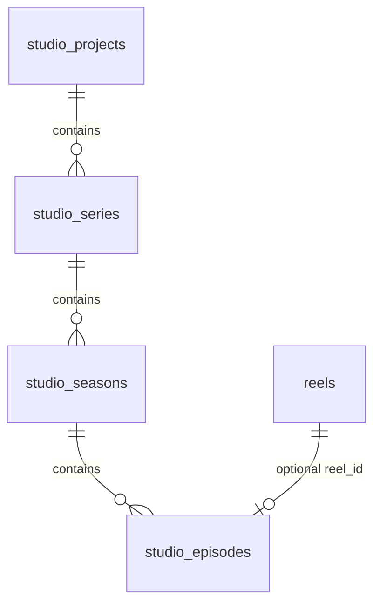

# Phase B — Studio Hierarchy Migration Report

**Status:** Pre-implementation reference (approved)  
**Scope:** Additive `Project → Series → Season → Episode → reel_id` layer  
**Playback impact:** None — `GET /api/reels` and theater unchanged

---

## 1. New Tables

| Table | Purpose |
|-------|---------|
| `studio_projects` | Top-level production container |
| `studio_series` | Show/series within a project |
| `studio_seasons` | Season within a series |
| `studio_episodes` | Editorial episode; optional FK to `reels.id` |

### Column summary

**studio_projects**
- `id` UUID PK
- `name` TEXT NOT NULL
- `slug` TEXT (optional URL-safe identifier)
- `status` TEXT — `active` \| `archived`
- `created_at`, `updated_at`

**studio_series**
- `id` UUID PK
- `project_id` UUID FK → `studio_projects(id)` ON DELETE CASCADE
- `title` TEXT NOT NULL
- `description` TEXT
- `status` TEXT — `draft` \| `in_production` \| `live` \| `archived`
- `created_at`, `updated_at`

**studio_seasons**
- `id` UUID PK
- `series_id` UUID FK → `studio_series(id)` ON DELETE CASCADE
- `season_number` INT NOT NULL
- `title` TEXT
- `sort_order` INT DEFAULT 0
- `created_at`, `updated_at`
- UNIQUE (`series_id`, `season_number`)

**studio_episodes**
- `id` UUID PK
- `season_id` UUID FK → `studio_seasons(id)` ON DELETE CASCADE
- `reel_id` UUID FK → `reels(id)` ON DELETE SET NULL (nullable until upload)
- `episode_number` INT NOT NULL
- `title` TEXT NOT NULL
- `description` TEXT
- `publish_status` TEXT — `draft` \| `scheduled` \| `published` \| `archived`
- `scheduled_at`, `published_at` TIMESTAMPTZ
- `created_at`, `updated_at`
- UNIQUE (`season_id`, `episode_number`)
- UNIQUE (`reel_id`) WHERE `reel_id IS NOT NULL`

---

## 2. Foreign Key Relationships

```
studio_projects (1) ──< studio_series (N)
studio_series   (1) ──< studio_seasons (N)
studio_seasons  (1) ──< studio_episodes (N)
reels           (1) ──< studio_episodes.reel_id (0..1, optional)
```



**Cascade behavior**
- Deleting a project removes its series, seasons, and episodes.
- Deleting a reel sets `studio_episodes.reel_id` to NULL (episode metadata preserved).
- Deleting an episode does not delete the reel.

---

## 3. Existing Reel Compatibility

| Concern | Guarantee |
|---------|-----------|
| Orphan reels (no episode) | Fully valid; appear on `GET /api/reels` as today |
| Ingestion pipeline | Unchanged — `POST /api/reels` still creates `reels` rows only |
| `list_ready_reels` filter | Unchanged — `status=ready AND validated=true` |
| Disk files in `public/videos/` | Unchanged — served by existing video stream handler |
| ReelV1 contract | Unchanged — no new required fields on list response |
| Episode binding | Optional via `POST /api/studio/episodes/{id}/attach-reel` after ingest |

**Backfill (idempotent):**
1. Seed project `"ReelForge Catalog"` if missing.
2. For each distinct `reels.category` among ready+validated reels, create a series (if missing).
3. Create season 1 per series.
4. For each ready+validated reel without an episode, create episode with `reel_id` set and `publish_status=published`.

Reels that fail backfill (e.g. duplicate `reel_id`) are skipped; ingestion and playback unaffected.

---

## 4. API Compatibility

### Unchanged endpoints (existing consumers)

| Endpoint | Behavior |
|----------|----------|
| `GET /api/reels` | Same response shape (ReelV1[]) |
| `POST /api/reels` | Same multipart ingest |
| `GET /api/reels/{id}` | Same poll/status |
| `DELETE /api/reels/{id}` | Same delete |
| `GET /videos/{filename}` | Same streaming |

### New endpoints (feature-flagged)

Enabled when `REELFORGE_STUDIO_HIERARCHY=true` (default **off** in production until explicitly enabled).

| Method | Path | Purpose |
|--------|------|---------|
| GET | `/api/studio/status` | Flag state + entity counts |
| GET | `/api/studio/projects` | List projects |
| POST | `/api/studio/projects` | Create project |
| GET | `/api/studio/projects/{id}/tree` | Full nested hierarchy |
| GET | `/api/studio/series` | List series (`?project_id=`) |
| POST | `/api/studio/series` | Create series |
| POST | `/api/studio/seasons` | Create season |
| GET | `/api/studio/seasons/{id}/episodes` | List episodes |
| POST | `/api/studio/episodes` | Create episode |
| POST | `/api/studio/episodes/{id}/attach-reel` | Bind `reel_id` |
| POST | `/api/studio/backfill` | Idempotent reel→episode backfill |

When flag is **off**, studio routes return `404` with `{ "error": "Studio hierarchy disabled" }`.

---

## 5. Rollback Plan

### Level 1 — Disable feature (instant, no schema change)

```bash
REELFORGE_STUDIO_HIERARCHY=false
# restart backend
```

- All studio API routes return 404.
- Reels catalog and playback identical to pre-Phase-B.
- Hierarchy data remains in DB for re-enable.

### Level 2 — Drop studio tables (schema rollback)

Run only after backup:

```sql
DROP TABLE IF EXISTS studio_episodes CASCADE;
DROP TABLE IF EXISTS studio_seasons CASCADE;
DROP TABLE IF EXISTS studio_series CASCADE;
DROP TABLE IF EXISTS studio_projects CASCADE;
```

- `reels` table untouched.
- Remove migration file from chain only if no other environment has applied it (prefer forward-fix).

### Level 3 — Full revert

1. Set feature flag off.
2. Drop studio tables (Level 2).
3. Remove `202512284_studio_hierarchy.sql` from deploy pipeline.
4. Revert frontend studio panel (optional — panel hidden when API disabled).

**Data loss on rollback:** Only studio hierarchy metadata; reels, videos, and thumbnails preserved.

---

## 6. Success Criteria Checklist

- [x] A reel can optionally belong to an Episode (`studio_episodes.reel_id`)
- [x] Episode → Season → Series → Project chain enforced by FKs
- [x] Existing reels without episodes remain valid and playable
- [x] `GET /api/reels` unchanged for existing consumers
- [x] Ingestion pipeline unchanged
- [x] Feature flag gates all new studio routes

---

## 7. Implementation Notes (Phase B delivered)

| Artifact | Path |
|----------|------|
| Migration | `backend/migrations/202512284_studio_hierarchy.sql` |
| Repository | `backend/src/db/studio.rs` |
| API | `backend/src/api/studio.rs` |
| Feature flag | `REELFORGE_STUDIO_HIERARCHY` (default **off**) |
| Frontend API | `frontend/src/lib/api/studio.js` |
| Admin UI | Control Center → **Production Hierarchy** section |

### Enable

```bash
# backend/.env
REELFORGE_STUDIO_HIERARCHY=true
```

Restart backend, open Control Center (admin), run **Backfill reels → episodes** once.

### Backfill

`POST /api/studio/backfill` — idempotent; maps ready+validated reels to episodes under category-named series in the default catalog project.
