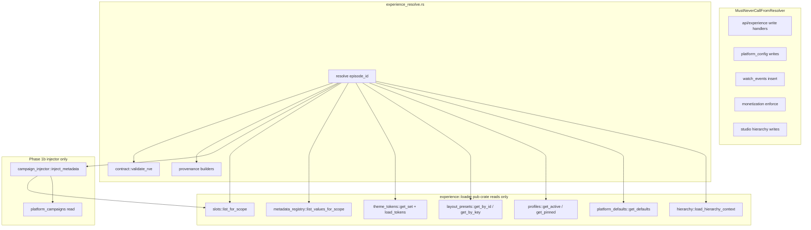

# Resolver Boundary Audit — Phase 1a.3.5

**Status:** Normative architecture audit (no code changes)  
**Scope:** Defines boundaries for `experience_resolve.rs` (Phase 1a.4)  
**Inputs:** [`RESOLVED_VIEWER_EXPERIENCE_CONTRACT.md`](./RESOLVED_VIEWER_EXPERIENCE_CONTRACT.md), [`RESOLVED_VIEWER_EXPERIENCE_SCHEMA.md`](./RESOLVED_VIEWER_EXPERIENCE_SCHEMA.md), Phase 1a.3 implementation

---

## Executive Summary

`experience_resolve.rs` is the **only** module permitted to compose `ResolvedViewerExperience` (RVE). It is a **pure read-and-merge** function: no writes, no side effects, no enforcement. All data enters through `experience::loader` (`pub(crate)` read functions) or future `campaign_injector` (Phase 1b, metadata-only). Studio-facing modules remain **write-only** at the API layer; their read paths are loader-gated.

---

## 1. Resolver Dependency Graph

### 1.1 Allowed composition pipeline

### 1.2 Module participation matrix

| Module | Path | Resolver role | Access path |
|--------|------|---------------|-------------|
| **platform_defaults** | `experience/platform_defaults.rs` | Platform baseline (labels, hero, watch flags, monetization presentation defaults) | `loader` → `get_defaults` |
| **hierarchy** | `experience/hierarchy.rs` | Episode chain, attachments, merge helpers | `loader` → `load_hierarchy_context`, `winning_attachment`, `merge_optional_*` |
| **profiles** | `experience/profiles.rs` | ACTIVE / pinned version row | `loader` → `load_profile_for_attachment` |
| **layout_presets** | `experience/layout_presets.rs` | Blueprint `definition` + `preset_key` | `loader` → `layout_by_id` / `layout_by_key` |
| **theme_tokens** | `experience/theme_tokens.rs` | Token set + token map | `loader` → `get_set_by_id`, `load_tokens_for_set` |
| **metadata_registry** | `experience/metadata_registry.rs` | Scoped metadata values | `loader` → `load_metadata_chain` |
| **slots** | `experience/slots.rs` | Slot assignment rows | `loader` → `list_for_scope` |
| **provenance** | `experience/provenance.rs` | Build `{ value, source, scope, profile_version }` | Direct call (pure functions) |
| **contract** | `experience/contract.rs` | Validate output; constants | `validate_rve`, `NULL_CRITICAL_PATHS` |
| **campaign_injector** | *Phase 1b — not yet present* | `campaigns[]` + enrich `slots[]` | Called only from resolver; reads `platform_campaigns` |

### 1.3 Explicitly excluded from resolver (read or write)

| Module | Path | Reason |
|--------|------|--------|
| **watch_events** | `db/watch_events.rs` | Write path for analytics; `watch_features` are **config gates** from profile/defaults, not live progress |
| **monetization** | `db/monetization.rs` | Access enforcement is a separate API; RVE sets `enforce_paywall: false` always |
| **platform_config** (hero/site) | `db/platform_config.rs` | `platform_hero_config` is legacy write surface; resolver reads **`platform_experience_defaults` only** |
| **platform_config** bundle | `get_full_config` | Alternate composition path — **forbidden** |
| **studio** CRUD | `db/studio.rs` | Hierarchy management only; resolver uses `hierarchy::load_hierarchy_context`, not studio list APIs |
| **reels / ingestion** | `db/reels.rs`, `ingestion/*` | Playback contract unchanged |
| **profiles** writes | `create_family`, `publish_version`, etc. | Studio write-only |
| **metadata_registry** writes | `create_definition`, `upsert_value` | Studio write-only |

### 1.4 Write-only modules (Studio / admin APIs)

These modules **must not** be imported by `experience_resolve.rs`:

| Module | Write operations |
|--------|------------------|
| `experience/profiles.rs` | `create_family`, `create_draft_version`, `publish_version`, `update_draft_labels` |
| `experience/metadata_registry.rs` | `create_definition`, `upsert_value` |
| `db/platform_config.rs` | All `update_*`, campaign CRUD |
| `db/studio.rs` | Project/series/season/episode CRUD |
| `db/watch_events.rs` | `insert_watch_event`, progress upsert |
| `api/*` | HTTP handlers (orchestration belongs in resolver only) |

Reads from the above are allowed **only** through `experience::loader` wrappers, never direct SQL in the resolver file.

---

## 2. Resolver Purity Rules

### 2.1 Allowed operations

| Operation | Allowed |
|-----------|---------|
| `SELECT` / read-only SQL via loader | Yes |
| In-memory merge per contract §5.1 | Yes |
| Visibility intersection (`baseline AND profile_enabled`) | Yes |
| Provenance map construction | Yes |
| `contract::validate_rve` before return | Yes |
| `contract::validate_metadata_key` on composed metadata keys | Yes |
| Read-only transaction (`READ ONLY` or default read committed) | Yes |
| Deterministic fallbacks (`default` source) | Yes |

### 2.2 Forbidden operations

| Category | Forbidden examples | Rationale |
|----------|-------------------|-----------|
| **Writes** | `INSERT`, `UPDATE`, `DELETE`, publish, attach | Studio owns mutations |
| **Side effects** | Analytics events, audit logs that mutate state | Resolver is idempotent read |
| **Campaign mutation** | Auto `scheduled` → `active` status UPDATE | Phase 1b+ may use read-time evaluation only; persistence in background job |
| **Watch mutation** | `insert_watch_event`, progress upsert | Watch Intelligence is separate |
| **Monetization enforcement** | `enforce_paywall: true`, access checks | Contract S6; monetization API owns enforcement |
| **Cache invalidation** | Pub/sub, cache bust on resolve | Phase 3 concern; resolve must not trigger writes |
| **UI formatting** | HTML, CSS, locale strings beyond labels | Viewer render-only |
| **Direct table access** | SQL in `experience_resolve.rs` bypassing loader | Boundary enforcement |
| **Bundle endpoints** | Composing `GET /config` style payloads | Single `RVE` output only |
| **Client merge** | Returning partial layers for client composition | Violates S1–S3 |
| **Hero dual-read** | Reading `platform_hero_config` in resolve path | Use `platform_experience_defaults` only (Phase 1a.4 dual-write on hero PUT is write-path only) |
| **DRAFT profile in output** | Resolving unpinned DRAFT versions | NC-103 |
| **Partial RVE on error** | Returning incomplete JSON on validation failure | NC-101 |

### 2.3 Purity invariant (single sentence)

> **Resolve is a pure function of (episode_id | reel_id, DB snapshot) → Result<RVE, ResolveError>**, with no observable mutations and `enforce_paywall` always `false`.

---

## 3. Resolver Output Ownership Matrix

Merge priority follows contract §5.1: `default` < `platform` < `project` < `series` < `season` < `episode` < `profile` < layout intersection < metadata overlay < `campaign`.

Legend: **MC** = must pass `validate_rve`; **NC** = null-critical.

| RVE section | Source module(s) | Merge priority | Validation | Fallback |
|-------------|------------------|----------------|------------|----------|
| **schema_version** | `contract::SCHEMA_VERSION` | Constant | MC: SemVer `1.0.0` | Hardcoded `"1.0.0"` |
| **resolve_context** | `hierarchy::load_hierarchy_context` | DB walk | MC: `project_id`, `resolved_at`, `enforce_paywall=false`; one of `episode_id`/`reel_id` | Error if episode not found |
| **experience_profile** | `profiles` via `loader::load_profile_for_attachment` + `hierarchy::winning_attachment` | Winning attachment → ACTIVE or pin | MC when present: version ids, `content_format`, `status` | **Omit section** if no family attached |
| **layout** | `layout_presets` + profile `layout_preset_id` + `platform_defaults.default_layout_preset_id` | profile → platform → `MINIMAL` | MC: `preset_key`, `definition.panels` | `MINIMAL` preset seed; provenance `default` |
| **theme** | `theme_tokens` + profile/platform set ids | Whole-set replacement: profile → platform → empty `{}` | MC: `tokens` object | `default-reelforge` slug / empty tokens |
| **labels** | Profile nullable fields layered over `platform_defaults` via hierarchy walk | project→series→season→episode profile layers, then platform | MC: `episode_label` non-empty | Platform defaults (`Episode`, etc.) |
| **metadata** | `metadata_registry` via `loader::load_metadata_chain` | project → series → season → episode (later wins) | Reserved key check; compose-time type check (NC-104) | `{}` |
| **visibility** | `layout_presets.definition` + profile flags | Intersection per panel; hero from merged flags | MC: `hero.mode`, `hero.enabled`; NC-102 intersection | Hero OFF; panels empty/minimal |
| **campaigns** | *Phase 1b* `campaign_injector` ← `platform_campaigns` | Active by date+status at read time | Schema campaign object; no `playback_url` | `[]` in Phase 1a.4 |
| **slots** | `slots` + *Phase 1b* injector | Scope chain + active assignments | `slot_key` enum / `custom.*` pattern | `[]` |
| **monetization_presentation** | Profile nullable + `platform_defaults` | profile overrides platform for non-null fields | `premium_cta_style` enum | Platform `NONE` / null styles |
| **watch_features** | Profile nullable + `platform_defaults` | Same as labels (bool merge) | MC: all four booleans required | Platform defaults (false) |
| **extensions** | Resolver stubs in 1a.4; injectors in future | N/A — optional | Schema per namespace | `{}` or omit |
| **provenance** | `provenance` helpers during merge | Parallel to each leaf field | MC: minimum keys + full leaf coverage (NC-101) | N/A — resolve fails if incomplete |

### 3.1 `visibility` detail (resolver-owned logic)

| Subfield | Computation owner | Rule |
|----------|-------------------|------|
| `visibility.hero.*` | Resolver | Merge bools/enums from platform → hierarchy layers → profile row |
| `visibility.panels.*.baseline_visible` | `layout_presets` | From blueprint only |
| `visibility.panels.*.profile_enabled` | `profiles` | Nullable = inherit enabled |
| `visibility.panels.*.effective_visible` | **Resolver only** | `baseline_visible && (profile_enabled.unwrap_or(true))` |
| `visibility.panels.*.disabled_by` | Resolver | Set when `effective_visible == false` |

### 3.2 `watch_features` vs Watch Intelligence

| Concept | Source | Note |
|---------|--------|------|
| `watch_features.*` | `platform_defaults` + `profiles` | Metadata gates for UI (show continue row, etc.) |
| `watch_progress` / events | **Not used** | `/api/watch/*` consumes progress; resolver does not read `watch_events` |

---

## 4. Future Compatibility Audit

Future systems attach via **`extensions`** and optional injectors called **from resolver only**. Core RVE sections remain stable per contract §3 (additive minor bumps).

| Future system | Extension namespace | Phase 1a.4 stub | Contract impact |
|---------------|---------------------|-----------------|-----------------|
| **AI recommendation engine** | `extensions.future_ai_modules` | Empty `modules: []` | None — metadata only |
| **Personalization** | `extensions.future_recommendation_modules` | `engine_id: null`, `shelf_hints: {}` | None — non-binding hints |
| **Creator storefronts** | `metadata` + `metadata_definitions` | Use registry keys (e.g. `merch_url`) | None — registry pattern |
| **Advertising** | `extensions.future_ad_modules` | Empty `placements: []` | Must not collide with `hero_promo` slot |
| **Sponsorship campaigns** | `campaigns` + `slots` | Phase 1b injector | Extends rows, not layout |
| **Live events** | Profile `pin_version` + `slots` | Already in schema | Pinned ARCHIVED allowed with warning |
| **Memberships** | `monetization_presentation` + monetization API | Presentation only in RVE | Enforcement stays external |
| **Creator messaging** | `extensions.custom_metadata` or new metadata defs | Registry write path | No resolver contract change |

### 4.1 Required extension points (frozen in 1.0.0)

| Extension | Resolver behavior (1a.4) |
|-----------|--------------------------|
| `extensions.custom_metadata` | Omit unless experimental keys needed |
| `extensions.custom_slots` | Merge after `slots[]`; keys `custom.*` only |
| `extensions.future_ai_modules` | Omit or `[]` |
| `extensions.future_recommendation_modules` | Omit or empty hints |
| `extensions.future_ad_modules` | Omit or `[]` |

### 4.2 Compatibility rules for new features

1. **Never** add required top-level RVE fields without a schema major bump.
2. **Never** read new tables inside `experience_resolve.rs` — add `loader` + optional injector.
3. Injectors return **metadata slices** only; they cannot set `layout.definition` or `visibility.panels.*.zone`.
4. Campaign/ad/AI modules must not call `publish_version` or slot writes during resolve.

---

## 5. Resolver Performance Budget

### 5.1 Expected query count (Phase 1a.4 baseline)

| Step | Queries | Notes |
|------|---------|-------|
| Hierarchy context | **1** | Single JOIN across studio tables |
| Platform defaults | **1** | Singleton row |
| Profile version | **0–1** | After attachment resolution |
| Layout preset | **1** | By id or key |
| Theme set + tokens | **1–2** | Set row + token rows |
| Metadata per scope | **1** | Batched: `WHERE (scope_type, scope_id) IN (...)` recommended |
| Slots per scope | **1–4** | Batched in Phase 1a.4 refactor |
| Campaigns (1b) | **1** | Active campaigns + slot join |
| **Target total** | **≤ 10** round-trips | Phase 1a.4 goal **≤ 6** with batching |

### 5.2 Batching strategy

| Data | Strategy |
|------|----------|
| Metadata values | Single query for all scopes in chain (project, series, season, episode) |
| Slot assignments | Single query with `OR` scope conditions |
| Theme tokens | Always load by `token_set_id` in one query |
| Profile layers | Do **not** load 4 profile rows; merge nullable fields in resolver from attachment IDs only, then load **one** winning profile version |

### 5.3 Transaction rules

| Rule | Requirement |
|------|-------------|
| Default | No explicit transaction (read committed) |
| Optional | `BEGIN READ ONLY` for snapshot consistency on pin-heavy resolves |
| Forbidden | Read-write transactions |
| Isolation | Stale read acceptable; resolve is point-in-time metadata |

### 5.4 Caching eligibility

| Cacheable | TTL guidance | Invalidation |
|-----------|--------------|--------------|
| Platform defaults | 60s–300s | On defaults PUT |
| Layout preset by key | 300s+ | On preset PUT (CUSTOM only) |
| Theme token set | 300s+ | On token PUT |
| Metadata definitions | 300s+ | On definition archive |
| **Per-episode RVE** | Optional 5–30s | On profile publish, attachment change, slot/campaign change |
| **Forbidden cache** | Cross-episode personalized (uses watch progress) | N/A in 1.4 |

Caching is **Phase 3**; 1a.4 implements uncached path first. Cache must not bypass `validate_rve`.

### 5.5 Latency budget

| Percentile | Target | Max queries |
|------------|--------|-------------|
| p50 | **< 25 ms** DB + merge | ≤ 6 batched |
| p95 | **< 75 ms** | ≤ 10 |
| p99 | **< 150 ms** | Hard cap; log slow resolve |

Studio preview and Viewer (Phase 2) share the same budget.

---

## 6. Exit Criteria for Phase 1a.4

All items must pass before merging `experience_resolve.rs`.

### 6.1 Infrastructure

- [ ] Migrations 288 and 289 applied; seed verification (`7` presets, `7` metadata defs, `5` theme sets)
- [ ] `REELFORGE_EXPERIENCE_PROFILES` documented; default off in production

### 6.2 Boundary enforcement

- [ ] `experience_resolve.rs` is the **only** file performing RVE composition
- [ ] Resolver imports only: `loader`, `provenance`, `contract`, `hierarchy` merge helpers (no `profiles::publish`, no `platform_config`)
- [ ] No SQL strings in `experience_resolve.rs` (grep gate in CI)
- [ ] `platform_hero_config` not read in resolve path
- [ ] `get_full_config` not used for experience preview

### 6.3 Functional completeness

- [ ] `resolve(episode_id)` returns full RVE per contract §7
- [ ] Merge order matches §5.1 (integration test with fixture data)
- [ ] ACTIVE vs pinned selection covered (tests exist + resolver e2e)
- [ ] Visibility intersection enforced (NC-102 test)
- [ ] Provenance entry for **every** emitted leaf field (NC-101 test)
- [ ] `validate_rve` called on every success path; 422 on NC failures with field list
- [ ] `enforce_paywall` always `false`
- [ ] `experience_profile` omitted when no attachment

### 6.4 API surface (minimal)

- [ ] `GET /api/experience/resolve?episode_id=` only (composition route)
- [ ] Write routes do **not** return merged RVE (attachment IDs only)
- [ ] No `GET /api/experience/defaults`, no `GET /api/experience/config` bundle

### 6.5 Performance

- [ ] Query count ≤ 10 (target ≤ 6 batched) measured in test or trace
- [ ] No write queries in resolve hot path (assertion test)

### 6.6 Documentation

- [ ] This audit referenced in `PHASE_1A3_IMPLEMENTATION_REPORT.md` or Phase 1a.4 PR description
- [ ] Known deferrals explicit: campaigns `[]` until 1b, extensions empty until needed

---

## 7. Module File Plan (Phase 1a.4 — reference only)

| File | Responsibility |
|------|----------------|
| `experience/experience_resolve.rs` | `pub async fn resolve(pool, episode_id) -> Result<Value, ResolveError>` |
| `experience/loader.rs` | Expand batched reads; remain `pub(crate)` |
| `experience/campaign_injector.rs` | Phase 1b — `inject_metadata(ctx) -> (campaigns, slots)` |
| `api/experience.rs` | Thin handler: call resolve + JSON response |
| **Not in resolver** | `profiles` writes, `metadata_registry` writes, `platform_config` |

---

## 8. Risk Register

| Risk | Mitigation |
|------|------------|
| Loader bypass via copy-paste SQL | CI grep: `experience_resolve.rs` must not contain `sqlx::query` |
| Campaign injector mutates status | Injector read-only; status evaluation in memory |
| Hero drift between platform tables | Resolver reads defaults only; hero PUT dual-write (separate task) |
| Partial provenance | Fail resolve (500) not partial JSON |
| Performance regression | Batch queries in loader before optimize cache |

---

**Document path:** `docs/RESOLVER_BOUNDARY_AUDIT.md`  
**Next phase:** 1a.4 — implement `experience_resolve.rs` against this audit
