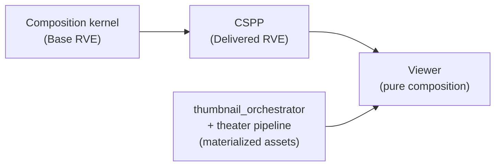
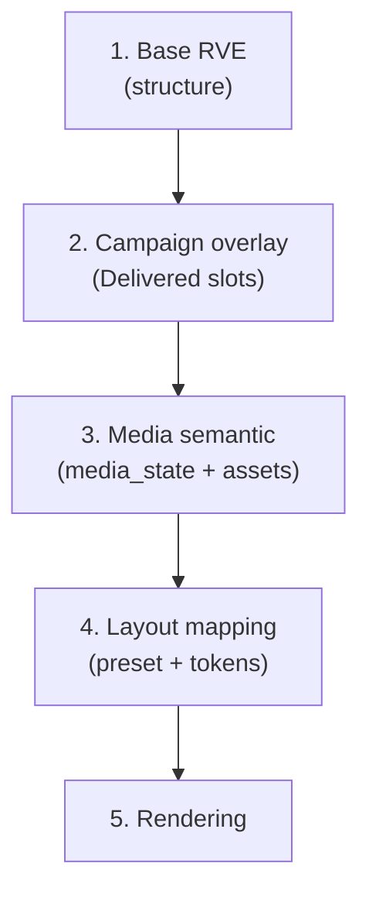

# Viewer Composition Contract

**Phase:** 1b.2 — Viewer Composition (architecture only)  
**Status:** Normative architecture (no implementation)  
**Version:** `1.0.0`  
**Project:** ReelForge / Smart Production Studio  
**Prerequisites:** [`RESOLVED_VIEWER_EXPERIENCE_CONTRACT.md`](./RESOLVED_VIEWER_EXPERIENCE_CONTRACT.md), [`RESOLVED_VIEWER_EXPERIENCE_SCHEMA.md`](./RESOLVED_VIEWER_EXPERIENCE_SCHEMA.md), [`CAMPAIGN_AND_SLOT_INJECTION_ARCHITECTURE.md`](./CAMPAIGN_AND_SLOT_INJECTION_ARCHITECTURE.md), [`MEDIA_REPRESENTATION_CONTRACT.md`](./MEDIA_REPRESENTATION_CONTRACT.md), [`MEDIA_INVENTORY_AND_PLACEHOLDER_ARCHITECTURE.md`](./MEDIA_INVENTORY_AND_PLACEHOLDER_ARCHITECTURE.md), [`EXPERIENCE_GOVERNANCE_CONTRACT.md`](./EXPERIENCE_GOVERNANCE_CONTRACT.md)

**Scope:** Viewer input contract, rendering invariants, composition priority, surface/slot binding, media and campaign rules, fallback hierarchy, determinism, extension boundaries, and contradiction analysis. This document does **not** define Svelte components, HTTP clients, JSON Schema amendments, resolver/CSPP code, or thumbnail orchestrator implementation.

**Explicit non-goals (Phase 1b.2):** Studio UI, resolve API changes, campaign enforcement, recommendation ranking algorithms, asset ingestion, paywall enforcement, A/B testing, client-side merge of experience tables.

---

## Table of Contents

1. [Purpose and Position in the Pipeline](#1-purpose-and-position-in-the-pipeline)
2. [Viewer Input Contract](#2-viewer-input-contract)
3. [Rendering Invariants](#3-rendering-invariants)
4. [Composition Priority Model](#4-composition-priority-model)
5. [Slot Rendering Contract by Surface](#5-slot-rendering-contract-by-surface)
6. [Media Binding Rules](#6-media-binding-rules)
7. [Campaign Rendering Rules](#7-campaign-rendering-rules)
8. [Fallback Hierarchy](#8-fallback-hierarchy)
9. [Determinism Requirement](#9-determinism-requirement)
10. [Extension Points](#10-extension-points)
11. [Contradiction Analysis](#11-contradiction-analysis)
12. [Phase 2 Implementation Checklist](#12-phase-2-implementation-checklist)

---

## 1. Purpose and Position in the Pipeline

The Viewer is the **terminal presentation layer** of the experience stack. All configuration merge, campaign injection, and schema validation occur **before** the Viewer runs. The Viewer **composes** a render plan from frozen RVE inputs and **binds** externally materialized assets — it does not **resolve** experience configuration.

| Upstream | Downstream of Viewer |
|----------|----------------------|
| `GET /api/experience/resolve` (or equivalent cache) supplies Base + Delivered pair | DOM / native UI tree only |
| Media pipeline supplies asset handles keyed by opaque refs | No writes to experience tables |

This contract implements governance **G3** (Viewer consumes only) and RVE **S1** (RVE-only experience data) for the production render path.

---

## 2. Viewer Input Contract

### 2.1 Sole inputs

The Viewer **must** accept exactly two logical documents per render invocation:

| Input | Role | Authority |
|-------|------|-----------|
| **Base RVE** | Structural experience truth from composition kernel | **Authoritative** for §8.1–8.7, §8.10–8.11 (see §2.2) |
| **Delivered RVE** | Validated post-CSPP document (`validate_rve` passed) | **Authoritative** for `campaigns[]`, enriched `slots[]`, campaign-related `provenance`, and future `media` block |

No other inputs may influence **experience composition** (layout, visibility, labels, campaign eligibility, media classification). The Viewer **must not** read `experience_profile_*`, `platform_campaigns`, `experience_slot_assignments`, or any other experience database table.

### 2.2 Structural section authority (Base RVE)

The following paths are read **only** from Base RVE in production render:

| Section | Paths (conceptual) |
|---------|-------------------|
| Context | `resolve_context`, `schema_version` |
| Layout | `layout` (including `preset_key`, `definition`) |
| Theme | `theme` |
| Labels | `labels` |
| Metadata | `metadata` |
| Visibility | `visibility` (hero, panels, intersection results) |
| Monetization presentation | `monetization_presentation` |
| Watch features | `watch_features` |
| Non-campaign provenance | `provenance` leaves not under `campaigns[]` / campaign-bound `slots[]` |

**Invariant VC-STRUCT-1:** For each path in §2.2, `delivered_rve.<path>` **must** equal `base_rve.<path>` when both documents are produced by the canonical pipeline. If they differ, the Viewer **must** use Base RVE for that path and **must not** treat Delivered as authoritative for structure (see §8.3).

### 2.3 Overlay section authority (Delivered RVE)

| Section | Source |
|---------|--------|
| `campaigns[]` | Delivered RVE only |
| `slots[]` (enriched fields: `status`, `campaign_id`, `content_ref`, `zone_hint`) | Delivered RVE only |
| `extensions.custom_slots` | Delivered RVE (after CSPP merge order) |
| `media` (future) | Delivered RVE only (semantic fields) |
| Campaign `provenance` entries | Delivered RVE only (optional for render; required for Studio debug) |

Base RVE carries `campaigns: []` and structural slot rows; the Viewer **must not** use Base `campaigns[]` or Base slot enrichment for overlay rendering.

### 2.4 Input pairing and validation

| Rule ID | Rule |
|---------|------|
| **IN-01** | Both documents must share the same `resolve_context.episode_id` (or equivalent primary context key). Mismatch → abort render with diagnostic (non-production); production may no-op surface. |
| **IN-02** | Delivered RVE must have passed server-side `validate_rve` before handoff. Viewer does not re-run JSON Schema in production hot path unless operating in strict debug mode. |
| **IN-03** | Viewer input adapter may receive a single HTTP body plus a side-channel Base snapshot from resolve pipeline; architecturally this is still the **pair** `(base_rve, delivered_rve)`. |
| **IN-04** | Cached Delivered RVE without paired Base is **invalid** for production Viewer composition. |

### 2.5 Forbidden inputs

| Forbidden | Reason |
|-----------|--------|
| Raw DB rows | RVE S5, governance G3 |
| Client-computed merge of profiles | Violates G1 |
| `platform_hero_config` URLs | Legacy; not RVE |
| Episode synopsis / cast for art selection | Media contract AP-M06 |
| Client clock for campaign activation | CSPP already evaluated windows |
| v1 absolute `url` / `thumbnailUrl` inside RVE JSON | NC-105 / media contract |

---

## 3. Rendering Invariants

The Viewer is a **pure renderer**: it maps frozen inputs to a render tree. It is **not** a resolver, injector, or governance actor.

### 3.1 Pure renderer definition

| Allowed (mechanical) | Forbidden (resolution) |
|----------------------|-------------------------|
| Read boolean gates (`effective_visible`, `watch_features.*`) | Recompute visibility intersection |
| Map `layout.preset_key` + `definition` to region tree | Alter `layout.definition` geometry |
| Map `theme.tokens` to style tokens | Merge theme from platform tables |
| Select **presentation tier** from `media_state` enum (lookup table) | Re-evaluate M1–M4 media rules |
| Bind orchestrator-supplied asset handle to `media_reference` | Parse `media_reference` as URL or path |
| Place slot overlay in `zone_hint` | Re-run campaign priority or collision (§6 CSPP) |
| Ignore unknown `extensions` namespaces | Apply unknown extension as override |
| Skip invalid campaign/slot safely | Fail entire page on bad campaign row |

### 3.2 No mutation

| Rule ID | Rule |
|---------|------|
| **RI-01** | Viewer **must not** mutate Base RVE, Delivered RVE, or any input object (including in-memory copy-on-write for “fixes”). |
| **RI-02** | Viewer **must not** persist derived merge results back to Studio or resolve APIs. |
| **RI-03** | Viewer **must not** emit writes to experience tables during render. |

### 3.3 No resolution logic

**Resolution** means any operation that **changes** which configuration wins across hierarchy layers, time, or campaign competition. The following are **resolution** and **forbidden** in the Viewer:

- Profile version selection (RVE §5.2)
- Metadata scope-upward merge (RDR-110–112)
- Slot deduplication last-wins (RDR-122)
- Campaign priority / collision groups (CSPP §6)
- Campaign `start_date` / `end_date` evaluation
- Inventory `READY` checks for `REAL_MEDIA`
- Thumbnail ladder H1–H4 / V1–V4 / T1–T4 / C1–C4 (media inventory §4)

### 3.4 No structural override via campaigns or extensions

RVE **S4** applies verbatim: `campaigns` and `slots` are informational overlays. Extensions under `extensions.*` are **ignored** unless explicitly implemented in a Viewer version that documents support; they **must not** override §2.2 paths.

### 3.5 Presentation vs enforcement

| Topic | Viewer behavior |
|-------|-----------------|
| `monetization_presentation` | Style only (CTA appearance) |
| `enforce_paywall` (if present on wire) | **Not** enforced in Viewer; access control is external |
| `watch_features.*` | Gates **whether** a region may render; does not fetch watch APIs inside composition |

---

## 4. Composition Priority Model

Composition is the **ordered application** of read-only layers to build a `CompositionPlan` (conceptual intermediate, not a wire format). Order is **fixed**; later layers may only affect **presentation** within regions already admitted by earlier layers.

| Step | Layer | Input source | Effect |
|------|-------|--------------|--------|
| **1** | **Base RVE substrate** | Base RVE §2.2 | Admit regions: layout regions, panel visibility, labels, theme, watch-feature gates |
| **2** | **Campaign overlay** | Delivered `campaigns[]`, `slots[]` | Attach promo overlays to admitted regions; never admit hidden regions |
| **3** | **Media semantic state** | Delivered `media` (future) + per-surface orchestrator bundle | Classify presentation tier per surface; bind handles |
| **4** | **Layout mapping** | Base `layout` + `theme` | Map regions → components; apply `zone_hint` placement |
| **5** | **Rendering** | CompositionPlan + materialized assets | Emit UI tree (pixels, a11y, motion) |

### 4.1 Layer interaction rules

| Rule ID | Rule |
|---------|------|
| **CP-01** | Step 1 is a **hard gate**: if `visibility.panels.<id>.effective_visible` is `false`, steps 2–5 **must not** render that panel’s content (slots included). |
| **CP-02** | Step 2 **cannot** promote a panel to visible. |
| **CP-03** | Step 3 uses **semantic** fields only; asset bytes come from orchestrator output keyed by `media_reference` / slot `content_ref` handles — not from Viewer URL construction. |
| **CP-04** | Step 4 never changes step 1 admission set; only positions admitted overlays and children. |
| **CP-05** | Hero `visibility.hero.mode` = `OFF` suppresses hero **media and slot** regardless of slot `status`. |

### 4.2 Relation to media inventory ladders

Media inventory §4 ladders (H1–H4, etc.) execute in **`thumbnail_orchestrator`** and theater pipeline **before** Viewer step 3. The Viewer receives **already classified** `media_state` (episode-level, future RVE) and **per-surface materialized handles**. The Viewer **maps** `media_state` → presentation tier; it does **not** walk inventory tables.

Campaign slot precedence (**GR-03**) is applied in orchestrator binding: active `hero_promo` `content_ref` wins over generic hero placeholder in the asset bundle. The Viewer consumes the **outcome** of that binding in step 3, not the ladder logic itself.

---

## 5. Slot Rendering Contract by Surface

Viewer surfaces are **logical render targets** aligned with RVE layout panels and standard `slot_key` values. Surface names here are **contract IDs**, not component file names.

### 5.1 Surface registry

| Surface ID | RVE panel / zone | Standard `slot_key`(s) | `watch_features` gate |
|------------|------------------|-------------------------|------------------------|
| **HERO** | `visibility.panels.hero`, `visibility.hero.*` | `hero_promo` | — |
| **CARD** | Shelf / vault tile regions in `layout.definition` | `shelf_featured`, `shelf_badge` | — |
| **THEATER** | Theater / player chrome panel | `theater_overlay` | — |
| **CONTINUE_WATCHING** | `visibility.panels.continue_watching` | *(none standard)* — row content from watch API + episode context | `continue_watching_enabled` |

**CARD** covers any tile-style shelf presentation governed by blueprint shelf zones, including featured rows and per-tile badges.

### 5.2 HERO surface

| Category | Allowed | Forbidden |
|----------|---------|-----------|
| **Read** | `visibility.hero.enabled`, `visibility.hero.mode`, `visibility.panels.hero.effective_visible`, `layout.definition` hero zones, `theme.tokens.hero_surface`, Delivered `slots[]` where `slot_key = hero_promo` and `status = active` | — |
| **Overlay** | Render promo chrome in `zone_hint` when panel visible and mode ≠ `OFF` | — |
| **Override** | — | Change `visibility.hero.mode` or `enabled`; resize hero geometry; fetch image URL by parsing `content_ref`; hide hero when `effective_visible: false` but force slot visible |
| **Campaign** | Display campaign name/type from bound `campaign_id` lookup in `campaigns[]` as **label/badge only** | Use campaign to enable hero when panel hidden |

### 5.3 CARD surface

| Category | Allowed | Forbidden |
|----------|---------|-----------|
| **Read** | Shelf order from `layout.definition.shelf_order`, panel visibility for parent shelf, `shelf_featured` (row-level), `shelf_badge` (tile-level), `card_style` theme token | — |
| **Overlay** | Featured row highlight from `shelf_featured`; corner badge from `shelf_badge` | Reorder shelf from `extensions.future_recommendation_modules.shelf_hints` in Phase 2 base contract (see §10.3) |
| **Override** | — | Insert tiles not in layout; override `effective_visible`; merge campaign `content_ref` into tile playback URL |
| **Campaign** | Badge and featured strip metadata only | Replace episode tile identity with campaign target unless `content_ref` explicitly carries series/episode id for navigation (navigation is app routing, not layout override) |

### 5.4 THEATER surface

| Category | Allowed | Forbidden |
|----------|---------|-----------|
| **Read** | Theater panel visibility, `theater_overlay` slot, `theme.tokens.overlay_style`, episode `media_state` for playback tier | — |
| **Overlay** | Premiere / CTA overlay in player chrome per `zone_hint` | — |
| **Override** | — | Override stream selection; inject alternate `playback_url` from campaign; disable theater when slot active |
| **Campaign** | Overlay graphics and CTA copy refs | Any structural change to theater layout or DRM gates |

### 5.5 CONTINUE_WATCHING surface

| Category | Allowed | Forbidden |
|----------|---------|-----------|
| **Read** | `watch_features.continue_watching_enabled`, `visibility.panels.continue_watching.effective_visible`, row `media_state` per item (from watch payload + episode media, future) | — |
| **Overlay** | — | Standard campaign slots on this row in v1 (no `slot_key` assigned) |
| **Override** | — | Render row when gate false; fabricate progress |
| **Media** | Bind tile thumb from orchestrator per media inventory §4.5 | Run C1–C4 ladder inside Viewer |

When the gate is false, the surface is **omitted** (not collapsed to placeholder).

### 5.6 Slot row eligibility (all surfaces)

| Condition | Viewer action |
|-----------|---------------|
| `slots[].status !== active` | Do not render slot overlay |
| `campaign_id` set but id ∉ `campaigns[]` | Treat as invalid campaign → ignore slot overlay (§8.3) |
| `slot_key` not mapped to surface | Ignore slot |
| Panel not admitted in step 1 | Ignore slot even if `status = active` |
| `content_ref` missing or malformed | Fall back to layout default for that zone (§8.2) |

### 5.7 Custom slots

`extensions.custom_slots.slots` with `custom.<name>` follow the same allowed/forbidden matrix as **CARD** or **HERO** based on `zone_hint` parent panel. Custom slots **must not** override standard keys (RVE §9.2).

---

## 6. Media Binding Rules

### 6.1 Semantic fields only (RVE)

When the `media` section exists on Delivered RVE, the Viewer **may read only**:

| Field | Use |
|-------|-----|
| `media_state` | Select presentation tier (§6.2) |
| `media_intent` | Select placeholder **family** (theme/layout table) |
| `media_reference` | Opaque handle for orchestrator lookup |
| `media_placeholder_policy` (optional) | Interpret allowed placeholder tier when `media_state` is `PLACEHOLDER_MEDIA` |

### 6.2 Presentation tier mapping (mechanical)

| `media_state` | Viewer presentation tier | Asset source |
|---------------|--------------------------|--------------|
| `REAL_MEDIA` | Real | Orchestrator bundle required |
| `DERIVED_MEDIA` | Derived | Orchestrator bundle required |
| `PLACEHOLDER_MEDIA` | Placeholder | Theme + layout tokens only |
| `FALLBACK_MEDIA` | Fallback | Platform default bundle |

The Viewer **must not** branch on inventory DB state, MIME type, or file extension.

### 6.3 URL and asset construction

| Rule ID | Rule |
|---------|------|
| **MB-01** | Viewer **must not** construct CDN URLs, signed URLs, or file paths from `media_reference`. |
| **MB-02** | Viewer **must not** construct URLs from `slots[].content_ref`. |
| **MB-03** | Viewer requests assets only via **MaterializedAssetBundle** (conceptual): map `opaque_ref → ready-to-display handle` produced by `thumbnail_orchestrator` / theater pipeline. |
| **MB-04** | Missing bundle entry for required real/derived tier → apply §8.1 (missing media), not inline URL guess. |
| **MB-05** | `media_intent` informs placeholder variant selection from **static tables** keyed by intent + `theme.tokens`; no content-specific art. |

### 6.4 Per-surface media binding

| Surface | Primary semantic context | Bundle key |
|---------|---------------------------|------------|
| HERO | Episode-level `media` + hero surface id | Episode `media_reference` + slot `content_ref` image key if overlay |
| CARD | Per-tile context (reel / episode id) | Per-tile ref from catalog row |
| THEATER | Episode playback | Theater pipeline handle |
| CONTINUE_WATCHING | Per progress row episode | Row episode ref |

Episode-level `media_state` in RVE may differ from per-tile thumbnail class (MI-02 in media inventory). Viewer uses **per-surface bundle entry** for tiles and **episode `media`** for hero/theater defaults.

### 6.5 Campaign vs media

Campaign overlays **do not** change `media_state`. Slot imagery is an **overlay layer** (step 2) above media tier (step 3). Orchestrator applies **GR-03** before handoff; Viewer does not re-arbitrate.

---

## 7. Campaign Rendering Rules

### 7.1 Presentation-only overlays

| Rule ID | Rule |
|---------|------|
| **CR-01** | `campaigns[]` provides **display metadata** (name, type, optional badge text). No campaign field alters §2.2 structure. |
| **CR-02** | Campaign graphics render only through **active** `slots[]` with valid `content_ref` + materialized asset. |
| **CR-03** | Viewer **must not** sort, filter, or re-prioritize `campaigns[]` for production UI. CSPP already resolved winners per collision group. |
| **CR-04** | Viewer **must not** evaluate `start_date`, `end_date`, or targeting fields. |
| **CR-05** | Multiple entries in `campaigns[]` without a winning slot binding produce **no** extra UI unless Studio debug mode lists them. |

### 7.2 Forbidden campaign overrides

| Forbidden | RVE / governance basis |
|-----------|------------------------|
| Override `layout.*` | S4, NC-105 |
| Override `visibility.*` | S4 |
| Override `labels.*` or `metadata.*` | S4 |
| Override `theme.*` globally | S4; local overlay styles must come from `theme.tokens` + slot zone |
| Inject `playback_url` | NC-105 |
| Change `watch_features` | G3 |
| Set `media_state` | Media contract §4 |

### 7.3 Safe ignore semantics

Invalid or stale campaign data **must not** throw in production render (see §8.3). Debug builds may surface warnings.

---

## 8. Fallback Hierarchy

Fallbacks are **deterministic degradations** within an admitted region. They are **not** a second resolution pass.

### 8.1 Missing media (orchestrator bundle miss)

| Order | Condition | Action |
|-------|-----------|--------|
| F1 | `media_state` is `REAL_MEDIA` or `DERIVED_MEDIA` and bundle has handle | Render handle |
| F2 | `media_state` is `PLACEHOLDER_MEDIA` | Render theme/layout placeholder for `media_intent` |
| F3 | `media_state` is `FALLBACK_MEDIA` or F1 failed | Render platform fallback asset |
| F4 | All above fail | Render empty region with layout-safe skeleton (no URL construction) |

Viewer **must not** promote to `REAL_MEDIA` based on client-side heuristics.

### 8.2 Missing or inactive slot

| Order | Condition | Action |
|-------|-----------|--------|
| S1 | Active slot with materialized `content_ref` | Render overlay |
| S2 | Active slot, no asset | Render layout default for `zone_hint` (no promo) |
| S3 | Inactive / missing slot | Layout default only |

Layout default means: blueprint panel content without promo chrome.

### 8.3 Invalid campaign

| Condition | Action |
|-----------|--------|
| `campaign_id` not in `campaigns[]` | Ignore campaign binding; S2/S3 |
| Unknown `campaign_type` | Ignore type styling; render neutral badge if slot otherwise valid |
| NC-105 forbidden keys present on campaign object | Ignore entire campaign row; S2/S3 |
| `delivered` structural path ≠ `base` | Use Base for path; log diagnostic |

### 8.4 Structural mismatch (Base vs Delivered)

Production policy: **Base wins** for §2.2. Delivered-only drift is treated as pipeline defect, not Viewer merge opportunity.

### 8.5 Hero mode interaction

| `visibility.hero.mode` | Fallback |
|------------------------|----------|
| `OFF` | No hero media, no `hero_promo` (surface skipped) |
| `STATIC_IMAGE` | Image tiers only; video bundle entries ignored |
| `STATIC_VIDEO` / carousel modes | Per contract §8.7 carousel rules; missing slide → F3 for that slide index |

---

## 9. Determinism Requirement

### 9.1 Pure function statement

> **DET-1:** For fixed inputs `(base_rve, delivered_rve, materialized_asset_bundle, viewer_version)`, the Viewer composition output `CompositionPlan` and region admission set are **identical** across invocations on the same platform.

| Input | Counted in determinism? |
|-------|-------------------------|
| `base_rve` | Yes |
| `delivered_rve` | Yes |
| `materialized_asset_bundle` | Yes (opaque map; stable ordering by ref key) |
| `viewer_version` | Yes (composition tables versioned) |
| Wall clock | **No** |
| Random UUID generation | **No** (ids in output must come from RVE or bundle) |
| Network fetch beyond bundle | **No** in composition phase |

### 9.2 Corollaries

| ID | Statement |
|----|-----------|
| **DET-2** | Two Viewers with the same `viewer_version` and inputs produce byte-identical `CompositionPlan` JSON if serialized. |
| **DET-3** | Non-deterministic animation timing belongs in **rendering** step 5 only if driven by `extensions.future_animation_layer` with explicit seed or disabled in v1. |
| **DET-4** | Viewer output does not feed back into resolve or CSPP. |

### 9.3 Relation to Delivered-only phrasing

Downstream docs sometimes say “Viewer consumes Delivered RVE.” This contract refines that: **Delivered RVE is necessary but not sufficient**; **Base RVE is required** for structural determinism and RP-1 alignment (campaign purity). Functionally: `compose_viewer(base, delivered, bundle) → plan`.

---

## 10. Extension Points

Extensions live under Delivered RVE `extensions`. Unsupported namespaces are **ignored** (RVE §3.4).

### 10.1 `extensions.future_interactive_overlays`

| Field (conceptual) | Role |
|--------------------|------|
| `overlays[]` | Clickable hotspots, polls, shop CTAs above admitted regions |

| Rule | Detail |
|------|--------|
| Admission | Requires panel already visible in step 1 |
| Purity | Must not mutate Base or Delivered structural sections |
| Precedence | Runs **after** campaign overlay (step 2b); before media binding |
| Campaign | Must not share `slot_key` with standard keys without precedence doc |

### 10.2 `extensions.future_animation_layer`

| Field (conceptual) | Role |
|--------------------|------|
| `animations[]` | Motion profiles per `zone_hint` or panel |

| Rule | Detail |
|------|--------|
| Step | Applies in **rendering** (step 5) only |
| Determinism | Must use explicit `seed` or `reduce_motion` gate from RVE theme flags when added |
| Override | Must not change layout geometry or visibility |

### 10.3 `extensions.future_recommendation_surfaces`

| Field (conceptual) | Role |
|--------------------|------|
| `engine_id`, `shelf_hints` | Non-binding ordering hints (RVE §9.4) |

| Rule | Detail |
|------|--------|
| Phase 2 base | **Ignored** for ordering unless a future amendment enables `recommendations_enabled` + explicit Viewer feature flag |
| Surface | Maps to **CARD** / recommendations panel when visible |
| Purity | Hints must not override `layout.definition.shelf_order` in v1 Viewer |

### 10.4 Existing RVE extensions (reference)

| Namespace | Viewer v1 behavior |
|-----------|-------------------|
| `future_ad_modules` | Ignore `placements` until ad Viewer spec |
| `future_recommendation_modules` | Same as §10.3 |
| `custom_metadata` | Ignore in production render |
| `custom_slots` | Render per §5.7 |

---

## 11. Contradiction Analysis

| ID | Source A | Source B | Conflict | Resolution (1b.2) |
|----|----------|----------|----------|-------------------|
| **VC-01** | Campaign arch §4.4: Viewer consumes **Delivered only** | This contract: **Base + Delivered** | Input cardinality | **Refined:** Delivered alone is insufficient for structural authority; pair required. Delivered remains the campaign/media overlay source. Update campaign arch in a future doc pass (non-blocking). |
| **VC-02** | RVE S1: “Viewer consumes RVE only” | Base + Delivered pair | Two documents? | **Harmonized:** Pair is a **pipeline derivative**, not a second compose. Still no DB. S1 satisfied. |
| **VC-03** | Governance G3: resolved output only | Base RVE not served to Viewer today (single HTTP body) | Transport | **Implementation note:** API may return Delivered only if Base is embedded (`_base_rve`) or cached server-side with same cache key. Contract requires logical pair before Viewer. |
| **VC-04** | Media inventory §4: ladders in orchestrator | Viewer step 3 “media semantic” | Who runs H1–H4? | **Aligned:** Viewer maps `media_state` only; orchestrator runs ladders (GR-04). |
| **VC-05** | Media contract §5.3: campaign `content_ref` forbidden as placeholder input | GR-03 slot precedence | Placeholder vs slot | **Aligned:** Orchestrator applies GR-03; Viewer binds bundle outcome. Viewer never uses `content_ref` for placeholder **selection**. |
| **VC-06** | Schema: no `media` block in `1.0.0` JSON Schema | §6 requires semantic media fields | Wire gap | **Deferred:** Phase 2 Viewer uses bundle-only binding until schema amendment; contract rules apply when `media` ships. |
| **VC-07** | Campaign arch: Viewer **may** sort `campaigns[]` for debug | CR-03 forbids production sort | Debug vs prod | **Split:** Debug Studio preview may sort; production Viewer must not. |
| **VC-08** | `extensions.future_recommendation_modules` in RVE §9.4 | §10.3 ignores hints in v1 | Ordering | **Explicit:** v1 Viewer ignores hints; amendment required to enable. |
| **VC-09** | NC-105 on campaign objects | §8.3 ignore invalid campaign | Validation location | **Aligned:** Server `validate_rve` primary; Viewer safe-ignore is last resort. |
| **VC-10** | Governance G1: sole composer `experience_resolve.rs` | Viewer reads Base for structure | Authority split | **Aligned:** Viewer does not compose RVE; reads pre-composed Base. G1 unchanged. |

**Verdict:** No blocker for Phase 2 **architecture**. Transport shape for Base+Delivered is an implementation detail (VC-03).

---

## 12. Phase 2 Implementation Checklist

Architecture-only phase delivers this document. Before Viewer.svelte (or equivalent) merge:

| # | Check |
|---|-------|
| 1 | Input adapter supplies `(base_rve, delivered_rve)` per §2 |
| 2 | Structural paths read from Base only |
| 3 | No DB / merge / campaign time logic in Viewer |
| 4 | Composition order §4 enforced |
| 5 | Surface rules §5 for HERO, CARD, THEATER, CONTINUE_WATCHING |
| 6 | Media binding §6 via orchestrator bundle only |
| 7 | DET-1 tested with golden `CompositionPlan` fixtures |
| 8 | Invalid campaign / slot safe-ignore §8.3 |
| 9 | Extensions ignored unless explicitly versioned |
| 10 | Governance G3 sign-off |

---

## References

| Document | Relevance |
|----------|-----------|
| [`CAMPAIGN_AND_SLOT_INJECTION_ARCHITECTURE.md`](./CAMPAIGN_AND_SLOT_INJECTION_ARCHITECTURE.md) | Base vs Delivered, CSPP, slots, RP-1 |
| [`MEDIA_INVENTORY_AND_PLACEHOLDER_ARCHITECTURE.md`](./MEDIA_INVENTORY_AND_PLACEHOLDER_ARCHITECTURE.md) | Surface ladders, GR-02–GR-04 |
| [`MEDIA_REPRESENTATION_CONTRACT.md`](./MEDIA_REPRESENTATION_CONTRACT.md) | Semantic media fields, consumer boundary |
| [`RESOLVED_VIEWER_EXPERIENCE_SCHEMA.md`](./RESOLVED_VIEWER_EXPERIENCE_SCHEMA.md) | NC-105, enums, extensions |
| [`EXPERIENCE_GOVERNANCE_CONTRACT.md`](./EXPERIENCE_GOVERNANCE_CONTRACT.md) | G1, G3, preview isolation |
| [`RESOLVED_VIEWER_EXPERIENCE_CONTRACT.md`](./RESOLVED_VIEWER_EXPERIENCE_CONTRACT.md) | S1, S4, §8.7–8.9 |

---

*End of Phase 1b.2 architecture document.*
