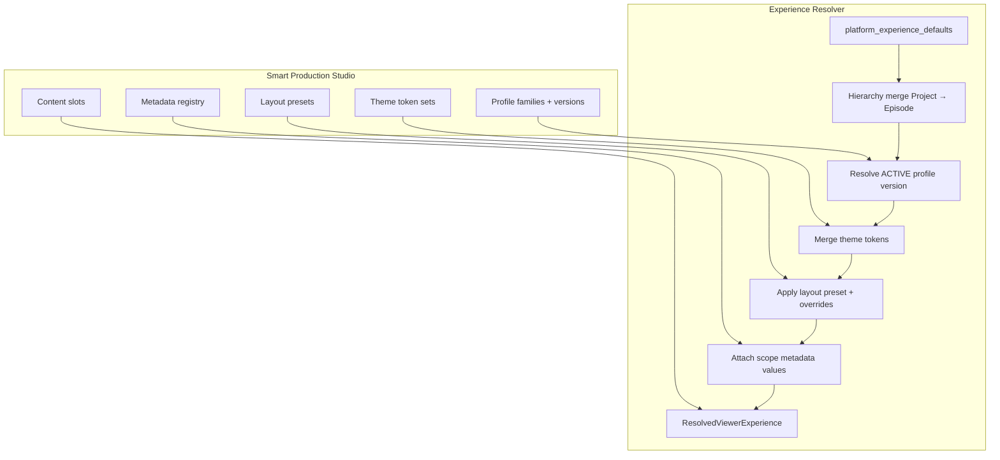
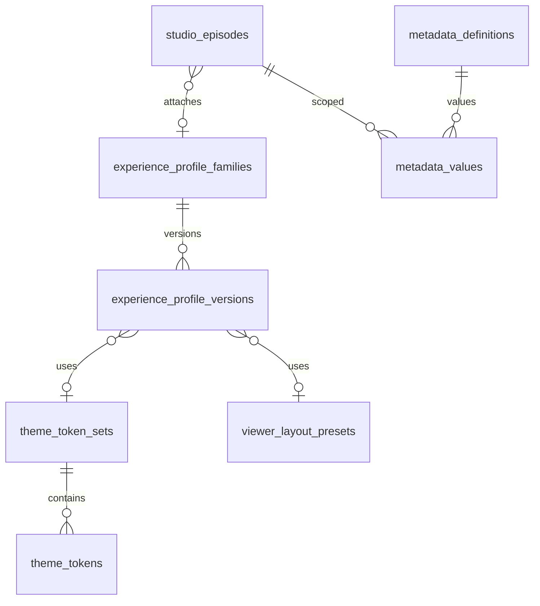

# Viewer Experience Layer — Architecture Report (Amendment v2)

**Status:** Architecture refinement — **approved in principle; amendments incorporated — implementation blocked**  
**Revision:** 2026-06-03 — Amendments 1–4 + Profile Deletion Policy  
**Project:** ReelForge / Smart Production Studio  
**Prerequisite:** Phase B Studio Hierarchy operational (`Project → Series → Season → Episode → Reel`)  
**Core principle:** `Viewer Experience = Resolved Configuration + Metadata`, not hardcoded Svelte/Rust logic.

**Constraints (unchanged):** No implementation code. No migrations. No source file edits. Architecture only.

---

## Table of Contents

1. [Architecture Report](#1-architecture-report)
2. [Database Schema Proposal](#2-database-schema-proposal)
3. [API Proposal](#3-api-proposal)
4. [Feature Flag Strategy](#4-feature-flag-strategy)
5. [Rollback Plan](#5-rollback-plan)
6. [File Modification Map](#6-file-modification-map)
7. [Risk Assessment](#7-risk-assessment)
8. [Migration Order](#8-migration-order)
9. [Recommendations](#9-recommendations)

---

## 1. Architecture Report

### 1.1 Executive summary

Smart Production Studio becomes a **fully configurable control center** for viewer experiences. Configuration flows through five cooperating subsystems:

| Subsystem | Purpose | Phase 1 |
|-----------|---------|---------|
| **Experience Profiles** (versioned) | Labels, hero, components, monetization presentation | Schema + APIs |
| **Theme Token Sets** | Semantic branding surfaces (no hardcoded colors in app) | Schema + APIs |
| **Viewer Layout Presets** | Panel arrangement & placement strategies | Schema + APIs |
| **Metadata Registry** | Admin-defined fields without migrations | Schema + APIs |
| **Content Slots** | Promotional regions | Schema + APIs |

All subsystems resolve server-side into `ResolvedViewerExperience`. **No Viewer, theme CSS, or playback changes** until a separately approved Phase 2.



### 1.2 Problem statement

| Source | Limitation |
|--------|------------|
| `Viewer.svelte` | Hardcoded hero, labels, layout (~3.6k LOC) |
| `platform_hero_config` | Global only; not versioned |
| No profile versioning | Cannot safely publish, rollback, or compare experiences |
| No theme abstraction | Branding would require code/CSS edits |
| No layout presets | Each experience style needs custom branches |
| Fixed schema fields | Creator-specific metadata requires migrations |

### 1.3 Inheritance model (configuration merge)

**Order:** platform defaults → project → series → season → episode (child overrides parent).

At each hierarchy level the resolver loads:

1. **Profile attachment** → ACTIVE version of pinned or latest family (see §1.4)
2. **Theme token set** from profile (nullable → inherit)
3. **Layout preset** from profile (nullable → inherit platform default preset)
4. **Metadata values** merged scope-upward (episode values override series, etc.)

Only **non-NULL** profile override fields apply during merge.

### 1.4 Amendment 1 — Experience Profile Versioning

#### 1.4.1 Concepts

| Concept | Description |
|---------|-------------|
| **Profile family** | Stable logical identity (`profile_family_id`) — e.g. “Micro Drama Premium” |
| **Profile version row** | Immutable snapshot row per `version` integer under a family |
| **ACTIVE version** | At most one per family; used by default resolution |
| **DRAFT version** | Editable working copy; not visible to Viewer resolve |
| **ARCHIVED version** | Historical; retained for audit, compare, restore |

#### 1.4.2 Version lineage

```
profile_family_id (stable UUID, never changes for a logical profile)
  ├── version 1  ACTIVE   published_at=T1  created_from_profile_id=NULL
  ├── version 2  DRAFT    (editing)
  └── version 3  ARCHIVED  created_from_profile_id=version_1.id  (after rollback archive)
```

**Lineage tracking:**

- `created_from_profile_id` → UUID of the **source version row** cloned from (not family id).
- `profile_family_id` → groups all versions; Studio UI lists versions by family.
- Optional `changelog` TEXT on version row for human publish notes (implementation detail).

**Clone workflow:** `POST .../profiles/{id}/clone` creates new DRAFT row: same `profile_family_id`, `version = max(version)+1`, `created_from_profile_id = source.id`, copies all config fields.

**Publish workflow:** `POST .../profiles/{id}/publish`

1. Validate DRAFT row.
2. Set previous ACTIVE in same family → `ARCHIVED`, clear its exclusive lock.
3. Set target row → `ACTIVE`, `published_at = now()`.
4. Enforce `UNIQUE (profile_family_id) WHERE status = 'ACTIVE'` (partial unique index).

**Profile rollback (Studio):**

- **Soft rollback:** Publish a **restored clone** — clone from archived version N, publish → becomes new ACTIVE (old ACTIVE archived). Full audit trail preserved. **Recommended.**
- **Hard pointer rollback (optional):** Re-activate archived row — only if no schema drift; discouraged because mutates history. Use clone+publish instead.

#### 1.4.3 Attachment pinning — recommendation

Hierarchy tables store attachment to a **profile family**, not a specific version row:

| Column | Type | Semantics |
|--------|------|-----------|
| `experience_profile_family_id` | UUID | Which logical profile to use |
| `experience_profile_pin_version` | BOOLEAN DEFAULT false | When true, pin to specific version |
| `experience_profile_version_id` | UUID NULL | Required when `pin_version=true` |

**Default (recommended):** `pin_version = false` → resolver uses **latest ACTIVE** version for `experience_profile_family_id`.

**Pinned:** `pin_version = true` + `experience_profile_version_id` → resolver uses exact version (even if ARCHIVED — Studio warning) for broadcast stability (live events, locked campaigns).

| Scenario | Recommendation |
|----------|----------------|
| Most series / seasons | **Latest ACTIVE** (auto-upgrade on publish) |
| Locked premiere / compliance | **Pinned version** |
| After profile publish | Unpinned attachments pick up new ACTIVE automatically |
| Pinned attachments | Unchanged until admin updates pin |

#### 1.4.4 Studio capabilities (versioning)

| Action | API (proposed) | Effect |
|--------|----------------|--------|
| Clone | `POST /profiles/{version_id}/clone` | New DRAFT in same family |
| Publish | `POST /profiles/{version_id}/publish` | DRAFT→ACTIVE, demote prior ACTIVE |
| Archive | `POST /profiles/{version_id}/archive` | ACTIVE/DRAFT→ARCHIVED (if not referenced as pin) |
| Restore | `POST /profiles/{version_id}/restore` | ARCHIVED→DRAFT clone (preferred) or DRAFT promotion |
| Compare | `GET /profiles/compare?v1=&v2=` | Field-level diff JSON |

### 1.5 Amendment 2 — Theme Token System

#### 1.5.1 Objective

Replace hardcoded branding with **semantic token sets**. Viewer Phase 2 maps tokens → CSS variables; Phase 1 stores and resolves tokens only.

#### 1.5.2 Structure

| Entity | Role |
|--------|------|
| `theme_token_sets` | Named collection — “Default ReelForge”, “Documentary”, etc. |
| `theme_tokens` | Rows: `(set_id, token_key, token_value)` |

**Standard token keys (extensible):**

| Token key | Semantics (Phase 2 mapping) |
|-----------|----------------------------|
| `hero_surface` | Hero background treatment |
| `panel_surface` | Side panels / shelves |
| `accent_surface` | Highlights, progress, focus |
| `typography_style` | Font stack reference id |
| `button_style` | Primary CTA shape treatment |
| `card_style` | Thumbnail / tile treatment |
| `overlay_style` | Modals, paywall presentation shell |

`token_value` is JSONB: `{ "variant": "dark-cinema", "density": "compact" }` — not raw hex in Phase 1 (allows future design-system swap).

#### 1.5.3 Profile reference

`experience_profile_versions.theme_token_set_id` → nullable FK to `theme_token_sets`.

#### 1.5.4 Inheritance strategy

```
platform_default_theme_token_set_id  (on platform_experience_defaults)
  → overridden by profile version's theme_token_set_id (if set)
  → hierarchy merge does NOT merge token keys field-by-field; whole set replacement
```

**Resolve output includes:** `theme_tokens: { hero_surface: {...}, ... }` merged from winning profile version + platform fallback set.

**No visual changes now.** Tokens appear only in resolve JSON and Studio preview metadata.

### 1.6 Amendment 3 — Viewer Layout Presets

#### 1.6.1 Objective

Support MINIMAL, NETFLIX, REELSHORT, DOCUMENTARY, ARTIST_ACCESS, EDUCATIONAL, CUSTOM layouts without application rewrites.

#### 1.6.2 Preset definition model

`viewer_layout_presets` table stores:

| Field | Purpose |
|-------|---------|
| `preset_key` | `MINIMAL`, `NETFLIX`, `REELSHORT`, … |
| `name` | Studio display name |
| `definition` | JSONB layout blueprint |

**`definition` structure (illustrative):**

```json
{
  "panels": {
    "hero": { "visible": true, "zone": "top" },
    "continue_watching": { "visible": true, "zone": "below_hero" },
    "recommendations": { "visible": true, "zone": "main_shelf" },
    "artist_panel": { "visible": false, "zone": "theater_sidebar" },
    "credits": { "visible": false, "zone": "theater_end" },
    "cast_panel": { "visible": false, "zone": "theater_sidebar" },
    "timeline": { "visible": false, "zone": "theater_bottom" }
  },
  "cta": { "zone": "hero_overlay" },
  "shelf_order": ["continue_watching", "recommendations", "categories"]
}
```

#### 1.6.3 Preset hierarchy & overrides

| Layer | Source |
|-------|--------|
| Platform default | `platform_experience_defaults.default_layout_preset_id` |
| Profile version | `layout_preset_id` (nullable → inherit) |
| Profile boolean flags | Override preset panel visibility — e.g. `artist_panel_enabled=false` forces panel off even if preset shows it |

**Override behavior:** Layout preset provides **baseline arrangement**; profile component toggles act as **visibility overrides** (intersection: preset.visible AND profile.enabled). Provenance records whether preset or profile disabled a panel.

#### 1.6.4 Relationship to experience profiles

| Dimension | Profile controls | Preset controls |
|-----------|------------------|-----------------|
| Labels, hero mode | ✓ | — |
| Component enable flags | ✓ | Suggested defaults |
| Spatial arrangement | — | ✓ |
| Slot regions | Slots table | Zone placement hints |

`content_format` on profile often **implies** a default `layout_preset_id` (Studio wizard); admin can override.

### 1.7 Amendment 4 — Metadata Registry

#### 1.7.1 Objective

Administrators define fields (Artist Name, Merch URL, Tour Date, …) without schema migrations.

#### 1.7.2 Storage model

| Table | Role |
|-------|------|
| `metadata_definitions` | Field schema registry |
| `metadata_values` | Values per (definition, scope_type, scope_id) |

**Definition fields:**

| Field | Example |
|-------|---------|
| `field_key` | `artist_name` (stable machine key) |
| `label` | `Artist Name` |
| `data_type` | `TEXT`, `URL`, `DATE`, `NUMBER`, `BOOLEAN`, `JSON` |
| `validation` | JSON Schema fragment |
| `scope_levels` | `['project','series','season','episode']` |
| `status` | `ACTIVE`, `ARCHIVED` |

**Value row:** `(definition_id, scope_type, scope_id, value_jsonb)`

#### 1.7.3 Validation strategy

| Stage | Validation |
|-------|------------|
| Studio write | Rust validates `value` against definition `data_type` + `validation` JSON Schema |
| Resolve read | Returns merged values; invalid legacy values flagged `validation_warning` in provenance |
| URL fields | Pattern + optional HTTPS-only policy in schema |

#### 1.7.4 Indexing strategy

| Index | Purpose |
|-------|---------|
| `UNIQUE (definition_id, scope_type, scope_id)` | One value per field per scope |
| `INDEX (scope_type, scope_id)` | Load all metadata for an episode |
| `GIN (value_jsonb)` | Optional — search merch URLs, artist names (admin Studio search) |
| `INDEX (field_key)` on definitions | Lookup by key |

#### 1.7.5 Future UI generation

Studio **dynamic forms** render from `metadata_definitions`:

1. Filter definitions where `scope_levels` contains current entity.
2. Render input by `data_type`.
3. Save to `metadata_values`.
4. Viewer Phase 2: `resolved_metadata: { artist_name: "...", merch_url: "..." }` for panels (artist panel, sidebar merch).

**No implementation now** — registry is API + schema only.

### 1.8 Profile deletion policy (mandatory)

**Normal Studio operations must never physically DELETE profile versions** referenced by hierarchy or pinned.

| Status | Meaning | Visible in resolve? |
|--------|---------|---------------------|
| `DRAFT` | Work in progress | No |
| `ACTIVE` | Published production config | Yes (if attached) |
| `ARCHIVED` | Retired, audit retained | Only if explicitly pinned |

| Operation | Allowed? |
|-----------|----------|
| Archive profile version | ✓ (if not sole ACTIVE for live pin without replacement) |
| Restore archived → new DRAFT | ✓ |
| Hard DELETE | ✗ via Studio API — **admin DB maintenance only** |
| DELETE blocked when | Any hierarchy row references `family_id` or `version_id` |

**Retention:** ARCHIVED versions kept indefinitely by default; optional `retention_policy` (future) archives families older than N years to cold storage — not Phase 1.

### 1.9 Content slots, business models, guarantees

(Slots, `content_format`, hero mapping, and non-negotiable guarantees from v1 remain valid — see §2.4, §2.5.)

| Area | Guarantee |
|------|-----------|
| `GET /api/reels` | Unchanged |
| Ingestion / theater playback | Unchanged |
| Viewer aesthetics | Unchanged until Phase 2 |
| Monetization enforcement | Not introduced |

---

## 2. Database Schema Proposal

**Proposed migrations (documentation only — do not create until implementation approved):**

| File | Contents |
|------|----------|
| `202512288_viewer_experience_layer.sql` | Core profiles (versioned), defaults, hierarchy attachments, slots |
| `202512289_experience_extensions.sql` | Theme tokens, layout presets, metadata registry |

### 2.1 `experience_profile_families`

```sql
CREATE TABLE experience_profile_families (
    id              UUID PRIMARY KEY DEFAULT gen_random_uuid(),
    name            TEXT NOT NULL,
    slug            TEXT,
    description     TEXT,
    created_at      TIMESTAMPTZ NOT NULL DEFAULT now(),
    updated_at      TIMESTAMPTZ NOT NULL DEFAULT now()
);
CREATE UNIQUE INDEX idx_profile_families_slug
    ON experience_profile_families(slug) WHERE slug IS NOT NULL AND slug <> '';
```

### 2.2 `experience_profile_versions`

Replaces monolithic `experience_profiles` from v1. Each row is one version.

```sql
CREATE TABLE experience_profile_versions (
    id                          UUID PRIMARY KEY DEFAULT gen_random_uuid(),
    profile_family_id           UUID NOT NULL REFERENCES experience_profile_families(id) ON DELETE RESTRICT,
    version                     INT NOT NULL DEFAULT 1,
    status                      TEXT NOT NULL DEFAULT 'DRAFT'
                                CHECK (status IN ('DRAFT', 'ACTIVE', 'ARCHIVED')),
    published_at                TIMESTAMPTZ,
    created_from_profile_id     UUID REFERENCES experience_profile_versions(id) ON DELETE SET NULL,
    changelog                   TEXT,

    content_format              TEXT NOT NULL DEFAULT 'GENERIC'
                                CHECK (content_format IN (
                                    'GENERIC', 'MICRO_DRAMA', 'DOCUMENTARY', 'MUSIC_VIDEO',
                                    'REALITY', 'EDUCATIONAL', 'CREATOR_COURSE', 'CREATOR_CHANNEL',
                                    'LIVESTREAM_REPLAY'
                                )),

    -- Theme & layout references (Amendments 2–3)
    theme_token_set_id          UUID,  -- FK theme_token_sets
    layout_preset_id            UUID,  -- FK viewer_layout_presets

    -- Navigation & labels (nullable = inherit in merge)
    project_label               TEXT,
    series_label                TEXT,
    season_label                TEXT,
    episode_label               TEXT,
    vip_label                   TEXT,
    trailer_label               TEXT,
    bonus_content_label         TEXT,

    -- Hero, components, monetization presentation (same as v1)
    hero_enabled                BOOLEAN,
    hero_mode                   TEXT CHECK (hero_mode IS NULL OR hero_mode IN (
                                    'OFF', 'STATIC_IMAGE', 'STATIC_VIDEO',
                                    'CAROUSEL_IMAGES', 'CAROUSEL_VIDEOS', 'MIXED')),
    hero_autoplay               BOOLEAN,
    hero_carousel_interval      INT CHECK (hero_carousel_interval IS NULL
                                    OR hero_carousel_interval BETWEEN 3 AND 120),
    hero_overlay_enabled        BOOLEAN,
    continue_watching_enabled   BOOLEAN,
    recommendations_enabled     BOOLEAN,
    artist_panel_enabled        BOOLEAN,
    credits_enabled             BOOLEAN,
    downloads_enabled           BOOLEAN,
    comments_enabled            BOOLEAN,
    cast_panel_enabled          BOOLEAN,
    trivia_enabled              BOOLEAN,
    timeline_enabled            BOOLEAN,
    paywall_style               TEXT,
    access_style                TEXT,
    cta_style                   TEXT,

    created_at                  TIMESTAMPTZ NOT NULL DEFAULT now(),
    updated_at                  TIMESTAMPTZ NOT NULL DEFAULT now(),

    UNIQUE (profile_family_id, version)
);

-- At most one ACTIVE version per family
CREATE UNIQUE INDEX idx_profile_versions_one_active
    ON experience_profile_versions(profile_family_id)
    WHERE status = 'ACTIVE';

CREATE INDEX idx_profile_versions_family_status
    ON experience_profile_versions(profile_family_id, status);
```

### 2.3 Hierarchy attachments (pinned vs latest)

```sql
ALTER TABLE studio_projects
    ADD COLUMN experience_profile_family_id UUID REFERENCES experience_profile_families(id) ON DELETE SET NULL,
    ADD COLUMN experience_profile_pin_version BOOLEAN NOT NULL DEFAULT false,
    ADD COLUMN experience_profile_version_id UUID REFERENCES experience_profile_versions(id) ON DELETE SET NULL;

-- Repeat pattern for studio_series, studio_seasons, studio_episodes
```

### 2.4 `theme_token_sets` + `theme_tokens` (Amendment 2)

```sql
CREATE TABLE theme_token_sets (
    id          UUID PRIMARY KEY DEFAULT gen_random_uuid(),
    name        TEXT NOT NULL,
    slug        TEXT NOT NULL,
    status      TEXT NOT NULL DEFAULT 'ACTIVE' CHECK (status IN ('ACTIVE', 'ARCHIVED')),
    created_at  TIMESTAMPTZ NOT NULL DEFAULT now(),
    updated_at  TIMESTAMPTZ NOT NULL DEFAULT now()
);

CREATE TABLE theme_tokens (
    id              UUID PRIMARY KEY DEFAULT gen_random_uuid(),
    token_set_id    UUID NOT NULL REFERENCES theme_token_sets(id) ON DELETE CASCADE,
    token_key       TEXT NOT NULL CHECK (token_key IN (
                        'hero_surface', 'panel_surface', 'accent_surface',
                        'typography_style', 'button_style', 'card_style', 'overlay_style'
                    )),
    token_value     JSONB NOT NULL DEFAULT '{}'::jsonb,
    UNIQUE (token_set_id, token_key)
);
```

**Seeded sets:** `default-reelforge`, `documentary`, `artist-access`, `micro-drama`, `educational`.

### 2.5 `viewer_layout_presets` (Amendment 3)

```sql
CREATE TABLE viewer_layout_presets (
    id          UUID PRIMARY KEY DEFAULT gen_random_uuid(),
    preset_key  TEXT NOT NULL UNIQUE CHECK (preset_key IN (
                    'MINIMAL', 'NETFLIX', 'REELSHORT', 'DOCUMENTARY',
                    'ARTIST_ACCESS', 'EDUCATIONAL', 'CUSTOM'
                )),
    name        TEXT NOT NULL,
    description TEXT,
    definition  JSONB NOT NULL DEFAULT '{}'::jsonb,
    status      TEXT NOT NULL DEFAULT 'ACTIVE' CHECK (status IN ('ACTIVE', 'ARCHIVED')),
    created_at  TIMESTAMPTZ NOT NULL DEFAULT now(),
    updated_at  TIMESTAMPTZ NOT NULL DEFAULT now()
);
```

`platform_experience_defaults.default_layout_preset_id` → FK to `viewer_layout_presets` (default `MINIMAL` or `NETFLIX` per product choice).

### 2.6 Metadata registry (Amendment 4)

```sql
CREATE TABLE metadata_definitions (
    id              UUID PRIMARY KEY DEFAULT gen_random_uuid(),
    field_key       TEXT NOT NULL UNIQUE,
    label           TEXT NOT NULL,
    description     TEXT,
    data_type         TEXT NOT NULL CHECK (data_type IN (
                        'TEXT', 'URL', 'DATE', 'NUMBER', 'BOOLEAN', 'JSON'
                    )),
    validation      JSONB NOT NULL DEFAULT '{}'::jsonb,
    scope_levels    TEXT[] NOT NULL DEFAULT '{project,series,season,episode}',
    status          TEXT NOT NULL DEFAULT 'ACTIVE' CHECK (status IN ('ACTIVE', 'ARCHIVED')),
    sort_order      INT NOT NULL DEFAULT 0,
    created_at      TIMESTAMPTZ NOT NULL DEFAULT now(),
    updated_at      TIMESTAMPTZ NOT NULL DEFAULT now()
);

CREATE TABLE metadata_values (
    id              UUID PRIMARY KEY DEFAULT gen_random_uuid(),
    definition_id   UUID NOT NULL REFERENCES metadata_definitions(id) ON DELETE RESTRICT,
    scope_type      TEXT NOT NULL CHECK (scope_type IN ('project', 'series', 'season', 'episode')),
    scope_id        UUID NOT NULL,
    value_jsonb     JSONB NOT NULL,
    created_at      TIMESTAMPTZ NOT NULL DEFAULT now(),
    updated_at      TIMESTAMPTZ NOT NULL DEFAULT now(),
    UNIQUE (definition_id, scope_type, scope_id)
);

CREATE INDEX idx_metadata_values_scope ON metadata_values(scope_type, scope_id);
CREATE INDEX idx_metadata_values_gin ON metadata_values USING GIN (value_jsonb);
```

**Seed definitions:** `artist_name`, `sponsor_name`, `merch_url`, `tour_date`, `vip_link`, `bonus_content_url`, `download_package_url`.

### 2.7 `platform_experience_defaults`, slots

Extended from v1:

- `default_theme_token_set_id` UUID FK
- `default_layout_preset_id` UUID FK
- All v1 label/hero/component defaults retained

`experience_slot_assignments` — unchanged from v1.

### 2.8 ER diagram (amended)



---

## 3. API Proposal

**Feature flag:** `REELFORGE_EXPERIENCE_PROFILES` (default off)

### 3.1 Profile families & versions

| Method | Path | Description |
|--------|------|-------------|
| GET | `/api/experience/profile-families` | List families + ACTIVE version summary |
| POST | `/api/experience/profile-families` | Create family + initial DRAFT v1 |
| GET | `/api/experience/profile-families/{family_id}/versions` | List all versions |
| GET | `/api/experience/profiles/{version_id}` | Get one version row |
| PUT | `/api/experience/profiles/{version_id}` | Update DRAFT only |
| POST | `/api/experience/profiles/{version_id}/clone` | Clone → new DRAFT |
| POST | `/api/experience/profiles/{version_id}/publish` | Publish DRAFT → ACTIVE |
| POST | `/api/experience/profiles/{version_id}/archive` | Archive (not delete) |
| POST | `/api/experience/profiles/{version_id}/restore` | Restore → new DRAFT from ARCHIVED |
| GET | `/api/experience/profiles/compare` | `?v1=&v2=` field diff |

**Removed:** `DELETE /api/experience/profiles/{id}` — replaced by archive.

### 3.2 Theme tokens

| Method | Path | Description |
|--------|------|-------------|
| GET | `/api/experience/theme-sets` | List token sets |
| POST | `/api/experience/theme-sets` | Create set |
| GET | `/api/experience/theme-sets/{id}` | Set + tokens |
| PUT | `/api/experience/theme-sets/{id}/tokens` | Bulk upsert tokens |
| POST | `/api/experience/theme-sets/{id}/archive` | Archive set |

### 3.3 Layout presets

| Method | Path | Description |
|--------|------|-------------|
| GET | `/api/experience/layout-presets` | List presets |
| GET | `/api/experience/layout-presets/{key}` | Get definition |
| PUT | `/api/experience/layout-presets/{key}` | Update CUSTOM preset definition (admin) |

Built-in presets (`NETFLIX`, etc.) seeded read-only; `CUSTOM` editable.

### 3.4 Metadata registry

| Method | Path | Description |
|--------|------|-------------|
| GET | `/api/experience/metadata/definitions` | List definitions |
| POST | `/api/experience/metadata/definitions` | Create definition |
| PUT | `/api/experience/metadata/definitions/{id}` | Update |
| POST | `/api/experience/metadata/definitions/{id}/archive` | Soft-retire |
| GET | `/api/experience/metadata/values` | `?scope_type=&scope_id=` |
| PUT | `/api/experience/metadata/values` | Upsert batch |

### 3.5 Hierarchy attachment (amended body)

```json
{
  "experience_profile_family_id": "uuid",
  "experience_profile_pin_version": false,
  "experience_profile_version_id": null
}
```

### 3.6 Resolve (amended response)

`GET /api/experience/resolve?episode_id=` adds:

```json
{
  "profile_version_id": "uuid",
  "profile_family_id": "uuid",
  "profile_version": 3,
  "layout_preset_key": "REELSHORT",
  "layout_definition": { "panels": { ... } },
  "theme_tokens": {
    "hero_surface": { "variant": "vertical-bold" },
    "panel_surface": { "variant": "dark" }
  },
  "metadata": {
    "artist_name": "Example Artist",
    "merch_url": "https://..."
  },
  "provenance": {
    "layout_preset_key": "experience_profile_version:uuid",
    "theme_tokens": "theme_token_set:uuid",
    "metadata.artist_name": "studio_episode:uuid"
  }
}
```

Plus all v1 fields (labels, hero, components, slots, `enforce_paywall: false`).

### 3.7 Slots, defaults, config bundle

Unchanged paths from v1; bundle includes family/version ids and metadata summary.

---

## 4. Feature Flag Strategy

| Flag | Scope |
|------|-------|
| `REELFORGE_EXPERIENCE_PROFILES` | All `/api/experience/*` |
| `platform_feature_flags.experience_profiles` | Studio DB preference |
| `VITE_REELFORGE_EXPERIENCE_PROFILES` | Phase 2 Viewer |
| `VITE_REELFORGE_EXPERIENCE_THEMES` | Phase 2 CSS token mapping (sub-flag) |
| `VITE_REELFORGE_EXPERIENCE_LAYOUTS` | Phase 2 layout engine (sub-flag) |

Sub-flags allow incremental Viewer rollout: labels first, then layout, then theme tokens.

---

## 5. Rollback Plan

| Level | Action |
|-------|--------|
| 1 | `REELFORGE_EXPERIENCE_PROFILES=false` — instant |
| 2 | Detach all `experience_profile_family_id` |
| 3 | Archive slot assignments |
| 4 | Drop extension tables (289) then core (288) after backup |

Version history in DB survives Level 1–2 — re-enable without data loss.

---

## 6. File Modification Map

**No source edits until implementation approved.**

### Backend (new)

| Path | Purpose |
|------|---------|
| `migrations/202512288_viewer_experience_layer.sql` | Families, versions, defaults, hierarchy, slots |
| `migrations/202512289_experience_extensions.sql` | Themes, layouts, metadata registry |
| `src/db/experience_profiles.rs` | Versioning, publish, clone, compare |
| `src/db/experience_resolve.rs` | Merge resolver |
| `src/db/theme_tokens.rs` | Token sets |
| `src/db/layout_presets.rs` | Presets |
| `src/db/metadata_registry.rs` | Definitions + values |
| `src/api/experience.rs` | HTTP surface |

### Frontend — Studio only (Phase 1b)

| Path | Purpose |
|------|---------|
| `components/studio/ExperienceProfilePanel.svelte` | Version timeline, publish, compare |
| `components/studio/ThemeTokenPanel.svelte` | Token set editor |
| `components/studio/LayoutPresetPanel.svelte` | Preset preview (metadata) |
| `components/studio/MetadataRegistryPanel.svelte` | Definitions + per-entity values |
| `lib/api/experience.js` | Client |

### Frontend — Phase 2 only

| Path | Purpose |
|------|---------|
| `stores/experienceStore.js` | Resolved config cache |
| `lib/experience/layoutEngine.js` | Apply preset definition |
| `lib/experience/themeMapper.js` | Map tokens → CSS variables |
| `Viewer.svelte` | Consume store (no playback edits) |

### Unchanged

`ingestion/*`, `api/reels.rs`, `reel_contract.rs`, `theaterPlayback.js`, `mediaBootstrap.js`

---

## 7. Risk Assessment

| Risk | Likelihood | Impact | Mitigation |
|------|------------|--------|------------|
| Version publish breaks live viewers | Medium | High | Default unpinned → optional pin; publish preview via resolve |
| Multiple ACTIVE versions (race) | Low | High | Partial unique index + transactional publish |
| Theme token sprawl | Medium | Low | Allowlisted `token_key`; Studio validation |
| Layout preset JSON invalid | Medium | Medium | JSON Schema validation on write; preset smoke tests |
| Metadata registry abuse (XSS URLs) | Medium | Medium | URL validation; sanitize on Viewer render (Phase 2) |
| Orphan metadata values after scope delete | Medium | Low | CASCADE on hierarchy delete or periodic cleanup job (Phase 2) |
| Resolver latency | Medium | Low | Batch fetch; cache per session |
| Confusion: profile version vs reel version | Medium | Low | Naming: `profile_version` integer vs `reel_id` |
| Hard delete via SQL | Low | Medium | No DELETE in API; document admin-only policy |
| Migration 288/289 ordering | Low | High | Strict order in §8 |

---

## 8. Migration Order

| Order | File | Dependency |
|-------|------|------------|
| 1–8 | (existing chain through `202512287`) | Unchanged |
| 9 | `202512288_viewer_experience_layer.sql` | 284, 285 |
| 10 | `202512289_experience_extensions.sql` | 288 |

**288 applies:** profile families, profile versions, platform defaults (extended FKs), hierarchy attachment columns, slot assignments, feature flag column.

**289 applies:** theme_token_sets, theme_tokens, viewer_layout_presets, metadata_definitions, metadata_values, seeds.

**Deployment:** Flag off → apply 288 → apply 289 → smoke test reels/ingestion → enable flag staging → Studio panels → Phase 2 gate.

---

## 9. Recommendations

### 9.1 Versioning

| Decision | Recommendation |
|----------|----------------|
| Lineage | `profile_family_id` + monotonic `version` + `created_from_profile_id` |
| Rollback | **Clone archived → publish** (never re-activate in place) |
| Attachments | **Default: latest ACTIVE**; opt-in pin for locked deployments |
| Compare API | Ship in Phase 1b — critical for Studio confidence |

### 9.2 Theme tokens

| Decision | Recommendation |
|----------|----------------|
| Value format | JSONB semantic variants, not hex colors |
| Inheritance | Whole-set replacement at profile level |
| Phase 2 | Map tokens to CSS custom properties in `themeMapper.js` |

### 9.3 Layout presets

| Decision | Recommendation |
|----------|----------------|
| Preset vs flags | Preset = geometry; profile flags = visibility override |
| CUSTOM preset | Single editable row for experimental layouts |
| Default platform preset | `NETFLIX` for current ReelForge shelf density; document in seed |

### 9.4 Metadata registry

| Decision | Recommendation |
|----------|----------------|
| Storage | EAV (`metadata_values`) with JSONB payload |
| New fields | Admin creates definition — no migration |
| Viewer consumption | Expose as flat `metadata` object in resolve |
| Indexing | B-tree on scope; GIN optional for admin search |

### 9.5 Profile lifecycle

| Decision | Recommendation |
|----------|----------------|
| DELETE | **Disallow** in Studio API |
| Archive | Allowed; blocked if sole ACTIVE for unpinned attachment without successor |
| Restore | Clone to DRAFT, not in-place un-archive |

### 9.6 Implementation phasing

| Phase | Deliverable |
|-------|-------------|
| **1a** | Migrations 288 + 289, resolver, CRUD APIs, flag off in prod |
| **1b** | Studio panels: profiles (version UI), metadata, themes, layouts |
| **2a** | Viewer: labels + flags from resolve |
| **2b** | Viewer: layout engine |
| **2c** | Viewer: theme token CSS mapping |

### 9.7 Approval gate (updated)

| Step | Status |
|------|--------|
| Base architecture (v1) | Approved |
| Amendment 1 — Versioning | Incorporated |
| Amendment 2 — Theme tokens | Incorporated |
| Amendment 3 — Layout presets | Incorporated |
| Amendment 4 — Metadata registry | Incorporated |
| Profile deletion policy | Incorporated |
| **Implementation start** | **Awaiting final sign-off after amendment review** |

---

**Supersedes:** [`EXPERIENCE_PROFILE_ARCHITECTURE.md`](./EXPERIENCE_PROFILE_ARCHITECTURE.md) (v1 draft)  
**Document path:** `docs/VIEWER_EXPERIENCE_LAYER_ARCHITECTURE.md`
