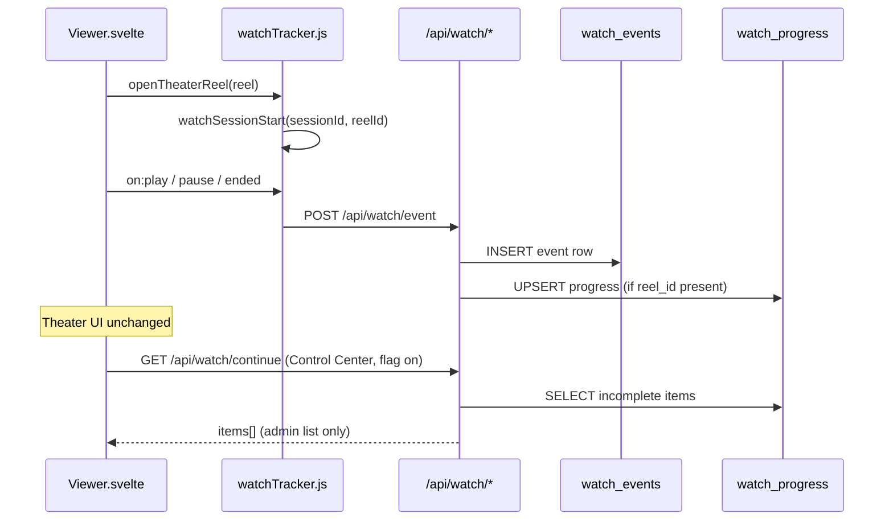
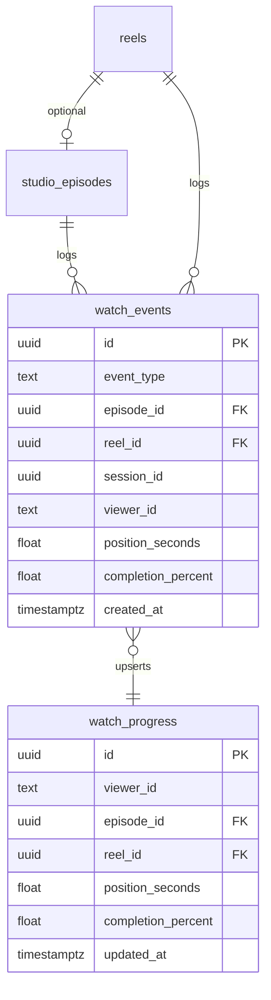

# Watch Intelligence Foundation

**Status:** Implemented (event collection + progress only)  
**Feature flag:** `REELFORGE_WATCH_TRACKING=true` (default **off**)  
**Frontend opt-in:** `VITE_REELFORGE_WATCH_TRACKING=true` (optional; otherwise probes `/api/watch/status` on first theater session)

**Explicitly out of scope:** AI, predictions, recommendation engine, paywall enforcement, playback blocking.

---

## 1. Migration Report

**File:** `backend/migrations/202512287_watch_intelligence.sql`

Additive tables only. No changes to `reels`, ingestion jobs, or ReelV1.

| Table | Purpose |
|-------|---------|
| `watch_events` | Append-only event log (PLAY, PAUSE, RESUME, SEEK, COMPLETE, NEXT_EPISODE, EXIT) |
| `watch_progress` | Denormalized latest position per viewer + episode (or viewer + reel when no episode) |

### `watch_events` columns

| Column | Type | Notes |
|--------|------|-------|
| `id` | UUID PK | Auto-generated |
| `event_type` | TEXT | CHECK constraint on allowed types |
| `episode_id` | UUID FK | Nullable → `studio_episodes` |
| `reel_id` | UUID FK | Nullable → `reels` |
| `session_id` | UUID | Theater session (client-generated) |
| `viewer_id` | TEXT | Anonymous viewer key (`X-Reelforge-Viewer-Id` / localStorage) |
| `started_at` | TIMESTAMPTZ | Optional (PLAY / RESUME) |
| `ended_at` | TIMESTAMPTZ | Optional (COMPLETE / EXIT) |
| `position_seconds` | DOUBLE | Playback position at event time |
| `duration_seconds` | DOUBLE | Video duration when known |
| `completion_percent` | DOUBLE | Computed: `position / duration * 100` |
| `created_at` | TIMESTAMPTZ | Server default `now()` |

### `watch_progress` columns

| Column | Type | Notes |
|--------|------|-------|
| `viewer_id` | TEXT | Same identity as events |
| `episode_id` | UUID | Unique with viewer when set |
| `reel_id` | UUID | Required; unique with viewer when `episode_id` IS NULL |
| `session_id` | UUID | Last active session |
| `position_seconds` | DOUBLE | Resume point |
| `duration_seconds` | DOUBLE | Last known duration |
| `completion_percent` | DOUBLE | 0–100 |
| `last_event_type` | TEXT | Last applied event |
| `started_at` / `ended_at` | TIMESTAMPTZ | From latest events |
| `updated_at` | TIMESTAMPTZ | Upsert timestamp |

**Indexes:** `session_id`, `reel_id`, `episode_id`, `(viewer_id, created_at DESC)`, `(viewer_id, updated_at DESC)` on progress.

**Requires:** Studio hierarchy migration (`202512284`) for `episode_id` FK; reels table for `reel_id`. Orphan reels (no episode) still track via `reel_id` only.

**Episode resolution:** If the client sends `reel_id` only, the API resolves `episode_id` from `studio_episodes.reel_id`. If only `episode_id` is sent, `reel_id` is resolved from the episode row.

---

## 2. Data Flow Diagram





---

## 3. API Documentation

**Flag off:** All routes return `404` with `{ "error": "Watch tracking API disabled", "hint": "Set REELFORGE_WATCH_TRACKING=true to enable" }`.

**Viewer identity:** Required for progress/continue. Send header `X-Reelforge-Viewer-Id` or query/body `viewer_id`. The frontend stores a stable UUID in `localStorage` key `reelforge_viewer_id`.

### Status

| Method | Path | Response |
|--------|------|----------|
| GET | `/api/watch/status` | `{ "enabled": true, "event_types": ["PLAY", ...] }` |

### Record event

| Method | Path | Body |
|--------|------|------|
| POST | `/api/watch/event` | See below |

```json
{
  "event_type": "PLAY",
  "reel_id": "uuid",
  "episode_id": "uuid (optional)",
  "session_id": "uuid",
  "viewer_id": "uuid-string (optional if header set)",
  "position_seconds": 12.5,
  "duration_seconds": 120.0,
  "started_at": "2026-05-29T12:00:00Z",
  "ended_at": "2026-05-29T12:05:00Z"
}
```

**Response:** `{ "ok": true, "event_id": "uuid" }`

**Event types:** `PLAY`, `PAUSE`, `RESUME`, `SEEK`, `COMPLETE`, `NEXT_EPISODE`, `EXIT`

**Frontend theater hooks (flag on):** `PLAY`, `PAUSE`, `RESUME` (play after pause), `COMPLETE` (ended), `EXIT` (theater close). `SEEK` and `NEXT_EPISODE` are API-ready for future wiring.

### Progress by episode

| Method | Path | Query |
|--------|------|-------|
| GET | `/api/watch/progress/{episode}` | `?viewer_id=` or header |

**Response (200):** `WatchProgressRow` — `position_seconds`, `completion_percent`, `reel_id`, `session_id`, etc.

**404:** No progress for this viewer + episode.

### Continue watching

| Method | Path | Query |
|--------|------|-------|
| GET | `/api/watch/continue` | `?viewer_id=` & `?limit=` (1–50, default 20) |

**Response:**

```json
{
  "items": [
    {
      "episode_id": "uuid or null",
      "reel_id": "uuid",
      "session_id": "uuid",
      "position_seconds": 45.2,
      "duration_seconds": 120.0,
      "completion_percent": 37.6,
      "updated_at": "2026-05-29T12:00:00Z",
      "reel_title": "...",
      "episode_title": "..."
    }
  ],
  "count": 1
}
```

**Filter:** `completion_percent < 95` and `position_seconds > 0`, ordered by `updated_at DESC`.

**Unchanged endpoints:** `GET /api/reels`, ingestion, video streaming, theater layout — no watch fields on ReelV1.

---

## 4. Rollback Plan

### Level 1 — Disable API (instant)

```bash
unset REELFORGE_WATCH_TRACKING
# or
REELFORGE_WATCH_TRACKING=false
# restart backend
```

- All `/api/watch/*` return 404.
- `watchTracker.js` stops emitting after status probe fails.
- Theater playback and ingestion unchanged.

### Level 2 — Disable client probe

```bash
# frontend build / dev
VITE_REELFORGE_WATCH_TRACKING=false
```

No network calls from theater (unless status was already cached as enabled).

### Level 3 — Remove admin continue list (optional)

Remove `{#if $watchContinueEnabled}` block from Control Center in `Viewer.svelte`. No backend impact.

### Level 4 — Drop tables (after backup)

```sql
DROP TABLE IF EXISTS watch_progress;
DROP TABLE IF EXISTS watch_events;
```

Studio hierarchy and reels remain intact. Historical analytics data is lost.

---

## 5. Performance Impact Analysis

| Area | Impact | Notes |
|------|--------|-------|
| Theater playback | **None** when flag off | No extra DOM, controls, or autoplay logic |
| Theater (flag on) | **Low** | Fire-and-forget `POST` on play/pause/complete/exit; failures logged in dev only |
| Network | ~1–5 KB per event | JSON body; no WebSocket |
| Database writes | 1 INSERT + 1 UPSERT per event | Progress upsert uses partial unique indexes |
| Database reads | Progress/continue only on admin API calls | Not on hot `GET /api/reels` path |
| Index growth | Linear with viewing activity | `watch_events` append-only; consider retention job in a future phase |
| Continue query | Single indexed SELECT | `viewer_id` + `updated_at DESC`, limit capped at 50 |

**Recommendations (future, not implemented):**

- Batch events client-side if volume grows.
- Partition or archive `watch_events` older than N days.
- Do not block `play()` on API success (current design already async).

---

## 6. File Modification Map

| Path | Change |
|------|--------|
| `backend/migrations/202512287_watch_intelligence.sql` | **New** — `watch_events`, `watch_progress` |
| `backend/src/db/watch_events.rs` | **New** — insert event, upsert progress, continue list |
| `backend/src/api/watch.rs` | **New** — HTTP handlers |
| `backend/src/db/mod.rs` | `watch_events` module, `watch_tracking_enabled()` |
| `backend/src/api/mod.rs` | `watch` module export |
| `backend/src/main.rs` | Routes: status, event, progress, continue |
| `backend/.env.example` | Flag documented |
| `frontend/src/lib/api/watch.js` | **New** — API client + viewer id |
| `frontend/src/lib/watch/watchTracker.js` | **New** — theater event hooks |
| `frontend/src/Viewer.svelte` | Additive hooks on existing video handlers; Control Center continue list (flag-gated) |
| `docs/WATCH_INTELLIGENCE_FOUNDATION.md` | **New** — this document |

### Unchanged

- Ingestion pipeline, ReelV1 contract, hero, shelf layout, theater controls/appearance
- Monetization enforcement, AI, recommendations
- `GET /api/reels` response shape

---

## 7. Enable

```bash
# Backend (requires DB migration applied)
REELFORGE_WATCH_TRACKING=true

# Optional: skip status probe on first play
VITE_REELFORGE_WATCH_TRACKING=true
```

Restart backend → open theater video → events persist when flag is on.

**Resume progress:** `GET /api/watch/progress/{episode_id}` returns `position_seconds` for client-driven seek (not wired in theater UI in this phase — API-only resume).

**Control Center:** When flag is on and admin opens Control Center, a minimal “Continue watching (API)” list loads from `GET /api/watch/continue`.

---

## 8. Success Criteria

| Criterion | Met |
|-----------|-----|
| Existing playback unchanged | ✓ No control/layout changes; hooks only call tracker when enabled |
| Existing ingestion unchanged | ✓ No reel or ingest schema changes |
| Watch events persist | ✓ `watch_events` INSERT on each POST |
| Progress can be resumed | ✓ `watch_progress` upsert + GET progress/continue |
| Feature disabled instantly | ✓ Env flag → 404; tracker stops |
| All changes additive | ✓ New tables, modules, optional UI block |
