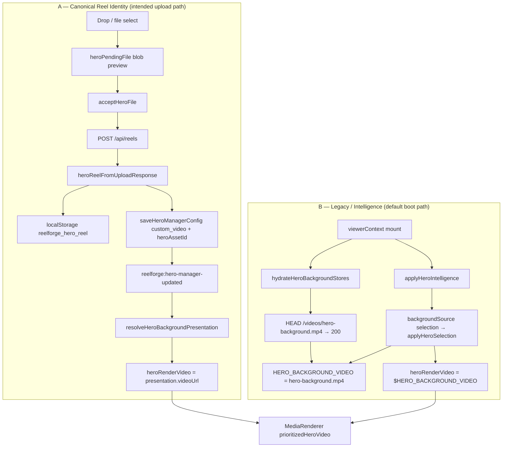

# BG-6B — Hero Background Canonical Trace

**Mission:** READ-ONLY forensic trace — drag/drop → rendered `<video>`.  
**Environment:** Production Netlify `https://strong-lolly-a9fcb4.netlify.app` + Railway backend (BG-5L write path verified).  
**Known-good feed reel:** `03f66631-6038-4ff3-8374-444f4c21eaf6` (in API + feed DOM; **not** hero DOM).  
**Evidence:** BG-6A artifact `artifacts/bg-6a-production-ui.json`, source under `frontend/src/`.

---

## Executive Answers

| # | Question | Answer |
|---|----------|--------|
| 1 | Where does Hero upload finish? | **`acceptHeroFile()`** in `HeroExperience.svelte` — **not** on drop. Drop only sets preview (`heroPendingFile`). Upload completes after `uploadVideo()` resolves, then `saveHeroReel()` + `saveHeroManagerConfig()` + `HERO_BACKGROUND_VIDEO.set()`. |
| 2 | Backend endpoint? | **`POST /api/reels`** via `uploadVideo()` → `createReel()` in `lib/api/media.js`. |
| 3 | Creates a Reel? | **Yes.** Multipart with `video` field; meta `{ category: 'HERO', title, description }`. Returns normalized reel `{ id, url, thumbnailUrl, status }`. |
| 4 | Updates configuration? | **Yes, on Accept only.** `saveHeroManagerConfig({ backgroundSource: 'custom_video', heroAssetId: reel.id, backgroundStyle: 'video', ... })` → `reelforge_hero_manager_config`. |
| 5 | Updates localStorage? | **Yes, on Accept only.** `reelforge_hero_reel` (canonical); legacy `reelforge_hero_video` / `reelforge_hero_image` **removed** on save. |
| 6 | Updates Svelte stores? | **Yes, on Accept only.** `HERO_BACKGROUND_VIDEO`, optionally `HERO_POSTER_IMAGE`; clears `heroPendingFile`, resets `heroVideoFailed` / `heroVideoLoaded`. |
| 7 | Who owns Hero state? | **Split:** `viewerContext.js` owns runtime writables; `heroReelIdentity.js` owns canonical reel persistence; `heroIntelligence.js` owns manager config + resolution; `HeroExperience.svelte` owns in-memory `heroManagerConfig` (line 70). |
| 8 | Who decides Hero `src`? | **`HeroExperience.svelte`** reactive chain: `prioritizedHeroVideo` → `<MediaRenderer url={prioritizedHeroVideo}>`. Inputs: `heroBackgroundPresentation`, `$HERO_BACKGROUND_VIDEO`, carousel slides, `heroSelection`. Bootstrap from `hydrateHeroBackgroundStores` + `applyHeroIntelligence` in `viewerContext.js`. |
| 9 | Why `/videos/hero-background.mp4` wins? | Default manager config has **`backgroundSource: 'selection'`**. In that mode the render gate uses **`$HERO_BACKGROUND_VIDEO`**, which bootstraps to **`CONFIG.HERO_VIDEO_PATHS[0]`** (`/videos/hero-background.mp4`) via async HEAD 200 — not the uploaded/canonical UUID reel. |

**Root cause (one sentence):** Hero replacement is gated on **Accept → `custom_video` manager config + `reelforge_hero_reel`**, but production runs in **`backgroundSource: 'selection'`** with **`$HERO_BACKGROUND_VIDEO` hydrated to `/videos/hero-background.mp4`**, so feed/canonical reels like `03f66631…` never pass the `heroRenderVideo`/`prioritizedHeroVideo` gate into `<MediaRenderer>`.

---

## Architecture: Dual Hero Systems

Production runs **both** systems concurrently; they conflict unless Accept + config promotion completes.



| System | Identity | Storage keys | Render binding |
|--------|----------|--------------|----------------|
| **A — Canonical** | UUID reel (`id`, `fileName`, `url`) | `reelforge_hero_reel`, `reelforge_hero_manager_config.heroAssetId` | `backgroundSource === 'custom_video'` **and** `resolveHeroBackgroundAsset().videoUrl` |
| **B — Legacy / Intelligence** | Static default + feed selection | `CONFIG.HERO_VIDEO_PATHS[0]`, default `backgroundSource: 'selection'` | `$HERO_BACKGROUND_VIDEO` or `applyHeroSelection().videoUrl` |

**Verdict:** Hero **uses canonical reel identity (A) only after Accept**; **default runtime is B**, which keeps `/videos/hero-background.mp4`.

---

## 1. Call Graph (complete pipeline)

### Phase 0 — Bootstrap (page load, before any drop)

```
viewerContext.js (module init)
  hydrateHeroBackgroundStoresSync(getHeroBackgroundStores(), CONFIG)
    migrateLegacyHeroStorageIfNeeded()
    loadHeroManagerConfig()          → default backgroundSource: 'selection'
    loadHeroReel()                   → null (no reelforge_hero_reel)
    applyHeroManagerBackground()     → returns false (selection guard line 964)
    → 'pending_default'

viewerContext.js mountViewer / onMount
  hydrateHeroBackgroundStores(...)
    fetch HEAD /videos/hero-background.mp4 → 200
    HERO_BACKGROUND_VIDEO.set('/videos/hero-background.mp4')
  syncFromVault(true)
  applyHeroIntelligence(true)
    selectHeroContent(heroType, feed)
    applyHeroBackgroundFromIntelligence()
      managerConfig.backgroundSource === 'selection'
      applyHeroSelection(heroSelection, stores) → may set feed reel video on store
  window.addEventListener('reelforge:hero-manager-updated', handleHeroManagerUpdated)

HeroExperience.svelte (onMount)
  heroManagerConfig = loadHeroManagerConfig()   // once at init line 70
  applyHeroManagerBackground(heroManagerConfig, getHeroBackgroundStores())  // no-op if selection
  window.addEventListener('reelforge:hero-manager-updated', handleManagerUpdate)
```

### Phase 1 — Drag / drop (preview only)

```
User drop on .hero-drop-zone
  HeroExperience.handleHeroDragEnter / handleHeroDragOver
  HeroExperience.handleHeroDrop(event)
    pipelineCheckpoint('DROP_RECEIVED', { vault: 'hero' })
    HeroExperience.handleHeroFileSelect({ target: { files: [file] } })
      console [HERO_FILE_SELECTED], [HERO_UPLOAD stage: hero-file-select]
      uploadStatus.set('🎬 PROCESSING...')
      isProbablyVideo(file)?
        resourceManager.addBlobUrl(URL.createObjectURL(file))
        heroPendingFile.set({ file, preview, name, size, type: 'video' })   // viewerContext store
        heroPreviewUrl.set(preview)
        uploadStatus.set('Preview: … Accept or Reject')
      // NO network call; NO saveHeroReel; NO saveHeroManagerConfig

Reactive (HeroExperience):
  pendingHeroFile = $heroPendingFile
  heroUploadState = 'previewing'   // enables Accept button
  heroBackgroundPresentation unchanged (still selection)
  heroRenderVideo = $HERO_BACKGROUND_VIDEO   // still hero-background.mp4
  prioritizedHeroVideo unchanged
  <MediaRenderer url={prioritizedHeroVideo}>   // stage hero still default
  Drop-zone shows blob preview in .hero-pending-preview (NOT stage video)
```

### Phase 2 — Accept (upload + persistence)

```
User click .accept-btn (only if heroUploadState === 'previewing')
  HeroExperience.acceptHeroFile()
    get(heroPendingFile)
    validateVideoFile(file)                    // client validation
    dynamic import uploadVideo from media.js
    uploadVideo(file, authHeaders, { title, description, category: 'HERO' })
      media.js createReel(formData)
        enforceUploadPolicy()
        fetch POST ${API_BASE_URL}/api/reels
        normalizeReel / pollIngestionUntilReady
        return { id, url, thumbnailUrl, status: 'ready' }

    heroReelFromUploadResponse(created, 'video')   // heroReelIdentity.js
      normalizeReel(raw, 'hero-upload')
      toRelativeMediaPath(url) → /videos/{uuid}.mp4

    saveHeroReel(reel)                            // reelforge_hero_reel
      localStorage.removeItem(reelforge_hero_video|image)

    HERO_BACKGROUND_VIDEO.set(reel.url)           // before → after logged

    saveHeroManagerConfig({                       // heroIntelligence.js
      backgroundSource: 'custom_video',
      heroAssetId: reel.id,
      backgroundStyle: 'video',
      ...viewerPatch
    })
      localStorage reelforge_hero_manager_config
      dispatchEvent('reelforge:hero-manager-updated', { detail: next })

    heroPendingFile.set(null)
    heroPreviewUrl.set(null)
    pipelineCheckpoint('VIDEO_READY', { reelId, videoSrc: reel.url })
```

### Phase 3 — Event fan-out (post-save)

```
reelforge:hero-manager-updated
  HeroExperience.handleManagerUpdate(event)
    heroManagerConfig = event.detail
    applyHeroManagerBackground(heroManagerConfig, getHeroBackgroundStores())
    restartCarouselTimers()
    queueHeroRenderDiagnostics()

  viewerContext.handleHeroManagerUpdated(event)
    config.backgroundSource === 'custom_video'?
      applyManagerBackgroundFromConfig(config)
        applyHeroManagerBackground → HERO_BACKGROUND_VIDEO.set(resolved.videoUrl)
    heroSelection.set(selectHeroContent(...))
    startHeroRotation / stopHeroRotation
```

### Phase 4 — Reactive render resolution

```
HeroExperience reactive chain:
  $: heroBackgroundPresentation = resolveHeroBackgroundPresentation(heroManagerConfig)
      resolveHeroBackgroundAsset(config)
        loadHeroVaultItems()  // requires manager.heroAssetId === reel.id
        loadHeroReel()
        bridge if heroAssetId === canonicalReel.id → videoUrl = reel.url

  $: heroRenderVideo =
      backgroundSource === 'custom_video' && presentation.videoUrl
        ? presentation.videoUrl
        : $HERO_BACKGROUND_VIDEO

  $: heroVisualSlides =
      heroRegistryAssets.length > 0 ? registry slides : buildHeroCarouselSlides(feedReels)

  $: prioritizedHeroVideo =
      heroStoryMediaPriorityEnabled ? heroRenderVideo || heroSlideVideo
                                    : heroSlideVideo || heroRenderVideo

  $: activeHeroMediaMode =
      canUseVideo ? 'video' : canUseImage ? 'image' : 'fallback'
      // gate: backgroundSource !== 'custom_image' for video mode

  Template (section === 'stage'):
    {#if activeHeroMediaMode === 'video'}
      <MediaRenderer url={prioritizedHeroVideo} className="hero-video hero-media" />
```

### Phase 5 — Parallel paths that do NOT promote hero upload

```
syncFromVault / websocket onCreated
  isHeroAsset(reel) → category HERO or matches hero domain snapshot
  Hero reels filtered from personal vault feed cards (heroDomainGuard.js)
  Does NOT auto-bind hero reel to HERO_BACKGROUND_VIDEO

applyHeroIntelligence(false) on metrics-updated
  If hasUserHeroOverride → skip unless custom_video/custom_image
  If selection → applyHeroSelection (feed-driven video)
```

---

## 2. Ownership Graph

```
┌─────────────────────────────────────────────────────────────────────────┐
│ localStorage                                                            │
│  reelforge_hero_reel          ← saveHeroReel (canonical id/url)         │
│  reelforge_hero_manager_config ← saveHeroManagerConfig (pointer+mode)   │
│  reelforge_hero_video/image   ← legacy; cleared on canonical save       │
└───────────────────────────────┬─────────────────────────────────────────┘
                                │ load/save
        ┌───────────────────────┼───────────────────────┐
        ▼                       ▼                       ▼
 heroReelIdentity.js    heroIntelligence.js      heroDomainGuard.js
 loadHeroReel            loadHeroManagerConfig     isHeroAsset / filterNonHeroAssets
 saveHeroReel            saveHeroManagerConfig     getHeroDomainSnapshot
 heroReelFromUpload...   resolveHeroBackground*
                        hydrateHeroBackground*
                        applyHeroIntelligence
                                │
                                ▼
                    viewerContext.js (CONFIG, stores)
                      HERO_BACKGROUND_VIDEO  ← writable, init hero-background.mp4
                      HERO_POSTER_IMAGE
                      heroPendingFile, heroPreviewUrl
                      heroSelection
                      heroVideoFailed, heroVideoLoaded
                      mountViewer: hydrate + applyHeroIntelligence
                      handleHeroManagerUpdated listener
                                │
                                ▼
                    HeroExperience.svelte
                      let heroManagerConfig (in-memory, event-synced)
                      acceptHeroFile / handleHeroDrop (upload UX)
                      reactive: heroRenderVideo, prioritizedHeroVideo
                      owns <MediaRenderer> for stage hero
                                │
                                ▼
                    HeroManagerPanel.svelte (studio)
                      config UI: backgroundSource, heroAssetId
                      saveHeroManagerConfig on change
                      does NOT run acceptHeroFile upload
```

**Primary render owner:** `HeroExperience.svelte` (stage `<MediaRenderer>`).  
**Primary persistence owner:** `heroReelIdentity.js` + `heroIntelligence.js`.  
**Primary bootstrap owner:** `viewerContext.js`.

---

## 3. Reactive Dependency Graph

```
heroManagerConfig (let, updated by reelforge:hero-manager-updated)
  └─► heroBackgroundPresentation
        └─► resolveHeroBackgroundPresentation
              └─► resolveHeroBackgroundAsset
                    ├─► loadHeroManagerConfig().heroAssetId
                    ├─► loadHeroReel().id / .url
                    └─► loadHeroVaultItems() [empty if heroAssetId ≠ reel.id]

HERO_BACKGROUND_VIDEO ($store from viewerContext)
  └─► heroRenderVideo (when backgroundSource ≠ custom_video or no presentation.videoUrl)
  └─► prioritizedHeroVideo (fallback arm)

heroRegistryAssets
  └─► buildHeroAssetRegistry(loadHeroVaultItems())
  └─► heroVisualSlides
        └─► activeHeroSlide
              └─► heroSlideVideo
                    └─► prioritizedHeroVideo (primary arm when story draft)

heroBackgroundPresentation.backgroundSource
  └─► heroRenderVideo branch selection
  └─► activeHeroMediaMode gate (blocks video if custom_image)
  └─► data-hero-background-source on DOM

$heroVideoFailed
  └─► activeHeroMediaMode (can force fallback)

prioritizedHeroVideo
  └─► {#key prioritizedHeroVideo:heroVideoFailureCount}
  └─► <MediaRenderer url={prioritizedHeroVideo} />

$heroPendingFile
  └─► heroUploadState (idle | previewing | processing)
  └─► drop-zone preview UI (NOT stage video)
```

---

## 4. Timeline with Transitions

| Step | Before | After | Source | Consumer |
|------|--------|-------|--------|----------|
| Module init | (none) | `HERO_BACKGROUND_VIDEO = '/videos/hero-background.mp4'` | `viewerContext.js:354` CONFIG | All hero reactives |
| Sync hydrate | store = default path | `'pending_default'` (no canonical reel) | `hydrateHeroBackgroundStoresSync` | async hydrate |
| Async hydrate HEAD | store = default | store = `/videos/hero-background.mp4` (HEAD 200) | `hydrateHeroBackgroundStores` | `$HERO_BACKGROUND_VIDEO` |
| applyHeroIntelligence | selection mode | `heroSelection` set; may set store from feed | `applyHeroBackgroundFromIntelligence` | carousel copy, optional store |
| **Drop MP4** | `heroPendingFile = null` | `heroPendingFile = { blob preview }` | `handleHeroFileSelect` | drop-zone preview only |
| Drop (no Accept) | `reelforge_hero_reel = null` | **unchanged null** | — | render gate |
| Drop (no Accept) | `backgroundSource = 'selection'` | **unchanged** | — | `heroRenderVideo → $HERO_BACKGROUND_VIDEO` |
| Drop (no Accept) | stage `src = hero-background.mp4` | **unchanged** | BG-6A DOM evidence | `<MediaRenderer>` |
| **Accept click** | pending blob | `POST /api/reels` → `{ id: uuid, url: /videos/uuid.mp4 }` | `createReel` | `heroReelFromUploadResponse` |
| Accept success | `reelforge_hero_reel = null` | `{ id, url, backgroundSource: custom_video }` | `saveHeroReel` | `loadHeroVaultItems`, resolve |
| Accept success | `backgroundSource = selection` | `custom_video`, `heroAssetId = uuid` | `saveHeroManagerConfig` | presentation + DOM attr |
| Accept success | store = hero-background.mp4 | store = `/videos/uuid.mp4` | `HERO_BACKGROUND_VIDEO.set` | `heroRenderVideo` |
| Event | in-memory config stale? | `heroManagerConfig = event.detail` | `reelforge:hero-manager-updated` | reactives re-run |
| Render (custom_video) | `heroRenderVideo = hero-background.mp4` | `heroRenderVideo = /videos/uuid.mp4` | `resolveHeroBackgroundPresentation` | `prioritizedHeroVideo` |
| DOM | `<video src=…hero-background.mp4>` | `<video src=…/videos/uuid.mp4>` | `MediaRenderer` | user-visible hero |

### BG-6A production trace (observed)

| Field | Value | Implication |
|-------|-------|-------------|
| `localStorage.hero_reel` | `null` | Accept path never ran (script also checked wrong key `reelforge_hero_reel_identity`) |
| `localStorage.hero_video` | `null` | No legacy write |
| `heroVideoEl.src` | `…/videos/hero-background.mp4` | System B winning |
| Feed DOM | `03f66631…` present | Feed ≠ Hero pipelines |

---

## 5. Exact Render Gate (rejects `03f66631…` and non-promoted uploads)

### Gate 1 — Upload completion gate (hard stop before any hero adoption)

```javascript
// acceptHeroFile is the ONLY path that POSTs and saves canonical hero identity.
// handleHeroDrop → handleHeroFileSelect stops at heroPendingFile (preview).
```

**Effect:** Drop alone never creates `reelforge_hero_reel` or `custom_video` config. Reel `03f66631…` in feed is invisible to this gate.

### Gate 2 — Presentation mode gate (primary render fork)

```133:171:frontend/src/components/experiences/HeroExperience.svelte
  $: heroBackgroundPresentation = resolveHeroBackgroundPresentation(
    heroManagerConfig || loadHeroManagerConfig()
  );
  // ...
  $: heroRenderVideo =
    heroBackgroundPresentation.backgroundSource === 'custom_video' &&
    heroBackgroundPresentation.videoUrl
      ? heroBackgroundPresentation.videoUrl
      : heroUsesImageBackground
        ? ''
        : $HERO_BACKGROUND_VIDEO;
```

| Condition | `heroRenderVideo` source | UUID reel used? |
|-----------|--------------------------|-----------------|
| `backgroundSource === 'custom_video'` **and** `presentation.videoUrl` truthy | `presentation.videoUrl` | **Yes** (if resolve succeeded) |
| `backgroundSource === 'selection'` (default) | `$HERO_BACKGROUND_VIDEO` | **No** — uses static default or intelligence |
| `backgroundSource === 'custom_image'` | `''` (video cleared) | No |

**Production state:** `backgroundSource: 'selection'` → Gate 2 always takes `$HERO_BACKGROUND_VIDEO` branch.

### Gate 3 — Asset resolution gate (canonical identity match)

```876:897:frontend/src/lib/hero/heroIntelligence.js
export function resolveHeroBackgroundAsset(config, vaultItems, options) {
    const heroAssetId = String(config.heroAssetId || '').trim();
    const canonicalReel = loadHeroReel();
    let bridgeAsset = null;
    if (canonicalReel?.id && canonicalReel?.url && heroAssetId === canonicalReel.id) {
        bridgeAsset = normalizeHeroAssetRecord(heroReelToVaultItem(canonicalReel), ...);
    }
    if (!bridgeAsset) {
        bridgeAsset = resolveHeroAssetById(heroAssetId, items);
    }
    // videoUrl = isVideo ? mediaUrl : ''
}
```

| Condition | `presentation.videoUrl` | Result |
|-----------|---------------------------|--------|
| `heroAssetId === canonicalReel.id` | `/videos/{uuid}.mp4` | Pass Gate 2 |
| `heroAssetId` mismatch or no `reelforge_hero_reel` | `''` | Gate 2 falls back to `$HERO_BACKGROUND_VIDEO` |
| `loadHeroVaultItems()` id mismatch | `[]` vault | bridge fails |

```826:834:frontend/src/lib/hero/heroIntelligence.js
export function loadHeroVaultItems() {
    const manager = loadHeroManagerConfig();
    const reel = loadHeroReel();
    if (!reel?.id || !reel?.url) return [];
    if (String(manager?.heroAssetId || '').trim() !== reel.id) return [];
    return [heroReelToVaultItem(reel)];
}
```

### Gate 4 — Manager apply guard (bootstrap / hydration)

```963:966:frontend/src/lib/hero/heroIntelligence.js
export function applyHeroManagerBackground(config, stores, options) {
    if (options.respectSelection !== false && config.backgroundSource === 'selection') {
        return false;
    }
```

**Effect:** On mount, canonical stores are **not** applied from manager config while in selection mode.

### Gate 5 — Default hydration gate (static MP4 wins)

```2058:2093:frontend/src/lib/hero/heroIntelligence.js
    return 'pending_default';
// ...
    for (const path of defaultPaths) {
        const res = await fetch(resolvedUrl, { method: 'HEAD' });
        if (res.ok) {
            stores.setVideo?.(path);  // '/videos/hero-background.mp4'
            return 'default';
        }
    }
```

**Effect:** With no canonical hero saved, `$HERO_BACKGROUND_VIDEO` is explicitly set to `/videos/hero-background.mp4` when file exists (production: HEAD 200, BG-5L unrelated).

### Gate 6 — DOM emission gate

```1421:1428:frontend/src/components/experiences/HeroExperience.svelte
      {#if activeHeroMediaMode === 'video'}
        <MediaRenderer
          type="video"
          url={prioritizedHeroVideo}
```

`prioritizedHeroVideo` must be non-empty and `activeHeroMediaMode === 'video'`. With selection mode + hydrated default, output is **`hero-background.mp4`**, not feed UUID.

### Gate 7 — Feed isolation gate

```1684:1688:frontend/src/viewer/viewerContext.js
const heroIgnored = isHeroAsset(reel);
// Hero-category reels filtered from vault shelf; websocket sync does not promote to hero store
```

**Effect:** Reel `03f66631…` can appear in **feed cards** but is excluded from hero adoption unless Gates 1–2 promote it via Accept + `custom_video`.

---

## 6. Stores & Events Inventory

### Svelte writables (`viewerContext.js`)

| Store | Initial | Written by |
|-------|---------|------------|
| `HERO_BACKGROUND_VIDEO` | `/videos/hero-background.mp4` | hydrate, acceptHeroFile, applyHeroManagerBackground, applyHeroSelection, error handlers |
| `HERO_POSTER_IMAGE` | `''` | acceptHeroFile (image), hydrate, applyHeroManagerBackground |
| `heroPendingFile` | `null` | handleHeroFileSelect, acceptHeroFile |
| `heroPreviewUrl` | `null` | handleHeroFileSelect, acceptHeroFile |
| `heroSelection` | `null` | applyHeroIntelligence, handleHeroManagerUpdated |
| `heroVideoFailed` | `false` | video error handlers, acceptHeroFile |
| `heroVideoLoaded` | `false` | handleHeroVideoLoad |
| `heroIsDragOver` | `false` | drag handlers |

### Custom events

| Event | Dispatched by | Handlers |
|-------|---------------|----------|
| `reelforge:hero-manager-updated` | `saveHeroManagerConfig` | `HeroExperience.handleManagerUpdate`, `viewerContext.handleHeroManagerUpdated` |
| `reelforge:metrics-updated` | metrics engine | `applyHeroIntelligence(false)` |
| `reelforge:release-schedule-updated` | release center | `applyHeroIntelligence(false)` |
| `reelforge:upload-updated` | websocket onCreated | vault sync (not hero bind) |

### localStorage keys

| Key | Role |
|-----|------|
| `reelforge_hero_reel` | Canonical hero reel JSON |
| `reelforge_hero_manager_config` | Manager mode + `heroAssetId` pointer |
| `reelforge_hero_video` | Legacy URL (cleared on canonical save) |
| `reelforge_hero_image` | Legacy image (cleared on canonical save) |

---

## 7. Backend / API (evidence from code + BG-5L)

| Step | Endpoint | Method | Body | Response |
|------|----------|--------|------|----------|
| Hero video upload | `/api/reels` | POST | `multipart: video, title, description, category=HERO` | `{ id, url, thumbnailUrl, status }` |
| Ingest poll (if 202) | ingestion poll | GET | — | ready reel |
| Static hero file | `/videos/hero-background.mp4` | HEAD/GET | — | 200 (bundled default) |
| Canonical reel media | `/videos/{uuid}.mp4` | GET | — | 200 (BG-5L verified for `03f66631…`) |

**No dedicated hero-config API** — hero configuration is **browser localStorage only**.

---

## 8. HeroManagerPanel.svelte (studio, parallel config path)

- Loads `config = loadHeroManagerConfig()`; can set `backgroundSource` to `selection | custom_video | custom_image`.
- `handleHeroAssetChange` → `saveHeroManagerConfig({ heroAssetId, backgroundSource })` — **selects existing registry asset**, does not upload.
- `applyConfig` persists manager fields and dispatches `reelforge:hero-manager-updated`.
- Setting `backgroundSource: 'selection'` (line ~407) **explicitly reverts** to intelligence-driven hero.

Upload UX lives only in `HeroExperience.svelte` (`.hero-replace-section`), not HeroManagerPanel.

---

## 9. Canonical vs Legacy — Decision Matrix

| User action | System | Persisted? | Rendered src |
|-------------|--------|------------|--------------|
| Page load, no prior hero | B | `selection` default | `/videos/hero-background.mp4` |
| Drop only | — | nothing | `/videos/hero-background.mp4` |
| Drop + Accept | A | `reelforge_hero_reel` + `custom_video` | `/videos/{new-uuid}.mp4` |
| Feed has `03f66631…` | B | unchanged | `/videos/hero-background.mp4` (not auto-linked) |
| Studio: set custom_video + pick asset | A | config only (if reel exists) | resolved UUID url |
| Studio: set selection | B | `selection` | `$HERO_BACKGROUND_VIDEO` / feed selection |

---

## 10. Production Failure Correlation

| BG-6A check | Result | Trace explanation |
|-------------|--------|-------------------|
| Hero drop | Executed | Phase 1 only — preview |
| Accept click | **Not executed** | Phase 2 never ran |
| `heroStorageSet` | **false** | Gates 1 + 2 |
| DOM hero src | `hero-background.mp4` | Gates 2 + 5 |
| Feed reel `03f66631…` | **PASS** | Separate pipeline; Gate 7 |

If a human clicks Accept and upload succeeds but DOM stays on default, check console for `[HERO][STALE CONFIG DETECTED]` (in-memory `heroManagerConfig` ≠ persisted) or post-save `applyHeroIntelligence(false)` overwriting store while `backgroundSource` drifts back to `selection`.

---

## Files traced

| File | Role |
|------|------|
| `components/experiences/HeroExperience.svelte` | Drop, Accept, upload, render gate, `<MediaRenderer>` |
| `components/studio/HeroManagerPanel.svelte` | Manager config UI |
| `viewer/viewerContext.js` | Stores, bootstrap, intelligence listeners |
| `lib/hero/heroReelIdentity.js` | Canonical reel persistence |
| `lib/hero/heroIntelligence.js` | Config, resolve, hydrate, intelligence |
| `lib/hero/heroDomainGuard.js` | Hero vs feed isolation |
| `lib/api/media.js` | `createReel` / `uploadVideo` → POST `/api/reels` |

---

*BG-6B — evidence only. No code changes.*
