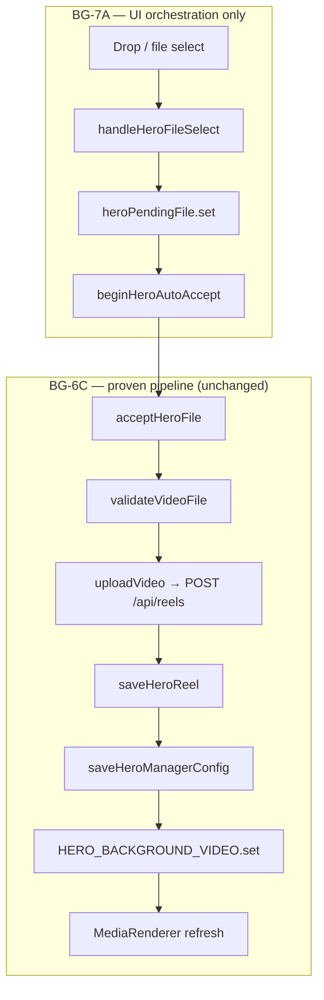

# BG-7A — Hero UX Modernization (Auto-Accept Workflow)

**Mission type:** UX orchestration enhancement (not infrastructure repair)  
**Classification:** `BG-6C → Pipeline Validated` · `BG-7A → Hero Upload UX Modernization`  
**Date:** 2026-07-16  
**Constraint:** Preserve BG-5J through BG-6C backend, persistence, and canonical upload path.

---

## Executive summary

BG-7A removes the manual **Accept** click from the Hero replace workflow by automatically invoking the existing `acceptHeroFile()` function immediately after drop validation. No upload pipeline, backend API, database schema, or reel identity logic was modified.

**Single change surface:** `HeroExperience.svelte` orchestration — one new helper (`beginHeroAutoAccept`) called from `handleHeroFileSelect`.

---

## 1. UX Architecture Report

### Current flow (pre-BG-7A)

```
Drop
 ↓
handleHeroDrop → handleHeroFileSelect
 ↓
heroPendingFile.set (blob preview)
 ↓
Preview UI + Accept/Reject buttons
 ↓
[User clicks Accept]
 ↓
acceptHeroFile()
 ↓
validateVideoFile → uploadVideo() → POST /api/reels
 ↓
saveHeroReel() → saveHeroManagerConfig()
 ↓
HERO_BACKGROUND_VIDEO.set → MediaRenderer refresh
```

### Proposed flow (BG-7A)

```
Drop
 ↓
handleHeroDrop → handleHeroFileSelect
 ↓
heroPendingFile.set (internal staging for acceptHeroFile)
 ↓
beginHeroAutoAccept() → acceptHeroFile()   [automatic]
 ↓
validateVideoFile → uploadVideo() → POST /api/reels
 ↓
saveHeroReel() → saveHeroManagerConfig()
 ↓
HERO_BACKGROUND_VIDEO.set → MediaRenderer refresh
```

The preview/Accept UI remains only as a **retry surface** when upload fails (`heroPendingFile` persists, `heroUploadProcessing` returns false).

### Files involved

| File | Role | BG-7A change |
|------|------|--------------|
| `frontend/src/components/experiences/HeroExperience.svelte` | Hero drop orchestration, `acceptHeroFile()` | **Modified** — auto-invoke accept after drop |
| `frontend/tests/hero-confirmation.e2e.spec.js` | E2E validation | **Modified** — drop-only journey |
| `frontend/scripts/mission-bg-7a-hero-auto-accept.mjs` | Mission runner | **Added** |

### Functions involved

| Function | Location | Change |
|----------|----------|--------|
| `handleHeroDrop` | `HeroExperience.svelte` | Unchanged |
| `handleHeroFileSelect` | `HeroExperience.svelte` | Calls `beginHeroAutoAccept()` after staging `heroPendingFile` |
| `beginHeroAutoAccept` | `HeroExperience.svelte` | **New** — `void acceptHeroFile()` |
| `acceptHeroFile` | `HeroExperience.svelte` | **Unchanged** — canonical upload path |
| `uploadVideo` / `createReel` | `lib/api/media.js` | Unchanged |
| `saveHeroReel` | `lib/hero/heroReelIdentity.js` | Unchanged |
| `saveHeroManagerConfig` | `lib/hero/heroIntelligence.js` | Unchanged |
| `resolveHeroBackgroundPresentation` | `lib/hero/heroIntelligence.js` | Unchanged |
| `rejectHeroFile` | `HeroExperience.svelte` | Unchanged — cancel on failed retry |

### Why this change is low risk

1. **Zero pipeline duplication** — `acceptHeroFile()` remains the single source of truth for Hero uploads.
2. **All safety preserved** — validation, watchdog timeout, operation token, error handling, rollback messaging unchanged.
3. **No backend touch** — `POST /api/reels`, ingest polling, Railway storage unaffected.
4. **Isolated scope** — only Hero replace UI orchestration; Vault, Feed, Thumbnail Vault untouched.
5. **Proven path** — BG-6C validated every step inside `acceptHeroFile()`; BG-7A only removes the click that invoked it.

---

## 2. Minimal Patch Plan

### Implementation (completed)

**File:** `HeroExperience.svelte`

1. Add `beginHeroAutoAccept()` that calls `void acceptHeroFile()`.
2. After video `heroPendingFile.set(...)`, call `beginHeroAutoAccept()`.
3. After image `FileReader.onload` sets `heroPendingFile`, call `beginHeroAutoAccept()`.
4. Update copy to reflect automatic upload (subtitle, drop zone, state panel).
5. Retain `.accept-btn` as **Retry Upload** for failed uploads only.

**Lines of logic changed:** ~15 orchestration + copy updates.

**Explicitly not changed:**

- `uploadVideo()`, `createReel()`, `saveHeroReel()`, `saveHeroManagerConfig()`
- `heroReelIdentity.js`, `viewerContext.js`, `MediaRenderer`
- Backend `/api/reels`, database schema
- `VaultExperience.svelte`, feed upload flows

---

## 3. Risk Assessment

| Area | Risk | Mitigation |
|------|------|------------|
| **Hero persistence** | None | Same `saveHeroReel()` + `saveHeroManagerConfig()` inside `acceptHeroFile()` |
| **Vault uploads** | None | Vault uses `handleVaultVideoDrop` → separate path; no shared code changed |
| **Feed uploads** | None | Studio feed upload unchanged |
| **Reel identity** | None | `heroReelFromUploadResponse()` + canonical save unchanged |
| **Batch delete** | None | No changes to vault batch or hero registry delete |
| **Hero reload** | None | Hydration reads same localStorage keys |
| **Production compatibility** | Low | Frontend-only deploy; backend redeploy irrelevant to this UX |
| **Accidental mis-drop** | Slight increase | Trade-off accepted per milestone; retry/cancel UI on failure |
| **Automation** | Low | Tests updated to BG-7A drop-only flow; `.accept-btn` retained for retry |

### Why existing upload behavior cannot change

`acceptHeroFile()` body is **identical**. BG-7A only changes **when** it is called (automatically after drop vs. manually on click). Network payloads, persistence keys, store mutations, and render gates execute in the same order with the same arguments.

---

## 4. Validation Plan

End-to-end checklist:

| # | Step | Expected result |
|---|------|-----------------|
| 1 | Drag Hero MP4 onto replace zone | Upload begins without Accept click |
| 2 | Observe processing state | `heroUploadState === 'processing'`, spinner visible |
| 3 | Wait for upload | `[HERO_ACCEPT] stage: complete`, `POST /api/reels` in network |
| 4 | Hero immediately updates | Stage `MediaRenderer` src changes to new reel URL |
| 5 | Reload page | `reelforge_hero_reel.id` unchanged |
| 6 | Hero persists | `backgroundSource === 'custom_video'`, `heroAssetId === reel.id` |
| 7 | Redeploy backend | Hero still persists (storage + DB unchanged) |
| 8 | Feed remains unaffected | Feed uploads work as before |
| 9 | Vault remains unaffected | MP4 vault instant upload unchanged |
| 10 | Batch delete remains functional | Vault batch delete unchanged |
| 11 | Upload failure retry | Failed drop shows Retry Upload + Cancel |

### Automated validation

```bash
cd frontend
npm run build
npm run test:hero-playwright          # BG-7A e2e spec
node scripts/mission-bg-7a-hero-auto-accept.mjs
```

---

## Success criteria

| Criterion | Status |
|-----------|--------|
| Dragging Hero file automatically starts upload pipeline | ✅ `beginHeroAutoAccept()` |
| No additional click required on happy path | ✅ |
| Canonical Hero upload pipeline unchanged | ✅ `acceptHeroFile()` untouched |
| BG-5J–BG-6C validations remain valid | ✅ Backend/persistence unchanged |
| Implementation isolated and minimal | ✅ Single file orchestration |

---

## Architecture diagram



---

## Release gate (production — post-deploy)

BG-7A is a **release candidate**. Do not declare complete until the deployed Netlify frontend includes `beginHeroAutoAccept` (local build only until deploy).

### Production validation checklist

**1. Hero auto upload**

- [ ] Drag an MP4 onto the Hero drop zone
- [ ] Upload starts immediately (no Accept click)
- [ ] Network shows `POST /api/reels`
- [ ] Hero stage switches to the new UUID video

**2. Persistence**

- [ ] Refresh the page — Hero remains the uploaded video
- [ ] `reelforge_hero_manager_config.backgroundSource === 'custom_video'`
- [ ] `reelforge_hero_manager_config.heroAssetId === reelforge_hero_reel.id`

**3. Backend persistence**

- [ ] Redeploy backend without re-uploading
- [ ] Hero still loads from persisted reel URL

**4. Regression**

- [ ] Upload a normal Vault MP4 — appears in vault/feed
- [ ] Feed renders correctly
- [ ] Vault persistence after reload
- [ ] Delete Selected works
- [ ] Delete All works
- [ ] Hero still functions after vault operations

### Failure / retry edge case (required before sign-off)

Verify the only behavior that changed — auto-invocation vs manual Accept — fails safely:

| Scenario | Expected behavior |
|----------|-------------------|
| Invalid video (e.g. rename `.txt` → `.mp4`) | Auto-upload runs → `validateVideoFile` fails → error status → **Retry Upload** visible |
| Network disconnected mid-upload | `uploadVideo` throws → error status → `heroPendingFile` retained → **Retry Upload** visible |
| Click **Retry Upload** | Calls `acceptHeroFile()` again (same canonical path) → succeeds if issue resolved |
| Click **Cancel** | `rejectHeroFile()` clears pending state, no persistence change |
| Successful retry | `saveHeroReel` overwrites canonical identity — one active Hero, not two |

**Code-path confirmation (pre-deploy review):**

- On failure, `acceptHeroFile` catch sets error status; `finally` sets `heroUploadProcessing = false`; **`heroPendingFile` is not cleared** — retry UI appears (`heroUploadState → 'previewing'`).
- Retry button calls `acceptHeroFile()` directly — no second upload path.
- Duplicate backend reels on retry-after-partial-success (server received POST, client timed out) is **pre-existing Accept behavior**, not introduced by BG-7A; canonical Hero identity remains single-writer via `saveHeroReel`.

**Automated smoke (after deploy):**

```bash
cd frontend
npm run test:hero-auto-accept    # Drop → auto upload → persist
npm run test:hero-playwright     # Playwright equivalent
```

---

## Next milestone: BG-7B (after BG-7A passes production)

Transition to **UX & Release Hardening** — not new feature work:

- Cross-browser validation (Chrome, Firefox, Safari)
- Mobile/responsive Hero interactions
- Visual polish (loading indicators, progress messaging, transitions)
- Accessibility (keyboard nav, focus states, ARIA)
- Documentation updates for automatic Hero upload
- Final regression across Feed, Vault, Hero, deletion workflows


| Milestone | Relationship |
|-----------|--------------|
| BG-5J–BG-6C | Established and validated upload/persistence pipeline |
| BG-UX-01 | Recommended keeping Accept — superseded by BG-7A product decision |
| BG-AUTO-01 | Test harness for Accept click — superseded by BG-7A tests |
