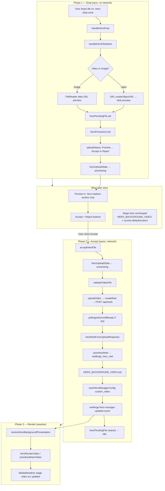

# BG-UX-01 — Hero Drag-and-Drop UX Enhancement Audit

**Mission type:** Product experience audit (not infrastructure repair)  
**Classification:** `BG-6C → Infrastructure Validation Complete` · `BG-UX-01 → Product Experience Optimization`  
**Date:** 2026-07-16  
**Constraint:** No changes to the working upload pipeline in this mission.

---

## Executive summary

The Hero **Drop → Preview → Accept → Upload → Replace** workflow is **implemented deliberately**, not as a broken stub. It is **consistent with Thumbnail Vault** (confirm-before-upload) and **inconsistent with MP4 Video Vault** (upload-on-drop). Production validation (BG-6C) proves the pipeline works when Accept is clicked; the observed “failure” on drop-only is **expectation mismatch**, not a backend defect.

**Recommended product decision:** **Keep the Accept gate** for Hero replacement (high-impact, site-wide visual change), and **improve affordance/copy** so users understand preview ≠ replacement. Do **not** auto-upload on drop without a separate approved UX mission.

---

## Primary question — classification

| Option | Verdict | Evidence |
|--------|---------|----------|
| **1. Intentional product design** | **Mostly yes** | Explicit Accept/Reject UI, shared copy `"Preview: … Accept or Reject"`, validation scripts click Accept, BG-5A documents “HERO PATH (preview + accept)” |
| **2. Temporary implementation artifact** | **No** | Mission 5.6 canonical identity, BG-5A/6B/6C traces, watchdog/timeouts, `heroUploadState` machine — mature implementation |
| **3. Inconsistency vs other uploads** | **Partially yes** | Matches **Thumbnail Vault**; diverges from **MP4 Vault** (“Appears instantly”) and **Studio feed upload** (select → metadata → Upload button) |

**Synthesis:** Accept is an **intentional confirmation model** for destructive/global Hero replacement, but **copy and placement** do not signal that clearly relative to the adjacent MP4 Vault zone.

---

## 1. Current behavior map

### Flow diagram



### Step-by-step: state, UI, triggers

| Step | State changes | UI | Upload trigger | Persistence trigger | Render trigger |
|------|---------------|-----|----------------|---------------------|----------------|
| **User drops file** | `heroPendingFile`, `heroPreviewUrl`, `heroIsDragOver` | Blob preview in **replace-section**; Accept/Reject appear; **stage hero unchanged** | None | None | None |
| **Preview showing** | `heroUploadState = 'previewing'` | `uploadStatus`: `"🎬 Preview: {name} - Accept or Reject"` | None | None | Stage still uses `$HERO_BACKGROUND_VIDEO` / selection mode |
| **User clicks Accept** | `heroUploadProcessing = true` → `'processing'` | Spinner: “Processing hero asset…” | **`acceptHeroFile()`** → `uploadVideo()` | After API ready: `saveHeroReel`, `saveHeroManagerConfig` | After config + event: reactives update `prioritizedHeroVideo` |
| **User clicks Reject** | `heroPendingFile` cleared, blob revoked | Drop zone empty again | None | None | None |
| **Upload complete** | `HERO_BACKGROUND_VIDEO`, manager config, canonical reel | Status: `"✅ Hero video uploaded"` | (already done) | `reelforge_hero_reel`, `reelforge_hero_manager_config` | `backgroundSource: custom_video` → presentation gate |
| **Render** | Store + in-memory config via event | Stage `<MediaRenderer>` src changes | — | — | `activeHeroMediaMode === 'video'` + `url={prioritizedHeroVideo}` |

### Key code anchors

| Concern | Location | Behavior |
|---------|----------|----------|
| Drop (preview only) | `HeroExperience.svelte` `handleHeroDrop` → `handleHeroFileSelect` | Sets `heroPendingFile`; **no** `createReel` |
| Upload gate | `acceptHeroFile()` | Only path that calls `uploadVideo` / `uploadThumbnail` |
| Preview UI | `section === 'replace'` block | Accept/Reject in `.hero-batch-controls` |
| State machine | `$: heroUploadState` | `idle` → `previewing` → `processing` → `idle` |
| Persistence | `saveHeroReel`, `saveHeroManagerConfig` | Canonical reel + `custom_video` pointer |
| Render | Reactive `heroRenderVideo`, `prioritizedHeroVideo` | Requires `custom_video` + resolved URL |
| Stage vs preview | Two `<MediaRenderer>` instances | Preview uses `$heroPreviewUrl` (blob); stage uses `prioritizedHeroVideo` |

---

## 2. Comparison with ReelForge upload philosophy

### Upload models in the product today

| Experience | Drop behavior | Confirm step | Upload API | Replaces global hero? | Copy cue |
|------------|---------------|--------------|------------|----------------------|----------|
| **Hero replace** | Preview only | **Accept required** | `POST /api/reels` (`category: HERO`) | **Yes** — stage background | “DROP OR CLICK TO REPLACE HERO” (no “Accept to upload”) |
| **Thumbnail Vault** | Preview only | **Accept required** | `POST /api/reels` | No — vault grid | “Preview … Accept or Reject” |
| **MP4 Video Vault** | **Upload immediately** | None | `POST /api/reels` | No — additive vault + feed | “DROP VIDEO HERE … **Appears instantly**” |
| **Studio feed upload** | File select/drop → `selectedFile` | **Upload button** | Separate flow via `handleUploadWithFaces` | No | Explicit “📤 UPLOAD TO {category}” |

### Consistency analysis

**Hero is consistent with:**
- Thumbnail Vault — same `pending*` store pattern, Accept/Reject buttons, `"Preview: … Accept or Reject"` status string, explicit audit log: *“upload happens on Accept”* (`VaultExperience.svelte`).

**Hero is inconsistent with:**
- MP4 Video Vault — validates on drop, uploads immediately, no preview gate (`handleVaultVideoDrop` → `uploadMedia` directly).
- User mental model from **adjacent UI in the same Content tab**: MP4 zone promises instant appearance; Hero zone says “replace” but does not say “confirm to replace.”

**Hero is analogous to:**
- Studio feed upload — multi-step commit, but uses a **labeled Upload button** rather than Accept/Reject.

### Architectural note (not UX bug)

After upload, Hero and Vault **share** `createReel()` → ingest → poll. Divergence is **only pre-POST** (BG-5A). Post-upload, Hero writes hero identity stores; Vault writes `personal_video_vault` and feed distribution. Hero assets are **filtered from vault** via `heroDomainGuard.isHeroAsset`.

---

## 3. UX risks

### Current Accept model

**Advantages**

| Benefit | Why it matters for Hero |
|---------|-------------------------|
| Prevents accidental replacement | Hero changes **every visitor’s** homepage background |
| Review before network cost | Large MP4s; validation runs at Accept |
| Reject without side effects | No orphan reels from aborted attempts (drop-only creates zero API rows — BG-6C) |
| Aligns with thumbnail confirm flow | Same studio muscle memory for “preview first” |
| Supports editorial patch | `acceptHeroFile` hydrates hero title/subtitle from filename when fields are default |

**Disadvantages**

| Risk | Evidence |
|------|----------|
| Extra action vs MP4 Vault | BG-6A automation dropped only; BG-6C PATH A identical |
| Drop ≠ upload expectation | Users may assume drag-and-drop completes the job |
| Preview location confusion | Preview in **replace-section**; stage hero stays old file until Accept |
| Copy ambiguity | “REPLACE HERO” reads like immediate action; status text easy to miss |
| Automation/test gaps | BG-6A checked storage without clicking Accept; wrong key `reelforge_hero_reel_identity` masked reel |

### Automatic upload model (hypothetical)

**Potential flow:** Drop → validate → upload → save config → replace hero (skip Accept).

| Dimension | Assessment |
|-----------|------------|
| **Implementation complexity** | **Medium** — move validate + `uploadVideo` from `acceptHeroFile` into drop handler; keep persistence/render chain; add undo or confirm toast |
| **Regression risk** | **High** — touches proven BG-6C path; Mission 5.6/5.6.5 tests assume Accept; watchdog/token logic lives in `acceptHeroFile` |
| **User benefit** | **Mixed** — faster for power users; worse for mistaken drops |
| **Consistency impact** | Aligns with MP4 Vault; **breaks** parity with Thumbnail Vault unless that changes too |

---

## 4. Production validation context (BG-6C)

Infrastructure phase is **closed**:

| Check | Result |
|-------|--------|
| Drop event | PASS |
| Accept + upload | PASS |
| API / ingest | PASS |
| `saveHeroReel` / config | PASS |
| `custom_video` + store | PASS |
| MediaRenderer rerender | PASS |
| Accept UI reachable | PASS |

**UX takeaway:** The product works as designed; the open question is whether the design matches user expectations.

---

## 5. Recommended product decision

### Decision: **Keep Accept; enhance affordance (Option A)**

**Rationale**

1. Hero replacement is **global and destructive** — stronger confirmation than additive vault upload.
2. Accept model is **codified** in tests, missions, and architecture docs — not accidental.
3. Thumbnail Vault already establishes a **confirm-before-upload** pattern in the same surface.
4. BG-6C shows **zero regression benefit** from changing upload logic; risk is in the wrong layer.

**Do not auto-upload on drop** until product explicitly chooses to align Hero with MP4 Vault *and* accepts regression testing scope for Mission 5.6 / BG-6C equivalents.

### Option B (future consideration): Auto-upload with soft confirm

Only if product prioritizes speed over mis-drop protection: upload on drop, show toast “Hero updated — Undo,” revert via previous `reelforge_hero_reel` snapshot. **Higher engineering and test cost**; not recommended as first step.

### Option C (not recommended): Remove Accept entirely

Violates mission constraints, increases accidental replacement risk, and contradicts thumbnail vault pattern without user research.

---

## 6. If UX enhancement is approved — minimal implementation plan

**Scope:** Presentation and copy only. **Do not** move `uploadVideo()` out of `acceptHeroFile()` in the first iteration.

### Files involved

| File | Change type |
|------|-------------|
| `frontend/src/components/experiences/HeroExperience.svelte` | Copy, optional inline helper text, optional preview→stage visual hint |
| `frontend/src/viewer/viewer.css` | Styles for confirmation banner / step indicator (if added) |
| `frontend/scripts/mission-bg-6a-production-ui-validate.mjs` | Fix hero test to click Accept; fix LS key to `reelforge_hero_reel` (test harness only) |

**No changes required (preserve pipeline):**

- `lib/api/media.js` — `createReel` / `uploadVideo`
- `lib/hero/heroReelIdentity.js` — `saveHeroReel`
- `lib/hero/heroIntelligence.js` — `saveHeroManagerConfig`
- `viewerContext.js` — store bootstrap
- Backend `/api/reels`

### Minimal UX enhancements (ordered by impact / effort)

1. **Copy alignment** — Replace zone subtitle: e.g. *“Step 1: Drop to preview · Step 2: Click Accept to upload and replace hero”* (mirrors explicit MP4 “Appears instantly” honesty).
2. **Status visibility** — Ensure `uploadStatus` preview message is visible near stage hero (shared studio status bar may be off-screen when scrolled to replace section).
3. **Stage affordance while pending** — Subtle banner on stage: *“Preview ready — Accept below to apply”* when `$heroPendingFile` is set (read-only bind; no upload move).
4. **Accept button label** — *“Accept & Replace Hero”* instead of generic *“Accept”* (matches destructive action).
5. **Automation/docs** — Update validation scripts to always run Accept path for hero tests.

### Validation steps (post-enhancement)

1. **PATH A regression:** Drop only → no POST, stage unchanged (intentional).
2. **PATH B regression:** Drop + Accept → BG-6C chain PASS.
3. **Copy review:** Hero zone text mentions two-step flow.
4. **Cross-flow check:** MP4 Vault still instant; Thumbnail still Accept.
5. **Reload:** Accepted hero persists (`reelforge_hero_reel` + `custom_video`).
6. **Playwright:** Extend `mission-bg-6c-hero-accept-trace.mjs` or BG-6A hero phase with Accept click.

---

## 7. Success criteria checklist

| Criterion | Status |
|-----------|--------|
| Current Hero behavior documented | ✓ |
| UX decision separated from infrastructure debugging | ✓ |
| No production pipeline changes in this mission | ✓ |
| Clear product recommendation | ✓ — Keep Accept; improve affordance |

---

## 8. Mission lineage

```
BG-5A  Pipeline trace (Hero preview+accept vs Vault immediate)
BG-5B  Reel resolution
BG-6A  Production UI (hero drop-only false negative)
BG-6B  Canonical trace (render gates)
BG-6C  Accept execution trace (PATH A vs B)
BG-UX-01  Product UX audit ← this document
```

---

*BG-UX-01 — analysis only. No application or backend code modified.*
