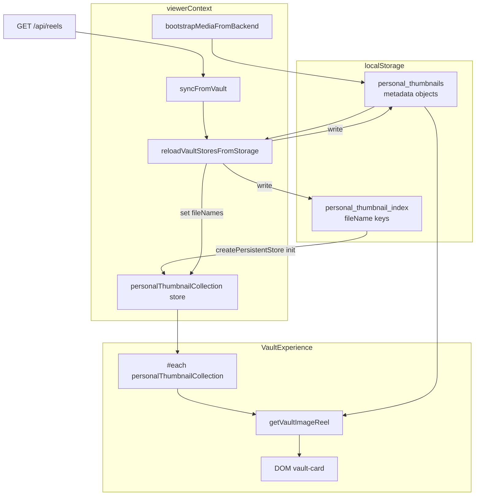

# MISSION_5_7_5_RENDER_SOURCE_AUDIT

Generated: 2026-07-13T06:41:24.041Z

## Mode: Investigation only (no patches)

---

## 1. Complete render pipeline

```
DOM Card (.vault-grid--images .vault-card)
  ↓ #each in VaultExperience.svelte:1285
  ↓ ($personalThumbnailCollection ?? []).filter(Boolean)
  ↓ Svelte store: personalThumbnailCollection
  ↓ createPersistentStore('personal_thumbnail_index') — init loads index from localStorage
  ↓ viewerContext.reloadVaultStoresFromStorage() — sets index from personal_thumbnails fileNames
  ↓ mediaBootstrap.ingestThumbReelsToVault() — refreshes metadata only (no new entries since 5.7.2)
  ↓ localStorage: personal_thumbnails (metadata) + personal_thumbnail_index (render keys)
  ↓ backend GET /api/reels
```

**Card content resolution (per item):**
```
collection item (string fileName or object)
  ↓ getVaultImageReel(img, i) — vaultUtils.js:237
  ↓ findStoredThumbnailEntry(personal_thumbnails)
  ↓ resolve url → MediaThumbnail OR {:else} .placeholder div
```

---

## 2. Store ownership diagram



---

## 3. Count comparison table

| Stage | Count |
|-------|------:|
| Backend reels (/thumbs/) | 59 |
| personal_thumbnails (localStorage) | 15 |
| personal_thumbnail_index (localStorage) | 15 |
| personalThumbnailCollection (derived) | 15 |
| Rendered DOM cards | 15 |
| Placeholder cards | 15 |
| Feed personal thumbnails | 15 |
| UI heading | Your Thumbnails (15) |

---

## 4. First divergence

**STOP — first mismatch:**

```json
{
  "stage": "backendReels (59) → personal_thumbnails (15)",
  "expected": 59,
  "actual": 15,
  "delta": -44,
  "type": "count_pipeline_mismatch"
}
```

---

## 5. Exact file / function / line

| Responsibility | Location |
|----------------|----------|
| Render loop source | `VaultExperience.svelte:1285` — `{#each ($personalThumbnailCollection ?? []).filter(Boolean)}` |
| Heading count | `VaultExperience.svelte:1235` — `{$personalThumbnailCollection.length}` |
| Store definition | `viewerContext.js:276` — `createPersistentStore(CONFIG.THUMBNAIL_INDEX_KEY)` |
| Index ← metadata sync | `viewerContext.js:790` — `personalThumbnailCollection.set(normalizedThumbs.map(fileName))` |
| Placeholder branch | `VaultExperience.svelte:1310-1311` — `{:else} div.placeholder` when `!isImage(reel) || !reel.url` |
| Dynamic placeholder on 404 | `vaultUtils.js:166-170` — `handleVaultMediaError` injects `.placeholder` |
| Metadata lookup | `vaultUtils.js:237` — `getVaultImageReel` |

**Rendered cards originate from:** `personalThumbnailCollection` backed by `personal_thumbnail_index` localStorage, **not** directly from backend catalog or feed.

---

## 6. Duplication source checklist

- [x] personal_thumbnails
- [x] personal_thumbnail_index
- [x] viewerContext
- [x] bootstrap merge
- [ ] demo data
- [x] placeholder generator
- [x] derived store
- [x] cached collection
- [ ] another source

---

## 7. Per-card forensic report

### Card 0

| Field | Value |
|-------|-------|
| renderIndex | 0 |
| store | personalThumbnailCollection |
| component | VaultExperience.svelte:1285 |
| collectionItem | `"phantom-no-id-0.png"` |
| displayName | phantom-no-id-0.png |
| id | — |
| fileName | phantom-no-id-0.png |
| url | /thumbs/phantom-no-id-0.png |
| placeholder | true |
| orphaned | true |
| active_upload | false |
| hasStoredMetadata | true |
| backendExists | false |
| diskExists | false |

### Card 1

| Field | Value |
|-------|-------|
| renderIndex | 1 |
| store | personalThumbnailCollection |
| component | VaultExperience.svelte:1285 |
| collectionItem | `"phantom-no-id-1.png"` |
| displayName | phantom-no-id-1.png |
| id | — |
| fileName | phantom-no-id-1.png |
| url | /thumbs/phantom-no-id-1.png |
| placeholder | true |
| orphaned | true |
| active_upload | false |
| hasStoredMetadata | true |
| backendExists | false |
| diskExists | false |

### Card 2

| Field | Value |
|-------|-------|
| renderIndex | 2 |
| store | personalThumbnailCollection |
| component | VaultExperience.svelte:1285 |
| collectionItem | `"phantom-no-id-2.png"` |
| displayName | phantom-no-id-2.png |
| id | — |
| fileName | phantom-no-id-2.png |
| url | /thumbs/phantom-no-id-2.png |
| placeholder | true |
| orphaned | true |
| active_upload | false |
| hasStoredMetadata | true |
| backendExists | false |
| diskExists | false |

### Card 3

| Field | Value |
|-------|-------|
| renderIndex | 3 |
| store | personalThumbnailCollection |
| component | VaultExperience.svelte:1285 |
| collectionItem | `"phantom-no-id-3.png"` |
| displayName | phantom-no-id-3.png |
| id | — |
| fileName | phantom-no-id-3.png |
| url | /thumbs/phantom-no-id-3.png |
| placeholder | true |
| orphaned | true |
| active_upload | false |
| hasStoredMetadata | true |
| backendExists | false |
| diskExists | false |

### Card 4

| Field | Value |
|-------|-------|
| renderIndex | 4 |
| store | personalThumbnailCollection |
| component | VaultExperience.svelte:1285 |
| collectionItem | `"phantom-no-id-4.png"` |
| displayName | phantom-no-id-4.png |
| id | — |
| fileName | phantom-no-id-4.png |
| url | /thumbs/phantom-no-id-4.png |
| placeholder | true |
| orphaned | true |
| active_upload | false |
| hasStoredMetadata | true |
| backendExists | false |
| diskExists | false |

### Card 5

| Field | Value |
|-------|-------|
| renderIndex | 5 |
| store | personalThumbnailCollection |
| component | VaultExperience.svelte:1285 |
| collectionItem | `"phantom-no-id-5.png"` |
| displayName | phantom-no-id-5.png |
| id | — |
| fileName | phantom-no-id-5.png |
| url | /thumbs/phantom-no-id-5.png |
| placeholder | true |
| orphaned | true |
| active_upload | false |
| hasStoredMetadata | true |
| backendExists | false |
| diskExists | false |

### Card 6

| Field | Value |
|-------|-------|
| renderIndex | 6 |
| store | personalThumbnailCollection |
| component | VaultExperience.svelte:1285 |
| collectionItem | `"phantom-no-id-6.png"` |
| displayName | phantom-no-id-6.png |
| id | — |
| fileName | phantom-no-id-6.png |
| url | /thumbs/phantom-no-id-6.png |
| placeholder | true |
| orphaned | true |
| active_upload | false |
| hasStoredMetadata | true |
| backendExists | false |
| diskExists | false |

### Card 7

| Field | Value |
|-------|-------|
| renderIndex | 7 |
| store | personalThumbnailCollection |
| component | VaultExperience.svelte:1285 |
| collectionItem | `"phantom-no-id-7.png"` |
| displayName | phantom-no-id-7.png |
| id | — |
| fileName | phantom-no-id-7.png |
| url | /thumbs/phantom-no-id-7.png |
| placeholder | true |
| orphaned | true |
| active_upload | false |
| hasStoredMetadata | true |
| backendExists | false |
| diskExists | false |

### Card 8

| Field | Value |
|-------|-------|
| renderIndex | 8 |
| store | personalThumbnailCollection |
| component | VaultExperience.svelte:1285 |
| collectionItem | `"phantom-no-id-8.png"` |
| displayName | phantom-no-id-8.png |
| id | — |
| fileName | phantom-no-id-8.png |
| url | /thumbs/phantom-no-id-8.png |
| placeholder | true |
| orphaned | true |
| active_upload | false |
| hasStoredMetadata | true |
| backendExists | false |
| diskExists | false |

### Card 9

| Field | Value |
|-------|-------|
| renderIndex | 9 |
| store | personalThumbnailCollection |
| component | VaultExperience.svelte:1285 |
| collectionItem | `"phantom-no-id-9.png"` |
| displayName | phantom-no-id-9.png |
| id | — |
| fileName | phantom-no-id-9.png |
| url | /thumbs/phantom-no-id-9.png |
| placeholder | true |
| orphaned | true |
| active_upload | false |
| hasStoredMetadata | true |
| backendExists | false |
| diskExists | false |

### Card 10

| Field | Value |
|-------|-------|
| renderIndex | 10 |
| store | personalThumbnailCollection |
| component | VaultExperience.svelte:1285 |
| collectionItem | `"phantom-no-id-10.png"` |
| displayName | phantom-no-id-10.png |
| id | — |
| fileName | phantom-no-id-10.png |
| url | /thumbs/phantom-no-id-10.png |
| placeholder | true |
| orphaned | true |
| active_upload | false |
| hasStoredMetadata | true |
| backendExists | false |
| diskExists | false |

### Card 11

| Field | Value |
|-------|-------|
| renderIndex | 11 |
| store | personalThumbnailCollection |
| component | VaultExperience.svelte:1285 |
| collectionItem | `"phantom-no-id-11.png"` |
| displayName | phantom-no-id-11.png |
| id | — |
| fileName | phantom-no-id-11.png |
| url | /thumbs/phantom-no-id-11.png |
| placeholder | true |
| orphaned | true |
| active_upload | false |
| hasStoredMetadata | true |
| backendExists | false |
| diskExists | false |

### Card 12

| Field | Value |
|-------|-------|
| renderIndex | 12 |
| store | personalThumbnailCollection |
| component | VaultExperience.svelte:1285 |
| collectionItem | `"phantom-no-id-12.png"` |
| displayName | phantom-no-id-12.png |
| id | — |
| fileName | phantom-no-id-12.png |
| url | /thumbs/phantom-no-id-12.png |
| placeholder | true |
| orphaned | true |
| active_upload | false |
| hasStoredMetadata | true |
| backendExists | false |
| diskExists | false |

### Card 13

| Field | Value |
|-------|-------|
| renderIndex | 13 |
| store | personalThumbnailCollection |
| component | VaultExperience.svelte:1285 |
| collectionItem | `"phantom-no-id-13.png"` |
| displayName | phantom-no-id-13.png |
| id | — |
| fileName | phantom-no-id-13.png |
| url | /thumbs/phantom-no-id-13.png |
| placeholder | true |
| orphaned | true |
| active_upload | false |
| hasStoredMetadata | true |
| backendExists | false |
| diskExists | false |

### Card 14

| Field | Value |
|-------|-------|
| renderIndex | 14 |
| store | personalThumbnailCollection |
| component | VaultExperience.svelte:1285 |
| collectionItem | `"phantom-no-id-14.png"` |
| displayName | phantom-no-id-14.png |
| id | — |
| fileName | phantom-no-id-14.png |
| url | /thumbs/phantom-no-id-14.png |
| placeholder | true |
| orphaned | true |
| active_upload | false |
| hasStoredMetadata | true |
| backendExists | false |
| diskExists | false |


---

## 8. Store dumps (summary)

### personal_thumbnail_index (15)

```json
[
  "phantom-no-id-0.png",
  "phantom-no-id-1.png",
  "phantom-no-id-2.png",
  "phantom-no-id-3.png",
  "phantom-no-id-4.png",
  "phantom-no-id-5.png",
  "phantom-no-id-6.png",
  "phantom-no-id-7.png",
  "phantom-no-id-8.png",
  "phantom-no-id-9.png",
  "phantom-no-id-10.png",
  "phantom-no-id-11.png",
  "phantom-no-id-12.png",
  "phantom-no-id-13.png",
  "phantom-no-id-14.png"
]
```

### personal_thumbnails (15)

```json
[
  {
    "fileName": "phantom-no-id-0.png",
    "name": "phantom-no-id-0.png",
    "title": "phantom-no-id-0.png",
    "url": "/thumbs/phantom-no-id-0.png",
    "addedAt": "2026-07-13T06:41:03.357Z",
    "orphaned": true
  },
  {
    "fileName": "phantom-no-id-1.png",
    "name": "phantom-no-id-1.png",
    "title": "phantom-no-id-1.png",
    "url": "/thumbs/phantom-no-id-1.png",
    "addedAt": "2026-07-13T06:41:03.357Z",
    "orphaned": true
  },
  {
    "fileName": "phantom-no-id-2.png",
    "name": "phantom-no-id-2.png",
    "title": "phantom-no-id-2.png",
    "url": "/thumbs/phantom-no-id-2.png",
    "addedAt": "2026-07-13T06:41:03.357Z",
    "orphaned": true
  },
  {
    "fileName": "phantom-no-id-3.png",
    "name": "phantom-no-id-3.png",
    "title": "phantom-no-id-3.png",
    "url": "/thumbs/phantom-no-id-3.png",
    "addedAt": "2026-07-13T06:41:03.357Z",
    "orphaned": true
  },
  {
    "fileName": "phantom-no-id-4.png",
    "name": "phantom-no-id-4.png",
    "title": "phantom-no-id-4.png",
    "url": "/thumbs/phantom-no-id-4.png",
    "addedAt": "2026-07-13T06:41:03.357Z",
    "orphaned": true
  },
  {
    "fileName": "phantom-no-id-5.png",
    "name": "phantom-no-id-5.png",
    "title": "phantom-no-id-5.png",
    "url": "/thumbs/phantom-no-id-5.png",
    "addedAt": "2026-07-13T06:41:03.357Z",
    "orphaned": true
  },
  {
    "fileName": "phantom-no-id-6.png",
    "name": "phantom-no-id-6.png",
    "title": "phantom-no-id-6.png",
    "url": "/thumbs/phantom-no-id-6.png",
    "addedAt": "2026-07-13T06:41:03.357Z",
    "orphaned": true
  },
  {
    "fileName": "phantom-no-id-7.png",
    "name": "phantom-no-id-7.png",
    "title": "phantom-no-id-7.png",
    "url": "/thumbs/phantom-no-id-7.png",
    "addedAt": "2026-07-13T06:41:03.357Z",
    "orphaned": true
  },
  {
    "fileName": "phantom-no-id-8.png",
    "name": "phantom-no-id-8.png",
    "title": "phantom-no-id-8.png",
    "url": "/thumbs/phantom-no-id-8.png",
    "addedAt": "2026-07-13T06:41:03.357Z",
    "orphaned": true
  },
  {
    "fileName": "phantom-no-id-9.png",
    "name": "phantom-no-id-9.png",
    "title": "phantom-no-id-9.png",
    "url": "/thumbs/phantom-no-id-9.png",
    "addedAt": "2026-07-13T06:41:03.357Z",
    "orphaned": true
  },
  {
    "fileName": "phantom-no-id-10.png",
    "name": "phantom-no-id-10.png",
    "title": "phantom-no-id-10.png",
    "url": "/thumbs/phantom-no-id-10.png",
    "addedAt": "2026-07-13T06:41:03.357Z",
    "orphaned": true
  },
  {
    "fileName": "phantom-no-id-11.png",
    "name": "phantom-no-id-11.png",
    "title": "phantom-no-id-11.png",
    "url": "/thumbs/phantom-no-id-11.png",
    "addedAt": "2026-07-13T06:41:03.357Z",
    "orphaned": true
  },
  {
    "fileName": "phantom-no-id-12.png",
    "name": "phantom-no-id-12.png",
    "title": "phantom-no-id-12.png",
    "url": "/thumbs/phantom-no-id-12.png",
    "addedAt": "2026-07-13T06:41:03.357Z",
    "orphaned": true
  },
  {
    "fileName": "phantom-no-id-13.png",
    "name": "phantom-no-id-13.png",
    "title": "phantom-no-id-13.png",
    "url": "/thumbs/phantom-no-id-13.png",
    "addedAt": "2026-07-13T06:41:03.357Z",
    "orphaned": true
  },
  {
    "fileName": "phantom-no-id-14.png",
    "name": "phantom-no-id-14.png",
    "title": "phantom-no-id-14.png",
    "url": "/thumbs/phantom-no-id-14.png",
    "addedAt": "2026-07-13T06:41:03.357Z",
    "orphaned": true
  }
]
```

---

## 9. Instrumentation log sample

```json
[
  {
    "tag": "[VAULT_STORAGE]",
    "payload": {
      "key": "personal_thumbnails",
      "action": "getStoredThumbnailEntries",
      "count": 15,
      "ts": "2026-07-13T06:41:13.655Z"
    },
    "at": 1783924873655
  },
  {
    "tag": "[VAULT_STORAGE]",
    "payload": {
      "key": "personal_thumbnails",
      "action": "getStoredThumbnailEntries",
      "count": 15,
      "ts": "2026-07-13T06:41:13.656Z"
    },
    "at": 1783924873656
  },
  {
    "tag": "[VAULT_STORAGE]",
    "payload": {
      "key": "personal_thumbnails",
      "action": "getStoredThumbnailEntries",
      "count": 15,
      "ts": "2026-07-13T06:41:13.656Z"
    },
    "at": 1783924873656
  },
  {
    "tag": "[VAULT_STORAGE]",
    "payload": {
      "key": "personal_thumbnails",
      "action": "getStoredThumbnailEntries",
      "count": 15,
      "ts": "2026-07-13T06:41:13.656Z"
    },
    "at": 1783924873656
  },
  {
    "tag": "[VAULT_STORAGE]",
    "payload": {
      "key": "personal_thumbnails",
      "action": "getStoredThumbnailEntries",
      "count": 15,
      "ts": "2026-07-13T06:41:13.656Z"
    },
    "at": 1783924873656
  },
  {
    "tag": "[VAULT_STORAGE]",
    "payload": {
      "key": "personal_thumbnails",
      "action": "getStoredThumbnailEntries",
      "count": 15,
      "ts": "2026-07-13T06:41:13.656Z"
    },
    "at": 1783924873656
  },
  {
    "tag": "[VAULT_STORAGE]",
    "payload": {
      "key": "personal_thumbnails",
      "action": "getStoredThumbnailEntries",
      "count": 15,
      "ts": "2026-07-13T06:41:13.656Z"
    },
    "at": 1783924873656
  },
  {
    "tag": "[VAULT_STORAGE]",
    "payload": {
      "key": "personal_thumbnails",
      "action": "getStoredThumbnailEntries",
      "count": 15,
      "ts": "2026-07-13T06:41:13.656Z"
    },
    "at": 1783924873656
  },
  {
    "tag": "[VAULT_STORAGE]",
    "payload": {
      "key": "personal_thumbnails",
      "action": "getStoredThumbnailEntries",
      "count": 15,
      "ts": "2026-07-13T06:41:13.657Z"
    },
    "at": 1783924873657
  },
  {
    "tag": "[VAULT_STORAGE]",
    "payload": {
      "key": "personal_thumbnails",
      "action": "getStoredThumbnailEntries",
      "count": 15,
      "ts": "2026-07-13T06:41:13.657Z"
    },
    "at": 1783924873657
  },
  {
    "tag": "[VAULT_STORAGE]",
    "payload": {
      "key": "personal_thumbnails",
      "action": "getStoredThumbnailEntries",
      "count": 15,
      "ts": "2026-07-13T06:41:13.657Z"
    },
    "at": 1783924873657
  },
  {
    "tag": "[VAULT_STORAGE]",
    "payload": {
      "key": "personal_thumbnails",
      "action": "getStoredThumbnailEntries",
      "count": 15,
      "ts": "2026-07-13T06:41:13.657Z"
    },
    "at": 1783924873657
  },
  {
    "tag": "[VAULT_STORAGE]",
    "payload": {
      "key": "personal_thumbnails",
      "action": "getStoredThumbnailEntries",
      "count": 15,
      "ts": "2026-07-13T06:41:13.657Z"
    },
    "at": 1783924873657
  },
  {
    "tag": "[VAULT_STORAGE]",
    "payload": {
      "key": "personal_thumbnails",
      "action": "getStoredThumbnailEntries",
      "count": 15,
      "ts": "2026-07-13T06:41:13.658Z"
    },
    "at": 1783924873658
  },
  {
    "tag": "[VAULT_STORAGE]",
    "payload": {
      "key": "personal_thumbnails",
      "action": "getStoredThumbnailEntries",
      "count": 15,
      "ts": "2026-07-13T06:41:13.658Z"
    },
    "at": 1783924873658
  },
  {
    "tag": "[VAULT_STORAGE]",
    "payload": {
      "key": "personal_thumbnails",
      "action": "getStoredThumbnailEntries",
      "count": 15,
      "ts": "2026-07-13T06:41:13.658Z"
    },
    "at": 1783924873658
  },
  {
    "tag": "[VAULT_STORAGE]",
    "payload": {
      "key": "personal_thumbnails",
      "action": "getStoredThumbnailEntries",
      "count": 15,
      "ts": "2026-07-13T06:41:13.658Z"
    },
    "at": 1783924873658
  },
  {
    "tag": "[VAULT_STORAGE]",
    "payload": {
      "key": "personal_thumbnails",
      "action": "getStoredThumbnailEntries",
      "count": 15,
      "ts": "2026-07-13T06:41:13.658Z"
    },
    "at": 1783924873658
  },
  {
    "tag": "[VAULT_STORAGE]",
    "payload": {
      "key": "personal_thumbnails",
      "action": "getStoredThumbnailEntries",
      "count": 15,
      "ts": "2026-07-13T06:41:13.658Z"
    },
    "at": 1783924873658
  },
  {
    "tag": "[VAULT_STORAGE]",
    "payload": {
      "key": "personal_thumbnails",
      "action": "getStoredThumbnailEntries",
      "count": 15,
      "ts": "2026-07-13T06:41:13.658Z"
    },
    "at": 1783924873658
  },
  {
    "tag": "[VAULT_STORAGE]",
    "payload": {
      "key": "personal_thumbnails",
      "action": "getStoredThumbnailEntries",
      "count": 15,
      "ts": "2026-07-13T06:41:13.659Z"
    },
    "at": 1783924873659
  },
  {
    "tag": "[VAULT_STORAGE]",
    "payload": {
      "key": "personal_thumbnails",
      "action": "getStoredThumbnailEntries",
      "count": 15,
      "ts": "2026-07-13T06:41:13.659Z"
    },
    "at": 1783924873659
  },
  {
    "tag": "[VAULT_STORAGE]",
    "payload": {
      "key": "personal_thumbnails",
      "action": "getStoredThumbnailEntries",
      "count": 15,
      "ts": "2026-07-13T06:41:13.659Z"
    },
    "at": 1783924873659
  },
  {
    "tag": "[VAULT_STORAGE]",
    "payload": {
      "key": "personal_thumbnails",
      "action": "getStoredThumbnailEntries",
      "count": 15,
      "ts": "2026-07-13T06:41:13.659Z"
    },
    "at": 1783924873659
  },
  {
    "tag": "[VAULT_STORAGE]",
    "payload": {
      "key": "personal_thumbnails",
      "action": "getStoredThumbnailEntries",
      "count": 15,
      "ts": "2026-07-13T06:41:13.659Z"
    },
    "at": 1783924873659
  },
  {
    "tag": "[VAULT_STORAGE]",
    "payload": {
      "key": "personal_thumbnails",
      "action": "getStoredThumbnailEntries",
      "count": 15,
      "ts": "2026-07-13T06:41:13.659Z"
    },
    "at": 1783924873659
  },
  {
    "tag": "[VAULT_STORAGE]",
    "payload": {
      "key": "personal_thumbnails",
      "action": "getStoredThumbnailEntries",
      "count": 15,
      "ts": "2026-07-13T06:41:13.659Z"
    },
    "at": 1783924873659
  },
  {
    "tag": "[VAULT_STORAGE]",
    "payload": {
      "key": "personal_thumbnails",
      "action": "getStoredThumbnailEntries",
      "count": 15,
      "ts": "2026-07-13T06:41:13.659Z"
    },
    "at": 1783924873659
  },
  {
    "tag": "[VAULT_STORAGE]",
    "payload": {
      "key": "personal_thumbnails",
      "action": "getStoredThumbnailEntries",
      "count": 15,
      "ts": "2026-07-13T06:41:13.659Z"
    },
    "at": 1783924873659
  },
  {
    "tag": "[VAULT_STORAGE]",
    "payload": {
      "key": "personal_thumbnails",
      "action": "getStoredThumbnailEntries",
      "count": 15,
      "ts": "2026-07-13T06:41:13.660Z"
    },
    "at": 1783924873660
  },
  {
    "tag": "[VAULT_STORAGE]",
    "payload": {
      "key": "personal_thumbnails",
      "action": "getStoredThumbnailEntries",
      "count": 15,
      "ts": "2026-07-13T06:41:13.660Z"
    },
    "at": 1783924873660
  },
  {
    "tag": "[VAULT_STORAGE]",
    "payload": {
      "key": "personal_thumbnails",
      "action": "getStoredThumbnailEntries",
      "count": 15,
      "ts": "2026-07-13T06:41:13.660Z"
    },
    "at": 1783924873660
  },
  {
    "tag": "[VAULT_STORAGE]",
    "payload": {
      "key": "personal_thumbnails",
      "action": "getStoredThumbnailEntries",
      "count": 15,
      "ts": "2026-07-13T06:41:13.660Z"
    },
    "at": 1783924873660
  },
  {
    "tag": "[VAULT_STORAGE]",
    "payload": {
      "key": "personal_thumbnails",
      "action": "getStoredThumbnailEntries",
      "count": 15,
      "ts": "2026-07-13T06:41:13.660Z"
    },
    "at": 1783924873660
  },
  {
    "tag": "[VAULT_STORAGE]",
    "payload": {
      "key": "personal_thumbnails",
      "action": "getStoredThumbnailEntries",
      "count": 15,
      "ts": "2026-07-13T06:41:13.660Z"
    },
    "at": 1783924873660
  },
  {
    "tag": "[VAULT_STORAGE]",
    "payload": {
      "key": "personal_thumbnails",
      "action": "getStoredThumbnailEntries",
      "count": 15,
      "ts": "2026-07-13T06:41:13.660Z"
    },
    "at": 1783924873660
  },
  {
    "tag": "[VAULT_STORAGE]",
    "payload": {
      "key": "personal_thumbnails",
      "action": "getStoredThumbnailEntries",
      "count": 15,
      "ts": "2026-07-13T06:41:13.660Z"
    },
    "at": 1783924873660
  },
  {
    "tag": "[VAULT_STORAGE]",
    "payload": {
      "key": "personal_thumbnails",
      "action": "getStoredThumbnailEntries",
      "count": 15,
      "ts": "2026-07-13T06:41:13.661Z"
    },
    "at": 1783924873661
  },
  {
    "tag": "[VAULT_STORAGE]",
    "payload": {
      "key": "personal_thumbnails",
      "action": "getStoredThumbnailEntries",
      "count": 15,
      "ts": "2026-07-13T06:41:13.661Z"
    },
    "at": 1783924873661
  },
  {
    "tag": "[VAULT_STORAGE]",
    "payload": {
      "key": "personal_thumbnails",
      "action": "getStoredThumbnailEntries",
      "count": 15,
      "ts": "2026-07-13T06:41:13.661Z"
    },
    "at": 1783924873661
  }
]
```

---

## 10. Placeholder analysis

- Card 0: placeholder=true, id=none, fileName=phantom-no-id-0.png, backend=false, disk=false, orphaned=true
- Card 1: placeholder=true, id=none, fileName=phantom-no-id-1.png, backend=false, disk=false, orphaned=true
- Card 2: placeholder=true, id=none, fileName=phantom-no-id-2.png, backend=false, disk=false, orphaned=true
- Card 3: placeholder=true, id=none, fileName=phantom-no-id-3.png, backend=false, disk=false, orphaned=true
- Card 4: placeholder=true, id=none, fileName=phantom-no-id-4.png, backend=false, disk=false, orphaned=true
- Card 5: placeholder=true, id=none, fileName=phantom-no-id-5.png, backend=false, disk=false, orphaned=true
- Card 6: placeholder=true, id=none, fileName=phantom-no-id-6.png, backend=false, disk=false, orphaned=true
- Card 7: placeholder=true, id=none, fileName=phantom-no-id-7.png, backend=false, disk=false, orphaned=true
- Card 8: placeholder=true, id=none, fileName=phantom-no-id-8.png, backend=false, disk=false, orphaned=true
- Card 9: placeholder=true, id=none, fileName=phantom-no-id-9.png, backend=false, disk=false, orphaned=true
- Card 10: placeholder=true, id=none, fileName=phantom-no-id-10.png, backend=false, disk=false, orphaned=true
- Card 11: placeholder=true, id=none, fileName=phantom-no-id-11.png, backend=false, disk=false, orphaned=true
- Card 12: placeholder=true, id=none, fileName=phantom-no-id-12.png, backend=false, disk=false, orphaned=true
- Card 13: placeholder=true, id=none, fileName=phantom-no-id-13.png, backend=false, disk=false, orphaned=true
- Card 14: placeholder=true, id=none, fileName=phantom-no-id-14.png, backend=false, disk=false, orphaned=true

**Placeholder creation paths:**
1. **Template** (`VaultExperience.svelte:1310`) — `getVaultImageReel` returns empty url or non-image
2. **Error handler** (`vaultUtils.js:166`) — image 404 triggers dynamic `.placeholder` insertion

---

Audit command: `node scripts/mission-5.7.5-render-audit.mjs`
