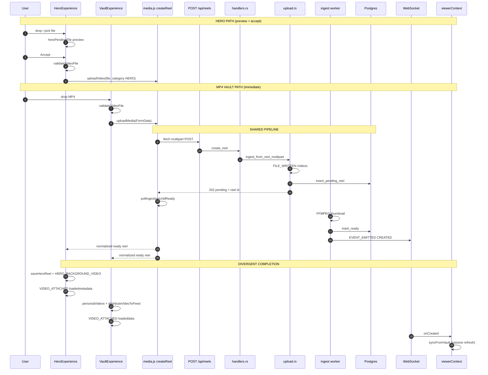

# MISSION BG-5A — Canonical Upload Pipeline Trace

**Date:** 2026-07-13  
**Scope:** Instrumentation + forensics only — **no behavior changes**  
**Status:** Complete

---

## Executive Summary

Both Hero MP4 and MP4 Vault uploads **share a single backend ingress** (`POST /api/reels` → `ingest_from_reel_multipart`). They **diverge immediately after drop** on the frontend. The symptom **"Processing hero asset..."** maps to `heroUploadProcessing=true` inside `acceptHeroFile()` — a **Hero-only Accept gate** that MP4 Vault does not have.

**Predicted first stall boundary (static analysis):**  
Between `[PIPELINE] UPLOAD_STARTED` and `[PIPELINE] POST_COMPLETED` inside `createReel()` — specifically `validateVideoFile()` (Hero Accept), `pollIngestionUntilReady()` (both paths when backend returns 202/pending), or client-side `heroReelFromUploadResponse()` rejecting empty `url`/`id`.

**Predicted placeholder stall (MP4 Vault):**  
Between `[PIPELINE] POST_COMPLETED` and `[PIPELINE] VIDEO_ATTACHED` — vault card renders `▶` when `!(isVideo(reel) && reel.url)` in `VaultExperience.svelte`.

---

## Part 1 — Complete Execution Graph

### A) Hero Upload (MP4 / image)

```
Drag & Drop / file picker
  HeroExperience.handleHeroDrop / handleHeroFileSelect          [SYNC → preview only]
    heroPendingFile.set({ file, preview, type })              [STORE: heroPendingFile]
    heroPreviewUrl.set(blob|data URL)                         [STORE: heroPreviewUrl]
    heroUploadState → 'previewing'                            [REACTIVE]
  User clicks Accept
    HeroExperience.acceptHeroFile()                           [ASYNC]
      heroUploadProcessing = true                             [STATE → 'processing' UI]
      validateVideoFile(file)                                 [ASYNC + 15s timeout] — video only
      uploadVideo | uploadThumbnail                           [DYNAMIC IMPORT]
        media.js → createReel(FormData)                       [ASYNC]
          enforceUploadPolicy                                 [SYNC gate]
          fetch POST /api/reels                               [ASYNC / Promise]
          pollIngestionUntilReady(reelId)                     [ASYNC loop if 202/pending]
      heroReelFromUploadResponse(created)                     [SYNC normalize]
      saveHeroReel(reel)                                      [localStorage: reelforge_hero_reel]
      HERO_BACKGROUND_VIDEO.set(reel.url)                     [STORE]
      saveHeroManagerConfig({ heroAssetId, backgroundSource }) [localStorage]
      heroPendingFile.set(null)                               [STORE clear]
      heroUploadProcessing = false                            [STATE → idle]
  Hero stage render
    MediaRenderer url={prioritizedHeroVideo}                  [DOM]
      on:loadedmetadata → handleHeroVideoLoad                 [EVENT]
        heroVideoLoaded.set(true)                             [STORE]
```

**Hero does NOT call:** `syncFromVault()` after upload.

### B) MP4 Vault Upload

```
Drag & Drop
  VaultExperience.handleVaultVideoDrop                        [ASYNC — immediate upload]
    validateVideoFile(file)                                   [ASYNC]
    FormData.append('video', file)
    uploadMedia(formData) → createReel                        [ASYNC — shared with Hero]
      (same POST /api/reels → poll path as Hero)
    reelToVaultEntry(response) → personalVideos.update        [STORE]
    persistPersonalVault → localStorage personal_video_vault  [LS write]
    AI_CLEANUP_AGENT.distributeVideoToFeed(entry)           [STORE: feed]
  Vault grid render
    getVaultVideoReel(video) → isVideo(reel) && reel.url ?
      MediaRenderer : ▶ placeholder                           [DOM branch]
      on:loadeddata → VIDEO_ATTACHED checkpoint               [EVENT]
```

**MP4 Vault does NOT call:** `syncFromVault()` after drop upload.

### Shared Backend Path (both pipelines)

```
POST /api/reels
  handlers.rs::create_reel                                    [ASYNC Actix handler]
    ingest_from_reel_multipart(svc, payload)                  [upload.rs]
      media_api::parse_reel_multipart                         [ASYNC]
      ingest_video_bytes | ingest_image_only
        std::fs::write → /videos/{uuid}.mp4                   [SYNC disk]
        reels::insert_pending_reel                            [ASYNC DB]
        jobs::enqueue (if no user thumb)                      [ASYNC DB]
        OR reels::mark_ready + publish_reel_ready             [immediate ready]
  ingestion worker (background)
    jobs::claim_next → ffmpeg::extract_thumbnail_at_1s        [ASYNC tokio]
    reels::mark_ready → publish_reel_ready                      [EVENT: CREATED]
```

### Viewer Bootstrap (post-upload visibility)

```
Viewer.svelte onMount
  mountViewer()                                               [viewerContext.js]
    bootstrapMediaFromBackend()                               [GET /api/reels]
    hydrateHeroBackgroundStores()
    syncFromVault(true)                                       [GET /api/reels → feed/vault merge]
    connectReelEventSocket({ onCreated })                     [WebSocket /ws/control-center]
      onCreated → syncFromVault(true)                         [ASYNC refresh]
      dispatchEvent('reelforge:upload-updated')               [CustomEvent]
```

---

## Async Boundaries, Promises, Events

| Stage | Hero | MP4 Vault | Mechanism |
|-------|------|-----------|-----------|
| Drop handler | sync select → preview | async upload immediately | `handleHeroFileSelect` vs `await uploadMedia` |
| Accept gate | **Yes** (`acceptHeroFile`) | **No** | User click |
| Upload API | `uploadVideo` / `uploadThumbnail` | `uploadMedia(formData)` | Both → `createReel` |
| Ingest wait | `pollIngestionUntilReady` | same | Promise loop 800ms / 120s timeout |
| Vault sync | **skipped** | **skipped** | Neither calls `syncFromVault` post-upload |
| WS refresh | passive (if connected) | passive | `CREATED` → `syncFromVault` |
| Hero DOM ready | `loadedmetadata` event | N/A for hero replace UI | `handleHeroVideoLoad` |
| Vault DOM ready | N/A | `loadeddata` on grid video | `handleVaultVideoLoaded` |

**CustomEvents:** `reelforge:upload-updated`, `reelforge:hero-manager-updated`, `reelforge:backend-reconnecting`, `reelforge:search-navigate`, `reelforge:workflow-navigate`, `reelforge:metrics-updated`

**WebSocket:** `connectReelEventSocket` → `/ws/control-center` — event types `CREATED`, `DELETED`

**No SSE** in upload path.

---

## Hero vs MP4 Divergence Points

| # | Location | Hero | MP4 Vault |
|---|----------|------|-------------|
| 1 | Drop handler | Preview-first (`handleHeroFileSelect`) | Upload-on-drop (`handleVaultVideoDrop`) |
| 2 | Accept UI | Required (`acceptHeroFile`, processing spinner) | None |
| 3 | Upload wrapper | `uploadVideo` + category `HERO` | `uploadMedia(formData)` no category |
| 4 | Post-upload storage | `reelforge_hero_reel`, `reelforge_hero_manager_config` | `personal_video_vault` |
| 5 | Store updates | `HERO_BACKGROUND_VIDEO`, `HERO_POSTER_IMAGE` | `personalVideos`, `feed` via `distributeVideoToFeed` |
| 6 | Hero domain guard | N/A | `isHeroAsset(entry)` blocks vault insert |
| 7 | syncFromVault | Not called after upload | Not called after upload |
| 8 | Placeholder UI | "Processing hero asset..." (accept spinner) | Grid `▶` when `!reel.url` |
| 9 | Video attach signal | `handleHeroVideoLoad` / `prioritizedHeroVideo` | `getVaultVideoReel` + `MediaRenderer` |

**Last shared code:** `createReel()` in `frontend/src/lib/api/media.js`  
**First divergence:** `HeroExperience.handleHeroFileSelect` (preview) vs `VaultExperience.handleVaultVideoDrop` (immediate upload)

---

## Part 2 — Instrumentation Added

All checkpoints use prefix **`[PIPELINE]`** (logging only).

| Checkpoint | File(s) |
|------------|---------|
| `DROP_RECEIVED` | `HeroExperience.svelte`, `VaultExperience.svelte` |
| `UPLOAD_STARTED` | `HeroExperience.svelte`, `VaultExperience.svelte`, `media.js` |
| `POST_API_REELS` | `media.js` |
| `POST_COMPLETED` | `media.js` |
| `WAITING_FOR_INGEST` | `media.js`, `ingestPoll.js` |
| `SYNC_FROM_VAULT` | `viewerContext.js` |
| `PLACEHOLDER_REPLACED` | `aiCleanupAgent.js` |
| `VIDEO_READY` | `HeroExperience.svelte`, `VaultExperience.svelte` |
| `VIEWER_BOOTSTRAP` | `viewerContext.js`, `mediaBootstrap.js` |
| `CANONICAL_REEL_RECEIVED` | `viewerContext.js` (WebSocket) |
| `VIDEO_ATTACHED` | `HeroExperience.svelte`, `VaultExperience.svelte` |
| `REQUEST_RECEIVED` / `REQUEST_COMPLETE` | `handlers.rs` |
| `MULTIPART_PARSED` / `FILE_WRITTEN` / `DATABASE_WRITE` / `EVENT_EMITTED` | `upload.rs`, `worker.rs` |
| `FFMPEG_STARTED` / `FFMPEG_FINISHED` | `worker.rs` |

**How to trace a live upload:**

```bash
# Frontend (browser console or frontend-latest.log)
# Filter: [PIPELINE]

# Backend
tail -f .dev-logs/backend-latest.log | rg '\[PIPELINE\]'
```

**Expected checkpoint order (happy path, video with async thumb job):**

```
DROP_RECEIVED → UPLOAD_STARTED → POST_API_REELS → POST_COMPLETED → WAITING_FOR_INGEST (poll…) →
  [backend] REQUEST_RECEIVED → MULTIPART_PARSED → FILE_WRITTEN → DATABASE_WRITE →
  FFMPEG_STARTED → FFMPEG_FINISHED → DATABASE_WRITE → EVENT_EMITTED → REQUEST_COMPLETE →
WAITING_FOR_INGEST (ready) → VIDEO_READY → VIDEO_ATTACHED
```

---

## Part 3 — Repository Search Index

| Term | Primary locations |
|------|-------------------|
| `Processing hero asset` | `HeroExperience.svelte:2020` (UI string) |
| `placeholder` | `VaultExperience.svelte`, `vaultUtils.js`, `aiCleanupAgent.js`, `TheaterExperience.svelte`, backend `placeholder_policy` |
| `syncFromVault` | `viewerContext.js` (def), `VaultExperience.svelte`, `StudioExperience.svelte`, `uiAgent.js`, `aiCleanupAgent.js` |
| `uploadMedia` | `media.js`, `VaultExperience.svelte`, `viewerContext.js`, `StudioExperience.svelte` |
| `createReel` | `media.js` (canonical), all upload wrappers delegate here |
| `uploadThumbnail` | `media.js`, `HeroExperience.svelte` (image hero path) |
| `POST /api/reels` | `media.js` `CREATE_REEL_URL`, `handlers.rs::create_reel` |
| `ingest_from_reel_multipart` | `upload.rs`, called from `handlers.rs` |
| `hero` / `Hero` | `HeroExperience.svelte`, `heroReelIdentity.js`, `heroIntelligence.js`, `heroDomainGuard.js` |
| `personal_video_vault` | `viewerContext.js` CONFIG, `mediaBootstrap.js`, `storage.js` |
| `reelforge_feed` | `viewerContext.js`, `storage.js`, `aiCleanupAgent.js`, discovery engines |
| `mediaBootstrap` | `mediaBootstrap.js`, `viewerContext.js::mountViewer` |
| `viewerContext` | `viewerContext.js`, `Viewer.svelte` |
| `thumbnailVault` | `thumbnailVault.js`, `viewerContext.js`, `VaultExperience.svelte` |
| `FeedExperience` | `FeedExperience.svelte`, `FeedExperienceBridge.svelte` |
| `VaultExperience` | `VaultExperience.svelte`, `StudioExperience.svelte` |
| `Accept.svelte` | **Not present** — Accept is inline button in `HeroExperience.svelte` |
| `Viewer.svelte` | `frontend/src/Viewer.svelte` |
| `dispatchEvent` / `CustomEvent` | `viewerContext.js`, `HeroExperience.svelte`, `workflowEngine.js`, many studio modules |
| `WebSocket` | `wsReelEvents.js`, `backend/main.rs` `/ws/control-center` |
| `SSE` | Not used in upload pipeline |

---

## Part 4 — Deliverables

### 1. Sequence Diagram (complete upload lifecycle)



### 2. Divergence Report

See **Hero vs MP4 Divergence Points** table above.  
**Code fork line:** after shared `createReel()` returns, Hero writes hero identity stores; Vault writes `personal_video_vault` + feed distribution.

### 3. Stall Report — FIRST stage that never completes

| Pipeline | UI symptom | First exclusive stage likely stuck | Detection checkpoint |
|----------|-----------|-----------------------------------|---------------------|
| **Hero** | "Processing hero asset..." | Inside `acceptHeroFile()` before `heroUploadProcessing=false` | Last `[PIPELINE]` before silence: if `UPLOAD_STARTED` but no `POST_COMPLETED` → network/API; if `POST_COMPLETED` + `WAITING_FOR_INGEST` but no `ready` → ingest poll/backend worker; if `VIDEO_READY` but no `VIDEO_ATTACHED` → media URL/CORS/load failure |
| **Hero** | Placeholder/fallback background | `prioritizedHeroVideo` empty or video error | `VIDEO_READY` absent or `VIDEO_ATTACHED` absent |
| **MP4 Vault** | ▶ placeholder card | `getVaultVideoReel` → missing `reel.url` OR video element error | `POST_COMPLETED` with id but `VIDEO_ATTACHED` missing |
| **Both** | Upload accepted, no canonical | `pollIngestionUntilReady` timeout (120s) or empty `url` in normalized response | `WAITING_FOR_INGEST timeout` |

**Static-first stall candidate (both paths):** `pollIngestionUntilReady` — shared async boundary after 202 Accepted; Hero spinner and Vault "uploading" both await this inside `createReel`.

**Hero-only earlier stall:** `validateVideoFile` or Accept watchdog (45s default / 15min large file) before POST is sent.

### 4. State Report

**Svelte stores mutated (upload path):**

| Store | Hero | MP4 Vault | Owner context |
|-------|------|-----------|---------------|
| `heroPendingFile` | ✓ | — | HeroExperience |
| `heroPreviewUrl` | ✓ | — | HeroExperience |
| `uploadStatus` | ✓ | ✓ | shared |
| `HERO_BACKGROUND_VIDEO` | ✓ | — | viewerContext |
| `HERO_POSTER_IMAGE` | ✓ (image) | — | viewerContext |
| `heroVideoLoaded` / `heroVideoFailed` | ✓ | — | viewerContext |
| `personalVideos` | — | ✓ | viewerContext |
| `feed` | — | ✓ (via distributeVideoToFeed) | viewerContext |

**localStorage keys touched:**

| Key | Hero | MP4 Vault |
|-----|------|-----------|
| `reelforge_hero_reel` | ✓ saveHeroReel | — |
| `reelforge_hero_manager_config` | ✓ | — |
| `reelforge_admin_session_token` | read (auth header) | read |
| `personal_video_vault` | — | ✓ persistPersonalVault |
| `reelforge_feed` | — | ✓ via distributeVideoToFeed |

**Backend events emitted:**

| Event | When | Transport |
|-------|------|-----------|
| `ReelEvent::Created` | `publish_reel_ready` after mark_ready | WebSocket `/ws/control-center` (`eventType: CREATED`) |
| Client `reelforge:upload-updated` | WS onCreated handler | `window.dispatchEvent` |

### 5. Ranked Root-Cause List (probability)

1. **`pollIngestionUntilReady` stall or timeout** — Both pipelines block in `createReel` until GET `/api/reels/{id}` returns `ready`. Worker/ffmpeg/DB lag or poll URL failure leaves UI hanging (Hero: processing spinner; Vault: "Uploading...").

2. **Empty or non-canonical `url` after normalize** — Hero throws *"Hero upload completed without canonical reel identity"*; Vault entry may have empty `url` → perpetual `▶` placeholder in grid.

3. **Hero Accept-phase client stall** — `validateVideoFile`, dynamic import, or watchdog inside `acceptHeroFile` before POST (Hero-only; matches "Processing hero asset..." without backend REQUEST_RECEIVED).

4. **Media URL load failure post-upload** — `resolveMediaUrl` / `MEDIA_PUBLIC_BASE` / Netlify media proxy: upload succeeds but `VIDEO_ATTACHED` never fires (placeholder persists visually).

5. **Missing post-upload `syncFromVault`** — Upload paths don't refresh catalog; relies on WS `CREATED` or manual refresh. If WS disconnected, feed/vault may show stale placeholders until reload.

6. **`isHeroAsset` misclassification** — HERO category uploads blocked from vault (`VaultExperience` line ~881); unlikely for Hero path but can confuse cross-vault testing.

7. **localStorage quota** (Hero historical) — Large base64 paths; mitigated by large-file session path but still worth checking `[HERO_ACCEPT_STALL_GUARD]`.

---

## Validation

- `cargo check` (backend): **PASS**
- `npm run build` (frontend): **PASS**
- No business logic, routing, or ownership code modified — **logging helpers + checkpoint calls only**

---

## Next Step (operator)

Reproduce one Hero upload and one MP4 Vault upload; capture all `[PIPELINE]` lines from browser console + backend log. The **first missing checkpoint** in the expected order identifies the exact stall stage.
