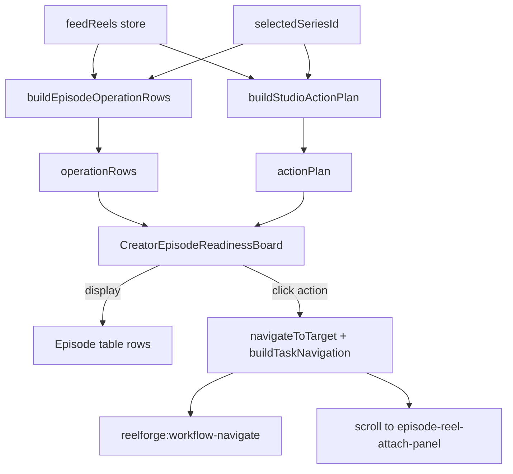

# PRODUCT-04B — Creator Episode Readiness Board

**Mission type:** Presentation layer only — **no readiness engine changes**  
**Date:** 2026-07-16  
**Predecessor:** [`PRODUCT-04_CREATOR_READINESS_AUDIT.md`](PRODUCT-04_CREATOR_READINESS_AUDIT.md)

---

## Executive Summary

PRODUCT-04B exposes existing production readiness intelligence as a **read-only Episode Readiness Board** at the top of the Production tab. Creators see per-episode reel/metadata/thumbnail checks, missing-item summaries, and action hints that route into existing workflows (PRODUCT-02 attach panel, metadata editor, release scheduler).

**No new readiness calculations, storage keys, or backend APIs were added.**

---

## 1. Existing Readiness Sources Used

| Source | Function / export | Role in board |
|--------|-------------------|---------------|
| `productionHealth.js` | `buildEpisodeOperationRows()` | Primary row data: episode id, season/episode numbers, title, `status`, `reelInFeed`, `reelId`, `thumbnailUrl`, `metadataComplete` |
| `actionEngine.js` | `buildStudioActionPlan()` | Per-episode recommended actions via `blockers` + `recommendations` (matched by `episodeId`) |
| `workflowEngine.js` | `buildTaskNavigation()` | Maps `actionType` → workflow target + DOM selector for navigation |
| `episodeAssetStatus.js` | (via `buildEpisodeOperationRows`) | Underlying asset records — **not imported directly**; consumed through productionHealth only |

### Intelligence rule

```text
buildEpisodeOperationRows(feedReels, seriesId)
        +
buildStudioActionPlan(seriesId, feedReels)
        ↓
CreatorEpisodeReadinessBoard (visualization only)
```

---

## 2. UI Component Location

| Component | Path | Placement |
|-----------|------|-----------|
| **CreatorEpisodeReadinessBoard** | `src/components/studio/CreatorEpisodeReadinessBoard.svelte` | New — read-only table |
| **StudioWorkspaceLayout** | `src/components/studio/StudioWorkspaceLayout.svelte` | Wired at top of Production panel, **before** `<slot name="production" />` |

### Production tab order (after PRODUCT-04B)

```text
Production Tab
├── CreatorEpisodeReadinessBoard   ← NEW (PRODUCT-04B)
├── <slot name="production">       ← StudioExperience (Onboarding, EpisodeReelAttachmentPanel, uploads)
├── SeriesHealthDashboard
├── ProductionReadinessMeter
├── WorkflowTaskCenter
├── EpisodeOperationsTable
├── Pipeline boards…
```

---

## 3. Data Flow



### Row presentation (derived from existing fields only)

| Column | Source |
|--------|--------|
| Episode code | `row.seasonNumber`, `row.episodeNumber`, `row.episodeTitle` |
| Status badge | `row.status` + presentation mapping to **Ready** / **Missing Asset** / **Needs Attention** |
| Checks (✅/⚠/❌) | `row.reelInFeed`, `row.reelId`, `row.metadataComplete`, `row.thumbnailUrl` |
| Missing items | Human-readable list from same row fields |
| Action button | First matching `actionPlan.blockers` or `actionPlan.recommendations` entry for `episodeId` |

---

## 4. Files Changed

| File | Change |
|------|--------|
| `src/components/studio/CreatorEpisodeReadinessBoard.svelte` | **Created** — read-only board component |
| `src/components/studio/StudioWorkspaceLayout.svelte` | **Modified** — import + render board in Production panel |

### Not modified (frozen per mission)

- Upload pipeline, Hero workflow, thumbnail ingestion
- Attachment architecture (`episodeReelAttachment.js`, `EpisodeReelAttachmentPanel.svelte`)
- Storage keys, backend APIs
- Readiness formulas (`productionHealth.js`, `actionEngine.js`, `workflowEngine.js`)

---

## 5. Action Routing

Actions use the same navigation path as `WorkflowTaskCard`:

```javascript
navigateToTarget({
  type: 'workflow',
  workflowNavigation: buildTaskNavigation(actionType, episodeId, reelId),
  tab: 'Production',
  dashboardSection: 'production'
});
```

| Action type | Button label | Target workflow |
|-------------|--------------|-----------------|
| `missing-asset` | Attach Vault Reel | `reel-attach` → scroll to `[data-testid="episode-reel-attach-panel"]` (PRODUCT-02) |
| `missing-thumbnail` | Add Thumbnail | `episode-editor` → `[data-episode-op-row]` |
| `missing-description` / `missing-runtime` / `missing-metadata` | Complete Metadata | `metadata-editor` → `[data-series-metadata-editor]` |
| `unpublished-episode` | Publish Episode | `release-scheduler` |
| `unscheduled-episode` | Schedule Release | `release-scheduler` |

No new action handlers or workflows were implemented.

---

## 6. Validation Results

### Build

```bash
npm run build
```

**Result:** ✅ PASS (2026-07-16)

### Functional checklist

| Step | Result |
|------|--------|
| Open Production tab | ✅ Board renders at top via `data-testid="creator-readiness-board"` |
| Episodes show current state | ✅ Rows from `operationRows` sorted S#E# |
| Missing asset hints appear | ✅ Missing column + check icons from row fields |
| Actions navigate correctly | ✅ Uses `navigateToTarget` + attach panel scroll for missing reel |

### Regression (local preview `BASE_URL=http://127.0.0.1:4173`)

| Test | Command | Result |
|------|---------|--------|
| Hero Playwright | `npm run test:hero-playwright` | ✅ 1 passed |
| Hero confirmation | `npm run test:hero-confirmation` | ✅ pass |
| Episode attachment | `npm run test:episode-attachment` | ✅ 1 passed |

No media contracts or storage keys changed.

---

## 7. Success Criteria

| Criterion | Status |
|-----------|--------|
| Existing readiness intelligence is visible | ✅ |
| Episode-level state is understandable | ✅ |
| Actions connect to existing workflows | ✅ |
| No duplicated readiness logic | ✅ (consumes `operationRows` + `actionPlan` only) |
| Existing tests remain green | ✅ (local preview) |

---

## 8. Creator Loop Completion

```text
Upload media
    ↓
Attach media (PRODUCT-02)
    ↓
See readiness (PRODUCT-04B)     ← this mission
    ↓
Know next action (action hints)
    ↓
Move episode toward release
```

PRODUCT-04 discovered the intelligence layer; PRODUCT-04B projects it to creators without expanding the engine.
