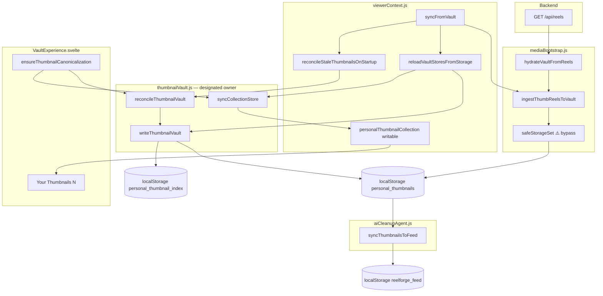

# Mission 5.8.7 — State Ownership Map

**Scope:** Thumbnail vault runtime stores and every current writer (live execution path).

---

## Store authority matrix

| Store | Intended owner | Actual writers (runtime) | Read by UI |
|-------|----------------|------------------------|------------|
| `personal_thumbnails` | `thumbnailVault.js` (`writeThumbnailVault`) | `writeThumbnailVault`, `storeThumbnailMetadata`, **`safeStorageSet` (mediaBootstrap ingest — violation)**, `reconcileThumbnailVault`, `clearOldestThumbnailData` | `readThumbnailVault`, `syncCollectionStore`, `aiCleanupAgent.syncThumbnailsToFeed` |
| `personal_thumbnail_index` | `thumbnailVault.js` (index mirror only) | `writeThumbnailVault` (`localStorage.setItem` at line 95), `safeStorageSet` if keyed directly | `deriveCollectionKeys` (derived from metadata, not read as authority) |
| `personalThumbnailCollection` | **Derived only** via `syncCollectionStore` | `syncCollectionStore`, `setPersonalThumbnailCollection` (clear path in `reloadVaultStoresFromStorage`) | `VaultExperience.svelte` `#each`, heading count |
| `reelforge_feed` | `syncFromVault` / feed pipeline | `feed.set`, `feed.subscribe→storageSet`, `syncThumbnailsToFeed`, `AI_CLEANUP_AGENT.distributeVideoToFeed` | Feed cards (placeholder thumbs, not vault grid count) |

---

## Ownership diagram

---

## Function ownership table

| Function | Module | May write `personal_thumbnails` | May write `personalThumbnailCollection` | May write `reelforge_feed` |
|----------|--------|--------------------------------|------------------------------------------|---------------------------|
| `writeThumbnailVault` | thumbnailVault.js | ✅ owner | ❌ (caller syncs) | ❌ |
| `syncCollectionStore` | thumbnailVault.js | ❌ read-only | ✅ derived | ❌ |
| `reconcileThumbnailVault` | thumbnailVault.js | ✅ via write | ❌ | ❌ |
| `appendThumbnailVaultEntry` | thumbnailVault.js | ✅ | ❌ | ❌ |
| `deleteThumbnailVaultEntries` | thumbnailVault.js | ✅ | ❌ | ❌ |
| `storeThumbnailMetadata` | storage.js | ✅ (called by owner) | ❌ | ❌ |
| `safeStorageSet` | storage.js | ⚠️ direct | ❌ | ✅ |
| `ingestThumbReelsToVault` | mediaBootstrap.js | ⚠️ **violates owner** | ❌ | ❌ |
| `hydrateVaultFromReels` | mediaBootstrap.js | via ingest | ❌ | ❌ |
| `bootstrapMediaFromBackend` | mediaBootstrap.js | via hydrate | ❌ | ❌ |
| `reloadVaultStoresFromStorage` | viewerContext.js | via writeThumbnailVault | ✅ via syncCollectionStore | ❌ |
| `syncFromVault` | viewerContext.js | via ingest + reload + reconcile | ✅ via syncCollectionStore | ✅ |
| `reconcileStaleThumbnailsOnStartup` | viewerContext.js | via reconcile | ✅ via syncCollectionStore | ❌ |
| `setPersonalThumbnailCollection` | viewerContext.js | ❌ | ✅ clear path | ❌ |
| `ensureThumbnailCanonicalization` | VaultExperience.svelte | via reconcile | ✅ via syncCollectionStore | ❌ |
| `syncThumbnailsToFeed` | aiCleanupAgent.js | read-only | ❌ | ✅ placeholders |
| `createPersistentStore` | viewerContext.js | ⚠️ if thumb keys used | ❌ (index store removed) | possible |
| `feed.subscribe` | viewerContext.js | ❌ | ❌ | ✅ |

---

## Initialization sequence owners

| Phase | Actor | Effect on thumb state |
|-------|-------|----------------------|
| Module load | `feed.subscribe` | Persists existing `reelforge_feed` |
| `mountViewer` start | `prepareStorageOnStartup` | May evict/trim `personal_thumbnails` if quota exceeded |
| Bootstrap | `bootstrapMediaFromBackend` | Re-affirms local ghosts via `ingestThumbReelsToVault` |
| Pre-sync reload | `reloadVaultStoresFromStorage` | **Publishes ghosts to collection (20 cards)** |
| Deferred | `syncThumbnailsToFeed` | Feed placeholders from vault metadata |
| Sync | `syncFromVault` | Re-ingest, re-reload, reconcile, feed hydrate |
| Vault UI mount | `ensureThumbnailCanonicalization` | Second reconcile + collection sync |

---

## Known ownership violations (proven at runtime)

1. **`ingestThumbReelsToVault` → `safeStorageSet`** — writes `personal_thumbnails` without `writeThumbnailVault` (mediaBootstrap.js:270).
2. **`reloadVaultStoresFromStorage`** — treats stale localStorage as authoritative input to collection before backend reconcile completes (viewerContext.js:825–828).
3. **`syncFromVault` empty clear** — only clears vault when **all** `rawData.length === 0`, not when thumb reel count alone is 0 (viewerContext.js:1064–1074).

---

## Instrumentation (temporary, Mission 5.8.7)

| File | Role |
|------|------|
| `thumbStoreWriteTrace.js` | Emits `[THUMB_STORE_WRITE]` + accumulates `window.__thumbWriteChain` |
| `thumbnailVault.js` | Traced: `writeThumbnailVault`, `syncCollectionStore` |
| `storage.js` | Traced: `storeThumbnailMetadata`, `safeStorageSet` |
| `mediaBootstrap.js` | Traced: `ingestThumbReelsToVault` |
| `viewerContext.js` | Traced: `setPersonalThumbnailCollection` |
| `aiCleanupAgent.js` | Traced: `syncThumbnailsToFeed` |

Remove instrumentation after fix is validated.

---

## Canonical invariants (target state)

| Invariant | Current compliance |
|-----------|-------------------|
| `personal_thumbnails` is sole metadata authority | ❌ violated by `ingestThumbReelsToVault` |
| `personalThumbnailCollection` is derived only | ✅ no `createPersistentStore` on collection |
| `personal_thumbnail_index` is mirror only | ✅ written only in `writeThumbnailVault` |
| Startup reconcile before UI shows stale count | ❌ `reloadVaultStoresFromStorage` runs before `syncFromVault` reconcile |
