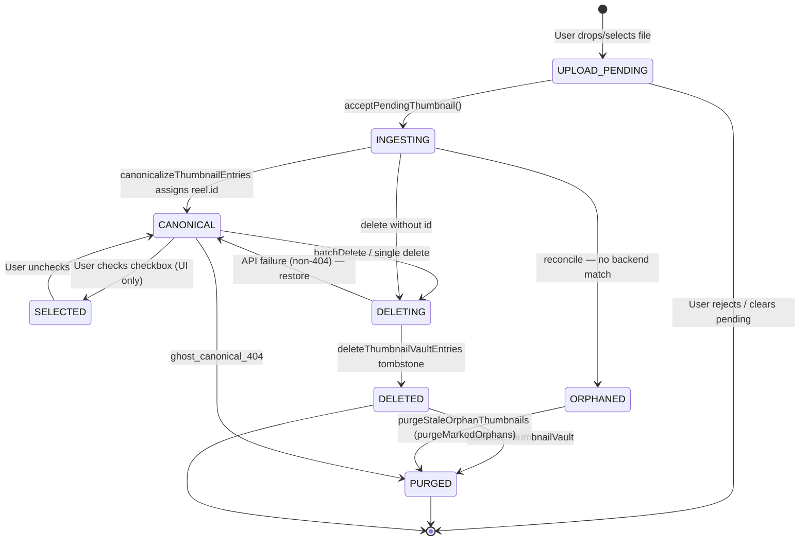

# Thumbnail Vault State Machine (Mission 5.8)

Generated: 2026-07-12

## Principle

Every thumbnail entry exists in **exactly one** lifecycle state at any moment. States are stored on the metadata object as `vaultState` in `personal_thumbnails` (canonical source of truth).

## States

| State | Meaning | Visible in UI? | Persisted? |
|-------|---------|----------------|------------|
| `UPLOAD_PENDING` | User selected file; blob/data URL only | Preview panel only | Transient — must not survive reload as canonical |
| `INGESTING` | Accepted locally; awaiting backend id assignment | Yes (vault card) | Yes, until canonicalized or purged |
| `CANONICAL` | Has `reel.id`; backend confirms existence (when reachable) | Yes | Yes |
| `ORPHANED` | No id; no unique backend match; `orphaned: true` | Yes (disabled checkbox) | Yes on startup; purged post-delete |
| `SELECTED` | UI-only selection overlay | Checkbox state | Never persisted |
| `DELETING` | Delete API in flight | Card visible until tombstone | Transient |
| `DELETED` | Tombstone applied; entry removed from metadata | No | No |
| `PURGED` | Reconcile removed stale/ghost/orphan entry | No | No |

## State Diagram

## Transitions (complete)

| From | To | Trigger | Owner | Mutator | Persists | Renders | Removes |
|------|-----|---------|-------|---------|----------|---------|---------|
| — | `UPLOAD_PENDING` | File drop / picker | `VaultExperience` | `pendingThumbnail.set` | No | Pending panel | User reject |
| `UPLOAD_PENDING` | `INGESTING` | `acceptPendingThumbnail()` | `thumbnailVault` | `appendThumbnailVaultEntry` | `personal_thumbnails` | `syncCollectionStore` | — |
| `INGESTING` | `CANONICAL` | `canonicalizeThumbnailEntries` | `thumbnailCanonicalization` | `reconcileThumbnailVault` | `writeThumbnailVault` | `syncCollectionStore` | — |
| `*` | `ORPHANED` | No unique backend match | `thumbnailCanonicalization` | `canonicalizeThumbnailEntries` | `writeThumbnailVault` | Vault card (disabled) | `purgeMarkedOrphans` |
| `CANONICAL` | `CANONICAL` | Metadata refresh | `mediaBootstrap` | `ingestThumbReelsToVault` | Updates existing only | — | — |
| `CANONICAL` | `SELECTED` | Checkbox click | `VaultExperience` | `selectedThumbnailIds` | Never | Checkbox UI | Uncheck |
| `CANONICAL` | `DELETING` | Delete confirm | `VaultExperience` | async delete loop | — | Card until tombstone | — |
| `DELETING` | `DELETED` | Tombstone | `thumbnailVault` | `deleteThumbnailVaultEntries` | Filter from metadata | `syncCollectionStore` | Entry removed |
| `DELETING` | `CANONICAL` | API non-404 failure | `VaultExperience` | No tombstone | Restore prior | — | — |
| `CANONICAL` | `PURGED` | Ghost id (404 on backend) | `thumbnailVault` | `reconcileThumbnailVault` | `writeThumbnailVault` | `syncCollectionStore` | Entry removed |
| `ORPHANED` | `PURGED` | Post-delete purge | `VaultExperience` | `purgeStaleOrphanThumbnails` | `writeThumbnailVault` | `syncCollectionStore` | Entry removed |
| All | cleared | Backend 0 reels (reachable) | `viewerContext` | `writeThumbnailVault([])` | Empty vault | 0 cards | All metadata |
| Metadata | derived keys | Any vault write | `thumbnailVault` | `syncCollectionStore` | Index mirror | `#each` collection | — |

## Reconcile modes

| Mode | `purgeMarkedOrphans` | `purgeGhostCanonical` | When |
|------|---------------------|----------------------|------|
| Startup | `false` | `true` | `ensureThumbnailCanonicalization`, `reconcileStaleThumbnailsOnStartup` |
| Post-delete | `true` | `true` | `purgeStaleOrphanThumbnails` after successful delete |
| Offline | skipped | skipped | `backendReachable === false` |

## UI-only states (never in localStorage)

- **SELECTED**: `selectedThumbnailIds` in `VaultExperience.svelte`
- **DELETING**: upload status / `isDeleting` during async API

## Impossible states eliminated (5.8)

| Impossible state | Pre-5.8 cause | 5.8 repair |
|------------------|---------------|------------|
| Backend 0 reels, 20 vault cards | Index store authoritative; stale snapshot re-write | Collection derived from metadata; ghost purge; no stale snapshot write |
| CANONICAL without id | Index key without metadata | `deriveCollectionKeys` from metadata; legacy strings normalized on write |
| CANONICAL with 404 id | Tombstone skipped on failed delete | `ghostIds` + `purgeGhostCanonical` |
| Validation pass, browser fail | Scripts checked backend; UI read index | Single owner; invariants on reconcile |
| Stale index → phantom cards | `hydrateVaultFromReels` imported full catalog | Bootstrap-empty-local removed; index is mirror only |
| Legacy string lost on sync | `dedupeThumbEntries` dropped strings | String entries preserved; ingest upgrades strings |
