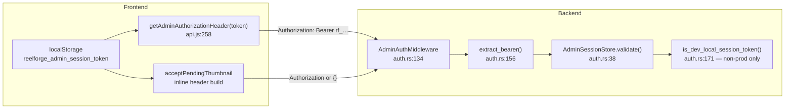

# BG-7K — Authentication Flow Archaeology

**Mission:** BG-7K-ROOTCAUSE Part B  
**Mode:** Read-only investigation  
**Date:** 2026-07-24

---

## Token key

| Key | Storage | Scope |
|-----|---------|-------|
| `reelforge_admin_session_token` | `localStorage` | All admin-mutating API calls |

Listed in protected keys: `frontend/src/lib/storage.js:30`.

---

## Producers (writers)

| Writer | File:line | Trigger | Value written |
|--------|-----------|---------|---------------|
| `attemptAdminLogin()` success | `StudioExperience.svelte:790–792` | `POST /admin/auth` returns `{ success:true, token }` | `result.token` (format `rf_{uuid}`) or fallback `'backend_token'` |
| `attemptAdminLogin()` dev fallback | `StudioExperience.svelte:804–807` | Backend unreachable + password in local list | `'dev_local_session'` |
| Test harnesses | `frontend/tests/**`, scripts | Manual seeding | varies |

**Backend token mint:** `handlers::admin_auth` (`handlers.rs:167–183`) → `format!("rf_{}", Uuid::new_v4())` → `admin_sessions.register(token)` (in-memory TTL, default 24h via `ADMIN_SESSION_TTL_SECONDS`).

---

## Consumers (readers)

| Reader | File:line | Usage |
|--------|-----------|-------|
| **`acceptPendingThumbnail`** | `VaultExperience.svelte:1368–1370` | Inline `localStorage.getItem` → manual `Authorization` header |
| `deleteVaultVideo` / thumb ops | `aiCleanupAgent.js:40,489,610` | `authHeaders()` for DELETE |
| `syncFromVault` | `viewerContext.js:849,1060` | `getAdminToken()` + `getAdminAuthorizationHeader()` on GET `/api/reels` |
| `mediaBootstrap` | `mediaBootstrap.js:39–40,260` | Bootstrap fetch |
| `HeroExperience` uploads | `HeroExperience.svelte:1390,1517` | Video/thumb upload headers |
| `StudioExperience` uploads | `StudioExperience.svelte:377,470,709,1043` | `uploadMedia` headers |
| `HeroManagerPanel` | `HeroManagerPanel.svelte:122` | Delete/fetch |
| `contentAgents` ProductionAgent | `contentAgents.js:185` | Delete |
| `securityAuditEngine` | `securityAuditEngine.js:305` | Audit scan |

**Gap:** Accept path does **not** use `getAdminAuthorizationHeader()` from `api.js:258–265` — duplicates logic and omits centralized empty-token handling.

---

## Authorization / Bearer flow



### `getAdminAuthorizationHeader(token)` (`api.js:258–265`)

```javascript
if (!token) return {};
return { Authorization: `Bearer ${token}` };
```

---

## Where 401 is generated

| Route class | Middleware | Error JSON | File:line |
|-------------|------------|------------|-----------|
| Mutating `/api/reels` POST | `AdminAuth` | `missing_authorization` | `auth.rs:56–58` |
| Mutating `/api/reels` POST | `AdminAuth` | `invalid_session` | `auth.rs:63` |
| `POST /admin/auth` bad password | handler | `{ success:false, error:"Invalid password" }` | `handlers.rs:171–175` |

**Public mutating exceptions** (no admin): `/api/watch/event`, `/api/analytics`, `/api/security/events`, `/api/dev/client-log` (`auth.rs:68–82`).

**GET `/api/reels` is not admin-gated** — catalog reads work without token; **POST requires admin**.

---

## Admin login / logout

| Action | Function | File:line | Effect |
|--------|----------|-----------|--------|
| Login | `attemptAdminLogin()` | `StudioExperience.svelte:783–818` | `authenticateAdmin(password)` → `POST /admin/auth` → `storageSet('reelforge_admin_session_token', token)` |
| Logout | `logout()` | `viewerContext.js:1526–1530` | `localStorage.removeItem('reelforge_admin_session_token')`, `adminMode.set(false)` |

**No session refresh endpoint.** TTL enforced only server-side on validate; client never checks expiry.

---

## `invalid_session` — frontend vs backend

| Error | Generated by | Client handling |
|-------|--------------|-----------------|
| `missing_authorization` | **Backend** — no Bearer header | `createReel` throws; Accept shows `❌ Upload failed: missing_authorization` |
| `invalid_session` | **Backend** — token not in store / expired / dev token on prod | Same throw path; message shown verbatim |

Frontend does **not** synthesize `invalid_session`. It only forwards `err.error` from JSON body (`media.js:407–422`).

---

## Failure mode decision tree

```
User clicks Accept
  └─ token in localStorage?
       ├─ NO  → headers {} → POST /api/reels → 401 missing_authorization  ← FIRST BOUNDARY (typical)
       └─ YES → Bearer sent
            └─ backend sessions.validate(token)?
                 ├─ NO (stale rf_*, dev_local on Railway, wrong token)
                 │    → 401 invalid_session  ← FIRST BOUNDARY (after deploy / dev fallback)
                 └─ YES → create_reel runs → 202/200 success
```

---

## Live evidence summary

| Scenario | Result |
|----------|--------|
| No header | `401 missing_authorization` |
| `dev_local_session` on Railway | `401 invalid_session` |
| Fresh `rf_*` from `/admin/auth` | `202` + ready thumbnail reel |

---

## Recommended minimal fix (documentation only)

1. Centralize Accept auth: `getAdminAuthorizationHeader(getAdminToken())` + preflight guard UI.
2. On `401 invalid_session`, call `logout()` and prompt Studio re-login.
3. Optionally persist `AdminSessionStore` server-side so Railway restarts do not invalidate all clients.

---

*BG-7K Auth Flow — no code modified.*
