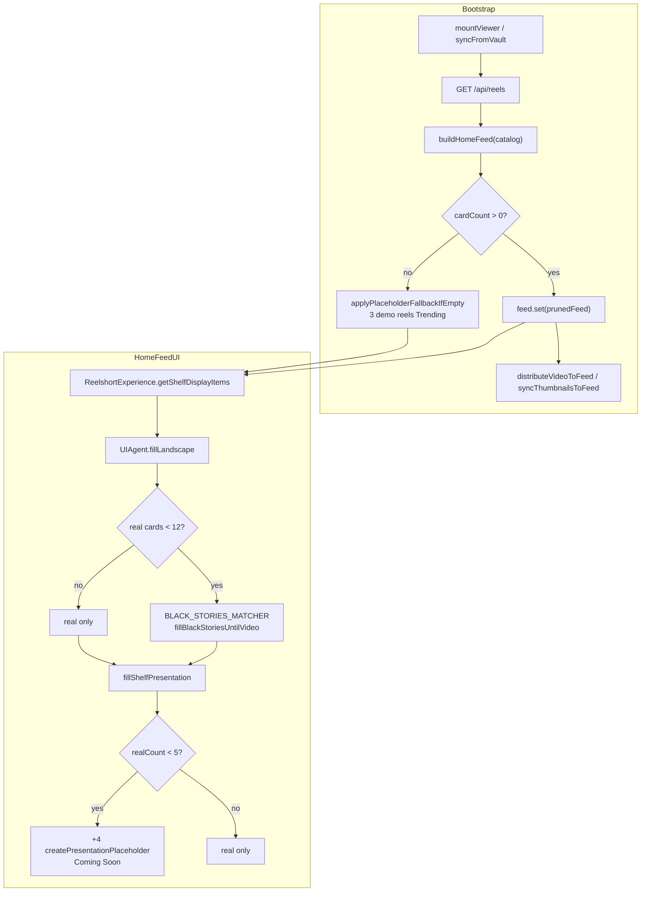

# BG-7K — Placeholder Generation Flow

**Mission:** BG-7K-ROOTCAUSE Part C  
**Mode:** Read-only investigation  
**Date:** 2026-07-24

---

## Question

Why does **one real MP4** in the vault produce **multiple placeholder episode-like cards**?

---

## Count sheet (1 real MP4 scenario)

| Layer | Real count | Placeholder count | Expected | Actual (typical UI) |
|-------|------------|-------------------|----------|---------------------|
| Video vault (`personalVideos`) | **1** | 0 | 1 | 1 |
| Backend catalog (`GET /api/reels`) | many rows globally; user vault filtered | — | user sees 1 | depends on tombstones/hero gates |
| Home feed store (`reelforge_feed`) | **1** video card (`isPersonalVideo`) | 0 in store after `buildHomeFeed` | 1 | 1 |
| Shelf **display** (DOM) | **1** playable card | **4** presentation fillers | 1 (user expectation) | **5** cards in row |
| Demo inject (`injectPlaceholderCards`) | — | **3** | 0 when real ≥ 1 | 0 (not triggered) |
| Black Stories (`fillBlackStoriesUntilVideo`) | — | up to **11** per shelf | 0 | **0 visible** (filtered out before display) |
| Mock series metadata (`mockSeriesData.js`) | 0 linked to user MP4 | **12** episode records | 0 in vault | visible in Series/Studio panels only |

**Root cause for “four placeholders”:** `fillShelfPresentation()` adds **`MIN_SHELF_PRESENTATION_COUNT - realCount` = 5 - 1 = 4** presentation-only cards.

---

## Placeholder generation graph



---

## Trace by surface

### 1. Home Feed (`buildHomeFeed`)

| Function | File:line | Placeholder behavior |
|----------|-----------|---------------------|
| `buildHomeFeed` | `buildHomeFeed.js:157–222` | Sets `isPlaceholder: false` on all eligible cards; **does not inject** demos |
| `applyPlaceholderFallbackIfEmpty` | `buildHomeFeed.js:243–258` | If real count 0 → `injectPlaceholderCards` → **3** demo reels |
| `injectPlaceholderCards` | `buildHomeFeed.js:229–236` | `buildDemoFeedReels()` from `demoPlaceholders.js` |
| `syncFromVault` empty backend branch | `viewerContext.js:1170–1186` | Clears vault + injects demo feed |
| `syncFromVault` post-sync fallback | `viewerContext.js:1270–1286` | Injects demo if `countRealFeedCards === 0` |

**Demo placeholder IDs:** `demo-1`, `demo-2`, `demo-3` (`demoPlaceholders.js:6–27`).

### 2. Vault

| Source | File:line | Trigger |
|--------|-----------|---------|
| Hardcoded demo HTML cards | `VaultExperience.svelte:1997–2033` | `shouldShowVaultDemoCards` when **zero** videos **and** zero thumbs |
| Grid placeholder emoji | `VaultExperience.svelte:1825–1826` | `getVaultImageReel` missing URL / image error |
| `fetchReadyReels` demo inject | `media.js:662–706` | API returns reels but none “ready” — returns 3 demos |

### 3. Studio

| Source | File:line | Content |
|--------|-----------|---------|
| `MOCK_SERIES_CATALOG` | `mockSeriesData.js:7–171` | **12 episodes** across 3 series with fictional `reelId`s |
| `seriesCatalog` store | `seriesStore.js:34–37` | Seeded from mock data at startup |
| `buildEpisodeAssetRecords` | `episodeAssetStatus.js` (via `productionHealth.js`) | Maps mock episodes → asset status rows |
| Studio hierarchy API | `backend/api/studio.rs` | **Disabled** on Railway (`REELFORGE_STUDIO_HIERARCHY` unset) — UI falls back to mock/local |
| `fillLandscape` in Studio shelves | via shared `UIAgent` | Same padding as home feed |

### 4. Feed shelf UI (where user sees cards)

| Function | File:line | Output |
|----------|-----------|--------|
| `getShelfDisplayItems` | `ReelshortExperience.svelte:220–223` | `fillLandscape` → `fillShelfPresentation` |
| `UIAgent.fillLandscape` | `uiAgent.js:44–69` | Pads to `TARGET_LANDSCAPE_COUNT` (12) with `isBlackStoriesPlaceholder: true` |
| `fillShelfPresentation` | `fillShelfPresentation.js:44–71` | Keeps only `isRealShelfCard`; adds **`presentation-placeholder-{shelf}-{i}`** |
| `createPresentationPlaceholder` | `fillShelfPresentation.js:10–21` | `isPresentationOnly: true`, title **"Coming Soon"**, `url: null` |

**Critical filter** (`fillShelfPresentation.js:28–34`):

```javascript
!item.isPlaceholder && !item.isBlackStoriesPlaceholder
```

Black Stories padding is **discarded** from the final row; presentation fillers replace visual density instead.

### 5. Other engines (not primary cause of “4 cards”)

| Engine | File | Role |
|--------|------|------|
| `fetchReadyReels` demo fallback | `media.js:643–706` | 3 demos when readiness gate fails |
| `AI_CLEANUP_AGENT.distributeThumbnailAcrossCategories` | `aiCleanupAgent.js:318–357` | Personal thumb feed cards (`isPlaceholder: false`) |
| `workflowEngine` / `episodePipeline` | `workflow/*.js`, `pipeline/*.js` | Studio task cards — not home shelf |
| `heroIntelligence` | `heroIntelligence.js` | Hero selection — not shelf padding |
| `releaseCenter` / `discoveryEngine` | various | Scheduled release metadata |

---

## Why one MP4 does not suppress presentation fillers

1. User uploads **one MP4** → `personalVideos` length = 1.
2. `syncFromVault` → `buildHomeFeed` produces **one** eligible video card.
3. `ReelshortExperience` renders shelf via `getShelfDisplayItems`.
4. `fillLandscape` may add Black Stories objects, but `fillShelfPresentation` counts only **one** real card.
5. `MIN_SHELF_PRESENTATION_COUNT = 5` → inserts **4** presentation placeholders.

User interprets locked **“Coming Soon”** slots as **placeholder episodes** (especially because real cards use `match: '🎬 EPISODE'` from `buildHomeFeed.js:130`).

---

## Origins classification

| Origin | Contributes to “4 placeholders”? |
|--------|----------------------------------|
| **Presentation shelf padding (BG-7S)** | **Yes — exactly 4** |
| Demo feed (`demoPlaceholders.js`) | No (when 1 real video in feed) |
| Black Stories matcher | Generated but **hidden** from final shelf |
| Mock series metadata | Episodes in Series UI, not the 4 shelf slots |
| Workflow / release planner | Studio panels only |
| cached `reelforge_feed` localStorage | Can stale-count; sync overwrites on `syncFromVault` |
| Backend catalog | 20+ videos on prod globally; vault shows 1 after client merge |

---

## Real vs placeholder — detection flags

| Flag | Meaning | Set by |
|------|---------|--------|
| `isPlaceholder: true` | Demo feed card | `demoPlaceholders.js`, `fetchReadyReels` fallback |
| `isBlackStoriesPlaceholder: true` | AI / filler story card | `contentAgents.js:256` |
| `isPresentationOnly: true` | Non-selectable shelf padding | `fillShelfPresentation.js:13` |
| `isPersonalVideo: true` | Real vault MP4 in feed | `buildHomeFeed`, `distributeVideoToFeed` |
| `match: '🎬 EPISODE'` | Label on **real** video cards | `buildHomeFeed.js:130` |

---

## Recommended minimal fix (documentation only)

1. Set `MIN_SHELF_PRESENTATION_COUNT` to `realCount` when any playable video exists, **or** skip `fillShelfPresentation` padding when `realCount >= 1`.
2. Rename presentation slots (“Layout slot”) vs episode cards (“🎬 EPISODE”).
3. Do not conflate mock series episode count with vault MP4 count in Studio health widgets when `seriesPersistenceMode === 'local'`.

---

*BG-7K Placeholder Flow — no code modified.*
