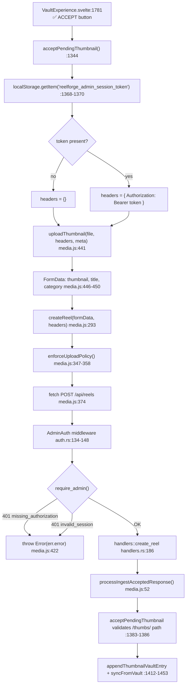

# BG-7K-ROOTCAUSE — Investigation Report

**Mission:** BG-7K-ROOTCAUSE  
**Mode:** Investigation only (no code changes)  
**Date:** 2026-07-24  
**Surfaces:** `http://127.0.0.1:5173`, `https://strong-lolly-a9fcb4.netlify.app`  
**Backend:** `https://reelforge-deploy-production.up.railway.app` (proxied as same-origin `/api` on Netlify; Vite proxy on local dev)

---

## Executive summary

| Symptom | First failing boundary | Verdict |
|---------|------------------------|---------|
| Thumbnail **Accept** fails on local + Netlify | `AdminAuth` middleware on `POST /api/reels` — request arrives **without a valid admin Bearer token** | **Auth boundary (backend 401)** before `create_reel` handler runs |
| One real MP4 in vault, **four placeholder cards** on Home Feed shelf | `fillShelfPresentation()` pads shelf to `MIN_SHELF_PRESENTATION_COUNT` (5) → **4 “Coming Soon” presentation slots** after 1 real card | **UI presentation padding (frontend)**, not backend catalog duplication |

**Note on requested symbol names:** `acceptThumbnail()`, `acceptVaultItem()`, and a second `createReel()` hop via `uploadVideo()` **do not exist** in this codebase. The real Accept path is documented below with actual function names.

---

## PART A — Thumbnail Accept execution path

### Name mapping (requested → actual)

| Requested | Actual entry / function | File:line |
|-----------|-------------------------|-----------|
| Thumbnail Accept button | `on:click={acceptPendingThumbnail}` | `VaultExperience.svelte:1781` |
| `acceptThumbnail()` | **`acceptPendingThumbnail()`** | `VaultExperience.svelte:1344–1484` |
| `acceptVaultItem()` | **Not present** | — |
| `uploadVideo()` → `createReel()` | **Not used for thumbnails** | Thumbnails use `uploadThumbnail()` → `createReel()` only |
| `createReel()` | `createReel(formData, headers)` | `media.js:293–432` |
| `POST /api/reels` | `fetch(\`${API_BASE_URL}/api/reels\`, { method:'POST', headers, body: formData })` | `media.js:374–377` |

### Execution graph (real upload path)

### Step-by-step trace (every function)

| Step | Function | File:line | Arguments (summary) | Authorization header | Return / exception |
|------|----------|-----------|---------------------|----------------------|-------------------|
| 1 | Accept click handler | `VaultExperience.svelte:1781` | DOM click event | — | calls step 2 |
| 2 | `acceptPendingThumbnail` | `VaultExperience.svelte:1344` | reads `get(pendingThumbnail)` → `{ file, preview, name }` | — | early return if `!pending` |
| 3 | token read | `VaultExperience.svelte:1368–1370` | key: `reelforge_admin_session_token` | built here: `token ? { Authorization: Bearer … } : {}` | `null` if never logged in |
| 4 | `uploadThumbnail` | `media.js:441–451` | `(file, headers, { title:name, category })` | passes through `headers` | delegates to `createReel` |
| 5 | `createReel` | `media.js:293` | `(formData, headers)` | **only** via `headers` arg — no auto-inject | throws on policy block / HTTP error |
| 6 | `enforceUploadPolicy` | `securityPolicyEngine.js:216` | `{ operation: 'create_reel' }` | — | `{ allowed:true }` unless Sentinel lock |
| 7 | `fetch POST /api/reels` | `media.js:374–377` | `headers`, multipart body | **present only if step 3 had token** | `Response` |
| 8 | `AdminAuthMiddleware::call` | `auth.rs:134–148` | HTTP request | reads `Authorization` header | 401 JSON if fail |
| 9 | `require_admin` | `auth.rs:52–64` | token from Bearer | — | `Err(401 { error })` |
| 10 | error path | `media.js:406–422` | `response.ok === false` | — | `throw new Error(err.error \|\| …)` |
| 11 | success path | `media.js:425–431` | JSON body | — | `processIngestAcceptedResponse(body, …)` |
| 12 | post-upload validate | `VaultExperience.svelte:1377–1386` | `thumbPath.startsWith('/thumbs/')` | — | throw if path invalid |
| 13 | catch | `VaultExperience.svelte:1461–1474` | `error.message` | — | UI: `❌ Upload failed: …` |

### Live probe evidence (2026-07-24)

Production Railway direct (same middleware as proxied `/api`):

| Probe | Authorization | HTTP | Body |
|-------|---------------|------|------|
| POST `/api/reels` (thumbnail) | *(none)* | **401** | `{"error":"missing_authorization"}` |
| POST `/api/reels` | `Bearer invalid_token_xyz` | **401** | `{"error":"invalid_session"}` |
| POST `/api/reels` | `Bearer dev_local_session` | **401** | `{"error":"invalid_session"}` |
| POST `/api/reels` | valid `Bearer rf_…` (from `/admin/auth`) | **202** | `{"id":"…","status":"ready","thumbnailUrl":"…/thumbs/….png",…}` |

**Conclusion:** Upload **succeeds** when a fresh Railway-registered token is sent. Default Accept failure is **not** CORS, ingest, or thumbnail path validation — it is **401 at auth middleware** when token is missing or rejected.

### Session token source

| Source | Writer | Reader (Accept path) |
|--------|--------|----------------------|
| `reelforge_admin_session_token` in `localStorage` | `StudioExperience.attemptAdminLogin()` after `POST /admin/auth` (`StudioExperience.svelte:792`) or dev fallback `dev_local_session` (`:807`) | `VaultExperience.acceptPendingThumbnail()` (`:1368–1370`) |

**No refresh mechanism exists.** Token is read once per Accept; there is no silent refresh, no retry after 401, and no shared `getAdminAuthorizationHeader()` helper on the Accept path (unlike `syncFromVault` in `viewerContext.js:1060`).

### Token expiry / invalid_session origin

| Condition | Error string | Origin |
|-----------|--------------|--------|
| No `Authorization` header | `missing_authorization` | **Backend** `auth.rs:56–58` |
| Bearer present but not in session store | `invalid_session` | **Backend** `auth.rs:63` |
| `dev_local_session` on Railway/production | `invalid_session` | **Backend** — `is_dev_local_session_token()` returns false when `RAILWAY_ENVIRONMENT` is set (`auth.rs:171–183`) |
| Stale `rf_*` after deploy/restart | `invalid_session` | **Backend** — `AdminSessionStore` is **in-memory only** (`auth.rs:14–16`); Railway restart drops all sessions while browser keeps old token |

Frontend surfaces backend errors verbatim: `throw new Error(err.error)` (`media.js:422`).

### Why both local `:5173` and Netlify fail the same way

1. **Netlify prod:** `API_BASE_URL === ''` → same-origin `/api` → Railway. User must complete Studio admin login on that origin. Without it, Accept sends `{}` headers → `missing_authorization`.
2. **Local `:5173`:** Default `API_BASE_URL === ''` → Vite proxy to `localhost:8080`. If user never logs in, same empty headers. If user has `dev_local_session` from offline fallback but hits **production** backend (or Railway proxy), backend returns `invalid_session`.
3. **`dev_local_session` only bypasses auth when backend is non-production** (`auth.rs:171–173`). It does **not** work against Railway.

### Secondary failures (after auth succeeds)

These are **downstream** and were **not** the first boundary in live probes:

| Stage | Condition | Symptom |
|-------|-----------|---------|
| Response validation | `acceptPendingThumbnail` requires relative `/thumbs/` path (`VaultExperience.svelte:1384–1386`) | Would throw `Invalid upload response` — **not observed** in authenticated probe (backend returned resolvable `/thumbs/` URL) |
| Post-accept reconcile | `reconcileThumbnailVault` purges ghosts (`VAULT_ROOTCAUSE_01`) | Accept “succeeds” then vault shows placeholder — separate sync bug |
| HTTP 202 + `status:"ready"` | `processIngestAcceptedResponse` treats any 202 as pending poll (`media.js:53`) | Extra poll round-trip; not a hard failure |

---

## PART B — Authentication archaeology (summary)

See **`BG_7K_AUTH_FLOW.md`** and **`bg7k-auth-trace.json`**.

**Determination:** Failure is **`token never sent`** or **`backend rejected token`** — not “frontend lost token mid-request.” The token is read synchronously immediately before fetch; if absent or stale, the backend generates the 401.

---

## PART C — Placeholder archaeology (summary)

See **`BG_7K_PLACEHOLDER_FLOW.md`** and **`bg7k-placeholder-trace.json`**.

**Determination for “1 MP4 → 4 placeholders”:**

| Count | Source | Value |
|-------|--------|-------|
| Real MP4 in vault (user) | `personalVideos` / `personal_video_vault` | **1** (expected) |
| Real shelf cards after sync | `buildHomeFeed` + `distributeVideoToFeed` | **1** video card (`isPlaceholder: false`, `match: '🎬 EPISODE'`) |
| Presentation fillers | `fillShelfPresentation` (`MIN_SHELF_PRESENTATION_COUNT = 5`) | **4** × `isPresentationOnly: true`, title **“Coming Soon”** |
| Black Stories padding | `UIAgent.fillLandscape` | Up to **11** per shelf (`TARGET_LANDSCAPE_COUNT 12 − 1`) — **stripped** before display by `fillShelfPresentation` filter |
| Demo feed cards | `getDemoPlaceholders()` / `injectPlaceholderCards` | **3** — only when feed real count is **0** |
| Mock series episodes | `mockSeriesData.js` | **12** episodes across 3 series in metadata — not vault MP4s |

**Expected shelf display with 1 real video:** 1 real + 4 presentation placeholders = **5 DOM cards** (`fillShelfPresentation.js:58–61`).

---

## PART D — Characterization

### First failing boundary

**`backend/src/auth.rs` → `AdminAuthMiddleware::call` → `require_admin()`** returning **401** on `POST /api/reels` when Thumbnail Accept runs without a valid admin session token.

### Secondary downstream failures

1. Post-accept `syncFromVault` → `reconcileThumbnailVault` purging accepted thumb (state sync — see VAULT_ROOTCAUSE_01).
2. `fillShelfPresentation` adding 4 non-playable “Coming Soon” cards (looks like extra episodes).
3. Stale `reelforge_admin_session_token` after Railway redeploy (`invalid_session`).

### Recommended minimal fix (investigation only — do not implement here)

1. **Auth:** In `acceptPendingThumbnail`, use shared `getAdminAuthorizationHeader(getAdminToken())` and block Accept with “Login to Studio first” when token missing; on `401 invalid_session`, clear stale token and prompt re-login.
2. **Placeholders:** Do not pad shelves with presentation fillers when `realCount >= 1`, or label them clearly as layout slots—not episodes.
3. **Optional:** Persist admin sessions in Redis/DB on Railway so `rf_*` tokens survive restarts.

---

## Deliverables index

| File | Purpose |
|------|---------|
| `BG_7K_ROOTCAUSE.md` | This document |
| `BG_7K_AUTH_FLOW.md` | Full auth producer/consumer map |
| `BG_7K_PLACEHOLDER_FLOW.md` | Placeholder generation graph |
| `bg7k-auth-trace.json` | Machine-readable auth trace |
| `bg7k-placeholder-trace.json` | Machine-readable placeholder trace |
| `bg7k-upload-trace.json` | Machine-readable Accept → POST trace |

---

*Generated: BG-7K-ROOTCAUSE — investigation complete, no code modified.*
