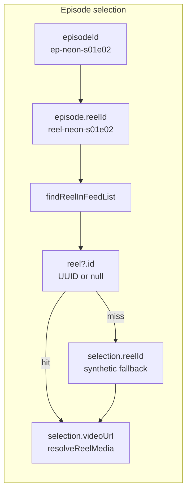
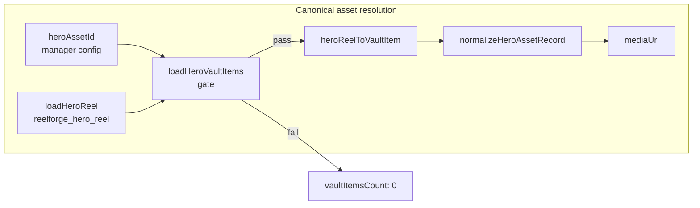

# HERO Asset Identity Trace

**Mission:** READ-ONLY — trace hero media identity chain and locate first divergence.  
**Evidence (user-reported):**

```text
[HERO_ROUTE] {
  heroAssetId: "",
  resolvedAssetId: "",
  assetType: "unknown",
  mediaUrl: "",
  vaultMatch: false
}

[HERO_CLASSIFY] {
  vaultItemsCount: 0
}
```

**Matched production artifact:** `artifacts/rc3-hero-state-01.json` (same signature with `backgroundSource: selection`, empty `heroAssetId`, empty `canonicalReelId`).

---

## Executive Summary

Hero media resolution runs on **two parallel identity systems** that are **not bridged**:

| System | Lookup key | Storage | Used when |
|--------|------------|---------|-----------|
| **A — Episode intelligence** | `episodeId` → `episode.reelId` → feed reel | `heroSelection` store, feed map | Default `backgroundSource: 'selection'` |
| **B — Canonical hero asset** | `heroAssetId` → `reelforge_hero_reel.id` → vault item | `reelforge_hero_manager_config`, `reelforge_hero_reel` | `custom_video` / `custom_image` after Accept |

The reported `[HERO_ROUTE]` failure is emitted by **System B** (`resolveHeroBackgroundAsset`) while the app is in **System A** mode. That is structurally expected on a fresh session, but it also masks real failures when `heroAssetId` and `reelforge_hero_reel` diverge.

**First divergence for reported evidence:** `loadHeroManagerConfig().heroAssetId === ""` at `resolveHeroBackgroundAsset` entry — before any vault or feed lookup runs.

**Secondary divergence (episode chain):** `candidateFromEpisode` → `findReelInFeedList(feed, "reel-neon-s01e02")` returns `null` because mock episode reel IDs do not match production feed UUIDs — so `selection.videoUrl` stays empty even though `selection.reelId` is populated.

---

## Requested Chain Trace

```text
episodeId → reelId → assetId → vault item → mediaUrl
```

### Chain A — Episode selection path (default boot)



| Step | Function | File | Input | Output (typical fresh prod) |
|------|----------|------|-------|-----------------------------|
| 1 | `selectHeroContent` | `heroIntelligence.js:1865` | `heroType`, feed map | `HeroSelection` with `episodeId` |
| 2 | `candidateFromEpisode` | `heroIntelligence.js:1330` | `episodeId` from ops/mock catalog | `episode.reelId = "reel-neon-s01e02"` |
| 3 | `findReelInFeedList` | `heroIntelligence.js:1164` | synthetic `reelId` | **`null`** (feed IDs are UUIDs) |
| 4 | `candidateFromEpisode` assign | `heroIntelligence.js:1345` | missed reel | `reelId: "reel-neon-s01e02"` (string only) |
| 5 | `resolveReelMedia` | `heroIntelligence.js:1180` | `reel = null` | **`videoUrl: ""`**, poster may be series default |
| 6 | `applyHeroSelection` | `heroIntelligence.js:2121` | empty `videoUrl` | store not updated from selection |
| 7 | Render fallback | `HeroExperience.svelte:228` | `$HERO_BACKGROUND_VIDEO` | `/videos/hero-background.mp4` (HEAD bootstrap) |

**Episode selection source:**

- `viewerContext.js` → `applyHeroIntelligence()` → `selectHeroContent(mode, feedSnapshot)` (`viewerContext.js:1681`)
- Also refreshed on `reelforge:hero-manager-updated` via `handleHeroManagerUpdated()` (`viewerContext.js:1545`)
- Candidates built from mock series catalog (`mockSeriesData.js`) + operations snapshot; winner logged as `[HERO_SELECTION]` with `episodeId` + `reelId`

**Episode → reel bridge (exists but not used here):**

- `episodeBridge.js:resolveReelForEpisode()` tries metadata map, feed `episodeId` fields, and title match — **stronger** than `findReelInFeedList` alone
- `runEpisodeBridgeSync()` runs after sync (`viewerContext.js:483`) but **`candidateFromEpisode` does not call `resolveReelForEpisode`**

---

### Chain B — Canonical asset path (`resolveHeroBackgroundAsset`)



| Step | Function | File | Expected key | Actual key (reported evidence) |
|------|----------|------|--------------|--------------------------------|
| 1 | `loadHeroManagerConfig` | `heroIntelligence.js:333` | `heroAssetId === reel.id` | **`""`** |
| 2 | `loadHeroReel` | `heroReelIdentity.js:79` | persisted canonical reel | **`null`** (no `reelforge_hero_reel`) |
| 3 | `loadHeroVaultItems` | `heroIntelligence.js:826` | `heroAssetId === reel.id` | **`[]`** (gate fails at line 833) |
| 4 | `resolveHeroAssetById` | `heroAssetBridge.js:126` | `heroAssetId` in registry | **`null`** (empty target id) |
| 5 | `resolveHeroBackgroundAsset` | `heroIntelligence.js:876` | resolved media | **`mediaUrl: ""`, `assetType: "unknown"`** |

**Vault gate (strict identity contract):**

```javascript
// heroIntelligence.js:826-833
const manager = loadHeroManagerConfig();
const reel = loadHeroReel();
if (!reel?.id || !reel?.url) return [];
if (String(manager?.heroAssetId || '').trim() !== reel.id) return [];
```

Both `heroAssetId` **and** `reelforge_hero_reel` must exist and match. Either alone is insufficient.

**Successful path (contrast):** `artifacts/rc3-hero-owner-01.json`

```text
heroAssetId: 192293f7-…
canonicalReelId: 192293f7-…
backgroundSource: custom_video
vaultItemsCount: 1
mediaUrl: /videos/192293f7-….mp4
```

Set by `HeroExperience.svelte:acceptHeroFile` → `saveHeroReel(reel)` + `saveHeroManagerConfig({ heroAssetId: reel.id, backgroundSource: 'custom_video' })`.

---

## Where `[HERO_ROUTE]` Is Emitted

| Stage | File | Meaning |
|-------|------|---------|
| `resolveHeroBackgroundAsset:resolved` | `heroIntelligence.js:921` | **Reported evidence** — canonical asset resolver |
| `AI_CLEANUP_AGENT.distributeVideoToFeed` | `aiCleanupAgent.js:263` | Feed distribution, not hero background |
| `websocket:onCreated` | `viewerContext.js:2109` | Ingestion routing, not hero background |

Only the first row corresponds to the user's empty `mediaUrl` signature.

**Call site that triggers it on every hydrated render:**

```javascript
// HeroExperience.svelte:196-198
$: heroBackgroundPresentation = $viewerHydrationReady
  ? resolveHeroBackgroundPresentation(heroManagerConfig || loadHeroManagerConfig())
  : PENDING_HERO_BACKGROUND_PRESENTATION;
```

`resolveHeroBackgroundPresentation` always calls `resolveHeroBackgroundAsset(..., { log: true })` (`heroIntelligence.js:1017`) even when `backgroundSource === 'selection'`.

---

## Identity Chain Break Analysis

### Reported evidence (fresh / selection mode)

```text
episodeId   ep-neon-s01e02          ✓ selected
     ↓
reelId      reel-neon-s01e02        ✓ assigned (synthetic)
     ↓
feed reel   null                    ✗ findReelInFeedList miss
     ↓
assetId     ""                      ✗ never bridged from selection.reelId
     ↓
vault item  []                      ✗ loadHeroVaultItems gate
     ↓
mediaUrl    ""                      ✗ resolveHeroBackgroundAsset
```

### Alternate failure (config drift — rc3-hero-state-01)

```text
heroAssetId       00000000-0000-0000-0000-000000000000  (stale/wrong)
canonicalReelId   192293f7-c784-46af-aa45-1bb15b6a4cc6  (present)
vaultItemsCount   0  (heroAssetId !== reel.id → loadHeroVaultItems returns [])
mediaUrl          "" (resolveHeroAssetById miss on wrong id)
```

Here the break is at **`loadHeroVaultItems:833`** — identity pointer mismatch, not missing upload.

### Restore path on refresh (production)

`mediaBootstrap.js:restoreHeroReelIdentityFromReels` bails immediately when `heroAssetId` is empty:

```text
[BG7J_HERO_RESTORE] { heroAssetId: , restored: false, matchedReelId: null }
[BG7V_HERO_RESTORE_REASON] { reason: 'NO_HERO_ID' }
```

So catalog → `reelforge_hero_reel` rehydration never runs in selection mode.

---

## Answers (Required Sections)

### 1. Source of hero episode selection

| Layer | Location |
|-------|----------|
| Trigger | `viewerContext.js:applyHeroIntelligence()` (boot + feed updates) |
| Selector | `heroIntelligence.js:selectHeroContent()` |
| Candidate builder | `buildHeroCandidates()` → `candidateFromEpisode()`, `buildMostWatchedCandidate()`, etc. |
| Episode catalog | `mockSeriesData.js` + `seriesStore.js` / operations snapshot |
| Output store | `heroSelection` writable (`viewerContext.js:437`) → prop to `HeroExperience.svelte` |
| Diagnostic | `[HERO_SELECTION] { episodeId, reelId, source, mode }` |

Default manager config: `backgroundSource: 'selection'`, `heroAssetId: ''` (`getDefaultHeroManagerConfig`, `heroIntelligence.js:283`).

### 2. Expected asset lookup key

For **`resolveHeroBackgroundAsset`** (System B — the function logging `[HERO_ROUTE]`):

```text
config.heroAssetId  ===  loadHeroReel().id  ===  vault item.id
```

Lookup sequence:

1. `heroAssetId` from `reelforge_hero_manager_config`
2. Canonical reel from `reelforge_hero_reel` (must match pointer)
3. `resolveHeroAssetById(heroAssetId, loadHeroVaultItems())`
4. `normalizeHeroAssetRecord` → `mediaUrl`

For **episode-driven background** (System A — actual render in selection mode):

```text
selection.videoUrl  OR  $HERO_BACKGROUND_VIDEO  (bootstrap default)
```

Not `heroAssetId`.

### 3. Actual lookup key (reported evidence)

| Field | Value |
|-------|-------|
| `backgroundSource` | `'selection'` |
| `heroAssetId` | `""` |
| `canonicalReelId` | `""` |
| `selection.reelId` | `"reel-neon-s01e02"` (synthetic, not a feed UUID) |
| `vaultItemsCount` | `0` |
| Resolver input | empty string passed to `resolveHeroAssetById` |

The asset resolver searches **`""`**, not the episode selection's `reelId`.

### 4. First divergence point

**Primary (matches user evidence):**

```text
heroIntelligence.js:876-878  resolveHeroBackgroundAsset
  → loadHeroManagerConfig().heroAssetId === ""
```

No `assetId` exists to continue the chain. Vault gate never reached with valid inputs.

**Secondary (episode → media, same session):**

```text
heroIntelligence.js:1334-1336  candidateFromEpisode
  → findReelInFeedList(feedReels, "reel-neon-s01e02") === null
```

Feed contains UUID catalog reels (`dff70497-…`, etc.), not mock `reel-neon-*` ids.

**Tertiary (architectural):**

```text
HeroExperience.svelte:196  resolveHeroBackgroundPresentation
  invokes System B while app operates in System A
```

Produces failure-shaped logs that are structurally expected but misleading for diagnostics.

### 5. Minimal surgical fix location

Do **not** patch vault ingest, feed builder, or upload pipeline for this identity bug. Smallest correct boundaries:

| Priority | Fix target | Rationale |
|----------|------------|-----------|
| **P1** | `heroIntelligence.js:candidateFromEpisode` (~1334) | Replace bare `findReelInFeedList(feed, episode.reelId)` with `resolveReelForEpisode(episodeId, findReelInFeed, getAllFeedReels)` from `episodeBridge.js:187` — restores **episodeId → real feed reel → videoUrl** without touching asset vault |
| **P2** | `HeroExperience.svelte:196` or `resolveHeroBackgroundPresentation` (~1013) | When `backgroundSource === 'selection'`, skip `resolveHeroBackgroundAsset` logging/resolution OR feed `heroSelection.reelId` as lookup key — stops false `[HERO_ROUTE]` failures and aligns presentation with selection chain |
| **P3** | `heroIntelligence.js:loadHeroVaultItems` (~833) | Only if fixing config drift: when `canonicalReel` exists but `heroAssetId` mismatches, reconcile pointer in `saveHeroManagerConfig` — addresses rc3 mismatch case (`00000000-…` vs real reel id) |

**Recommended first patch:** **P1 + P2** together — one line of episode resolution + guard the presentation resolver by `backgroundSource`. No schema changes, no automatic localStorage purge.

---

## Storage Keys Reference

| Key | Role in chain |
|-----|----------------|
| `reelforge_hero_manager_config` | `heroAssetId` pointer, `backgroundSource`, `heroType` |
| `reelforge_hero_reel` | Canonical `{ id, url, fileName }` — vault source of truth |
| `reelforge_feed` / feed store | UUID reels for episode lookup |
| `personal_video_vault` | General vault — hero entries filtered by `filterNonHeroAssets` during sync |
| Episode metadata map | `loadReelSeriesMetadataMap()` — bridges UUID reels ↔ episodeId when populated |

---

## Related Artifacts

| Artifact | Relevance |
|----------|-----------|
| `rc3-hero-state-01.json` | Exact empty `[HERO_ROUTE]` + selection mode |
| `rc3-hero-owner-01.json` | Successful chain after Accept + matching ids |
| `bg-6c-hero-accept-trace.json` | Pre-accept empty resolution; post-accept success |
| `bg-7v-hero-duplication.json` | Before/after heroAssetId population |
| `BG-6B_HERO_CANONICAL_TRACE.md` | Dual-system architecture (prior mission) |

---

## Conclusion

The reported `[HERO_ROUTE]` empty resolution is **not a vault rendering bug**. It is the canonical asset resolver running with **no `heroAssetId` and no `reelforge_hero_reel`** while the app is in **selection mode**.

The identity chain the user asked to trace **breaks at two levels**:

1. **Asset path:** `heroAssetId` empty → vault empty → `mediaUrl` empty (first divergence).
2. **Episode path:** synthetic `reel-neon-*` ids never resolve to feed UUIDs → `selection.videoUrl` empty → render falls back to default hero MP4.

Fix at the **eligibility boundary** between selection intelligence and canonical asset resolution — not by deleting catalog rows or clearing hero stores.
